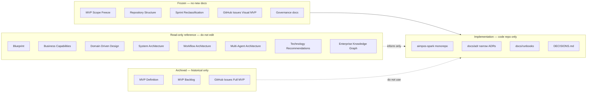

# AIMPOS-Spark Visual — Architecture Freeze Review

**Document Type:** Governance — Freeze Decision Record  
**Version:** 1.0  
**Status:** FROZEN — Effective June 9, 2026  
**Date:** June 9, 2026  
**Codename:** `AIMPOS-Spark-Visual`  
**Decision:** Architecture is frozen. Implementation begins at Sprint 0.

---

## Table of Contents

1. [Freeze Declaration](#1-freeze-declaration)
2. [Exact Freeze Point](#2-exact-freeze-point)
3. [Document Authority Hierarchy](#3-document-authority-hierarchy)
4. [Document Inventory](#4-document-inventory)
5. [What Changes After Freeze](#5-what-changes-after-freeze)
6. [Missing Documents](#6-missing-documents)
7. [Implementation Start Checklist](#7-implementation-start-checklist)

---

## 1. Freeze Declaration

**Architecture expansion stops here.**

All strategic and solution architecture for the Visual MVP increment (`Idea → Story → Script → Storyboard`) is considered **complete and sufficient** to begin implementation. No new architecture documents, capability maps, agent designs, or technology evaluations may be created unless a formal **Scope Change Request** (SCR) is approved per [MVP Scope Freeze.md](./MVP%20Scope%20Freeze.md) §11.

**What is frozen:**

- Product scope (4-stage pipeline, 12 features, 18 capabilities)
- Technology stack for Visual MVP (FastAPI, Temporal, LangGraph, PostgreSQL, MinIO, Redis, Ollama, ComfyUI, React, Docker Compose)
- Monorepo folder structure ([Repository Structure.md](./Repository%20Structure.md))
- Service boundaries (API / Worker / Web isolation)
- Sprint plan (Sprint 0–5 + Future Release per [Sprint Reclassification.md](./Sprint%20Reclassification.md))
- GitHub backlog (68 issues — bodies frozen; milestone relabeling only)

**What is not frozen (allowed during implementation):**

- `DECISIONS.md` in the application repository (implementation choices)
- `docs/adr/` in the application repository (narrow ADRs for code-level decisions only)
- `docs/runbooks/` (operational procedures discovered during deploy)
- Application code, tests, migrations, compose files
- Milestone labels on existing GitHub issues (per Sprint Reclassification)

---

## 2. Exact Freeze Point

### Architecture is frozen as of:

> **June 9, 2026 — upon publication of this document (Architecture Freeze Review v1.0) and acceptance of [Sprint Reclassification.md](./Sprint%20Reclassification.md) v1.0.**

### Freeze boundary diagram

### The line in practice

| Before freeze (done) | After freeze (now) |
|----------------------|-------------------|
| Write architecture documents | Write application code |
| Expand capability maps | Close GitHub issues |
| Debate technology choices | Pin configs in `configs/` |
| Add epics or features | Open SCR if scope must change |
| Design new agents | Implement 3 agents only (Story, Script, Cinematography) |

**First implementation action:** Sprint 0 — scaffold monorepo per Repository Structure.md; begin issue T-02-02 (PostgreSQL init) or US-04 (database schema).

---

## 3. Document Authority Hierarchy

When documents conflict during implementation, this order applies:

| Priority | Document | Role |
|----------|----------|------|
| 1 | [MVP Scope Freeze.md](./MVP%20Scope%20Freeze.md) | Scope contract — wins all scope disputes |
| 2 | [Architecture Freeze Review.md](./Architecture%20Freeze%20Review.md) | Freeze boundary — wins architecture disputes |
| 3 | [Sprint Reclassification.md](./Sprint%20Reclassification.md) | Issue → sprint mapping |
| 4 | [Sprint 0 — Platform Skeleton.md](./Sprint%200%20%E2%80%94%20Platform%20Skeleton.md) | Sprint 0 execution contract |
| 5 | [GitHub Issues - Visual MVP.md](./GitHub%20Issues%20-%20Visual%20MVP.md) | Issue acceptance criteria |
| 6 | [docs/governance/](./docs/governance/) | Engineering workflow, DoD, standards |
| 7 | [Repository Structure.md](./Repository%20Structure.md) | Monorepo layout |
| 8 | [MVP Dependency Map.md](./MVP%20Dependency%20Map.md) | Build order (adjust milestones only) |
| 9 | Strategic architecture (read-only) | Long-term vision — **do not implement from these** |

---

## 4. Document Inventory

### 4.1 Complete — freeze now (active execution set)

These documents are **complete for Visual MVP** and become **frozen** at the freeze point. Edit only via version bump for milestone relabeling or SCR-approved scope changes.

| Document | Location | Status after freeze |
|----------|----------|---------------------|
| MVP Scope Freeze | Root | **FROZEN** — scope contract |
| Architecture Freeze Review | Root | **FROZEN** — this document |
| Sprint Reclassification | Root | **FROZEN** — issue milestones |
| Sprint 0 — Platform Skeleton | Root | **FROZEN** — Sprint 0 contract |
| Repository Structure | Root | **FROZEN** — monorepo layout |
| GitHub Issues — Visual MVP | Root | **FROZEN** — 43 issue bodies |
| GitHub Issues — Tasks 01-25 | Root | **FROZEN** — 25 task bodies |
| MVP Dependency Map | Root | **FROZEN** — dependency order |
| development-workflow | docs/governance/ | **FROZEN** |
| definition-of-done | docs/governance/ | **FROZEN** |
| branching-strategy | docs/governance/ | **FROZEN** |
| coding-standards | docs/governance/ | **FROZEN** |
| github-issue-mapping.json | backlog/ | **FROZEN** — ID map |
| aimpos-spark-dependencies.csv | backlog/ | **FROZEN** — dependency data |

### 4.2 Complete — read-only reference (do not edit during Visual MVP)

These documents are **complete** as strategic references. They inform decisions but **must not drive new implementation scope**. Do not edit unless the multi-year program charter changes (post–Visual MVP).

| Document | Location | Status after freeze |
|----------|----------|---------------------|
| Blueprint for a multi-year initiative | Root | **READ-ONLY** (already marked Archive) |
| Business Capabilities | Root | **READ-ONLY** — 78 capabilities; 18 Included only |
| Domain Driven Design | Root | **READ-ONLY** — 14 contexts; 5 collapsed in MVP |
| System Architecture | Root | **READ-ONLY** — full platform; MVP is subset |
| Workflow Architecture | Root | **READ-ONLY** — 9 workflows; 1 implemented |
| Multi-Agent Architecture | Root | **READ-ONLY** — 10 agents; 3 implemented |
| Technology Recommendations | Root | **READ-ONLY** — 8 adopted; subset in MVP |
| Enterprise Knowledge Graph | Root | **READ-ONLY** — Neo4j deferred; PostgreSQL edges in MVP |

**Rule:** If implementation questions arise, resolve against **MVP Scope Freeze §5** (technology table) and **Repository Structure**, not by extending these documents.

### 4.3 Complete — archive (historical; do not use for execution)

These documents are **superseded**. They remain in the repository for traceability but **must not appear in sprint planning, issue intake, or AI prompts**.

| Document | Location | Superseded by | Action |
|----------|----------|---------------|--------|
| MVP Definition | Root | MVP Scope Freeze | **ARCHIVE** — includes video stage |
| MVP Backlog | Root | GitHub Issues — Visual MVP | **ARCHIVE** — 5-stage, 115 tasks |
| GitHub Issues — Full MVP (Superseded) | Root | GitHub Issues — Visual MVP | **ARCHIVE** — 50 issues, EPIC-05 |
| aimpos-spark-backlog.csv | backlog/ | Visual MVP issues | **ARCHIVE** — import reference only |
| aimpos-spark-backlog-jira.csv | backlog/ | Visual MVP issues | **ARCHIVE** |
| aimpos-spark-backlog-ado.csv | backlog/ | Visual MVP issues | **ARCHIVE** |
| Solo Founder Development Plan | Root | Sprint 0 + Reclassification | **ARCHIVE** — pre–Sprint 0 schedule |

### 4.4 Stale — update once then freeze

| Document | Issue | Action |
|----------|-------|--------|
| README.md | References Sprint 1–4 only; wrong first issue | **Update once** → then frozen |
| Solo Founder Development Plan | Week 1–3 assumes old Sprint 1 | **Archive** — do not update; use Sprint 0 doc |

### 4.5 Missing — create in application repo during implementation (not planning repo)

These are **not missing architecture**. They are **implementation artifacts** deferred until code exists. Do not create them in the planning workspace.

| Artifact | Create when | Location (in code repo) |
|----------|-------------|-------------------------|
| DECISIONS.md | Sprint 0 Day 1 | Repo root |
| docs/adr/0001–0003 | Sprint 0 Week 1 | docs/adr/ |
| docs/runbooks/local-development.md | Sprint 0 Week 1 | docs/runbooks/ |
| docs/runbooks/olares-deployment.md | Sprint 1 | docs/runbooks/ |
| docs/runbooks/gpu-sequencing.md | Sprint 1 | docs/runbooks/ |
| docs/runbooks/temporal-troubleshooting.md | Sprint 2 | docs/runbooks/ |
| docs/architecture/README.md | Sprint 0 | Pointer to frozen planning docs |
| docs/onboarding/setup.md | Sprint 0 | Contributor onboarding |
| Application monorepo | Sprint 0 Day 1 | api/, worker/, web/, deploy/, etc. |
| CI workflows | Sprint 0 Week 2 | .github/workflows/ |
| configs/ollama/models.json | Sprint 1 | Pinned models |
| configs/comfyui/workflows/*.json | Sprint 1 | Pinned workflows |

**Explicitly not missing for Visual MVP:**

- Neo4j schema documentation (deferred)
- Keycloak integration guide (deferred)
- Helm charts (deferred to Phase 0.5)
- Video stage specifications (deferred to Spark Full)

---

## 5. What Changes After Freeze

### Allowed without SCR

| Change | Where |
|--------|-------|
| Application code | `aimpos-spark` monorepo |
| Docker Compose files | `deploy/compose/` |
| Alembic migrations | `api/alembic/` |
| Pinned model/workflow JSON | `configs/` |
| Implementation ADRs (narrow) | `docs/adr/` in code repo |
| Runbooks | `docs/runbooks/` in code repo |
| DECISIONS.md entries | Code repo root |
| GitHub issue milestone labels | Per Sprint Reclassification |
| Close / comment on GitHub issues | Normal workflow |

### Requires SCR (Scope Change Request)

| Change | Process |
|--------|---------|
| Add feature, stage, or agent | MVP Scope Freeze §11.1 |
| Add technology (Neo4j, Keycloak, etc.) | MVP Scope Freeze §11.1 |
| Cut protected issue (US-02, US-07, etc.) | MVP Scope Freeze §11.2 — only pre-approved cuts |
| New architecture document in planning repo | **Prohibited** unless program charter changes |
| Edit Business Capabilities / DDD / Blueprint | **Prohibited** during Visual MVP |

### Prohibited entirely

- New epics or features in GitHub without SCR
- Re-run `import_to_github.py --all` (duplicate issues)
- Implement from archived documents (MVP Backlog, Full MVP issues)
- Expand System Architecture to match full-platform diagrams during MVP

---

## 6. Missing Documents

### In planning repository: none required

The planning repository has **sufficient documentation** to begin Sprint 0. No new architecture documents are needed.

### In application repository: expected gaps (normal)

The application repository does not exist yet. All code-side documentation is **intentionally absent** until Sprint 0 scaffolding. This is not an architecture gap — it is the expected pre-implementation state.

---

## 7. Implementation Start Checklist

Architecture freeze is effective when all items are true:

- [x] MVP Scope Freeze published (June 8, 2026)
- [x] 68 GitHub issues imported
- [x] Governance docs in place
- [x] Sprint 0 plan published
- [x] Sprint Reclassification published
- [x] Architecture Freeze Review published (this document)
- [ ] GitHub milestones relabeled: Sprint 0–5 + Future Release
- [ ] README.md updated with freeze hierarchy
- [ ] Application repository scaffolded (Sprint 0 Day 1)
- [ ] First PR merged: repository setup or T-02-02

**Implementation officially starts:** First commit to `aimpos-spark` application repository.

**Architecture officially frozen:** Publication of this document — **June 9, 2026**.

---

## Document Control

| Version | Date | Changes |
|---------|------|---------|
| 1.0 | 2026-06-09 | Initial architecture freeze decision |

| Role | Name | Date | Signature |
|------|------|------|-----------|
| Product Owner | | | |
| Lead Architect | | | |
| Solo Founder / Engineering | | | |

*When in conflict with informal discussion, this document and MVP Scope Freeze win.*

*End of document*
