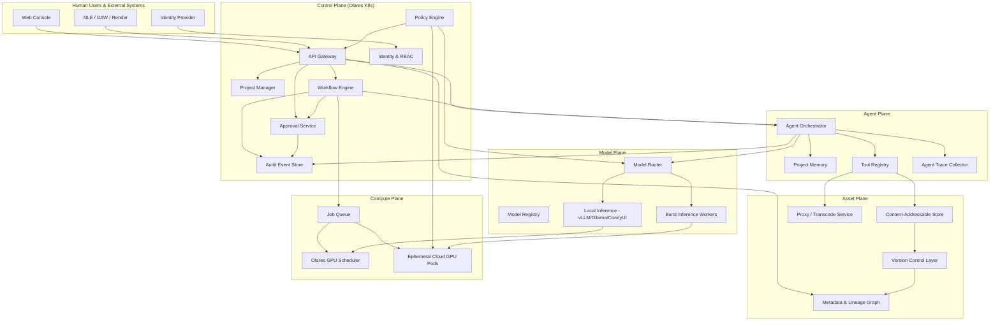
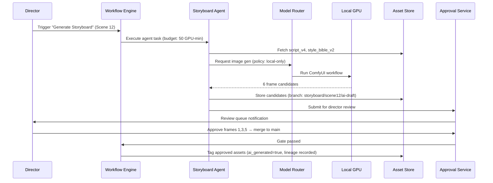
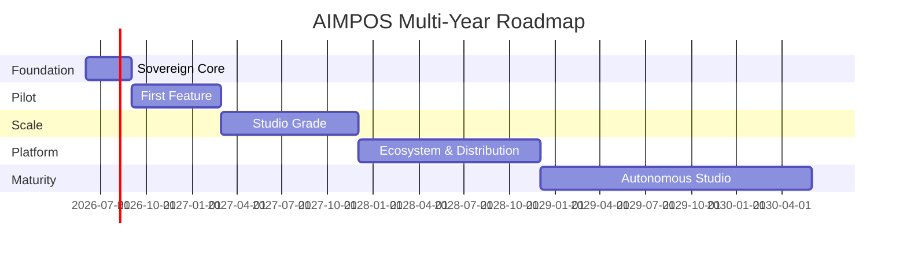

# AIMPOS — AI Media Production Operating System

## Enterprise Architecture Blueprint

| Field | Value |
|-------|-------|
| **Document Type** | Strategic Vision & Enterprise Architecture Blueprint |
| **Version** | 1.0 |
| **Status** | Approved — Archive |
| **Date** | June 8, 2026 |
| **Classification** | Internal / Strategic Planning |
| **Target Platform** | Olares One (Kubernetes-based, local-first AI infrastructure) |
| **Related Documents** | [Business Capabilities.md](./Business%20Capabilities.md) |

---

## Table of Contents

1. [Vision Document](#1-vision-document)
2. [Business Goals](#2-business-goals)
3. [Functional Requirements](#3-functional-requirements)
4. [Non-Functional Requirements](#4-non-functional-requirements)
5. [User Personas](#5-user-personas)
6. [High-Level Architecture](#6-high-level-architecture)
7. [Product Roadmap](#7-product-roadmap)
8. [Risks and Mitigations](#8-risks-and-mitigations)
9. [Success Criteria](#9-success-criteria)
10. [Future Expansion Opportunities](#10-future-expansion-opportunities)
- [Appendix A: Glossary](#appendix-a-glossary)
- [Appendix B: 30-Day Action Plan](#appendix-b-recommended-next-steps-30-day-action-plan)
- [Appendix C: Document Control](#appendix-c-document-control)

---

## Executive Summary

AIMPOS (AI Media Production Operating System) is a **privacy-first, workflow-driven, agentic media production platform** designed to run primarily on **Olares One** with self-hosted open-source AI models. It treats media production as an **operating system problem**: orchestrating people, agents, models, assets, approvals, and compute across the full lifecycle—from ideation through distribution.

The platform launches with **feature film production** as the anchor vertical, but its core abstractions (projects, workflows, assets, agents, approvals, compute policies) are **media-type agnostic**, enabling documentaries, TV series, podcasts, audiobooks, Islamic educational content, YouTube channels, marketing campaigns, animation, and future formats without architectural rework.

**Strategic differentiators:**

- Data never leaves the sovereign boundary by default
- Human-in-the-loop (HITL) is a first-class workflow primitive, not an afterthought
- Every asset, prompt, model invocation, and approval is versioned and auditable
- GPU burst to ephemeral cloud containers is policy-governed and opt-in per job

---

# 1. Vision Document

## 1.1 Vision Statement

> **AIMPOS empowers creators, studios, and enterprises to produce world-class media using sovereign AI—where creativity stays local, intelligence is agentic, and every decision is traceable.**

## 1.2 The Problem

Modern media production is fragmented across dozens of tools (scripting, VFX, audio, color, distribution), each with its own data silo, licensing model, and cloud dependency. Generative AI amplifies this fragmentation: prompts leak to third parties, outputs are ungoverned, and creative teams lose provenance over what was human-made vs. machine-generated.

Studios need:

- A **single operating layer** that unifies production workflows
- **Local inference** for sensitive pre-release content (scripts, dailies, talent likeness)
- **Agent assistance** without surrendering creative control
- **Enterprise governance** (audit, compliance, approvals, RBAC)
- **Elastic compute** when local GPUs are insufficient—without permanent cloud migration

## 1.3 The AIMPOS Concept

AIMPOS is not a single application. It is a **production operating system** comprising:

| Layer | Purpose |
|-------|---------|
| **Control Plane** | Projects, workflows, policies, RBAC, audit, approvals |
| **Agent Plane** | Multi-agent orchestration with tool use and HITL gates |
| **Model Plane** | Local model registry, routing, quantization, burst scheduling |
| **Asset Plane** | Versioned media, metadata, lineage, rights, storage tiers |
| **Compute Plane** | Olares-local GPU + ephemeral cloud burst workers |
| **Integration Plane** | NLE, DAW, render farms, CMS, distribution APIs |

## 1.4 Guiding Principles

1. **Privacy by architecture** — Sensitive data processed on Olares; egress is deny-by-default
2. **Local AI first** — Cloud is burst capacity, not primary runtime
3. **Open source first** — Prefer OSS models, engines, and infrastructure; avoid vendor lock-in
4. **Workflows over features** — Capabilities are composed into auditable pipelines
5. **Agents with guardrails** — Autonomy is bounded by policy, budget, and human approval
6. **Everything is versioned** — Assets, prompts, workflows, model weights, and decisions
7. **Human authority** — AI proposes; humans approve at defined gates
8. **Media-agnostic core** — Verticals extend the platform; they do not fork it

## 1.5 North Star Outcome (3–5 Years)

A production studio runs an entire slate—films, series, podcasts, educational content—on AIMPOS with:

- 80%+ of AI inference on local Olares clusters
- Sub-5-minute approval turnaround on critical gates
- Full asset lineage from script revision → final master
- Zero unapproved AI-generated content in distribution masters
- Multi-studio federation with shared governance templates

---

# 2. Business Goals

## 2.1 Primary Business Goals

| ID | Goal | Target (Year 3) |
|----|------|-----------------|
| BG-01 | Reduce end-to-end production cycle time for scripted content | 25–40% reduction vs. baseline |
| BG-02 | Lower per-minute production cost for mid-budget film | 15–30% reduction |
| BG-03 | Achieve sovereign AI compliance for pre-release content | 100% of sensitive assets local |
| BG-04 | Enable multi-format reuse (film → podcast → clips → education) | 1 project → 4+ derivative formats |
| BG-05 | Establish AIMPOS as internal production standard | 1 flagship film + 2 secondary verticals live |

## 2.2 Strategic Business Goals

| ID | Goal | Rationale |
|----|------|-----------|
| BG-06 | Build reusable IP in workflow templates and agent playbooks | Compounding advantage across projects |
| BG-07 | Create open-core ecosystem (community templates, model packs) | Talent acquisition, partner integrations |
| BG-08 | Support Islamic educational content with scholarly review workflows | Differentiated vertical + mission alignment |
| BG-09 | Enable studio-to-studio collaboration without data leakage | Federated projects with policy boundaries |
| BG-10 | Monetize enterprise tier (multi-node Olares clusters, SLA, support) | Sustainable revenue beyond internal use |

## 2.3 Operational Goals

- **Time-to-first-production:** Pilot film workflow operational within 6 months of platform MVP
- **Onboarding:** New crew member productive within 2 days via role-based workspaces
- **Incident recovery:** Full project state restorable from versioned assets within 4 hours
- **Cost predictability:** Per-project GPU cost attribution with monthly budget alerts

## 2.4 Constraints & Non-Negotiables

- No training on talent likeness without explicit consent workflow
- No distribution of AI-generated content without approval chain completion
- Cloud burst requires explicit project-level policy + per-job authorization
- All third-party model/API usage logged with data classification tags

---

# 3. Functional Requirements

Organized by capability domain. Priority: **P0** (MVP), **P1** (Year 1), **P2** (Year 2+).

> **Note:** The full business capability decomposition is maintained in [Business Capabilities.md](./Business%20Capabilities.md) (78 capabilities across 16 domains).

## 3.1 Project & Workspace Management

| ID | Requirement | Priority |
|----|-------------|----------|
| FR-01 | Create/manage projects with type (film, doc, series, podcast, etc.) | P0 |
| FR-02 | Multi-tenant workspaces with RBAC (studio, department, external vendor) | P0 |
| FR-03 | Project templates per media type with configurable phases | P0 |
| FR-04 | Cross-project asset library with rights and usage tags | P1 |
| FR-05 | Federated project sharing across Olares clusters | P2 |

## 3.2 Workflow Engine

| ID | Requirement | Priority |
|----|-------------|----------|
| FR-10 | Visual + declarative workflow designer (DAG-based) | P0 |
| FR-11 | Pre-built pipelines: script → pre-viz → shoot → post → master → distribute | P0 |
| FR-12 | Conditional branching, parallel stages, retry, timeout | P0 |
| FR-13 | HITL approval nodes as first-class workflow steps | P0 |
| FR-14 | Workflow versioning with diff and rollback | P0 |
| FR-15 | SLA timers and escalation on stalled approvals | P1 |
| FR-16 | Workflow marketplace (internal + community templates) | P2 |

## 3.3 Agentic AI Orchestration

| ID | Requirement | Priority |
|----|-------------|----------|
| FR-20 | Multi-agent runtime (planner, executor, critic, specialist agents) | P0 |
| FR-21 | Agent tool registry (script analysis, storyboard gen, audio cleanup, etc.) | P0 |
| FR-22 | Agent memory scoped per project with retention policies | P0 |
| FR-23 | Agent action budget (token, GPU minutes, API calls) per task | P0 |
| FR-24 | Agent proposals require human approval before irreversible actions | P0 |
| FR-25 | Agent observability: reasoning trace, tool calls, outputs | P0 |
| FR-26 | Role-specific agent personas (writer's room, AD, sound designer) | P1 |
| FR-27 | Multi-agent debate/critique loops for quality gates | P1 |

## 3.4 Model Management

| ID | Requirement | Priority |
|----|-------------|----------|
| FR-30 | Local model registry (LLM, diffusion, TTS, ASR, video, embedding) | P0 |
| FR-31 | Model routing by task, quality tier, latency, cost | P0 |
| FR-32 | Support multiple concurrent models with VRAM scheduling | P0 |
| FR-33 | Model version pinning per project/workflow stage | P0 |
| FR-34 | Quantization profiles (FP16, INT8, GGUF) per hardware | P0 |
| FR-35 | Evaluation harness for model A/B on production samples | P1 |
| FR-36 | Fine-tuned adapter management (LoRA, etc.) with lineage | P1 |

## 3.5 GPU Burst & Compute Orchestration

| ID | Requirement | Priority |
|----|-------------|----------|
| FR-40 | Local GPU queue with priority classes (interactive, batch, burst) | P0 |
| FR-41 | Policy engine: when burst is allowed (classification, budget, approver) | P0 |
| FR-42 | Ephemeral cloud GPU container provisioning (run-to-completion) | P1 |
| FR-43 | Encrypted transit of job packages; no persistent cloud storage | P1 |
| FR-44 | Automatic teardown and cost reconciliation per job | P1 |
| FR-45 | Multi-node Olares cluster scheduling | P1 |
| FR-46 | Render farm integration (Deadline, OpenCue) | P2 |

## 3.6 Asset Management & Version Control

| ID | Requirement | Priority |
|----|-------------|----------|
| FR-50 | Git-like versioning for all assets (scripts, media, prompts, configs) | P0 |
| FR-51 | Content-addressable storage with deduplication | P0 |
| FR-52 | Asset metadata schema (format, resolution, codec, rights, AI-generated flag) | P0 |
| FR-53 | Lineage graph: input assets → transformations → outputs | P0 |
| FR-54 | Branch/merge for creative iterations (script v3 vs v4) | P0 |
| FR-55 | Large media tiering (hot SSD, warm NAS, cold archive) | P1 |
| FR-56 | Automated proxy generation for editorial | P1 |
| FR-57 | Rights management and embargo enforcement | P1 |

## 3.7 Human-in-the-Loop Approvals

| ID | Requirement | Priority |
|----|-------------|----------|
| FR-60 | Configurable approval chains by asset type and project phase | P0 |
| FR-61 | Side-by-side review UI (human vs AI output, diff, annotations) | P0 |
| FR-62 | Approval delegation, quorum rules, veto authority | P0 |
| FR-63 | Immutable approval records linked to asset version | P0 |
| FR-64 | Mobile/remote approval via secure VPN (Olares) | P1 |
| FR-65 | Scholarly review workflow for Islamic educational content | P1 |

## 3.8 Audit & Compliance

| ID | Requirement | Priority |
|----|-------------|----------|
| FR-70 | Immutable audit log of all system events | P0 |
| FR-71 | Who/what/when/where/why for every AI invocation | P0 |
| FR-72 | Data classification labels (public, internal, confidential, talent) | P0 |
| FR-73 | Exportable compliance reports (AI usage, approvals, egress) | P0 |
| FR-74 | Consent tracking for likeness, voice, and training use | P1 |
| FR-75 | GDPR-style data subject request workflows | P2 |

## 3.9 Media-Type Vertical Capabilities

### Film (P0 anchor)

- Script breakdown, scene scheduling, shot list generation
- Pre-visualization and storyboard agents
- Dailies ingest, sync, proxy, metadata tagging
- VFX plate management and comp review
- Color pipeline handoff (LUT, CDL)
- Mastering and deliverables spec enforcement

### Documentary (P1)

- Interview transcription, topic clustering, narrative arc suggestions
- Archival footage rights tracking
- Fact-check agent with source citation requirements

### TV Series (P1)

- Episode/season hierarchy, continuity bible
- Writers' room collaboration with versioned room notes
- Recurring asset libraries (sets, costumes, characters)

### Podcast / Audiobook (P1)

- Multi-track audio ingest, noise reduction, chapter marking
- Voice consistency checks across sessions
- Distribution package generation (chapters, metadata, transcripts)

### Islamic Educational Content (P1)

- Scholar approval gates before publication
- Source citation and authenticity verification workflows
- Multi-language (Arabic, Urdu, English) content pipelines
- Modesty/content policy filters with human override

### YouTube / Marketing (P1)

- Clip extraction from long-form masters
- Thumbnail/title A/B variant generation (approval required)
- Campaign calendar and asset variant management

### Animation (P2)

- Rig/asset versioning, render layer management
- Style consistency agents across sequences

## 3.10 Integrations

| ID | Requirement | Priority |
|----|-------------|----------|
| FR-80 | NLE integration (DaVinci Resolve, Premiere, Avid) via watch folders/API | P1 |
| FR-81 | DAW integration (Reaper, Pro Tools) | P1 |
| FR-82 | Calendar/scheduling (production calendar) | P1 |
| FR-83 | Distribution (YouTube, podcast hosts, OTT packagers) | P2 |
| FR-84 | SSO (OIDC/SAML) | P1 |

---

# 4. Non-Functional Requirements

## 4.1 Performance

| ID | Requirement | Target |
|----|-------------|--------|
| NFR-01 | Interactive agent response (local LLM) | < 3s to first token (7B–13B class) |
| NFR-02 | Workflow orchestration overhead | < 500ms per step transition |
| NFR-03 | Asset metadata query | < 200ms p95 |
| NFR-04 | Concurrent projects per Olares One node | ≥ 5 active (mixed workload) |
| NFR-05 | Burst job provisioning | < 10 min from approval to worker ready |

## 4.2 Scalability

| ID | Requirement | Target |
|----|-------------|--------|
| NFR-10 | Horizontal scale via Olares K8s cluster | 1–10 nodes Year 1 |
| NFR-11 | Asset storage scale | 100TB+ per studio without architecture change |
| NFR-12 | Audit event ingest | 10K events/sec burst without loss |
| NFR-13 | Workflow instances | 1,000 concurrent across cluster |

## 4.3 Availability & Reliability

| ID | Requirement | Target |
|----|-------------|--------|
| NFR-20 | Control plane availability | 99.5% (studio hours + overnight batch) |
| NFR-21 | RPO (project state) | ≤ 1 hour |
| NFR-22 | RTO (full restore) | ≤ 4 hours |
| NFR-23 | Workflow idempotency | All steps safely retryable |

## 4.4 Security & Privacy

| ID | Requirement | Target |
|----|-------------|--------|
| NFR-30 | Encryption at rest | AES-256 all asset stores |
| NFR-31 | Encryption in transit | TLS 1.3 internal; mTLS service mesh |
| NFR-32 | Default egress policy | Deny-all; allowlist per project |
| NFR-33 | Secrets management | Vault-compatible; no secrets in workflows |
| NFR-34 | RBAC granularity | Project + asset + action level |
| NFR-35 | Air-gap mode | Full offline operation for 72+ hours |

## 4.5 Observability

| ID | Requirement | Target |
|----|-------------|--------|
| NFR-40 | Distributed tracing across agents/workflows | 100% sampled for AI paths |
| NFR-41 | GPU utilization dashboards | Per-project attribution |
| NFR-42 | Cost telemetry | Real-time burst spend tracking |
| NFR-43 | Alerting | PagerDuty-compatible webhooks |

## 4.6 Usability

| ID | Requirement | Target |
|----|-------------|--------|
| NFR-50 | Role-based UI simplification | ≤ 3 primary actions per role home |
| NFR-51 | Accessibility | WCAG 2.1 AA for web consoles |
| NFR-52 | Localization | EN + AR (RTL) by Year 2 |

## 4.7 Maintainability & Openness

| ID | Requirement | Target |
|----|-------------|--------|
| NFR-60 | OSS license compliance | SBOM per release |
| NFR-61 | Plugin API stability | Semver with 12-month deprecation |
| NFR-62 | Infrastructure as code | 100% deployable via GitOps |

---

# 5. User Personas

## 5.1 Executive Producer — *Sara*

| Attribute | Detail |
|-----------|--------|
| **Goals** | On-time, on-budget delivery; risk visibility; slate oversight |
| **Pain** | Fragmented status across tools; AI governance uncertainty |
| **AIMPOS value** | Executive dashboard, approval bottlenecks, cost/GPU attribution, compliance reports |
| **Key workflows** | Greenlight gate, budget approval, distribution sign-off |

## 5.2 Director — *Marcus*

| Attribute | Detail |
|-----------|--------|
| **Goals** | Creative vision realized; fast iteration on story and visuals |
| **Pain** | Slow previz; disconnected script-to-screen feedback loops |
| **AIMPOS value** | Storyboard/previz agents (proposal-only), shot list sync, dailies review with AI tagging |
| **Key workflows** | Script approval, storyboard review, fine cut approval |

## 5.3 Post-Production Supervisor — *Elena*

| Attribute | Detail |
|-----------|--------|
| **Goals** | Pipeline reliability; deliverables spec compliance; team coordination |
| **Pain** | Version chaos; unclear AI-generated element provenance |
| **AIMPOS value** | Asset lineage, automated deliverables validation, NLE integration |
| **Key workflows** | Conform approval, VFX turnover, master QC gate |

## 5.4 VFX / AI Artist — *Jordan*

| Attribute | Detail |
|-----------|--------|
| **Goals** | High-quality generative assists; fast iteration; clear briefs |
| **Pain** | Model inconsistency; no audit trail for client deliverables |
| **AIMPOS value** | Model routing, burst GPU on demand, versioned prompts and outputs |
| **Key workflows** | Plate processing, comp review submission, render job burst |

## 5.5 Sound Designer / Re-recording Mixer — *Aisha*

| Attribute | Detail |
|-----------|--------|
| **Goals** | Clean stems; consistent loudness; efficient ADR/dialogue workflows |
| **Pain** | Manual cleanup; missing metadata on AI-processed audio |
| **AIMPOS value** | Local ASR/TTS, noise reduction agents, loudness validation |
| **Key workflows** | Stem approval, M&E delivery, final mix sign-off |

## 5.6 Writer / Showrunner — *David*

| Attribute | Detail |
|-----------|--------|
| **Goals** | Collaborative writing; continuity; fast room iterations |
| **Pain** | AI overwriting voice; unversioned room changes |
| **AIMPOS value** | Branching script versions, writer-agent as suggest-only, room notes versioning |
| **Key workflows** | Script draft review, story bible updates, episode breakdown |

## 5.7 Islamic Content Scholar — *Dr. Hassan*

| Attribute | Detail |
|-----------|--------|
| **Goals** | Theological accuracy; source authenticity; publication integrity |
| **Pain** | Unreviewed AI content reaching audiences |
| **AIMPOS value** | Mandatory scholarly approval chain, citation enforcement, audit trail |
| **Key workflows** | Content authenticity review, translation verification, publication gate |

## 5.8 Platform / MLOps Engineer — *Priya*

| Attribute | Detail |
|-----------|--------|
| **Goals** | Stable models; efficient GPU use; secure burst policies |
| **Pain** | Ad-hoc model deployments; no cost controls |
| **AIMPOS value** | Model registry, Olares scheduling, burst policy engine, observability |
| **Key workflows** | Model promotion, burst policy config, incident response |

## 5.9 Studio IT / Security Officer — *Robert*

| Attribute | Detail |
|-----------|--------|
| **Goals** | Data sovereignty; access control; regulatory readiness |
| **Pain** | Shadow AI tools; unlogged cloud API usage |
| **AIMPOS value** | Deny-by-default egress, RBAC, immutable audit, air-gap support |
| **Key workflows** | Access reviews, compliance exports, incident forensics |

## 5.10 External Vendor / Freelancer — *Lin*

| Attribute | Detail |
|-----------|--------|
| **Goals** | Clear briefs; limited access; fast turnaround |
| **Pain** | Over-broad studio system access |
| **AIMPOS value** | Scoped project sandbox, time-limited credentials, watermark on previews |
| **Key workflows** | Asset upload, review response, deliverable submission |

---

# 6. High-Level Architecture

## 6.1 Architecture Overview

## 6.2 Layer Descriptions

### Control Plane

The **system of record** for production state. Owns project lifecycle, workflow definitions and instances, approval chains, RBAC, and the immutable audit log. All other planes are invoked *through* policy-checked APIs.

**Recommended OSS alignment:** Temporal or Argo Workflows (orchestration), Open Policy Agent (policy), Keycloak or Zitadel (identity), immudb or append-only event store (audit).

### Agent Plane

Hosts **bounded autonomous agents** that plan, execute tools, and propose outputs. Agents never bypass the Approval Service for gated actions. Each agent run produces a full trace (prompts, tool calls, model IDs, outputs) stored in audit.

**Pattern:** Supervisor agent delegates to specialist agents (script, visual, audio, compliance). Critic agent validates before human presentation.

### Model Plane

**Model registry** catalogs local weights, adapters, and capability tags. **Model router** selects inference backend based on task, classification, SLA, and policy. Local inference runs on Olares GPU via vLLM, llama.cpp, ComfyUI, Whisper, Coqui TTS, etc. Burst path provisions ephemeral containers only when policy approves.

### Asset Plane

**Content-addressable storage** (MinIO/SeaweedFS on Olares) with a **version control semantic layer** (branches, tags, merges—LakeFS or custom Git-like API). **Lineage graph** records every transformation: `script_v12 + prompt_v3 + model_flux_1.2 → storyboard_frame_0042`.

### Compute Plane

**Local queue** prioritizes interactive vs batch. **Burst orchestrator** packages job context, spins ephemeral GPU pod (RunPod, Lambda, self-managed K8s), executes, returns artifacts, destroys pod. No persistent cloud state.

## 6.3 Core Data Flow: AI-Assisted Storyboard Generation

## 6.4 Deployment Topology on Olares

| Tier | Components | Hardware |
|------|------------|----------|
| **Edge Node (Olares One)** | Control plane, agent orchestrator, local inference, hot asset store | RTX 5090 24GB, 96GB RAM, 2TB NVMe |
| **Storage Node** | Warm/cold assets, backup | NAS / expanded NVMe via Thunderbolt |
| **Cluster Node (optional)** | Additional inference, transcode | Second Olares One or approved hardware |
| **Burst Zone (ephemeral)** | Heavy video gen, large training, 4K+ batch | Cloud GPU container, auto-destroy |

## 6.5 Key Architectural Decisions (ADRs Summary)

| Decision | Choice | Rationale |
|----------|--------|-----------|
| Orchestration | Workflow engine + event-driven agents | Auditable, retryable, HITL-native |
| Storage | CAS + version semantic layer | Dedup + Git-like creative workflow |
| Inference default | Local on Olares | Privacy, latency, cost |
| Burst model | Ephemeral job workers | No data residency in cloud |
| Agent framework | Pluggable (LangGraph-style patterns) | Avoid single-vendor agent lock-in |
| API style | Event-sourced core + REST/GraphQL facade | Auditability + developer ergonomics |
| Multi-tenancy | Namespace-per-studio on shared cluster | Olares K8s native |

## 6.6 Reference Technology Stack (OSS-First)

| Capability | Candidates |
|------------|------------|
| Platform | Olares OS (K8s) |
| Workflow | Temporal, Argo Workflows, Windmill |
| Agents | Custom orchestrator + LangGraph patterns |
| LLM inference | vLLM, Ollama, llama.cpp |
| Image/video gen | ComfyUI, Stable Diffusion, CogVideo |
| Audio | Whisper, Coqui TTS, Demucs |
| Object storage | MinIO, SeaweedFS |
| Versioned assets | LakeFS, DVC |
| Policy | Open Policy Agent |
| Observability | OpenTelemetry, Grafana, Loki |
| Identity | Keycloak, Zitadel |
| Message bus | NATS, Redis Streams |

---

# 7. Product Roadmap

## Phase 0: Foundation (Months 0–3) — *"Sovereign Core"*

**Goal:** Runnable platform on single Olares One with one end-to-end path.

| Deliverable | Outcome |
|-------------|---------|
| Olares deployment blueprint | K8s namespaces, storage, networking |
| Control plane MVP | Projects, RBAC, basic audit |
| Asset store v1 | CAS upload, versioning, metadata |
| Workflow engine integration | Linear pipelines with HITL node |
| Local LLM + image inference | Script analysis + storyboard draft |
| Film project template | Development → Pre-production phases |

**Exit criteria:** One internal short film scene produced through AIMPOS with full audit trail.

---

## Phase 1: Production Pilot (Months 4–9) — *"First Feature"*

**Goal:** Support active feature film production for development through post.

| Deliverable | Outcome |
|-------------|---------|
| Multi-agent orchestration | Planner + specialist + critic pattern |
| Model registry & router | Multi-model with project pinning |
| Approval chains v2 | Delegation, quorum, escalation |
| NLE watch-folder integration | Resolve/Premiere proxy sync |
| Dailies ingest pipeline | Sync, proxy, AI tagging |
| Lineage graph UI | Visual provenance |
| Podcast vertical template | Reuse core for audio-first project |

**Exit criteria:** Flagship film pilot completes one production phase (e.g., post) entirely on AIMPOS.

---

## Phase 2: Scale & Govern (Months 10–18) — *"Studio Grade"*

**Goal:** Enterprise governance, burst compute, multi-vertical.

| Deliverable | Outcome |
|-------------|---------|
| GPU burst orchestrator | Policy-gated ephemeral cloud workers |
| Multi-node Olares cluster | Distributed inference scheduling |
| Islamic education workflow | Scholar approval + citation gates |
| TV series template | Season/episode hierarchy, bible |
| Documentary template | Transcription, archival rights |
| Compliance reporting | Exportable AI usage reports |
| Vendor sandbox access | Scoped external collaborator mode |

**Exit criteria:** 3 concurrent projects across 3 media types; burst used on ≥1 production job with zero policy violations.

---

## Phase 3: Distribution & Ecosystem (Months 19–30) — *"Platform"*

**Goal:** Distribution integration, marketplace, federation.

| Deliverable | Outcome |
|-------------|---------|
| Marketing/YouTube vertical | Clip extraction, campaign variants |
| Animation pipeline extensions | Render farm integration |
| Workflow marketplace | Shareable templates |
| Distribution packagers | OTT/podcast/YouTube export |
| Federated projects | Cross-cluster collaboration |
| Enterprise SLA tier | Multi-studio support model |

**Exit criteria:** Full slate (film + series + education) with distribution handoff; 1 external studio pilot.

---

## Phase 4: Intelligence Maturity (Months 31–48) — *"Autonomous Studio"*

**Goal:** Advanced agent autonomy within guardrails; predictive production.

| Deliverable | Outcome |
|-------------|---------|
| Predictive scheduling agents | Budget/timeline risk forecasting |
| Fine-tune pipeline (local) | Style-consistent LoRA per project |
| Multi-agent quality loops | Automated pre-QC before human review |
| Real-time onset assist | Dailies → assembly suggestions |
| Open-core community release | Template and plugin ecosystem |

**Exit criteria:** 25%+ cycle time reduction demonstrated across 2 completed projects.

---

## Roadmap Visualization

---

# 8. Risks and Mitigations

| Risk | Likelihood | Impact | Mitigation |
|------|------------|--------|------------|
| **Olares One GPU insufficient for video-gen at scale** | High | High | Burst policy engine; proxy-first editorial; model quantization roadmap; cluster expansion |
| **Agent hallucination in production-critical paths** | High | High | HITL mandatory gates; critic agents; confidence thresholds; no auto-merge to main |
| **Creative team resistance to "OS" overhead** | Medium | High | Role-simplified UIs; integrate into existing NLE/DAW; show time-saved metrics |
| **Version proliferation / storage explosion** | High | Medium | CAS dedup; tiered storage; retention policies; proxy-only editorial default |
| **Cloud burst data leakage** | Medium | Critical | Encrypted job packages; ephemeral workers; deny persistent cloud storage; egress audit |
| **OSS model quality gaps vs. cloud APIs** | High | Medium | Multi-model routing; burst fallback with explicit approval; continuous eval harness |
| **Workflow engine complexity** | Medium | Medium | Start linear; visual designer; pre-built templates; limit custom code in P0 |
| **Islamic content theological errors** | Medium | Critical | Scholar-mandatory gates; no auto-publish; source citation requirements |
| **Talent rights / likeness legal exposure** | Medium | Critical | Consent workflows; provenance tagging; legal review gate on AI face/voice |
| **Single-node Olares failure** | Medium | High | Backup to NAS; cluster mode; 4-hour RTO runbooks |
| **Key person dependency (MLOps)** | Medium | Medium | GitOps everything; runbooks; cross-train; managed model catalog |
| **Regulatory evolution (AI labeling laws)** | Medium | Medium | AI-generated flags in metadata; compliance module; regional export profiles |

## Risk Governance

- Quarterly risk review with Executive Producer + Security + MLOps
- **Red-team exercises** on burst egress paths annually
- **Legal review** of approval chain templates per distribution territory

---

# 9. Success Criteria

## 9.1 Phase-Gated Success Metrics

| Phase | Metric | Target |
|-------|--------|--------|
| Phase 0 | End-to-end audited workflow completion | 1 scene, 100% lineage |
| Phase 0 | Local inference ratio | ≥ 95% of AI calls |
| Phase 1 | Active production usage | 1 feature film phase live |
| Phase 1 | Approval SLA | Critical gates < 24h median |
| Phase 1 | User adoption | ≥ 80% of pilot crew weekly active |
| Phase 2 | Multi-vertical projects | ≥ 3 types concurrently |
| Phase 2 | Burst jobs with zero policy violations | 100% |
| Phase 2 | Unapproved AI in distribution masters | 0 incidents |
| Phase 3 | Cycle time reduction | ≥ 15% vs. baseline |
| Phase 3 | Cost per finished minute | ≥ 15% reduction |
| Phase 4 | Template reuse rate | ≥ 60% new projects from templates |
| Phase 4 | External studio pilot | 1 successful onboarding |

## 9.2 Platform Health KPIs (Ongoing)

| KPI | Target |
|-----|--------|
| System availability (control plane) | ≥ 99.5% |
| Audit log completeness | 100% of AI invocations |
| Mean time to restore project | ≤ 4 hours |
| GPU utilization (local) | 60–80% during batch windows |
| Storage deduplication ratio | ≥ 30% |
| Security incidents (data egress) | 0 critical |

## 9.3 Qualitative Success Signals

- Directors describe AIMPOS as **"invisible when working, invaluable when auditing"**
- Legal/compliance signs off on AI provenance for distribution
- Scholars trust Islamic content pipeline without parallel manual spreadsheets
- MLOps can promote a new model version in < 1 day with rollback in < 1 hour

---

# 10. Future Expansion Opportunities

## 10.1 Product & Vertical Expansion

| Opportunity | Description | Horizon |
|-------------|-------------|---------|
| **Live production / broadcast** | Real-time AI assist for news, sports, live events | Year 3+ |
| **Interactive / game cinematics** | Branching narrative asset pipelines | Year 3+ |
| **Localization factory** | Dubbing, subtitling, cultural adaptation at scale | Year 2+ |
| **Virtual production / LED volume** | Unreal Engine sync, on-set generative fill | Year 3+ |
| **Music video & short-form** | TikTok/Reels-native rapid iteration templates | Year 2+ |
| **Corporate L&D media** | Training video with compliance review | Year 2+ |
| **Heritage & archive restoration** | Documentary/restoration AI with rights governance | Year 3+ |

## 10.2 Technical Expansion

| Opportunity | Description |
|-------------|-------------|
| **Federated learning across studios** | Improve models without sharing raw assets (Olares roadmap alignment) |
| **Edge onset kits** | Lightweight Olares nodes for secure dailies ingest on location |
| **Neural asset search** | Multimodal embedding index across entire library |
| **Digital twin of production** | Simulation agents for schedule/budget optimization |
| **Blockchain-optional provenance** | Optional immutable public provenance for AI disclosure (regulatory) |
| **Haptic / spatial media** | Extend asset schema for VR/AR/visionOS deliverables |

## 10.3 Business & Ecosystem Expansion

| Opportunity | Description |
|-------------|-------------|
| **AIMPOS Open Core** | Community edition on Olares Market; enterprise governance tier |
| **Template marketplace** | Revenue share on workflow packs (film, podcast, education) |
| **Model pack certification** | Curated, evaluated model bundles for production quality |
| **Partner integrator program** | Certified NLE, render, distribution connectors |
| **Studio-as-a-Service** | Managed AIMPOS on Olares clusters for independent creators |
| **Regional sovereign studios** | GCC, EU, APAC deployments with local compliance packs |

## 10.4 Strategic Partnerships to Evaluate

| Partner | Focus |
|---------|-------|
| **Olares** | Deep platform integration, Market distribution, cluster roadmap |
| **Academy / guild partners** | Workflow standards for credited AI usage |
| **Islamic universities / councils** | Scholarly review network for education vertical |
| **Cloud GPU providers** | Burst-only partnerships with data destruction SLAs |
| **Open-source media foundations** | Blender, DaVinci, FFmpeg ecosystem alignment |

---

## Appendix A: Glossary

| Term | Definition |
|------|------------|
| **AIMPOS** | AI Media Production Operating System |
| **HITL** | Human-in-the-loop approval gates in workflows |
| **Burst** | Ephemeral cloud GPU execution, policy-governed |
| **Lineage** | Directed graph of asset transformations and dependencies |
| **Control Plane** | Governance, workflows, audit, projects |
| **Agent Plane** | Multi-agent orchestration and tool execution |
| **CAS** | Content-addressable storage (hash-based) |

---

## Appendix B: Recommended Next Steps (30-Day Action Plan)

| # | Action | Owner (suggested) |
|---|--------|-------------------|
| 1 | Charter steering committee (Executive Producer, CTO, MLOps, Legal, Director) | Executive Sponsor |
| 2 | Olares One lab environment — single-node deployment trial | MLOps |
| 3 | Reference architecture validation — script → storyboard → approval → audit on one scene | Architecture |
| 4 | Film pilot selection — low-risk internal short or documentary segment | Production |
| 5 | Policy framework draft — data classification, burst rules, AI disclosure, talent consent | Security / Legal |
| 6 | Vendor landscape assessment — workflow engine and asset versioning OSS finalists | Architecture |
| 7 | Persona-based UX wireframes — Director review UI and Producer dashboard first | Product |
| 8 | Build vs. integrate matrix — NLE, render, identity: integrate; governance core: build | Architecture |

---

## Appendix C: Document Control

| Version | Date | Author | Changes |
|---------|------|--------|---------|
| 1.0 | 2026-06-08 | AIMPOS Architecture Team | Initial approved blueprint — archive release |

### Document Set

| Document | Purpose | Status |
|----------|---------|--------|
| **Blueprint for a multi-year initiative.md** | Strategic vision, requirements, architecture, roadmap | Approved — Archive (this document) |
| **Business Capabilities.md** | Business capability model (78 capabilities, 16 domains) | Approved |

### Approval

| Role | Name | Date | Signature |
|------|------|------|-----------|
| Executive Sponsor | — | — | — |
| CTO / Chief Architect | — | — | — |
| Head of Production | — | — | — |

---

*This blueprint positions AIMPOS as a multi-year sovereign media platform—not a point solution for AI storyboards. The architecture deliberately separates control, agents, models, assets, and compute so each can evolve independently while the privacy-first, HITL, auditable contract remains invariant across every media vertical.*

*End of document*
