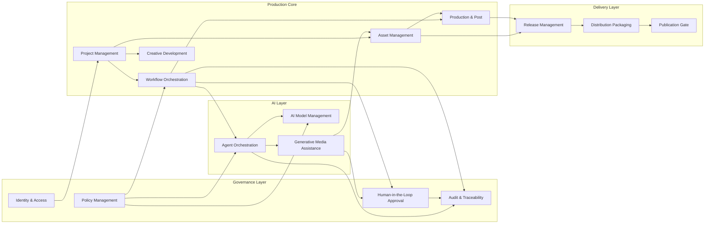

# AIMPOS Business Capability Model

**Document Type:** Business Architecture — Capability Map  
**Version:** 1.0  
**Status:** READ-ONLY REFERENCE — Frozen June 9, 2026. Implement 18 Included capabilities only per MVP Scope Freeze.  
**Date:** June 8, 2026  
**Parent Document:** Blueprint for a multi-year initiative.md  
**Scope:** AI Media Production Operating System (AIMPOS) — all media verticals

---

## Document Purpose

This document defines the **complete business capability model** for AIMPOS: what the platform must be able to do from a business and operational perspective, independent of technology or implementation choices. Capabilities are grouped into domains, prioritized against the approved roadmap, and mapped hierarchically to support investment planning, organizational design, and product backlog decomposition.

**Priority legend**

| Priority | Meaning |
|----------|---------|
| **P0** | Required for MVP / Phase 0 — sovereign core and film anchor |
| **P1** | Required for production pilot and studio-grade scale (Year 1) |
| **P2** | Platform maturity, multi-vertical expansion, ecosystem (Year 2+) |

---

## Hierarchical Capability Map

```
AIMPOS — AI Media Production Operating System
│
├── 1. STUDIO & PROJECT GOVERNANCE
│   ├── 1.1 Project Management
│   ├── 1.2 Workspace & Tenancy Management
│   ├── 1.3 Production Planning & Scheduling
│   ├── 1.4 Budget & Resource Management
│   └── 1.5 Slate & Portfolio Management
│
├── 2. CREATIVE DEVELOPMENT
│   ├── 2.1 Story Development
│   ├── 2.2 Script Writing & Management
│   ├── 2.3 Character Management
│   ├── 2.4 World & Continuity Bible Management
│   ├── 2.5 Writers' Room Collaboration
│   └── 2.6 Research & Reference Management
│
├── 3. PRE-PRODUCTION
│   ├── 3.1 Script Breakdown
│   ├── 3.2 Shot List & Storyboard Management
│   ├── 3.3 Pre-Visualization
│   ├── 3.4 Production Design Management
│   ├── 3.5 Casting & Talent Management
│   ├── 3.6 Location & Set Management
│   └── 3.7 Production Calendar Management
│
├── 4. PRODUCTION (ON-SET / CAPTURE)
│   ├── 4.1 Dailies Management
│   ├── 4.2 On-Set Media Ingest
│   ├── 4.3 Production Reporting
│   └── 4.4 On-Set Continuity Tracking
│
├── 5. VIDEO POST-PRODUCTION
│   ├── 5.1 Editorial Management
│   ├── 5.2 VFX Management
│   ├── 5.3 Color Grading Pipeline
│   ├── 5.4 Conform & Assembly
│   └── 5.5 Video Mastering & QC
│
├── 6. AUDIO POST-PRODUCTION
│   ├── 6.1 Audio Production
│   ├── 6.2 Dialogue & ADR Management
│   ├── 6.3 Sound Design
│   ├── 6.4 Music & Score Management
│   ├── 6.5 Audio Mixing & Mastering
│   └── 6.6 Podcast & Audiobook Production
│
├── 7. ASSET MANAGEMENT
│   ├── 7.1 Asset Ingest & Cataloging
│   ├── 7.2 Asset Version Control
│   ├── 7.3 Asset Lineage & Provenance
│   ├── 7.4 Rights & Licensing Management
│   ├── 7.5 Storage Tier & Lifecycle Management
│   ├── 7.6 Cross-Project Asset Library
│   └── 7.7 Proxy & Transcode Management
│
├── 8. AI & INTELLIGENT AUTOMATION
│   ├── 8.1 AI Model Management
│   ├── 8.2 Model Routing & Selection
│   ├── 8.3 Agent Orchestration
│   ├── 8.4 Agent Memory & Context Management
│   ├── 8.5 Prompt & Instruction Management
│   ├── 8.6 AI Quality Evaluation
│   └── 8.7 Generative Media Assistance
│
├── 9. WORKFLOW & ORCHESTRATION
│   ├── 9.1 Workflow Orchestration
│   ├── 9.2 Workflow Template Management
│   ├── 9.3 Human-in-the-Loop Approval
│   ├── 9.4 Task & Work Queue Management
│   └── 9.5 SLA & Escalation Management
│
├── 10. COMPUTE & RENDERING
│   ├── 10.1 Local Compute Scheduling
│   ├── 10.2 GPU Burst Management
│   ├── 10.3 Cluster & Capacity Management
│   ├── 10.4 Compute Cost Attribution
│   ├── 10.5 Rendering
│   └── 10.6 Render Farm Coordination
│
├── 11. GOVERNANCE, RISK & COMPLIANCE
│   ├── 11.1 Compliance Management
│   ├── 11.2 Audit & Traceability
│   ├── 11.3 Data Classification & Privacy
│   ├── 11.4 Consent & Talent Rights Management
│   ├── 11.5 Policy Management
│   ├── 11.6 Scholarly & Content Authenticity Review
│   └── 11.7 AI Disclosure & Labeling
│
├── 12. IDENTITY & ACCESS
│   ├── 12.1 Identity & Access Management
│   ├── 12.2 Role-Based Workspace Experience
│   └── 12.3 Vendor & External Collaborator Access
│
├── 13. INTEGRATION & ECOSYSTEM
│   ├── 13.1 Creative Tool Integration
│   ├── 13.2 Distribution Platform Integration
│   ├── 13.3 Enterprise System Integration
│   └── 13.4 Plugin & Extension Management
│
├── 14. RELEASE & DISTRIBUTION
│   ├── 14.1 Release Management
│   ├── 14.2 Deliverables Specification Management
│   ├── 14.3 Distribution Packaging
│   ├── 14.4 Campaign & Variant Management
│   └── 14.5 Publication Gate Management
│
├── 15. MEDIA VERTICAL EXTENSIONS
│   ├── 15.1 Feature Film Production
│   ├── 15.2 Documentary Production
│   ├── 15.3 TV Series Production
│   ├── 15.4 Islamic Educational Content Production
│   ├── 15.5 Marketing & Social Content Production
│   └── 15.6 Animation Production
│
└── 16. PLATFORM OPERATIONS & INSIGHTS
    ├── 16.1 Production Analytics & Reporting
    ├── 16.2 Observability & Health Management
    ├── 16.3 Disaster Recovery & Business Continuity
    └── 16.4 Knowledge & Template Marketplace
```

**Capability count:** 16 domains · 78 capabilities

---

## Domain 1: Studio & Project Governance

*Foundational capabilities that establish how studios, projects, and production portfolios are created, organized, funded, and overseen.*

---

### 1.1 Project Management

| Attribute | Description |
|-----------|-------------|
| **Purpose** | Create, configure, and lifecycle-manage production projects across all media types (film, series, podcast, education, marketing, animation) as the primary unit of work within AIMPOS. |
| **Inputs** | Studio charter, project brief, media type selection, phase template, team roster, governance policies, budget envelope |
| **Outputs** | Active project workspace, project metadata record, phase milestones, project status dashboard, archived project record |
| **Dependencies** | Workspace & Tenancy Management (1.2), Identity & Access Management (12.1), Workflow Template Management (9.2), Policy Management (11.5) |
| **Priority** | P0 |
| **Future roadmap** | Federated cross-studio projects; project cloning for derivative formats (film → podcast → education); portfolio-level dependency tracking across slates |

---

### 1.2 Workspace & Tenancy Management

| Attribute | Description |
|-----------|-------------|
| **Purpose** | Provide isolated, policy-bound workspaces for studios, departments, and external collaborators within a shared AIMPOS deployment. |
| **Inputs** | Organization structure, tenancy policy, user directory, data residency rules, namespace configuration |
| **Outputs** | Provisioned workspace, isolation boundaries, workspace-level policy bindings, usage quotas |
| **Dependencies** | Identity & Access Management (12.1), Policy Management (11.5), Data Classification & Privacy (11.3) |
| **Priority** | P0 |
| **Future roadmap** | Multi-region workspace federation; studio-as-a-service tenancy tiers; white-label workspace branding for enterprise clients |

---

### 1.3 Production Planning & Scheduling

| Attribute | Description |
|-----------|-------------|
| **Purpose** | Plan and track production phases, milestones, dependencies, and resource commitments from development through release. |
| **Inputs** | Project template, script breakdown, crew availability, location calendar, equipment schedule, budget constraints |
| **Outputs** | Production schedule, milestone tracker, dependency alerts, phase gate readiness status, schedule variance reports |
| **Dependencies** | Project Management (1.1), Script Breakdown (3.1), Production Calendar Management (3.7), Budget & Resource Management (1.4) |
| **Priority** | P1 |
| **Future roadmap** | Predictive schedule risk modeling; agent-assisted schedule optimization; integration with union/guild scheduling rules |

---

### 1.4 Budget & Resource Management

| Attribute | Description |
|-----------|-------------|
| **Purpose** | Track, allocate, and govern financial and compute resources across projects with real-time visibility and threshold alerts. |
| **Inputs** | Approved budget, GPU/compute rates, burst cost estimates, crew day rates, vendor quotes, spend policies |
| **Outputs** | Budget allocation ledger, spend-to-date reports, threshold alerts, per-phase cost attribution, budget approval requests |
| **Dependencies** | Project Management (1.1), Compute Cost Attribution (10.4), GPU Burst Management (10.2), Human-in-the-Loop Approval (9.3) |
| **Priority** | P1 |
| **Future roadmap** | Predictive budget overrun forecasting; automated cost optimization recommendations; multi-currency and multi-entity studio accounting |

---

### 1.5 Slate & Portfolio Management

| Attribute | Description |
|-----------|-------------|
| **Purpose** | Provide executive-level oversight across multiple concurrent projects, formats, and production stages within a studio portfolio. |
| **Inputs** | Active project registry, milestone status, budget summaries, risk registers, approval bottlenecks, compliance status |
| **Outputs** | Executive dashboard, slate health scorecard, cross-project resource conflicts, portfolio risk summary, greenlight recommendations |
| **Dependencies** | Project Management (1.1), Production Analytics & Reporting (16.1), Budget & Resource Management (1.4), Compliance Management (11.1) |
| **Priority** | P2 |
| **Future roadmap** | Rights and franchise management across slate; IP valuation tracking; investor/reporting portal for co-production partners |

---

## Domain 2: Creative Development

*Capabilities supporting ideation, narrative development, and creative bible management from concept through approved script.*

---

### 2.1 Story Development

| Attribute | Description |
|-----------|-------------|
| **Purpose** | Develop, iterate, and approve narrative concepts, treatments, outlines, and story structures before formal scripting. |
| **Inputs** | Creative brief, genre/market constraints, reference materials, writer notes, agent-generated story suggestions |
| **Outputs** | Approved treatment/outline, story structure document, beat sheet, development milestone sign-off, rejected draft archive |
| **Dependencies** | Research & Reference Management (2.6), Agent Orchestration (8.3), Human-in-the-Loop Approval (9.3), Asset Version Control (7.2) |
| **Priority** | P0 |
| **Future roadmap** | Multi-format story adaptation (film outline → series bible → podcast narrative); audience testing integration; franchise story universe management |

---

### 2.2 Script Writing & Management

| Attribute | Description |
|-----------|-------------|
| **Purpose** | Author, revise, branch, merge, and approve scripts (screenplay, narration, episode, educational lesson) with full version history. |
| **Inputs** | Approved outline, writer drafts, room notes, agent suggestions, formatting standards, revision notes |
| **Outputs** | Versioned script assets, revision comparison reports, approved script lock, script metadata (pages, scenes, characters) |
| **Dependencies** | Asset Version Control (7.2), Writers' Room Collaboration (2.5), Human-in-the-Loop Approval (9.3), Script Breakdown (3.1) |
| **Priority** | P0 |
| **Future roadmap** | Multi-language script pipelines; real-time collaborative editing; automated continuity checking against bible |

---

### 2.3 Character Management

| Attribute | Description |
|-----------|-------------|
| **Purpose** | Define, track, and maintain character profiles, arcs, relationships, casting status, and visual/voice references across a production. |
| **Inputs** | Script references, character bible entries, casting decisions, reference imagery, voice samples, agent-generated profiles |
| **Outputs** | Character registry, arc tracking, casting linkage, character asset bundles, continuity alerts |
| **Dependencies** | Script Writing & Management (2.2), World & Continuity Bible Management (2.4), Casting & Talent Management (3.5), Asset Ingest & Cataloging (7.1) |
| **Priority** | P1 |
| **Future roadmap** | Character consistency scoring across generated media; recurring character libraries for series; likeness consent linkage per character |

---

### 2.4 World & Continuity Bible Management

| Attribute | Description |
|-----------|-------------|
| **Purpose** | Maintain authoritative reference for world-building, continuity rules, timelines, locations, and recurring elements across episodes or sequels. |
| **Inputs** | Script revisions, showrunner notes, production design references, research materials, agent continuity checks |
| **Outputs** | Continuity bible, timeline registry, rule violation alerts, approved bible versions, derivative project seed data |
| **Dependencies** | Script Writing & Management (2.2), Character Management (2.3), Research & Reference Management (2.6), Asset Version Control (7.2) |
| **Priority** | P1 |
| **Future roadmap** | Cross-series shared universe bibles; automated continuity enforcement in agent outputs; AR/on-set bible access |

---

### 2.5 Writers' Room Collaboration

| Attribute | Description |
|-----------|-------------|
| **Purpose** | Facilitate structured writers' room sessions with versioned notes, pitch tracking, assignment management, and room-to-script traceability. |
| **Inputs** | Room agenda, pitch ideas, episode assignments, script drafts, agent room assists, attendance records |
| **Outputs** | Versioned room notes, pitch registry, assignment tracker, room-to-script lineage, session summaries |
| **Dependencies** | Script Writing & Management (2.2), Story Development (2.1), Human-in-the-Loop Approval (9.3), Asset Version Control (7.2) |
| **Priority** | P1 |
| **Future roadmap** | Virtual writers' room for distributed teams; AI pitch evaluation (advisory only); guild credit tracking integration |

---

### 2.6 Research & Reference Management

| Attribute | Description |
|-----------|-------------|
| **Purpose** | Collect, classify, and govern reference materials, source documents, and research findings that inform creative and factual decisions. |
| **Inputs** | Research briefs, source documents, web captures, interview transcripts, archival references, agent research summaries |
| **Outputs** | Classified reference library, source citation index, research approval records, fact-check linkage |
| **Dependencies** | Asset Ingest & Cataloging (7.1), Data Classification & Privacy (11.3), Scholarly & Content Authenticity Review (11.6) |
| **Priority** | P1 |
| **Future roadmap** | Automated source verification for documentary; rights clearance on reference materials; knowledge graph across productions |

---

## Domain 3: Pre-Production

*Capabilities that translate approved creative material into actionable production plans, visuals, and logistics.*

---

### 3.1 Script Breakdown

| Attribute | Description |
|-----------|-------------|
| **Purpose** | Decompose approved scripts into production elements—scenes, pages, cast, props, wardrobe, VFX, locations, and budget lines. |
| **Inputs** | Locked script, breakdown standards, historical cost data, agent breakdown suggestions |
| **Outputs** | Scene breakdown sheets, element lists, stripboard data, budget line mapping, breakdown approval record |
| **Dependencies** | Script Writing & Management (2.2), Production Planning & Scheduling (1.3), Budget & Resource Management (1.4) |
| **Priority** | P0 |
| **Future roadmap** | Auto-sync breakdown changes on script revision; multi-episode batch breakdown for series; localization breakdown variants |

---

### 3.2 Shot List & Storyboard Management

| Attribute | Description |
|-----------|-------------|
| **Purpose** | Create, review, approve, and maintain shot lists and storyboard frames aligned to script scenes and directorial intent. |
| **Inputs** | Script scenes, director brief, storyboard drafts (human and agent-generated), reference imagery, previz outputs |
| **Outputs** | Approved shot lists, storyboard frame sets, coverage maps, shot-to-scene linkage, review annotations |
| **Dependencies** | Script Breakdown (3.1), Pre-Visualization (3.3), Generative Media Assistance (8.7), Human-in-the-Loop Approval (9.3) |
| **Priority** | P0 |
| **Future roadmap** | On-set shot list mobile access; automated coverage gap detection; integration with virtual production volumes |

---

### 3.3 Pre-Visualization

| Attribute | Description |
|-----------|-------------|
| **Purpose** | Produce and iterate pre-visualization assets—animatics, layout films, blocking videos—to validate creative intent before principal photography. |
| **Inputs** | Storyboards, shot lists, 3D assets, timing notes, agent-generated previz proposals, director feedback |
| **Outputs** | Prevíz sequences, timing approvals, camera movement plans, previz-to-shoot handoff package |
| **Dependencies** | Shot List & Storyboard Management (3.2), Generative Media Assistance (8.7), Asset Version Control (7.2), Rendering (10.5) |
| **Priority** | P1 |
| **Future roadmap** | Real-time previz in virtual production environments; AI-assisted camera path optimization; game-engine pipeline sync |

---

### 3.4 Production Design Management

| Attribute | Description |
|-----------|-------------|
| **Purpose** | Manage production design assets including sets, props, costumes, mood boards, and design approvals linked to script elements. |
| **Inputs** | Script breakdown elements, designer submissions, reference imagery, budget constraints, agent design suggestions |
| **Outputs** | Design asset registry, mood board sets, approved design packages, element-to-scene mapping, design change log |
| **Dependencies** | Script Breakdown (3.1), Asset Ingest & Cataloging (7.1), Cross-Project Asset Library (7.6) |
| **Priority** | P1 |
| **Future roadmap** | 3D set asset versioning; AR on-set design reference; sustainable/production reuse tracking |

---

### 3.5 Casting & Talent Management

| Attribute | Description |
|-----------|-------------|
| **Purpose** | Track casting decisions, talent contracts, availability, likeness rights, and linkage to characters and scenes. |
| **Inputs** | Character registry, audition materials, contract terms, consent records, schedule requirements |
| **Outputs** | Casting registry, talent-scene assignments, availability calendar, consent status flags, casting approval records |
| **Dependencies** | Character Management (2.3), Consent & Talent Rights Management (11.4), Production Calendar Management (3.7) |
| **Priority** | P1 |
| **Future roadmap** | AI likeness usage tracking per talent; voice clone consent management; casting diversity analytics |

---

### 3.6 Location & Set Management

| Attribute | Description |
|-----------|-------------|
| **Purpose** | Catalog, approve, and schedule locations and stage sets with permits, logistics, and scene mapping. |
| **Inputs** | Script breakdown locations, scouting media, permit documents, availability windows, budget estimates |
| **Outputs** | Location registry, permit status tracker, location-scene schedule, logistical briefs, location approval records |
| **Dependencies** | Script Breakdown (3.1), Production Calendar Management (3.7), Rights & Licensing Management (7.4) |
| **Priority** | P1 |
| **Future roadmap** | Drone/scout media AI tagging; weather and logistics risk alerts; virtual location libraries |

---

### 3.7 Production Calendar Management

| Attribute | Description |
|-----------|-------------|
| **Purpose** | Maintain the master production calendar integrating shoot days, post milestones, approval deadlines, and delivery dates. |
| **Inputs** | Production schedule, crew availability, location permits, post pipeline milestones, approval SLA rules |
| **Outputs** | Master calendar, conflict alerts, milestone reminders, calendar exports, schedule change audit |
| **Dependencies** | Production Planning & Scheduling (1.3), Human-in-the-Loop Approval (9.3), Enterprise System Integration (13.3) |
| **Priority** | P1 |
| **Future roadmap** | Two-way sync with external calendar systems; automated cascade rescheduling on delays; mobile crew calendars |

---

## Domain 4: Production (On-Set / Capture)

*Capabilities for managing media capture, dailies, and on-set reporting during principal photography or recording.*

---

### 4.1 Dailies Management

| Attribute | Description |
|-----------|-------------|
| **Purpose** | Ingest, sync, organize, review, and distribute daily production footage with metadata, proxies, and selective approvals. |
| **Inputs** | Camera originals, audio sync references, slate metadata, script day references, crew review notes |
| **Outputs** | Organized dailies packages, synced proxies, scene-take registry, dailies review approvals, circle-take designations |
| **Dependencies** | On-Set Media Ingest (4.2), Proxy & Transcode Management (7.7), Editorial Management (5.1), Asset Lineage & Provenance (7.3) |
| **Priority** | P0 |
| **Future roadmap** | Near-real-time on-set dailies; AI-assisted take scoring (advisory); secure remote dailies for distributed review |

---

### 4.2 On-Set Media Ingest

| Attribute | Description |
|-----------|-------------|
| **Purpose** | Securely ingest and validate media from on-set or field capture with checksum verification, metadata extraction, and classification. |
| **Inputs** | Camera cards, audio recorders, metadata sidecars, ingest profiles, data classification rules |
| **Outputs** | Verified ingest records, cataloged raw assets, ingest failure alerts, on-set storage confirmations |
| **Dependencies** | Asset Ingest & Cataloging (7.1), Data Classification & Privacy (11.3), Storage Tier & Lifecycle Management (7.5) |
| **Priority** | P0 |
| **Future roadmap** | Edge ingest nodes for location shoots; automated QC on ingest; bonded cellular upload governance |

---

### 4.3 Production Reporting

| Attribute | Description |
|-----------|-------------|
| **Purpose** | Capture and distribute daily production reports including pages shot, delays, continuity notes, and budget impacts. |
| **Inputs** | AD reports, script supervisor notes, production manager logs, schedule data, expense entries |
| **Outputs** | Daily production reports, variance summaries, distribution to stakeholders, report archive |
| **Dependencies** | Production Planning & Scheduling (1.3), Budget & Resource Management (1.4), On-Set Continuity Tracking (4.4) |
| **Priority** | P1 |
| **Future roadmap** | Agent-summarized production reports; insurance/ bond compliance reporting; real-time executive dashboards |

---

### 4.4 On-Set Continuity Tracking

| Attribute | Description |
|-----------|-------------|
| **Purpose** | Record and track visual, dialogue, and performance continuity during capture to support editorial and reshoot decisions. |
| **Inputs** | Script supervisor notes, continuity photos, scene-take records, bible references, agent continuity flags |
| **Outputs** | Continuity logs, photo registry, mismatch alerts, continuity approval records, reshoot recommendations |
| **Dependencies** | World & Continuity Bible Management (2.4), Dailies Management (4.1), Character Management (2.3) |
| **Priority** | P1 |
| **Future roadmap** | AI-assisted wardrobe/prop mismatch detection; on-set AR continuity overlay; series episode continuity enforcement |

---

## Domain 5: Video Post-Production

*Capabilities for editorial, visual effects, color, conform, and video mastering through delivery-ready masters.*

---

### 5.1 Editorial Management

| Attribute | Description |
|-----------|-------------|
| **Purpose** | Manage editorial workflows including assembly, rough cut, fine cut, and director/producer review cycles with version control. |
| **Inputs** | Dailies proxies, edit decision lists, director notes, temp music/VFX, NLE project files |
| **Outputs** | Versioned edits, cut approval records, EDL/XML handoffs, edit-to-script mapping, locked picture reference |
| **Dependencies** | Dailies Management (4.1), Proxy & Transcode Management (7.7), Creative Tool Integration (13.1), Human-in-the-Loop Approval (9.3) |
| **Priority** | P0 |
| **Future roadmap** | AI-assisted assembly suggestions; multi-editor branching merges; cloudless collaborative review sessions |

---

### 5.2 VFX Management

| Attribute | Description |
|-----------|-------------|
| **Purpose** | Manage VFX plates, turnovers, comp iterations, vendor deliveries, and review/approval of visual effects shots. |
| **Inputs** | Locked edit references, VFX breakdown, plate media, comp submissions, vendor briefs, agent-generated elements |
| **Outputs** | VFX shot registry, turnover packages, versioned comps, shot approval records, final VFX deliverables |
| **Dependencies** | Editorial Management (5.1), Asset Lineage & Provenance (7.3), Rendering (10.5), Generative Media Assistance (8.7) |
| **Priority** | P1 |
| **Future roadmap** | Automated plate extraction; AI rotoscope/cleanup with mandatory review; virtual production LED volume integration |

---

### 5.3 Color Grading Pipeline

| Attribute | Description |
|-----------|-------------|
| **Purpose** | Manage color workflows including LUT/CDL handoffs, grade iterations, approval, and delivery of color-managed masters. |
| **Inputs** | Locked picture, CDL/LUT references, colorist grades, display standards, deliverables specs |
| **Outputs** | Approved grades, color-managed masters, LUT/CDL packages, grade approval records, spec validation reports |
| **Dependencies** | Editorial Management (5.1), Deliverables Specification Management (14.2), Creative Tool Integration (13.1) |
| **Priority** | P1 |
| **Future roadmap** | AI-assisted color matching across episodes; HDR/SDR dual-master automation; on-set live grade reference sync |

---

### 5.4 Conform & Assembly

| Attribute | Description |
|-----------|-------------|
| **Purpose** | Conform editorial timelines to locked picture, integrate final audio/VFX, and validate structural integrity before mastering. |
| **Inputs** | Locked edit, final VFX shots, final audio stems, EDL/XML, deliverables specs |
| **Outputs** | Conformed timeline, conform validation report, assembly approval, pre-master reference |
| **Dependencies** | Editorial Management (5.1), VFX Management (5.2), Audio Mixing & Mastering (6.5), Deliverables Specification Management (14.2) |
| **Priority** | P1 |
| **Future roadmap** | Automated conform error detection; multi-version conform (theatrical/streaming); IMF package assembly |

---

### 5.5 Video Mastering & QC

| Attribute | Description |
|-----------|-------------|
| **Purpose** | Produce, validate, and approve final video masters against technical and creative quality standards before release. |
| **Inputs** | Conformed assembly, deliverables specs, QC checklists, prior approval chain, AI-generated QC flags |
| **Outputs** | Certified master files, QC reports, mastering approval records, rejection/rework requests, master registry entry |
| **Dependencies** | Conform & Assembly (5.4), Deliverables Specification Management (14.2), Human-in-the-Loop Approval (9.3), AI Disclosure & Labeling (11.7) |
| **Priority** | P0 |
| **Future roadmap** | Automated loudness/flash/frame QC; territory-specific master variants; blockchain-optional provenance certificates |

---

## Domain 6: Audio Post-Production

*Capabilities for dialogue, sound design, music, mixing, and audio-first formats (podcast, audiobook).*

---

### 6.1 Audio Production

| Attribute | Description |
|-----------|-------------|
| **Purpose** | Manage end-to-end audio production workflows from ingest through stem delivery for all media types. |
| **Inputs** | Production audio, field recordings, project brief, audio specs, agent processing proposals |
| **Outputs** | Organized audio sessions, processed stems, production approval records, audio asset registry |
| **Dependencies** | On-Set Media Ingest (4.2), Asset Ingest & Cataloging (7.1), Creative Tool Integration (13.1), Agent Orchestration (8.3) |
| **Priority** | P0 |
| **Future roadmap** | Unified audio pipeline across film and podcast; immersive audio (Atmos) workflow; automated stem organization |

---

### 6.2 Dialogue & ADR Management

| Attribute | Description |
|-----------|-------------|
| **Purpose** | Manage dialogue editing, ADR scheduling, recording, alignment, and approval with script and picture sync. |
| **Inputs** | Production dialogue, ADR scripts, picture lock reference, talent availability, agent cleanup proposals |
| **Outputs** | Edited dialogue tracks, ADR session records, sync validation reports, dialogue approval records |
| **Dependencies** | Audio Production (6.1), Script Writing & Management (2.2), Casting & Talent Management (3.5), Consent & Talent Rights Management (11.4) |
| **Priority** | P1 |
| **Future roadmap** | AI voice repair with mandatory talent consent; automated ADR cue generation; multi-language dubbing management |

---

### 6.3 Sound Design

| Attribute | Description |
|-----------|-------------|
| **Purpose** | Create, organize, review, and approve sound design elements including effects, environments, and Foley. |
| **Inputs** | Picture lock, creative brief, sound libraries, designer submissions, agent-generated effects proposals |
| **Outputs** | Sound design stem packages, effect libraries, design approval records, sync-to-picture validation |
| **Dependencies** | Audio Production (6.1), Cross-Project Asset Library (7.6), Human-in-the-Loop Approval (9.3) |
| **Priority** | P1 |
| **Future roadmap** | AI Foley generation (approval-gated); spatial audio design; reusable franchise sound libraries |

---

### 6.4 Music & Score Management

| Attribute | Description |
|-----------|-------------|
| **Purpose** | Track music composition, licensing, temp scores, final score delivery, and rights clearance for all uses. |
| **Inputs** | Composer deliverables, music licenses, cue sheets, temp track references, budget allocations |
| **Outputs** | Score stems, cue sheet registry, music rights clearance status, music approval records |
| **Dependencies** | Rights & Licensing Management (7.4), Audio Production (6.1), Deliverables Specification Management (14.2) |
| **Priority** | P1 |
| **Future roadmap** | AI-assisted scoring suggestions (non-final); performing rights reporting automation; interactive music branching |

---

### 6.5 Audio Mixing & Mastering

| Attribute | Description |
|-----------|-------------|
| **Purpose** | Manage re-recording mixes, loudness compliance, format-specific masters, and final audio approval. |
| **Inputs** | Dialogue, music, and effects stems, mix notes, loudness standards, deliverables specs |
| **Outputs** | Mixed masters, loudness validation reports, mix approval records, platform-specific audio deliverables |
| **Dependencies** | Dialogue & ADR Management (6.2), Sound Design (6.3), Music & Score Management (6.4), Deliverables Specification Management (14.2) |
| **Priority** | P1 |
| **Future roadmap** | Automated loudness normalization per platform; immersive mix variant management; AI mix critique (advisory) |

---

### 6.6 Podcast & Audiobook Production

| Attribute | Description |
|-----------|-------------|
| **Purpose** | Support audio-first production workflows including multi-track recording, chapter marking, noise treatment, and distribution-ready packaging. |
| **Inputs** | Session recordings, chapter scripts, narration guides, audio specs, agent cleanup/transcript proposals |
| **Outputs** | Chapterized masters, transcripts, show notes, podcast/audiobook approval records, distribution packages |
| **Dependencies** | Audio Production (6.1), Asset Version Control (7.2), Distribution Packaging (14.3), Generative Media Assistance (8.7) |
| **Priority** | P1 |
| **Future roadmap** | Voice consistency scoring across sessions; multi-host remote recording governance; dynamic ad insertion prep |

---

## Domain 7: Asset Management

*Cross-cutting capabilities for ingesting, versioning, governing, and reusing all production assets.*

---

### 7.1 Asset Ingest & Cataloging

| Attribute | Description |
|-----------|-------------|
| **Purpose** | Ingest, validate, classify, and catalog all asset types—scripts, media, prompts, configs, documents—with consistent metadata. |
| **Inputs** | Raw files, ingest profiles, metadata schemas, classification rules, user-uploaded content |
| **Outputs** | Cataloged assets, metadata records, ingest validation reports, rejection/quarantine records |
| **Dependencies** | Data Classification & Privacy (11.3), Storage Tier & Lifecycle Management (7.5), Audit & Traceability (11.2) |
| **Priority** | P0 |
| **Future roadmap** | Automated metadata enrichment; multimodal asset search; ingest from 50+ professional format extensions |

---

### 7.2 Asset Version Control

| Attribute | Description |
|-----------|-------------|
| **Purpose** | Provide Git-like versioning—branch, merge, tag, diff—for all creative and configuration assets across projects. |
| **Inputs** | Asset revisions, branch policies, merge requests, approval decisions, version tags |
| **Outputs** | Version history, branch graph, merge records, tagged releases, diff reports |
| **Dependencies** | Asset Ingest & Cataloging (7.1), Human-in-the-Loop Approval (9.3), Audit & Traceability (11.2) |
| **Priority** | P0 |
| **Future roadmap** | Semantic merge for structured assets; binary-aware diff for media; cross-project version fork and upstream sync |

---

### 7.3 Asset Lineage & Provenance

| Attribute | Description |
|-----------|-------------|
| **Purpose** | Maintain a complete directed graph of asset transformations showing inputs, processes, agents, models, and human decisions. |
| **Inputs** | Version control events, workflow executions, agent traces, model invocations, approval records |
| **Outputs** | Lineage graph, provenance reports, AI-generated content flags, transformation audit trail |
| **Dependencies** | Asset Version Control (7.2), Agent Orchestration (8.3), AI Model Management (8.1), Audit & Traceability (11.2) |
| **Priority** | P0 |
| **Future roadmap** | Public provenance export for regulatory disclosure; lineage-based impact analysis on script changes; visual lineage explorer |

---

### 7.4 Rights & Licensing Management

| Attribute | Description |
|-----------|-------------|
| **Purpose** | Track intellectual property rights, licenses, embargoes, territorial restrictions, and usage permissions for all assets. |
| **Inputs** | License agreements, rights holder registry, embargo rules, usage requests, distribution territory maps |
| **Outputs** | Rights status flags, clearance reports, usage denial/approval decisions, expiring rights alerts |
| **Dependencies** | Asset Ingest & Cataloging (7.1), Consent & Talent Rights Management (11.4), Release Management (14.1) |
| **Priority** | P1 |
| **Future roadmap** | Automated rights conflict detection on reuse; blockchain rights registry (optional); co-production rights splitting |

---

### 7.5 Storage Tier & Lifecycle Management

| Attribute | Description |
|-----------|-------------|
| **Purpose** | Govern asset storage across hot, warm, and cold tiers with lifecycle policies, retention rules, and retrieval management. |
| **Inputs** | Storage policies, access patterns, project phase, retention schedules, archive requests |
| **Outputs** | Tier placement decisions, migration records, retrieval requests, storage utilization reports |
| **Dependencies** | Asset Ingest & Cataloging (7.1), Policy Management (11.5), Disaster Recovery & Business Continuity (16.3) |
| **Priority** | P1 |
| **Future roadmap** | Intelligent tiering based on production phase; geo-redundant archive; petabyte-scale single-studio support |

---

### 7.6 Cross-Project Asset Library

| Attribute | Description |
|-----------|-------------|
| **Purpose** | Enable discovery and governed reuse of assets across projects, formats, and franchises within a studio library. |
| **Inputs** | Approved assets, rights clearance, library taxonomy, search queries, reuse requests |
| **Outputs** | Library catalog entries, reuse approval records, derivative asset links, library usage analytics |
| **Dependencies** | Rights & Licensing Management (7.4), Asset Ingest & Cataloging (7.1), Cross-project policy rules (11.5) |
| **Priority** | P1 |
| **Future roadmap** | Franchise asset packs; AI-recommended asset reuse; federated library sharing across studio partners |

---

### 7.7 Proxy & Transcode Management

| Attribute | Description |
|-----------|-------------|
| **Purpose** | Generate, manage, and synchronize editorial proxies and format transcodes for efficient creative review and handoff. |
| **Inputs** | High-resolution masters, transcode profiles, editorial requirements, NLE integration configs |
| **Outputs** | Proxy files, transcode job records, sync validation, proxy-to-master linkage |
| **Dependencies** | Asset Ingest & Cataloging (7.1), Local Compute Scheduling (10.1), Creative Tool Integration (13.1) |
| **Priority** | P1 |
| **Future roadmap** | On-the-fly transcode for remote review; adaptive bitrate proxy ladders; automated HDR-to-SDR preview proxies |

---

## Domain 8: AI & Intelligent Automation

*Capabilities governing how AI models and agents participate in production with human authority preserved.*

---

### 8.1 AI Model Management

| Attribute | Description |
|-----------|-------------|
| **Purpose** | Register, version, classify, and lifecycle-manage all AI models (LLM, diffusion, TTS, ASR, video, embedding) used in production. |
| **Inputs** | Model weights, capability descriptors, license terms, evaluation results, hardware requirements, promotion requests |
| **Outputs** | Model registry, approved model catalog, deprecated model notices, model-to-project bindings |
| **Dependencies** | Policy Management (11.5), AI Quality Evaluation (8.6), Compute Cost Attribution (10.4) |
| **Priority** | P0 |
| **Future roadmap** | Certified model packs per vertical; community model marketplace; federated model improvement without raw data sharing |

---

### 8.2 Model Routing & Selection

| Attribute | Description |
|-----------|-------------|
| **Purpose** | Select the appropriate model and inference path for each task based on quality, latency, cost, classification, and policy constraints. |
| **Inputs** | Task definition, data classification, quality tier, budget limits, model registry, policy rules |
| **Outputs** | Routing decisions, inference assignments, fallback records, routing audit entries |
| **Dependencies** | AI Model Management (8.1), Policy Management (11.5), Local Compute Scheduling (10.1), GPU Burst Management (10.2) |
| **Priority** | P0 |
| **Future roadmap** | Adaptive routing based on real-time eval scores; multi-model ensemble strategies; per-territory model restrictions |

---

### 8.3 Agent Orchestration

| Attribute | Description |
|-----------|-------------|
| **Purpose** | Coordinate multi-agent workflows—planning, execution, critique—with bounded autonomy, tool access, and mandatory human gates. |
| **Inputs** | Workflow task definitions, agent personas, tool registry, project context, action budgets, approval policies |
| **Outputs** | Agent proposals, executed tool results, agent traces, escalation requests, completed agent tasks |
| **Dependencies** | Workflow Orchestration (9.1), Human-in-the-Loop Approval (9.3), Agent Memory & Context Management (8.4), Audit & Traceability (11.2) |
| **Priority** | P0 |
| **Future roadmap** | Role-specific agent personas (writer, AD, sound designer); multi-agent debate loops; cross-project agent playbook library |

---

### 8.4 Agent Memory & Context Management

| Attribute | Description |
|-----------|-------------|
| **Purpose** | Scope, retain, and govern agent memory per project with retention policies preventing uncontrolled context leakage. |
| **Inputs** | Project assets, prior agent interactions, memory retention policies, user corrections, bible/script context |
| **Outputs** | Scoped memory stores, context retrieval records, memory purge logs, correction feedback entries |
| **Dependencies** | Project Management (1.1), Data Classification & Privacy (11.3), Asset Version Control (7.2) |
| **Priority** | P0 |
| **Future roadmap** | Selective memory sharing across agents; franchise-level persistent memory; user-controlled memory export/delete |

---

### 8.5 Prompt & Instruction Management

| Attribute | Description |
|-----------|-------------|
| **Purpose** | Version, approve, reuse, and audit prompts, system instructions, and agent playbooks across projects. |
| **Inputs** | Prompt drafts, style guides, agent instructions, approval decisions, project templates |
| **Outputs** | Versioned prompt library, approved prompt sets, prompt-to-output lineage, prompt performance metrics |
| **Dependencies** | Asset Version Control (7.2), Agent Orchestration (8.3), AI Quality Evaluation (8.6) |
| **Priority** | P0 |
| **Future roadmap** | Prompt marketplace; automated prompt regression testing; multilingual prompt management |

---

### 8.6 AI Quality Evaluation

| Attribute | Description |
|-----------|-------------|
| **Purpose** | Evaluate and compare AI model and agent outputs against production quality standards through structured assessment. |
| **Inputs** | Model outputs, evaluation criteria, production sample sets, human ratings, A/B test configurations |
| **Outputs** | Evaluation scores, model comparison reports, promotion/block recommendations, quality trend dashboards |
| **Dependencies** | AI Model Management (8.1), Prompt & Instruction Management (8.5), Production Analytics & Reporting (16.1) |
| **Priority** | P1 |
| **Future roadmap** | Continuous production eval loops; automated regression on model upgrades; vertical-specific quality benchmarks |

---

### 8.7 Generative Media Assistance

| Attribute | Description |
|-----------|-------------|
| **Purpose** | Enable AI-assisted generation of media artifacts—storyboards, images, audio, video elements—as proposals requiring human approval. |
| **Inputs** | Creative briefs, reference assets, approved prompts, model routing decisions, style bibles |
| **Outputs** | Generated media candidates, generation metadata, candidate approval queue, rejected generation archive |
| **Dependencies** | Model Routing & Selection (8.2), Agent Orchestration (8.3), Human-in-the-Loop Approval (9.3), Asset Lineage & Provenance (7.3) |
| **Priority** | P0 |
| **Future roadmap** | Video generation at scale; style-consistent franchise generation; real-time on-set generative fill |

---

## Domain 9: Workflow & Orchestration

*Capabilities that compose all production activities into auditable, repeatable, human-governed pipelines.*

---

### 9.1 Workflow Orchestration

| Attribute | Description |
|-----------|-------------|
| **Purpose** | Define, execute, monitor, and recover multi-step production workflows with branching, parallelism, and retry semantics. |
| **Inputs** | Workflow definitions, project context, trigger events, step inputs, policy constraints |
| **Outputs** | Workflow instances, step completion records, failure/retry logs, workflow state snapshots |
| **Dependencies** | Workflow Template Management (9.2), Human-in-the-Loop Approval (9.3), Audit & Traceability (11.2) |
| **Priority** | P0 |
| **Future roadmap** | Event-driven reactive workflows; cross-project workflow composition; workflow simulation and dry-run |

---

### 9.2 Workflow Template Management

| Attribute | Description |
|-----------|-------------|
| **Purpose** | Create, version, publish, and govern reusable workflow templates per media type and production phase. |
| **Inputs** | Template designs, media type requirements, regulatory constraints, best-practice playbooks, community submissions |
| **Outputs** | Published templates, template version history, template adoption metrics, deprecation notices |
| **Dependencies** | Workflow Orchestration (9.1), Policy Management (11.5), Knowledge & Template Marketplace (16.4) |
| **Priority** | P0 |
| **Future roadmap** | Community template marketplace; template certification program; vertical-specific template packs (Islamic education, documentary) |

---

### 9.3 Human-in-the-Loop Approval

| Attribute | Description |
|-----------|-------------|
| **Purpose** | Enforce configurable human approval gates at defined workflow stages before irreversible or distribution-critical actions proceed. |
| **Inputs** | Approval chain definitions, submission packages, reviewer assignments, delegation rules, review annotations |
| **Outputs** | Approval/rejection decisions, immutable approval records, escalation triggers, annotated review artifacts |
| **Dependencies** | Workflow Orchestration (9.1), Identity & Access Management (12.1), Audit & Traceability (11.2) |
| **Priority** | P0 |
| **Future roadmap** | Mobile/remote secure approval; quorum and veto rules; AI-assisted review preparation (not auto-approval) |

---

### 9.4 Task & Work Queue Management

| Attribute | Description |
|-----------|-------------|
| **Purpose** | Assign, prioritize, and track human and automated tasks across roles, departments, and production phases. |
| **Inputs** | Workflow step outputs, role assignments, priority rules, workload data, deadline constraints |
| **Outputs** | Task queues, assignment notifications, completion records, backlog reports, bottleneck alerts |
| **Dependencies** | Workflow Orchestration (9.1), Role-Based Workspace Experience (12.2), SLA & Escalation Management (9.5) |
| **Priority** | P1 |
| **Future roadmap** | Agent-to-human task handoff optimization; cross-project workload balancing; contractor task marketplaces |

---

### 9.5 SLA & Escalation Management

| Attribute | Description |
|-----------|-------------|
| **Purpose** | Define, monitor, and enforce service-level agreements on approval turnaround, task completion, and workflow progression. |
| **Inputs** | SLA definitions, workflow timestamps, approval pending records, escalation policies, stakeholder contacts |
| **Outputs** | SLA compliance reports, escalation notifications, overdue alerts, escalation resolution records |
| **Dependencies** | Human-in-the-Loop Approval (9.3), Task & Work Queue Management (9.4), Production Analytics & Reporting (16.1) |
| **Priority** | P1 |
| **Future roadmap** | Predictive SLA breach warnings; dynamic SLA adjustment by project phase; executive escalation dashboards |

---

## Domain 10: Compute & Rendering

*Capabilities governing how computational and rendering workloads are scheduled, burst, costed, and completed.*

---

### 10.1 Local Compute Scheduling

| Attribute | Description |
|-----------|-------------|
| **Purpose** | Schedule and prioritize GPU/CPU workloads on local Olares infrastructure with fairness, preemption, and project attribution. |
| **Inputs** | Job definitions, priority classes, resource availability, project quotas, interactive vs batch classification |
| **Outputs** | Scheduled job queue, execution records, resource utilization reports, preemption logs |
| **Dependencies** | Policy Management (11.5), Cluster & Capacity Management (10.3), Compute Cost Attribution (10.4) |
| **Priority** | P0 |
| **Future roadmap** | Multi-node cluster scheduling; priority inheritance from workflow urgency; power/thermal-aware scheduling |

---

### 10.2 GPU Burst Management

| Attribute | Description |
|-----------|-------------|
| **Purpose** | Govern and execute ephemeral cloud GPU workloads when local capacity is insufficient, subject to strict policy and approval. |
| **Inputs** | Burst requests, data classification, budget authorization, policy approvals, job packages |
| **Outputs** | Burst execution records, ephemeral worker lifecycle logs, cost reconciliation, teardown confirmations |
| **Dependencies** | Policy Management (11.5), Local Compute Scheduling (10.1), Compute Cost Attribution (10.4), Data Classification & Privacy (11.3) |
| **Priority** | P1 |
| **Future roadmap** | Multi-cloud burst arbitrage; burst cost prediction; automatic burst fallback with human notification |

---

### 10.3 Cluster & Capacity Management

| Attribute | Description |
|-----------|-------------|
| **Purpose** | Manage Olares cluster topology, node health, capacity planning, and workload distribution across infrastructure. |
| **Inputs** | Node inventory, health metrics, capacity forecasts, project demand, maintenance windows |
| **Outputs** | Capacity dashboards, node allocation plans, scaling recommendations, maintenance schedules |
| **Dependencies** | Local Compute Scheduling (10.1), Observability & Health Management (16.2) |
| **Priority** | P1 |
| **Future roadmap** | Heterogeneous cluster (Olares + approved third-party nodes); federated compute across studio partners; edge node management |

---

### 10.4 Compute Cost Attribution

| Attribute | Description |
|-----------|-------------|
| **Purpose** | Attribute GPU, CPU, and burst costs to projects, workflows, agents, and users for budget governance and optimization. |
| **Inputs** | Job execution records, resource rates, burst invoices, project mappings, tagging policies |
| **Outputs** | Per-project cost reports, per-workflow cost breakdowns, budget variance alerts, optimization recommendations |
| **Dependencies** | Local Compute Scheduling (10.1), GPU Burst Management (10.2), Budget & Resource Management (1.4) |
| **Priority** | P1 |
| **Future roadmap** | Real-time cost dashboards; carbon footprint attribution; chargeback models for enterprise tenants |

---

### 10.5 Rendering

| Attribute | Description |
|-----------|-------------|
| **Purpose** | Manage render jobs for VFX, animation, previz, and deliverables generation with versioned outputs and approval gates. |
| **Inputs** | Scene files, render settings, frame ranges, priority class, output specifications, burst authorization |
| **Outputs** | Rendered frames/sequences, render logs, versioned render outputs, render approval records |
| **Dependencies** | Local Compute Scheduling (10.1), GPU Burst Management (10.2), Asset Version Control (7.2), VFX Management (5.2) |
| **Priority** | P1 |
| **Future roadmap** | Distributed render across cluster; AI denoising/upscaling passes; real-time preview rendering |

---

### 10.6 Render Farm Coordination

| Attribute | Description |
|-----------|-------------|
| **Purpose** | Integrate and coordinate external render farms alongside local and burst compute for large-scale rendering workloads. |
| **Inputs** | Render job packages, farm capacity, security policies, deadline priorities, output specifications |
| **Outputs** | Farm job submissions, completion records, farm cost attribution, security compliance confirmations |
| **Dependencies** | Rendering (10.5), Policy Management (11.5), Integration & Ecosystem (13.x), GPU Burst Management (10.2) |
| **Priority** | P2 |
| **Future roadmap** | Hybrid local+farm orchestration; animation studio pipeline integration; render cost optimization across providers |

---

## Domain 11: Governance, Risk & Compliance

*Capabilities ensuring sovereign AI, regulatory readiness, and ethical production governance.*

---

### 11.1 Compliance Management

| Attribute | Description |
|-----------|-------------|
| **Purpose** | Define, monitor, and demonstrate compliance with studio policies, industry regulations, and territorial media laws. |
| **Inputs** | Regulatory requirements, studio policies, production activities, AI usage records, distribution territories |
| **Outputs** | Compliance status reports, violation alerts, remediation plans, certification packages, audit-ready exports |
| **Dependencies** | Audit & Traceability (11.2), Policy Management (11.5), AI Disclosure & Labeling (11.7), Release Management (14.1) |
| **Priority** | P0 |
| **Future roadmap** | Territory-specific compliance packs; automated regulatory change monitoring; co-production compliance harmonization |

---

### 11.2 Audit & Traceability

| Attribute | Description |
|-----------|-------------|
| **Purpose** | Maintain an immutable, searchable record of all system events, AI invocations, approvals, and data movements. |
| **Inputs** | System events, agent traces, model invocations, approval decisions, access logs, egress attempts |
| **Outputs** | Audit log, trace reports, forensic investigation packages, completeness attestations |
| **Dependencies** | All domains (cross-cutting); Identity & Access Management (12.1) |
| **Priority** | P0 |
| **Future roadmap** | Real-time anomaly detection on audit streams; third-party auditor read-only portals; long-term archival (7+ years) |

---

### 11.3 Data Classification & Privacy

| Attribute | Description |
|-----------|-------------|
| **Purpose** | Classify all data and assets by sensitivity level and enforce privacy rules including deny-by-default egress. |
| **Inputs** | Classification taxonomy, asset metadata, project policies, regulatory requirements, user labels |
| **Outputs** | Classification labels, egress decisions, privacy impact assessments, reclassification records |
| **Dependencies** | Policy Management (11.5), Asset Ingest & Cataloging (7.1), GPU Burst Management (10.2) |
| **Priority** | P0 |
| **Future roadmap** | Automated classification inference; GDPR/CCPA data subject request automation; air-gap operation certification |

---

### 11.4 Consent & Talent Rights Management

| Attribute | Description |
|-----------|-------------|
| **Purpose** | Track and enforce consent for talent likeness, voice, performance, and AI training/generative use. |
| **Inputs** | Talent contracts, consent forms, usage requests, AI generation proposals, likeness detections |
| **Outputs** | Consent status registry, usage authorization decisions, violation blocks, consent expiry alerts |
| **Dependencies** | Casting & Talent Management (3.5), Rights & Licensing Management (7.4), Generative Media Assistance (8.7) |
| **Priority** | P1 |
| **Future roadmap** | Per-use consent granularity; union/guild rule integration; automated likeness detection in generated media |

---

### 11.5 Policy Management

| Attribute | Description |
|-----------|-------------|
| **Purpose** | Define, version, and enforce organizational and project-level policies governing AI, data, compute, and approvals. |
| **Inputs** | Policy definitions, regulatory requirements, studio standards, project overrides, approval authorities |
| **Outputs** | Active policy sets, policy violation events, policy change audit, policy compliance attestations |
| **Dependencies** | Identity & Access Management (12.1), Compliance Management (11.1) |
| **Priority** | P0 |
| **Future roadmap** | Policy simulation before enforcement; federated policy sync across studio partners; industry-standard policy templates |

---

### 11.6 Scholarly & Content Authenticity Review

| Attribute | Description |
|-----------|-------------|
| **Purpose** | Enforce scholarly review, source citation, and content authenticity verification for Islamic educational and factual content. |
| **Inputs** | Educational scripts, source references, scholarly reviewer assignments, agent-generated content, translation drafts |
| **Outputs** | Scholarly approval records, citation validation reports, authenticity certifications, rejection with remediation guidance |
| **Dependencies** | Human-in-the-Loop Approval (9.3), Research & Reference Management (2.6), Compliance Management (11.1) |
| **Priority** | P1 |
| **Future roadmap** | Scholar network partnerships; multi-madhab review configurations; automated citation completeness checking |

---

### 11.7 AI Disclosure & Labeling

| Attribute | Description |
|-----------|-------------|
| **Purpose** | Identify, label, and disclose AI-generated or AI-assisted content in assets and distribution packages per policy and regulation. |
| **Inputs** | Asset lineage, AI-generated flags, territory disclosure rules, distribution platform requirements |
| **Outputs** | AI disclosure labels, metadata embeds, distribution disclosure packages, compliance confirmations |
| **Dependencies** | Asset Lineage & Provenance (7.3), Compliance Management (11.1), Distribution Packaging (14.3) |
| **Priority** | P1 |
| **Future roadmap** | Automated platform-specific disclosure formats; viewer-facing AI labels; regulatory change auto-adaptation |

---

## Domain 12: Identity & Access

*Capabilities controlling who can access what, in which role, and under which constraints.*

---

### 12.1 Identity & Access Management

| Attribute | Description |
|-----------|-------------|
| **Purpose** | Authenticate users, manage roles, and enforce access control at project, asset, and action granularity. |
| **Inputs** | User directory, SSO assertions, role definitions, access requests, project membership |
| **Outputs** | Authentication sessions, authorization decisions, access grants/revocations, access review reports |
| **Dependencies** | Policy Management (11.5), Enterprise System Integration (13.3), Audit & Traceability (11.2) |
| **Priority** | P0 |
| **Future roadmap** | Fine-grained attribute-based access control; MFA enforcement; periodic access certification campaigns |

---

### 12.2 Role-Based Workspace Experience

| Attribute | Description |
|-----------|-------------|
| **Purpose** | Present role-appropriate views, actions, and workflows so each persona sees only what they need to perform their function. |
| **Inputs** | User role assignments, persona definitions, project phase, workspace configuration |
| **Outputs** | Personalized dashboards, filtered task queues, role-specific action menus, onboarding guides |
| **Dependencies** | Identity & Access Management (12.1), Task & Work Queue Management (9.4), Project Management (1.1) |
| **Priority** | P0 |
| **Future roadmap** | Customizable persona layouts; multilingual/RTL interfaces; accessibility-certified role views |

---

### 12.3 Vendor & External Collaborator Access

| Attribute | Description |
|-----------|-------------|
| **Purpose** | Provide time-bound, scope-limited access for freelancers, vendors, and partner studios without over-exposing studio assets. |
| **Inputs** | Vendor contracts, access scope definitions, project assignments, NDA status, time limits |
| **Outputs** | Sandboxed access credentials, vendor activity logs, access expiry records, deliverable submission receipts |
| **Dependencies** | Identity & Access Management (12.1), Data Classification & Privacy (11.3), Audit & Traceability (11.2) |
| **Priority** | P1 |
| **Future roadmap** | Watermarked preview enforcement; vendor performance scorecards; automated access revocation on contract end |

---

## Domain 13: Integration & Ecosystem

*Capabilities connecting AIMPOS to the broader creative, enterprise, and distribution ecosystem.*

---

### 13.1 Creative Tool Integration

| Attribute | Description |
|-----------|-------------|
| **Purpose** | Bi-directionally integrate with professional creative tools—NLEs, DAWs, compositors, design tools—for seamless asset flow. |
| **Inputs** | NLE/DAW project files, watch folder configs, export profiles, asset sync rules, tool credentials |
| **Outputs** | Synchronized assets, project handoffs, integration health status, sync conflict resolutions |
| **Dependencies** | Asset Ingest & Cataloging (7.1), Proxy & Transcode Management (7.7), Asset Version Control (7.2) |
| **Priority** | P1 |
| **Future roadmap** | Deep API integrations beyond watch folders; Blender/Unreal pipeline connectors; plugin SDK for third-party tools |

---

### 13.2 Distribution Platform Integration

| Attribute | Description |
|-----------|-------------|
| **Purpose** | Connect to distribution endpoints—OTT packagers, podcast hosts, YouTube, social platforms—for governed content delivery. |
| **Inputs** | Approved masters, distribution packages, platform credentials, territory rights, scheduling instructions |
| **Outputs** | Distribution confirmations, platform metadata sync, delivery failure alerts, publication records |
| **Dependencies** | Distribution Packaging (14.3), Rights & Licensing Management (7.4), Publication Gate Management (14.5) |
| **Priority** | P2 |
| **Future roadmap** | Multi-platform simultaneous release; platform analytics ingestion; automated rights geo-filtering |

---

### 13.3 Enterprise System Integration

| Attribute | Description |
|-----------|-------------|
| **Purpose** | Integrate with enterprise systems—SSO, HR, finance, calendar, asset MAM—for unified studio operations. |
| **Inputs** | SSO configurations, HR roster feeds, accounting codes, calendar systems, MAM metadata |
| **Outputs** | Synced identity data, financial coding, calendar events, integration audit logs |
| **Dependencies** | Identity & Access Management (12.1), Budget & Resource Management (1.4), Production Calendar Management (3.7) |
| **Priority** | P1 |
| **Future roadmap** | ERP integration for purchase orders; HR-driven onboarding automation; BI tool connectors |

---

### 13.4 Plugin & Extension Management

| Attribute | Description |
|-----------|-------------|
| **Purpose** | Govern the lifecycle of platform plugins and extensions that add capabilities without forking core functionality. |
| **Inputs** | Plugin packages, capability declarations, security reviews, version updates, deprecation notices |
| **Outputs** | Approved plugin catalog, installation records, plugin audit logs, API compatibility advisories |
| **Dependencies** | Policy Management (11.5), Audit & Traceability (11.2), Knowledge & Template Marketplace (16.4) |
| **Priority** | P2 |
| **Future roadmap** | Certified partner plugin program; revenue-sharing marketplace; sandboxed plugin execution |

---

## Domain 14: Release & Distribution

*Capabilities governing how finished content is validated, packaged, released, and published.*

---

### 14.1 Release Management

| Attribute | Description |
|-----------|-------------|
| **Purpose** | Plan, coordinate, and govern release events including theatrical, streaming, broadcast, podcast, and educational publication. |
| **Inputs** | Certified masters, release calendar, territory rights, marketing plans, approval chain completion status |
| **Outputs** | Release plans, release authorization records, go/no-go decisions, release event logs |
| **Dependencies** | Video Mastering & QC (5.5), Audio Mixing & Mastering (6.5), Compliance Management (11.1), Publication Gate Management (14.5) |
| **Priority** | P1 |
| **Future roadmap** | Simultaneous global release orchestration; windowing strategy management; franchise release sequencing |

---

### 14.2 Deliverables Specification Management

| Attribute | Description |
|-----------|-------------|
| **Purpose** | Define, validate, and enforce technical delivery specifications per platform, territory, and media type. |
| **Inputs** | Platform spec sheets, territory requirements, master references, validation rules |
| **Outputs** | Deliverables spec profiles, validation reports, spec compliance certificates, spec exception records |
| **Dependencies** | Video Mastering & QC (5.5), Audio Mixing & Mastering (6.5), Compliance Management (11.1) |
| **Priority** | P1 |
| **Future roadmap** | Auto-generated spec profiles from platform APIs; IMF/DCP/CMAF automated validation; spec version tracking |

---

### 14.3 Distribution Packaging

| Attribute | Description |
|-----------|-------------|
| **Purpose** | Assemble distribution-ready packages including media files, metadata, captions, artwork, and disclosure labels. |
| **Inputs** | Certified masters, metadata templates, caption files, artwork, AI disclosure labels, platform requirements |
| **Outputs** | Distribution packages, packaging validation reports, package approval records, delivery manifests |
| **Dependencies** | Deliverables Specification Management (14.2), AI Disclosure & Labeling (11.7), Rights & Licensing Management (7.4) |
| **Priority** | P2 |
| **Future roadmap** | One-click multi-platform packaging; automated localization packaging; dynamic ad insertion asset bundles |

---

### 14.4 Campaign & Variant Management

| Attribute | Description |
|-----------|-------------|
| **Purpose** | Manage marketing campaigns, promotional variants, A/B creative assets, and clip derivatives from master content. |
| **Inputs** | Master content, campaign briefs, clip specifications, thumbnail/title variants, approval policies |
| **Outputs** | Campaign asset sets, variant approval records, clip libraries, campaign calendar, performance linkage |
| **Dependencies** | Generative Media Assistance (8.7), Human-in-the-Loop Approval (9.3), Cross-Project Asset Library (7.6) |
| **Priority** | P1 |
| **Future roadmap** | Automated clip suggestion from masters; campaign performance feedback loop; influencer deliverable tracking |

---

### 14.5 Publication Gate Management

| Attribute | Description |
|-----------|-------------|
| **Purpose** | Enforce final publication gates ensuring all approvals, compliance, rights, and disclosure requirements are satisfied before content goes live. |
| **Inputs** | Publication requests, approval chain status, compliance checks, rights clearances, AI disclosure status |
| **Outputs** | Publication authorization or block, gate completion certificates, publication audit records |
| **Dependencies** | Human-in-the-Loop Approval (9.3), Compliance Management (11.1), Scholarly & Content Authenticity Review (11.6), Release Management (14.1) |
| **Priority** | P0 |
| **Future roadmap** | Scheduled publication with gate re-validation; emergency takedown workflows; multi-platform gate orchestration |

---

## Domain 15: Media Vertical Extensions

*Domain-specific capability compositions that extend the platform core for particular production formats.*

---

### 15.1 Feature Film Production

| Attribute | Description |
|-----------|-------------|
| **Purpose** | Orchestrate the complete feature film lifecycle from development through theatrical/streaming release using AIMPOS core capabilities. |
| **Inputs** | Film project template, screenplay, production plan, dailies, post pipeline, distribution specs |
| **Outputs** | Completed feature film deliverables, full production audit trail, film-specific milestone records |
| **Dependencies** | Domains 1–14 (core composition); Script Breakdown (3.1), Dailies Management (4.1), Video Mastering & QC (5.5) |
| **Priority** | P0 |
| **Future roadmap** | IMAX/large-format variants; international co-production workflows; franchise sequel seeding from film bible |

---

### 15.2 Documentary Production

| Attribute | Description |
|-----------|-------------|
| **Purpose** | Support documentary-specific workflows including interview management, archival research, fact-checking, and narrative assembly. |
| **Inputs** | Interview footage, archival materials, research sources, fact-check criteria, narrative outlines |
| **Outputs** | Transcript libraries, topic clusters, fact-check reports, archival rights records, documentary masters |
| **Dependencies** | Research & Reference Management (2.6), Generative Media Assistance (8.7), Rights & Licensing Management (7.4), Scholarly & Content Authenticity Review (11.6) |
| **Priority** | P1 |
| **Future roadmap** | Investigative journalism security workflows; living documentary (ongoing update) editions; archival restoration integration |

---

### 15.3 TV Series Production

| Attribute | Description |
|-----------|-------------|
| **Purpose** | Manage serialized production with season/episode hierarchy, continuity enforcement, and recurring asset reuse. |
| **Inputs** | Series bible, episode scripts, season arc plans, recurring asset libraries, broadcast specs |
| **Outputs** | Episode delivery packages, season continuity reports, series asset registry, writers' room episode tracker |
| **Dependencies** | World & Continuity Bible Management (2.4), Writers' Room Collaboration (2.5), Character Management (2.3), Cross-Project Asset Library (7.6) |
| **Priority** | P1 |
| **Future roadmap** | Batch episode pipeline processing; spin-off series branching; streaming platform episodic spec automation |

---

### 15.4 Islamic Educational Content Production

| Attribute | Description |
|-----------|-------------|
| **Purpose** | Produce theologically governed educational media with mandatory scholarly review, source citation, and multi-language support. |
| **Inputs** | Lesson scripts, source texts, scholarly reviewer pool, modesty/content policies, translation requirements |
| **Outputs** | Scholar-approved content packages, citation indexes, multi-language editions, publication certifications |
| **Dependencies** | Scholarly & Content Authenticity Review (11.6), Publication Gate Management (14.5), Research & Reference Management (2.6) |
| **Priority** | P1 |
| **Future roadmap** | Scholar network marketplace; curriculum sequencing; interactive Q&A content with governed agent assists |

---

### 15.5 Marketing & Social Content Production

| Attribute | Description |
|-----------|-------------|
| **Purpose** | Produce campaign-driven short-form content, clips, thumbnails, and variants from long-form masters for digital channels. |
| **Inputs** | Master content, campaign briefs, platform specs, brand guidelines, A/B test plans |
| **Outputs** | Clip libraries, thumbnail/title variants, campaign deliverable sets, variant approval records |
| **Dependencies** | Campaign & Variant Management (14.4), Generative Media Assistance (8.7), Distribution Packaging (14.3) |
| **Priority** | P1 |
| **Future roadmap** | Real-time social trend response workflows; UGC integration governance; performance analytics feedback |

---

### 15.6 Animation Production

| Attribute | Description |
|-----------|-------------|
| **Purpose** | Support animation-specific pipelines including rig versioning, layout, animation, lighting, and render layer management. |
| **Inputs** | Storyboards, rig files, layout scenes, animation curves, render layer specs, style guides |
| **Outputs** | Versioned animation assets, render layers, style consistency reports, animation deliverables |
| **Dependencies** | Rendering (10.5), Render Farm Coordination (10.6), Asset Version Control (7.2), Generative Media Assistance (8.7) |
| **Priority** | P2 |
| **Future roadmap** | Game-engine animation pipeline; AI in-betweening (approval-gated); style-consistent character libraries |

---

## Domain 16: Platform Operations & Insights

*Capabilities ensuring the platform itself is observable, resilient, analytically useful, and extensible.*

---

### 16.1 Production Analytics & Reporting

| Attribute | Description |
|-----------|-------------|
| **Purpose** | Provide analytics and reporting on production efficiency, AI usage, approval velocity, costs, and quality metrics. |
| **Inputs** | Workflow events, cost records, approval timestamps, AI invocation logs, project milestones |
| **Outputs** | Production dashboards, efficiency reports, AI usage summaries, executive scorecards, trend analyses |
| **Dependencies** | Audit & Traceability (11.2), Compute Cost Attribution (10.4), SLA & Escalation Management (9.5) |
| **Priority** | P1 |
| **Future roadmap** | Predictive production analytics; benchmark comparisons across projects; investor/co-producer reporting portals |

---

### 16.2 Observability & Health Management

| Attribute | Description |
|-----------|-------------|
| **Purpose** | Monitor platform health, GPU utilization, workflow failures, and agent errors with alerting and diagnostics. |
| **Inputs** | System metrics, GPU telemetry, workflow failure events, agent error traces, SLA thresholds |
| **Outputs** | Health dashboards, alert notifications, incident records, diagnostic reports, uptime attestations |
| **Dependencies** | Local Compute Scheduling (10.1), Workflow Orchestration (9.1), Cluster & Capacity Management (10.3) |
| **Priority** | P1 |
| **Future roadmap** | AI-assisted incident diagnosis; self-healing workflow recovery; capacity forecasting automation |

---

### 16.3 Disaster Recovery & Business Continuity

| Attribute | Description |
|-----------|-------------|
| **Purpose** | Ensure production data and project state can be recovered within defined RPO/RTO targets after infrastructure failure. |
| **Inputs** | Backup policies, replication configs, recovery runbooks, project criticality tiers, test schedules |
| **Outputs** | Backup confirmations, recovery test reports, failover records, RPO/RTO compliance attestations |
| **Dependencies** | Storage Tier & Lifecycle Management (7.5), Asset Version Control (7.2), Audit & Traceability (11.2) |
| **Priority** | P1 |
| **Future roadmap** | Geo-redundant backup across Olares clusters; air-gap recovery kits; automated chaos testing |

---

### 16.4 Knowledge & Template Marketplace

| Attribute | Description |
|-----------|-------------|
| **Purpose** | Enable sharing and discovery of workflow templates, agent playbooks, prompt libraries, and production knowledge across studios. |
| **Inputs** | Published templates, playbooks, community submissions, certification criteria, usage feedback |
| **Outputs** | Marketplace catalog, download/install records, ratings, certified template badges, revenue share reports |
| **Dependencies** | Workflow Template Management (9.2), Plugin & Extension Management (13.4), Prompt & Instruction Management (8.5) |
| **Priority** | P2 |
| **Future roadmap** | Open-core community edition; partner certification program; franchise production playbook licensing |

---

## Capability Dependency Overview

The following diagram summarizes primary cross-domain dependencies at the business level:



---

## Priority Summary

| Priority | Count | Focus |
|----------|-------|-------|
| **P0** | 28 | Sovereign core: project, asset, workflow, agent, model, approval, audit, film anchor |
| **P1** | 42 | Production pilot: post pipelines, burst, verticals, integrations, governance depth |
| **P2** | 8 | Platform maturity: marketplace, federation, animation, render farms, distribution automation |

---

## Capability-to-Roadmap Phase Alignment

| Roadmap Phase | Primary Capability Domains |
|---------------|---------------------------|
| **Phase 0 — Sovereign Core** | 1, 2, 3, 7, 8, 9, 11, 12, 14.5, 15.1 |
| **Phase 1 — First Feature** | 4, 5, 6, 10, 13.1, 14.1–14.2, 15.3, 15.6 (partial) |
| **Phase 2 — Studio Grade** | 1.3–1.4, 10.2, 11.4–11.7, 12.3, 15.2, 15.4, 15.5, 16.x |
| **Phase 3 — Platform** | 1.5, 13.2–13.4, 14.3–14.4, 15.6, 16.4 |
| **Phase 4 — Intelligence Maturity** | 8.6–8.7 (advanced), 9.5, 10.6, 16.1 (predictive) |

---

## Appendix: Capability Index

| ID | Capability | Domain | Priority |
|----|------------|--------|----------|
| 1.1 | Project Management | Studio & Project Governance | P0 |
| 1.2 | Workspace & Tenancy Management | Studio & Project Governance | P0 |
| 1.3 | Production Planning & Scheduling | Studio & Project Governance | P1 |
| 1.4 | Budget & Resource Management | Studio & Project Governance | P1 |
| 1.5 | Slate & Portfolio Management | Studio & Project Governance | P2 |
| 2.1 | Story Development | Creative Development | P0 |
| 2.2 | Script Writing & Management | Creative Development | P0 |
| 2.3 | Character Management | Creative Development | P1 |
| 2.4 | World & Continuity Bible Management | Creative Development | P1 |
| 2.5 | Writers' Room Collaboration | Creative Development | P1 |
| 2.6 | Research & Reference Management | Creative Development | P1 |
| 3.1 | Script Breakdown | Pre-Production | P0 |
| 3.2 | Shot List & Storyboard Management | Pre-Production | P0 |
| 3.3 | Pre-Visualization | Pre-Production | P1 |
| 3.4 | Production Design Management | Pre-Production | P1 |
| 3.5 | Casting & Talent Management | Pre-Production | P1 |
| 3.6 | Location & Set Management | Pre-Production | P1 |
| 3.7 | Production Calendar Management | Pre-Production | P1 |
| 4.1 | Dailies Management | Production (On-Set) | P0 |
| 4.2 | On-Set Media Ingest | Production (On-Set) | P0 |
| 4.3 | Production Reporting | Production (On-Set) | P1 |
| 4.4 | On-Set Continuity Tracking | Production (On-Set) | P1 |
| 5.1 | Editorial Management | Video Post-Production | P0 |
| 5.2 | VFX Management | Video Post-Production | P1 |
| 5.3 | Color Grading Pipeline | Video Post-Production | P1 |
| 5.4 | Conform & Assembly | Video Post-Production | P1 |
| 5.5 | Video Mastering & QC | Video Post-Production | P0 |
| 6.1 | Audio Production | Audio Post-Production | P0 |
| 6.2 | Dialogue & ADR Management | Audio Post-Production | P1 |
| 6.3 | Sound Design | Audio Post-Production | P1 |
| 6.4 | Music & Score Management | Audio Post-Production | P1 |
| 6.5 | Audio Mixing & Mastering | Audio Post-Production | P1 |
| 6.6 | Podcast & Audiobook Production | Audio Post-Production | P1 |
| 7.1 | Asset Ingest & Cataloging | Asset Management | P0 |
| 7.2 | Asset Version Control | Asset Management | P0 |
| 7.3 | Asset Lineage & Provenance | Asset Management | P0 |
| 7.4 | Rights & Licensing Management | Asset Management | P1 |
| 7.5 | Storage Tier & Lifecycle Management | Asset Management | P1 |
| 7.6 | Cross-Project Asset Library | Asset Management | P1 |
| 7.7 | Proxy & Transcode Management | Asset Management | P1 |
| 8.1 | AI Model Management | AI & Intelligent Automation | P0 |
| 8.2 | Model Routing & Selection | AI & Intelligent Automation | P0 |
| 8.3 | Agent Orchestration | AI & Intelligent Automation | P0 |
| 8.4 | Agent Memory & Context Management | AI & Intelligent Automation | P0 |
| 8.5 | Prompt & Instruction Management | AI & Intelligent Automation | P0 |
| 8.6 | AI Quality Evaluation | AI & Intelligent Automation | P1 |
| 8.7 | Generative Media Assistance | AI & Intelligent Automation | P0 |
| 9.1 | Workflow Orchestration | Workflow & Orchestration | P0 |
| 9.2 | Workflow Template Management | Workflow & Orchestration | P0 |
| 9.3 | Human-in-the-Loop Approval | Workflow & Orchestration | P0 |
| 9.4 | Task & Work Queue Management | Workflow & Orchestration | P1 |
| 9.5 | SLA & Escalation Management | Workflow & Orchestration | P1 |
| 10.1 | Local Compute Scheduling | Compute & Rendering | P0 |
| 10.2 | GPU Burst Management | Compute & Rendering | P1 |
| 10.3 | Cluster & Capacity Management | Compute & Rendering | P1 |
| 10.4 | Compute Cost Attribution | Compute & Rendering | P1 |
| 10.5 | Rendering | Compute & Rendering | P1 |
| 10.6 | Render Farm Coordination | Compute & Rendering | P2 |
| 11.1 | Compliance Management | Governance, Risk & Compliance | P0 |
| 11.2 | Audit & Traceability | Governance, Risk & Compliance | P0 |
| 11.3 | Data Classification & Privacy | Governance, Risk & Compliance | P0 |
| 11.4 | Consent & Talent Rights Management | Governance, Risk & Compliance | P1 |
| 11.5 | Policy Management | Governance, Risk & Compliance | P0 |
| 11.6 | Scholarly & Content Authenticity Review | Governance, Risk & Compliance | P1 |
| 11.7 | AI Disclosure & Labeling | Governance, Risk & Compliance | P1 |
| 12.1 | Identity & Access Management | Identity & Access | P0 |
| 12.2 | Role-Based Workspace Experience | Identity & Access | P0 |
| 12.3 | Vendor & External Collaborator Access | Identity & Access | P1 |
| 13.1 | Creative Tool Integration | Integration & Ecosystem | P1 |
| 13.2 | Distribution Platform Integration | Integration & Ecosystem | P2 |
| 13.3 | Enterprise System Integration | Integration & Ecosystem | P1 |
| 13.4 | Plugin & Extension Management | Integration & Ecosystem | P2 |
| 14.1 | Release Management | Release & Distribution | P1 |
| 14.2 | Deliverables Specification Management | Release & Distribution | P1 |
| 14.3 | Distribution Packaging | Release & Distribution | P2 |
| 14.4 | Campaign & Variant Management | Release & Distribution | P1 |
| 14.5 | Publication Gate Management | Release & Distribution | P0 |
| 15.1 | Feature Film Production | Media Vertical Extensions | P0 |
| 15.2 | Documentary Production | Media Vertical Extensions | P1 |
| 15.3 | TV Series Production | Media Vertical Extensions | P1 |
| 15.4 | Islamic Educational Content Production | Media Vertical Extensions | P1 |
| 15.5 | Marketing & Social Content Production | Media Vertical Extensions | P1 |
| 15.6 | Animation Production | Media Vertical Extensions | P2 |
| 16.1 | Production Analytics & Reporting | Platform Operations & Insights | P1 |
| 16.2 | Observability & Health Management | Platform Operations & Insights | P1 |
| 16.3 | Disaster Recovery & Business Continuity | Platform Operations & Insights | P1 |
| 16.4 | Knowledge & Template Marketplace | Platform Operations & Insights | P2 |

---

*End of document*
