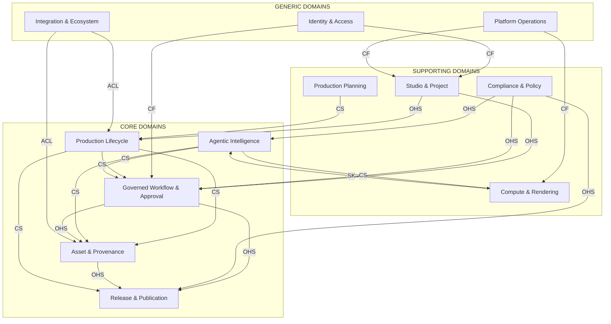

# AIMPOS — Domain Driven Design Model

**Document Type:** Strategic & Tactical DDD Architecture  
**Version:** 1.0  
**Status:** Approved — Pre-Implementation  
**Date:** June 8, 2026  
**Parent Documents:**

- [Blueprint for a multi-year initiative.md](./Blueprint%20for%20a%20multi-year%20initiative.md)
- [Business Capabilities.md](./Business%20Capabilities.md)

---

## Table of Contents

1. [Purpose & Scope](#1-purpose--scope)
2. [Strategic Domain Classification](#2-strategic-domain-classification)
3. [Context Map](#3-context-map)
4. [Ubiquitous Language](#4-ubiquitous-language)
5. [Core Domains](#5-core-domains)
6. [Supporting Domains](#6-supporting-domains)
7. [Generic Domains](#7-generic-domains)
8. [Cross-Context Integration Patterns](#8-cross-context-integration-patterns)
9. [Aggregate Design Rules](#9-aggregate-design-rules)
10. [Implementation Guardrails](#10-implementation-guardrails)
11. [Appendix: Capability-to-Context Mapping](#appendix-capability-to-context-mapping)

---

## 1. Purpose & Scope

This document translates the approved **Business Capability Model** (78 capabilities, 16 capability domains) into a **Domain Driven Design model** that governs all software design before coding begins.

It defines:

- **Strategic classification** — what to build custom vs. integrate vs. buy
- **Bounded contexts** — autonomous linguistic and transactional boundaries
- **Tactical patterns** — aggregates, entities, value objects, and domain events
- **Ownership boundaries** — which team/context owns which invariants

This is a **design-only artifact**. It describes business structure and domain logic, not technology stacks, databases, or frameworks.

---

## 2. Strategic Domain Classification

AIMPOS is a **platform** whose competitive advantage lies in **sovereign, governed, agentic media production**. Strategic investment follows that thesis.

### 2.1 Classification Summary

| Strategic Type | DDD Domains | Business Capability Domains | Investment Posture |
|----------------|-------------|----------------------------|-------------------|
| **Core** | Production Lifecycle, Asset & Provenance, Governed Workflow & Approval, Agentic Intelligence, Release & Publication | 2–6, 7, 8, 9, 11 (partial), 14, 15 | Build — deepest custom modeling |
| **Supporting** | Studio & Project Governance, Compute & Rendering, Compliance & Policy, Media Vertical Orchestration | 1, 10, 11 (partial), 15 (orchestration layer) | Build — tailored but less differentiation |
| **Generic** | Identity & Access, Integration & Ecosystem, Platform Operations | 12, 13, 16 | Integrate/adapt OSS — minimal custom domain logic |

### 2.2 Core Domains (5)

These domains embody AIMPOS differentiation and require the richest domain models.

| # | DDD Domain | Why Core |
|---|------------|----------|
| C1 | **Production Lifecycle** | The studio's reason for existing — creative development through post-production |
| C2 | **Asset & Provenance** | Versioned assets with immutable lineage — sovereign IP foundation |
| C3 | **Governed Workflow & Approval** | Workflow-driven, HITL-gated production — trust and auditability |
| C4 | **Agentic Intelligence** | Bounded autonomous agents — local AI competitive advantage |
| C5 | **Release & Publication** | Governed path from master to audience — zero unapproved AI in distribution |

### 2.3 Supporting Domains (4)

Necessary for enterprise operation; customized but not primary market differentiators.

| # | DDD Domain | Why Supporting |
|---|------------|----------------|
| S1 | **Studio & Project Governance** | Organizational shell around production — important, not unique |
| S2 | **Compute & Rendering** | Elastic sovereign compute — operational excellence, commodity patterns |
| S3 | **Compliance & Policy** | Regulatory and studio policy enforcement — critical guardrails |
| S4 | **Production Planning** | Scheduling, budget, calendar — enables production, not defines it |

### 2.4 Generic Domains (3)

Well-understood problems; prefer proven solutions with thin adaptation layers.

| # | DDD Domain | Why Generic |
|---|------------|-------------|
| G1 | **Identity & Access** | Authentication, RBAC — industry-standard patterns |
| G2 | **Integration & Ecosystem** | NLE, DAW, distribution connectors — adapter-heavy |
| G3 | **Platform Operations** | Observability, DR, analytics — operational tooling |

---

## 3. Context Map

### 3.1 Bounded Context Overview

AIMPOS decomposes into **14 bounded contexts**. Each context has one authoritative model for its terms and invariants.



**Legend:** OHS = Open Host Service · CS = Customer-Supplier · CF = Conformist · ACL = Anti-Corruption Layer · SK = Shared Kernel (infrastructure only)

### 3.2 Context Relationship Table

| Upstream Context | Downstream Context | Relationship | Integration Mechanism |
|------------------|-------------------|--------------|----------------------|
| Studio & Project | Production Lifecycle | Open Host Service | `ProjectId`, phase gates, team roster |
| Studio & Project | Governed Workflow | Open Host Service | `ProjectId`, policy bindings |
| Identity & Access | Studio & Project | Conformist | External identity claims |
| Identity & Access | Governed Workflow | Conformist | Principal, role, scope |
| Production Lifecycle | Asset & Provenance | Customer-Supplier | Asset registration requests |
| Production Lifecycle | Governed Workflow | Customer-Supplier | Stage transition commands |
| Production Lifecycle | Release & Publication | Customer-Supplier | Master handoff |
| Agentic Intelligence | Asset & Provenance | Customer-Supplier | Generated artifact registration |
| Agentic Intelligence | Governed Workflow | Customer-Supplier | Agent task completion, approval requests |
| Agentic Intelligence | Compute & Rendering | Customer-Supplier | Inference/render job requests |
| Governed Workflow | Asset & Provenance | Open Host Service | Approval-linked version promotion |
| Governed Workflow | Release & Publication | Open Host Service | Publication gate clearance |
| Compliance & Policy | Governed Workflow | Open Host Service | Policy evaluation, egress rules |
| Compliance & Policy | Agentic Intelligence | Open Host Service | Model/agent policy constraints |
| Compliance & Policy | Release & Publication | Open Host Service | Disclosure, consent validation |
| Asset & Provenance | Release & Publication | Open Host Service | Certified asset references |
| Production Planning | Production Lifecycle | Customer-Supplier | Schedule, milestone constraints |
| Compute & Rendering | Agentic Intelligence | Shared Kernel* | Job lifecycle primitives only |
| Integration & Ecosystem | Asset & Provenance | Anti-Corruption Layer | External tool metadata normalization |
| Integration & Ecosystem | Production Lifecycle | Anti-Corruption Layer | NLE/DAW project translation |
| Platform Operations | All contexts | Conformist | Telemetry, health — read-only |

*\*Shared Kernel limited to `ComputeJobId`, `JobStatus` — no business logic sharing.*

---

## 4. Ubiquitous Language

Terms used **consistently** across all contexts. Context-specific extensions are noted.

| Term | Definition | Authoritative Context |
|------|------------|----------------------|
| **Studio** | Top-level organizational tenant owning workspaces and projects | Studio & Project |
| **Workspace** | Isolated environment within a studio with policy and quota boundaries | Studio & Project |
| **Project** | Primary unit of production work with type, phase, team, and governance | Studio & Project |
| **Phase** | Named stage in a project lifecycle (Development, Pre-Production, Production, Post, Release) | Studio & Project |
| **Production Unit** | Generic term for scene, episode, chapter, lesson, or campaign segment | Production Lifecycle |
| **Creative Work** | Script, story, bible, breakdown, or other narrative artifact | Production Lifecycle |
| **Asset** | Any versioned digital artifact under governance (media, script, prompt, config) | Asset & Provenance |
| **Asset Version** | Immutable snapshot of an asset at a point in time | Asset & Provenance |
| **Lineage** | Directed graph linking inputs, transformations, and outputs | Asset & Provenance |
| **Workflow** | Defined DAG of steps orchestrating production activities | Governed Workflow |
| **Workflow Instance** | Running execution of a workflow for a specific subject | Governed Workflow |
| **Approval Gate** | Mandatory human decision point before progression | Governed Workflow |
| **Approval Decision** | Immutable record of approve/reject/defer with principal and rationale | Governed Workflow |
| **Agent Task** | Bounded unit of autonomous work by an AI agent | Agentic Intelligence |
| **Agent Proposal** | Agent output awaiting human review — never auto-promoted | Agentic Intelligence |
| **Model** | Registered AI model with capability, version, and policy tags | Agentic Intelligence |
| **Prompt** | Versioned instruction set used for model/agent invocation | Agentic Intelligence |
| **Policy** | Machine-evaluable rule governing data, compute, or AI behavior | Compliance & Policy |
| **Classification** | Sensitivity label (Public, Internal, Confidential, Talent) | Compliance & Policy |
| **Consent** | Recorded permission for likeness, voice, or training use | Compliance & Policy |
| **Master** | Final approved deliverable ready for release | Release & Publication |
| **Publication Gate** | Final compliance check before content goes live | Release & Publication |
| **Burst Job** | Ephemeral cloud GPU workload with mandatory teardown | Compute & Rendering |
| **Render Job** | Compute workload producing frames or media outputs | Compute & Rendering |

---

## 5. Core Domains

---

### C1 — Production Lifecycle

**Strategic type:** Core  
**Bounded context:** `Production`  
**Maps to capability domains:** 2 (Creative Development), 3 (Pre-Production), 4 (Production/On-Set), 5 (Video Post), 6 (Audio Post), 15 (Vertical Extensions — behavioral rules)

#### Responsibilities

- Model the end-to-end creative and production process from ideation through finished masters
- Maintain creative structures: scripts, scenes, shots, edits, mixes, episodes, chapters
- Enforce production invariants: locked script before breakdown, picture lock before conform, no skip of mandated phases
- Emit production events that trigger workflows, asset registrations, and approval requests
- Host vertical-specific subdomains (Film, Series, Documentary, Islamic Education, Podcast, Animation) as **domain extensions**, not forks

#### Bounded Contexts (Subdomains)

| Subdomain | Scope | Extension of |
|-----------|-------|--------------|
| `CreativeDevelopment` | Story, script, character, bible, writers' room, research | Production root |
| `PreProduction` | Breakdown, shot list, storyboard, previz, casting, locations | Production root |
| `Capture` | Dailies, on-set ingest, production reports, continuity | Production root |
| `VideoPost` | Editorial, VFX, color, conform, video mastering | Production root |
| `AudioPost` | Dialogue, sound design, music, mix, podcast/audiobook | Production root |
| `VerticalFilm` | Feature film phase rules and deliverables | Production root |
| `VerticalSeries` | Season/episode hierarchy, continuity bible rules | Production root |
| `VerticalDocumentary` | Interview arcs, archival rights, fact-check linkage | Production root |
| `VerticalIslamicEd` | Lesson structure, citation requirements, scholar gate hooks | Production root |
| `VerticalPodcast` | Chapter, session, transcript structures | Production root |
| `VerticalAnimation` | Rig, layer, sequence structures | Production root |

#### Entities

| Entity | Description | Identity |
|--------|-------------|----------|
| `CreativeWork` | Root narrative artifact (treatment, script, narration) | `CreativeWorkId` |
| `Script` | Formatted screenplay or narration script | `ScriptId` |
| `Scene` | Dramatic or instructional unit within a script | `SceneId` |
| `Character` | Named character with profile and arc | `CharacterId` |
| `ContinuityBible` | Authoritative world/continuity reference | `BibleId` |
| `WritersRoomSession` | Recorded writers' room meeting | `SessionId` |
| `Breakdown` | Script decomposition into production elements | `BreakdownId` |
| `Shot` | Single camera setup or coverage unit | `ShotId` |
| `StoryboardFrame` | Visual frame linked to a shot or scene | `FrameId` |
| `PrevizSequence` | Pre-visualization animatic or layout | `PrevizId` |
| `CastingDecision` | Talent assignment to character/role | `CastingId` |
| `ShootDay` | Single production day with scenes and reports | `ShootDayId` |
| `DailyPackage` | Ingested dailies for a shoot day | `DailyPackageId` |
| `Edit` | Editorial timeline version (rough, fine, locked) | `EditId` |
| `VFXShot` | Visual effects shot with plates and comps | `VFXShotId` |
| `ColorGrade` | Color grade version for an edit | `GradeId` |
| `AudioSession` | Recording or mixing session | `AudioSessionId` |
| `Mix` | Audio mix version (stem, premix, final) | `MixId` |
| `Episode` | Series episode container | `EpisodeId` |
| `Chapter` | Podcast/audiobook chapter | `ChapterId` |
| `Lesson` | Islamic educational content unit | `LessonId` |

#### Value Objects

| Value Object | Description |
|--------------|-------------|
| `SceneNumber` | Canonical scene identifier (e.g., "12A") |
| `PageCount` | Script page measurement |
| `Beat` | Story beat within an act |
| `CharacterArc` | Start/end state of character journey |
| `ShotCoverage` | Coverage type (wide, CU, OTS) |
| `Timecode` | SMPTE timecode range |
| `Take` | Take number with circle-take flag |
| `EditStatus` | Rough / Fine / Locked / Conformed |
| `LoudnessSpec` | Target LUFS and true-peak limits |
| `DeliverableSpecRef` | Reference to deliverables specification (foreign key VO) |
| `ProductionElement` | Breakdown element (prop, wardrobe, VFX tag) |
| `Citation` | Source reference for factual/educational content |
| `ContinuityNote` | On-set continuity observation |

#### Aggregates

| Aggregate Root | Child Entities / VOs | Invariants |
|----------------|---------------------|------------|
| **`Script`** | Scenes, Characters (refs), PageCount, revision metadata | Scenes immutable once locked; lock requires Approval Decision ref |
| **`Breakdown`** | ProductionElements, Scene mappings, budget line refs | Must reference locked Script version; elements traceable to scenes |
| **`ShotList`** | Shots, StoryboardFrames (refs), Scene mappings | Every shot maps to exactly one scene; coverage complete before shoot |
| **`ShootDay`** | DailyPackage (ref), ProductionReport, ContinuityNotes | One authoritative package per day; circle takes require supervisor flag |
| **`Edit`** | EditStatus, timecode ranges, VFXShot refs, proxy refs | Cannot reach Locked without director Approval Decision |
| **`VFXShot`** | Plates, comp versions, turnover refs | Comp versions immutable; approval required for final comp |
| **`Mix`** | Stems, LoudnessSpec, Edit ref | Final mix requires re-recording mixer Approval Decision |
| **`Episode`** *(series)* | Scenes, script ref, continuity refs | Episode number unique within season; bible compliance checked |
| **`Lesson`** *(Islamic ed)* | Citations, script ref, scholar review ref | Cannot publish without Scholar Approval Decision |

#### Domain Events

| Event | Payload Highlights | Consumers |
|-------|-------------------|-----------|
| `ScriptDraftCreated` | scriptId, projectId, version | Asset & Provenance, Workflow |
| `ScriptLocked` | scriptId, version, approvalId | Pre-Production, Workflow, Asset |
| `BreakdownApproved` | breakdownId, scriptVersion | Production Planning, Workflow |
| `ShotListApproved` | shotListId, sceneIds | Capture, Workflow |
| `DailyPackageIngested` | packageId, shootDayId, assetIds | Asset & Provenance, Editorial |
| `PictureLocked` | editId, version, approvalId | VFX, Color, Conform, Workflow |
| `VFXShotApproved` | vfxShotId, compVersion | Conform, Asset |
| `FinalMixApproved` | mixId, approvalId | Conform, Release |
| `MasterCertified` | masterId, specRef, lineageRoot | Release & Publication, Workflow |
| `ContinuityViolationDetected` | sceneId, ruleRef, severity | Writers' Room, Approval |
| `LessonSubmittedForScholarReview` | lessonId, citationIds | Governed Workflow |

#### Ownership Boundaries

| Owned by Production | Referenced, not owned |
|--------------------|----------------------|
| Creative structure, phase state, production metadata | `Asset` blobs (owned by Asset & Provenance) |
| Scene/shot/edit/mix versions as domain concepts | Approval records (owned by Governed Workflow) |
| Vertical-specific rules and extensions | Compute jobs (owned by Compute & Rendering) |
| Production invariants and phase gates | Model invocations (owned by Agentic Intelligence) |

**Team ownership:** Creative Production domain team (writers' room, post supervisors as domain experts)

---

### C2 — Asset & Provenance

**Strategic type:** Core  
**Bounded context:** `Assets`  
**Maps to capability domains:** 7 (Asset Management)

#### Responsibilities

- Register, version, and store all production artifacts under content-addressable identity
- Maintain immutable lineage graph linking every derivative to its origins
- Enforce rights, embargo, and classification on asset access
- Manage storage tier placement and proxy generation lifecycle
- Provide the **single source of truth** for "what exists, what version, where it came from"

#### Entities

| Entity | Description | Identity |
|--------|-------------|----------|
| `Asset` | Logical asset (script, video, audio, image, prompt) | `AssetId` |
| `AssetVersion` | Immutable version snapshot | `AssetVersionId` |
| `Branch` | Named line of creative iteration | `BranchId` |
| `LineageNode` | Node in provenance graph | `LineageNodeId` |
| `LineageEdge` | Transformation link between nodes | `EdgeId` |
| `RightsGrant` | Permission to use an asset in a context | `RightsGrantId` |
| `Embargo` | Time or scope restriction on access | `EmbargoId` |
| `Proxy` | Lower-resolution editorial surrogate | `ProxyId` |
| `StoragePlacement` | Record of tier and location | `PlacementId` |

#### Value Objects

| Value Object | Description |
|--------------|-------------|
| `ContentHash` | SHA-256 or BLAKE3 content address |
| `AssetMetadata` | Format, resolution, codec, duration, language |
| `VersionTag` | Semantic tag (v1.0, locked, ai-draft) |
| `AIGeneratedFlag` | Boolean + model ref + prompt ref + confidence |
| `ClassificationLabel` | Public / Internal / Confidential / Talent |
| `RightsScope` | Territory, medium, time window, exclusivity |
| `StorageTier` | Hot / Warm / Cold / Archive |
| `MergeRequest` | Source branch, target branch, conflict refs |
| `TransformationRecord` | Agent, model, workflow step that produced derivative |

#### Aggregates

| Aggregate Root | Child Entities / VOs | Invariants |
|----------------|---------------------|------------|
| **`Asset`** | Branches, AssetVersions (refs), metadata, classification | At least one version before promotion; classification mandatory on ingest |
| **`AssetVersion`** | ContentHash, AIGeneratedFlag, TransformationRecord, tags | Immutable after creation; cannot delete, only supersede |
| **`LineageGraph`** | LineageNodes, LineageEdges | Acyclic; every non-root node has ≥1 parent; AI nodes must record model+prompt |
| **`RightsGrant`** | RightsScope, asset refs, grantor, expiry | Access denied if grant expired or scope violated |
| **`Proxy`** | AssetVersion ref, transcode profile, sync timecode | Must reference exactly one source AssetVersion |

#### Domain Events

| Event | Payload Highlights | Consumers |
|-------|-------------------|-----------|
| `AssetIngested` | assetId, versionId, hash, classification | Production, Compliance, Workflow |
| `AssetVersionCreated` | assetId, versionId, branch, parentVersions | Lineage, Workflow |
| `BranchMerged` | assetId, sourceBranch, targetBranch, mergeCommit | Production, Workflow |
| `LineageNodeRecorded` | nodeId, parentIds, transformation | Compliance, Release |
| `AIGeneratedAssetTagged` | versionId, modelRef, promptRef | Compliance, Release |
| `RightsGrantIssued` | grantId, assetId, scope | Production, Release |
| `EmbargoActivated` | assetId, scope, until | Governed Workflow, Identity |
| `ProxyReady` | proxyId, sourceVersionId | Production (Editorial), Integration |
| `AssetArchived` | assetId, tier | Compute (cleanup), Platform Ops |

#### Ownership Boundaries

| Owned by Assets | Referenced, not owned |
|----------------|----------------------|
| Content identity, versions, branches, lineage | Production entities (Script, Edit) — referenced by ID |
| Rights, embargoes, classification, storage tier | Approval decisions — referenced by ID |
| Proxy and transcode lifecycle | Physical bytes on disk — infrastructure concern |

**Team ownership:** Asset & Data Governance team

---

### C3 — Governed Workflow & Approval

**Strategic type:** Core  
**Bounded context:** `Workflow`  
**Maps to capability domains:** 9 (Workflow & Orchestration), 11.3 partial (HITL via Approval)

#### Responsibilities

- Define, version, and execute production workflows as auditable DAGs
- Enforce human-in-the-loop gates — **no irreversible action without Approval Decision**
- Manage task queues, assignments, SLAs, and escalations
- Bind workflow templates to project types and verticals
- Coordinate cross-context orchestration without owning domain state of other contexts

#### Entities

| Entity | Description | Identity |
|--------|-------------|----------|
| `WorkflowDefinition` | Declarative DAG template | `WorkflowDefId` |
| `WorkflowInstance` | Running workflow execution | `WorkflowInstanceId` |
| `WorkflowStep` | Single node in a definition | `StepId` |
| `StepExecution` | Runtime execution of a step | `StepExecutionId` |
| `ApprovalChain` | Ordered approval requirements | `ApprovalChainId` |
| `ApprovalRequest` | Pending human decision | `ApprovalRequestId` |
| `ApprovalDecision` | Immutable approve/reject record | `ApprovalDecisionId` |
| `Task` | Human or system work item | `TaskId` |
| `Escalation` | SLA breach escalation record | `EscalationId` |

#### Value Objects

| Value Object | Description |
|--------------|-------------|
| `WorkflowVersion` | Semantic version of definition |
| `StepType` | Agent / HumanApproval / AssetAction / Compute / Gate |
| `StepStatus` | Pending / Running / AwaitingApproval / Completed / Failed |
| `ApprovalQuorum` | Required approvers, delegation rules, veto authority |
| `SLA` | Duration threshold and escalation target |
| `WorkflowSubject` | ProjectId + entity ref (scriptId, editId, etc.) |
| `RetryPolicy` | Max retries, backoff, idempotency key |
| `GateResult` | Pass / Fail / Deferred with reason |

#### Aggregates

| Aggregate Root | Child Entities / VOs | Invariants |
|----------------|---------------------|------------|
| **`WorkflowDefinition`** | Steps, version, template metadata | Published versions immutable; changes create new version |
| **`WorkflowInstance`** | StepExecutions, status, subject | Steps execute in DAG order; failed steps retry per policy |
| **`ApprovalRequest`** | ApprovalChain, assignees, annotations, deadline | Exactly one terminal Decision per request |
| **`ApprovalDecision`** | Principal, timestamp, rationale, assetVersionRef | **Immutable** — cannot amend, only supersede with new request |
| **`Task`** | Assignee, priority, SLA, stepExecution ref | Cannot complete if dependent Approval pending |

#### Domain Events

| Event | Payload Highlights | Consumers |
|-------|-------------------|-----------|
| `WorkflowStarted` | instanceId, defId, subject | Platform Ops, Production |
| `StepAwaitingApproval` | stepId, approvalRequestId | Identity (notify), Production |
| `ApprovalGranted` | decisionId, requestId, principal | Production, Assets, Release |
| `ApprovalRejected` | decisionId, requestId, rationale | Agentic Intelligence, Production |
| `WorkflowCompleted` | instanceId, subject | Production, Release, Analytics |
| `WorkflowFailed` | instanceId, stepId, error | Platform Ops, Agentic Intelligence |
| `SLABreached` | taskId, escalationId | Studio & Project, Platform Ops |
| `EscalationTriggered` | escalationId, targetPrincipal | Identity (notify) |

#### Ownership Boundaries

| Owned by Workflow | Referenced, not owned |
|-------------------|----------------------|
| Workflow definitions, instances, steps, tasks | Assets, scripts, edits — subject references only |
| Approval requests and immutable decisions | Agent outputs — referenced, not mutated |
| SLA and escalation state | Policy rules — evaluated via Compliance context |

**Team ownership:** Workflow & Governance platform team

---

### C4 — Agentic Intelligence

**Strategic type:** Core  
**Bounded context:** `Intelligence`  
**Maps to capability domains:** 8 (AI & Intelligent Automation)

#### Responsibilities

- Register and lifecycle-manage AI models and adapters
- Orchestrate multi-agent tasks with bounded autonomy and action budgets
- Route inference requests to local or burst compute per policy
- Manage versioned prompts, agent memory, and tool invocations
- Produce **proposals only** — never directly promote assets or bypass approval
- Record full observability trace for every agent action

#### Entities

| Entity | Description | Identity |
|--------|-------------|----------|
| `Model` | Registered AI model | `ModelId` |
| `ModelVersion` | Specific weight/configuration | `ModelVersionId` |
| `Adapter` | Fine-tuned LoRA or adapter | `AdapterId` |
| `Agent` | Configured agent persona | `AgentId` |
| `AgentTask` | Bounded execution unit | `AgentTaskId` |
| `AgentRun` | Single agent execution attempt | `AgentRunId` |
| `ToolInvocation` | Record of tool call | `InvocationId` |
| `Prompt` | Versioned instruction template | `PromptId` |
| `AgentMemory` | Scoped project memory store | `MemoryId` |
| `RoutingDecision` | Model/backend selection record | `RoutingId` |
| `EvaluationRun` | Model A/B evaluation | `EvalRunId` |

#### Value Objects

| Value Object | Description |
|--------------|-------------|
| `ModelCapability` | LLM / Diffusion / TTS / ASR / Video / Embedding |
| `ActionBudget` | Token limit, GPU minutes, API call cap |
| `AgentTrace` | Reasoning steps, tool calls, latencies |
| `ConfidenceScore` | Model output confidence (advisory) |
| `QuantizationProfile` | FP16 / INT8 / GGUF |
| `RoutingPolicy` | Local-first, burst-eligible, classification constraints |
| `ProposalStatus` | Draft / SubmittedForReview / Approved / Rejected |
| `MemoryRetention` | Scope, TTL, purge rules |

#### Aggregates

| Aggregate Root | Child Entities / VOs | Invariants |
|----------------|---------------------|------------|
| **`Model`** | ModelVersions, capabilities, license, status | Only `Approved` versions routable; deprecation blocks new tasks |
| **`AgentTask`** | AgentRuns, ActionBudget, subject ref, ProposalStatus | Budget exhaustion terminates task; no side effects without tool policy |
| **`AgentRun`** | ToolInvocations, AgentTrace, output refs | Every tool call logged; irreversible tools require pre-authorized workflow step |
| **`Prompt`** | Versions, approval status, performance metrics | Only approved prompt versions usable in production workflows |
| **`AgentMemory`** | Entries, MemoryRetention, project scope | Memory cannot cross project boundary; purge on retention expiry |
| **`RoutingDecision`** | ModelVersion, backend (local/burst), policy ref | Burst routing requires Compliance policy pass |

#### Domain Events

| Event | Payload Highlights | Consumers |
|-------|-------------------|-----------|
| `AgentTaskStarted` | taskId, agentId, budget | Workflow, Compute |
| `ToolInvoked` | invocationId, toolName, inputRefs | Assets (lineage), Compliance |
| `ProposalGenerated` | taskId, outputAssetRefs, confidence | Workflow (approval request), Assets |
| `AgentTaskCompleted` | taskId, runId, trace | Workflow, Platform Ops |
| `AgentTaskFailed` | taskId, error, trace | Workflow, Platform Ops |
| `BudgetExhausted` | taskId, budgetType | Workflow |
| `ModelPromoted` | modelId, versionId | Routing, Compliance |
| `ModelDeprecated` | modelId, versionId, successor | Routing, Workflow |
| `BurstRoutingRequested` | routingId, taskId, classification | Compute, Compliance |

#### Ownership Boundaries

| Owned by Intelligence | Referenced, not owned |
|------------------------|----------------------|
| Models, agents, prompts, tasks, traces, routing | Assets created — registered via Assets context events |
| Action budgets and proposal status | Approval decisions — owned by Workflow |
| Agent memory content (metadata); bytes in Assets | Compute execution — delegated to Compute context |

**Team ownership:** AI Platform / MLOps team with creative tool specialists

---

### C5 — Release & Publication

**Strategic type:** Core  
**Bounded context:** `Release`  
**Maps to capability domains:** 14 (Release & Distribution)

#### Responsibilities

- Govern transition from certified masters to audience-facing publication
- Validate deliverables against platform and territory specifications
- Assemble distribution packages with metadata, captions, artwork, AI disclosure
- Enforce publication gates: approvals, rights, compliance, scholarly sign-off complete
- Manage release calendar, campaigns, and derivative variants

#### Entities

| Entity | Description | Identity |
|--------|-------------|----------|
| `Master` | Certified final deliverable | `MasterId` |
| `DeliverableSpec` | Technical specification profile | `SpecId` |
| `QCReport` | Quality control validation result | `QCReportId` |
| `Release` | Planned or executed release event | `ReleaseId` |
| `DistributionPackage` | Assembled package for a platform | `PackageId` |
| `Campaign` | Marketing campaign with variants | `CampaignId` |
| `Variant` | Clip, thumbnail, title, or format variant | `VariantId` |
| `PublicationGate` | Final pre-publish checkpoint | `GateId` |

#### Value Objects

| Value Object | Description |
|--------------|-------------|
| `MasterStatus` | Draft / QC_Pending / Certified / Superseded |
| `QCCheckResult` | Pass / Fail per check item |
| `Territory` | Geographic distribution scope |
| `PlatformTarget` | YouTube / OTT / Podcast / Broadcast / Education Portal |
| `AIDisclosureLabel` | Regulatory disclosure metadata |
| `ReleaseWindow` | Theatrical, streaming, educational embargo dates |
| `PackageManifest` | File list, checksums, metadata schema |
| `GateChecklist` | Required approvals, rights, compliance items |

#### Aggregates

| Aggregate Root | Child Entities / VOs | Invariants |
|----------------|---------------------|------------|
| **`Master`** | AssetVersion refs, DeliverableSpec, QCReport, MasterStatus | Certification requires QC pass + Approval Decision + lineage complete |
| **`Release`** | Masters, ReleaseWindow, territories, gate ref | Cannot schedule without certified Master |
| **`DistributionPackage`** | PackageManifest, PlatformTarget, AIDisclosureLabel | All assets must have valid RightsGrants for territory |
| **`PublicationGate`** | GateChecklist, check results | **All checks pass** before `PublicationAuthorized` event |
| **`Campaign`** | Variants, schedule, master ref | Variants with AI content require separate approval refs |

#### Domain Events

| Event | Payload Highlights | Consumers |
|-------|-------------------|-----------|
| `MasterSubmittedForQC` | masterId, specId | Workflow, Assets |
| `MasterCertified` | masterId, qcReportId, lineageRoot | Release, Workflow |
| `ReleaseScheduled` | releaseId, window, territories | Integration, Studio |
| `PackageAssembled` | packageId, platform, manifest | Integration |
| `PublicationGateOpened` | gateId, releaseId | Compliance, Workflow |
| `PublicationAuthorized` | gateId, releaseId, principal | Integration, Audit |
| `PublicationBlocked` | gateId, failedChecks | Production, Compliance |
| `CampaignVariantApproved` | variantId, campaignId | Integration, Assets |

#### Ownership Boundaries

| Owned by Release | Referenced, not owned |
|-----------------|----------------------|
| Master certification state, releases, packages, gates | Asset bytes — owned by Assets |
| Campaign and variant metadata | Approvals — owned by Workflow |
| QC and spec validation results | Rights — validated via Assets, not re-owned |

**Team ownership:** Distribution & Delivery team

---

## 6. Supporting Domains

---

### S1 — Studio & Project Governance

**Strategic type:** Supporting  
**Bounded context:** `Studio`  
**Maps to capability domains:** 1 (Studio & Project Governance)

#### Responsibilities

- Manage studio tenants, workspaces, and organizational hierarchy
- Lifecycle-manage projects: create, configure, phase transitions, archive
- Bind governance policies and team rosters to projects
- Provide project context to all core domains via `ProjectId`
- Portfolio/slate oversight for executive visibility (P2)

#### Entities

`Studio`, `Workspace`, `Project`, `ProjectPhase`, `TeamRoster`, `ProjectMember`, `Slate`, `PortfolioView`

#### Value Objects

`MediaType`, `ProjectStatus`, `PhaseGate`, `TenancyQuota`, `WorkspacePolicy`, `GreenlightDecision`, `BudgetEnvelope`

#### Aggregates

| Aggregate Root | Invariants |
|----------------|------------|
| **`Studio`** | Unique slug; owns ≥1 workspace |
| **`Workspace`** | Isolated policy boundary; cannot exceed quota |
| **`Project`** | Valid media type; phase transitions follow template; archive is terminal |
| **`TeamRoster`** | Members must have Identity principal; roles unique per project |

#### Domain Events

`ProjectCreated`, `ProjectPhaseAdvanced`, `ProjectArchived`, `WorkspaceProvisioned`, `GreenlightGranted`, `TeamMemberAssigned`

#### Bounded Context

Single context `Studio` — no subdomains required at Phase 0.

#### Ownership Boundaries

Owns organizational and project shell. Does **not** own production artifacts, assets, or workflows — only references.

**Team ownership:** Platform product team

---

### S2 — Compute & Rendering

**Strategic type:** Supporting  
**Bounded context:** `Compute`  
**Maps to capability domains:** 10 (Compute & Rendering)

#### Responsibilities

- Schedule and prioritize GPU/CPU workloads on local Olares infrastructure
- Provision and teardown ephemeral burst workers per policy
- Manage render jobs and optional render farm coordination
- Attribute compute cost to projects, workflows, and agents
- Report capacity and utilization — no production creative decisions

#### Entities

`ComputeJob`, `RenderJob`, `BurstWorker`, `ClusterNode`, `JobQueue`, `CostRecord`, `FarmSubmission`

#### Value Objects

`JobPriority`, `JobStatus`, `ResourceSpec`, `GPUAllocation`, `BurstPolicy`, `CostAttribution`, `TeardownConfirmation`, `RenderFrameRange`

#### Aggregates

| Aggregate Root | Invariants |
|----------------|------------|
| **`ComputeJob`** | Terminal states immutable; idempotent retry keyed |
| **`BurstWorker`** | Must teardown within policy window; no persistent storage |
| **`RenderJob`** | Output refs registered to Assets on completion via event |
| **`CostRecord`** | Append-only; attributed to exactly one project |

#### Domain Events

`JobQueued`, `JobStarted`, `JobCompleted`, `JobFailed`, `BurstWorkerProvisioned`, `BurstWorkerDestroyed`, `CostRecorded`, `CapacityThresholdReached`

#### Ownership Boundaries

Owns job lifecycle and resource scheduling. Does **not** own prompts, models, or assets — receives work orders from Intelligence and Production.

**Team ownership:** Infrastructure / MLOps team

---

### S3 — Compliance & Policy

**Strategic type:** Supporting  
**Bounded context:** `Compliance`  
**Maps to capability domains:** 11 (Governance, Risk & Compliance)

#### Responsibilities

- Define, version, and evaluate policies (egress, burst, AI use, classification)
- Maintain immutable audit log of all cross-context security events
- Track consent for talent likeness, voice, and training use
- Enforce scholarly and content authenticity rules for Islamic education
- Manage AI disclosure and labeling requirements
- Produce exportable compliance reports

#### Entities

`Policy`, `PolicyEvaluation`, `AuditEntry`, `ConsentRecord`, `ScholarlyReview`, `ComplianceReport`, `DataSubjectRequest`

#### Value Objects

`ClassificationLabel`, `PolicyRule`, `EgressDecision`, `ConsentScope`, `AuditPrincipal`, `DisclosureRequirement`, `AuthenticityVerdict`, `CitationRequirement`

#### Aggregates

| Aggregate Root | Invariants |
|----------------|------------|
| **`Policy`** | Published versions immutable; deny-by-default egress |
| **`AuditEntry`** | Append-only, immutable, tamper-evident |
| **`ConsentRecord`** | Cannot grant beyond contract scope; expiry enforced |
| **`ScholarlyReview`** | Terminal verdict required before lesson publication |

#### Domain Events

`PolicyPublished`, `PolicyEvaluated`, `EgressDenied`, `EgressApproved`, `AuditEntryRecorded`, `ConsentGranted`, `ConsentRevoked`, `ScholarlyReviewCompleted`, `ComplianceReportGenerated`

#### Ownership Boundaries

Owns policies, audit, consent, compliance artifacts. Does **not** own workflows or assets — publishes evaluations consumed by other contexts.

**Team ownership:** Security & Compliance team

---

### S4 — Production Planning

**Strategic type:** Supporting  
**Bounded context:** `Planning`  
**Maps to capability domains:** 1.3, 1.4, 3.7 (Planning, Budget, Calendar)

#### Responsibilities

- Build and maintain production schedules from breakdown data
- Track budget allocation and spend against envelopes
- Manage master production calendar with conflict detection
- Emit planning constraints to Production Lifecycle — advisory and gate inputs

#### Entities

`ProductionSchedule`, `Milestone`, `BudgetLedger`, `BudgetLine`, `CalendarEvent`, `ScheduleConflict`

#### Value Objects

`MilestoneDate`, `VarianceReport`, `SpendThreshold`, `CrewAvailability`, `PermitWindow`, `ScheduleDependency`

#### Aggregates

| Aggregate Root | Invariants |
|----------------|------------|
| **`ProductionSchedule`** | Milestones linked to project phases; conflicts flagged not auto-resolved |
| **`BudgetLedger`** | Append-only entries; overrun triggers alert event, not auto-block |
| **`MasterCalendar`** | Events reference external entities by ID only |

#### Domain Events

`SchedulePublished`, `MilestoneSlipped`, `BudgetThresholdExceeded`, `CalendarConflictDetected`, `PermitExpiring`

#### Ownership Boundaries

Owns planning artifacts. Does **not** own shoot days, edits, or assets.

**Team ownership:** Production management tooling team

---

## 7. Generic Domains

---

### G1 — Identity & Access

**Strategic type:** Generic  
**Bounded context:** `Identity`  
**Maps to capability domains:** 12 (Identity & Access)

#### Responsibilities

- Authenticate principals via SSO/OIDC/SAML
- Issue role and scope claims consumed by all contexts
- Manage vendor sandbox credentials with time bounds
- Provide role-based workspace presentation config — **no production logic**

#### Entities

`Principal`, `Role`, `Scope`, `Session`, `VendorAccessGrant`

#### Value Objects

`Credential`, `Permission`, `AccessExpiry`, `SandboxPolicy`, ` MFAStatus`

#### Aggregates

| Aggregate Root | Invariants |
|----------------|------------|
| **`Principal`** | Unique external subject ID |
| **`VendorAccessGrant`** | Expiry mandatory; scope limited to single project |

#### Domain Events

`PrincipalAuthenticated`, `AccessGranted`, `AccessRevoked`, `VendorGrantExpired`

#### Ownership Boundaries

Thin adaptation over identity provider. AIMPOS does **not** innovate here.

**Team ownership:** Platform — integrate Keycloak/Zitadel

---

### G2 — Integration & Ecosystem

**Strategic type:** Generic  
**Bounded context:** `Integration`  
**Maps to capability domains:** 13 (Integration & Ecosystem)

#### Responsibilities

- Translate external tool formats (NLE, DAW, render farm, distribution APIs) via anti-corruption layers
- Manage connector plugins and health monitoring
- Relay distribution submissions — **no ownership of production or asset truth**

#### Entities

`Connector`, `SyncJob`, `ExternalProjectRef`, `DistributionSubmission`, `Plugin`

#### Value Objects

`ConnectorConfig`, `WatchFolderPath`, `FormatMapping`, `SubmissionStatus`, `HealthCheck`

#### Aggregates

| Aggregate Root | Invariants |
|----------------|------------|
| **`Connector`** | One ACL per external system type |
| **`SyncJob`** | Idempotent; failures retried with dead-letter |
| **`DistributionSubmission`** | References Release package — does not copy assets |

#### Domain Events

`SyncCompleted`, `SyncFailed`, `DistributionSubmitted`, `ConnectorDegraded`

#### Ownership Boundaries

ACL translates external models to AIMPOS events. Never embed external IDs in core aggregates — use `ExternalProjectRef`.

**Team ownership:** Integrations team

---

### G3 — Platform Operations

**Strategic type:** Generic  
**Bounded context:** `Operations`  
**Maps to capability domains:** 16 (Platform Operations & Insights)

#### Responsibilities

- Collect telemetry, metrics, logs from all contexts (read-only)
- Production analytics dashboards and executive reporting
- Disaster recovery orchestration and backup verification
- Template marketplace catalog (P2) — discovery, not workflow logic

#### Entities

`MetricSeries`, `Alert`, `BackupRun`, `RestoreTest`, `MarketplaceListing`, `Dashboard`

#### Value Objects

`SLO`, `IncidentSeverity`, `RPO`, `RTO`, `ListingRating`, `UsageMetric`

#### Aggregates

| Aggregate Root | Invariants |
|----------------|------------|
| **`Alert`** | Acknowledged or escalated — not silently dropped |
| **`BackupRun`** | Verified restore point or marked failed |
| **`MarketplaceListing`** | References WorkflowDefinition by ID — does not own it |

#### Domain Events

`AlertFired`, `BackupCompleted`, `RestoreTestPassed`, `ListingPublished`

#### Ownership Boundaries

Observability and marketplace discovery only. No production or governance mutations.

**Team ownership:** SRE / Platform Operations

---

## 8. Cross-Context Integration Patterns

### 8.1 Event-Driven Collaboration (Preferred)

Contexts communicate through **domain events** and **integration events**. Synchronous calls limited to:

- Policy evaluation (Compliance → caller)
- Identity claim resolution (Identity → caller)
- Asset metadata lookup (Assets → caller, read-only)

### 8.2 Critical Cross-Context Flows

#### Flow 1: Agent Proposal to Approved Asset

```
Intelligence: ProposalGenerated
  → Workflow: create ApprovalRequest
  → Human: ApprovalGranted
  → Assets: BranchMerged (promote to main)
  → Production: update subject status
  → Compliance: AuditEntryRecorded
```

#### Flow 2: Script Lock to Breakdown

```
Production: ScriptLocked
  → Workflow: start BreakdownWorkflow
  → Intelligence: AgentTask (breakdown assist)
  → Production: BreakdownApproved
  → Planning: SchedulePublished
```

#### Flow 3: Master to Publication

```
Production: MasterCertified
  → Release: create Release + PublicationGate
  → Compliance: evaluate GateChecklist
  → Workflow: ApprovalRequest (distribution sign-off)
  → Release: PublicationAuthorized
  → Integration: DistributionSubmitted
```

### 8.3 Anti-Corruption Layer Rules

| External System | ACL Location | Translates To |
|----------------|--------------|---------------|
| DaVinci Resolve / Premiere | Integration | `AssetIngested`, `ProxyReady` events |
| Pro Tools / Reaper | Integration | `AssetIngested` with audio metadata |
| YouTube / OTT APIs | Integration | `DistributionSubmission` status |
| SSO Provider | Identity | `Principal` claims |
| Cloud GPU Provider | Compute | `BurstWorker` lifecycle — no cloud IDs in core aggregates |

---

## 9. Aggregate Design Rules

Global rules applied across all contexts before implementation:

| Rule | Description |
|------|-------------|
| **AR-01** | One aggregate transaction — modify one aggregate root per transaction |
| **AR-02** | Reference by identity — aggregates reference other contexts by ID only |
| **AR-03** | Immutable decisions — `ApprovalDecision`, `AuditEntry`, `AssetVersion` never updated |
| **AR-04** | Events are facts — domain events named in past tense; payloads versioned |
| **AR-05** | AI proposes, humans dispose — no aggregate in Intelligence or Assets auto-promotes on AI output |
| **AR-06** | Lineage completeness — every `AssetVersion` with `AIGeneratedFlag=true` must have lineage parent |
| **AR-07** | Policy before burst — `BurstWorker` aggregate cannot provision without `PolicyEvaluated(pass)` ref |
| **AR-08** | Publication gate is terminal check — no Integration context bypasses `PublicationGate` |
| **AR-09** | Vertical extensions use same roots — `Episode`, `Lesson` extend Production, not separate contexts |
| **AR-10** | External IDs quarantined — third-party identifiers live only in Integration/Identity ACLs |

---

## 10. Implementation Guardrails

Before any code is written, teams must:

1. **Map every user story** to exactly one bounded context and one aggregate root
2. **Name code namespaces** after bounded contexts (`Production`, `Assets`, `Workflow`, etc.)
3. **Prohibit shared mutable databases** across contexts — integrate via events or explicit APIs
4. **Publish ubiquitous language glossary** updates when adding terms
5. **Review aggregate boundaries** in architecture review — reject cross-aggregate transactions
6. **Test invariants** at aggregate root — not in controllers or UI
7. **Version integration events** for backward compatibility across context deployments

### 10.1 Suggested Team Topology (Conway-aligned)

| Team | Contexts Owned |
|------|---------------|
| Creative Production | Production Lifecycle |
| Asset & Data | Asset & Provenance |
| Workflow & Governance | Governed Workflow & Approval, Compliance & Policy |
| AI Platform | Agentic Intelligence |
| Distribution | Release & Publication |
| Studio Platform | Studio & Project, Production Planning |
| Infrastructure | Compute & Rendering, Platform Operations |
| Integrations | Integration & Ecosystem, Identity & Access |

---

## Appendix: Capability-to-Context Mapping

| Business Capability Domain | DDD Strategic Type | Bounded Context |
|---------------------------|-------------------|-----------------|
| 1. Studio & Project Governance | Supporting | `Studio` |
| 2. Creative Development | Core | `Production` → CreativeDevelopment |
| 3. Pre-Production | Core | `Production` → PreProduction |
| 4. Production (On-Set) | Core | `Production` → Capture |
| 5. Video Post-Production | Core | `Production` → VideoPost |
| 6. Audio Post-Production | Core | `Production` → AudioPost |
| 7. Asset Management | Core | `Assets` |
| 8. AI & Intelligent Automation | Core | `Intelligence` |
| 9. Workflow & Orchestration | Core | `Workflow` |
| 10. Compute & Rendering | Supporting | `Compute` |
| 11. Governance, Risk & Compliance | Supporting | `Compliance` + `Workflow` (approvals) |
| 12. Identity & Access | Generic | `Identity` |
| 13. Integration & Ecosystem | Generic | `Integration` |
| 14. Release & Distribution | Core | `Release` |
| 15. Media Vertical Extensions | Core | `Production` → Vertical* subdomains |
| 16. Platform Operations & Insights | Generic | `Operations` |
| 1.3 / 1.4 / 3.7 Planning capabilities | Supporting | `Planning` |

---

## Document Control

| Version | Date | Changes |
|---------|------|---------|
| 1.0 | 2026-06-08 | Initial DDD model derived from Business Capabilities v1.0 |

| Related Document | Relationship |
|-----------------|--------------|
| Business Capabilities.md | Upstream — capability source |
| Blueprint for a multi-year initiative.md | Upstream — strategic vision |

---

*This DDD model is the authoritative domain design for AIMPOS. All implementation — services, APIs, data stores, and agent tools — must align to these bounded contexts, aggregates, and ownership boundaries.*

*End of document*
