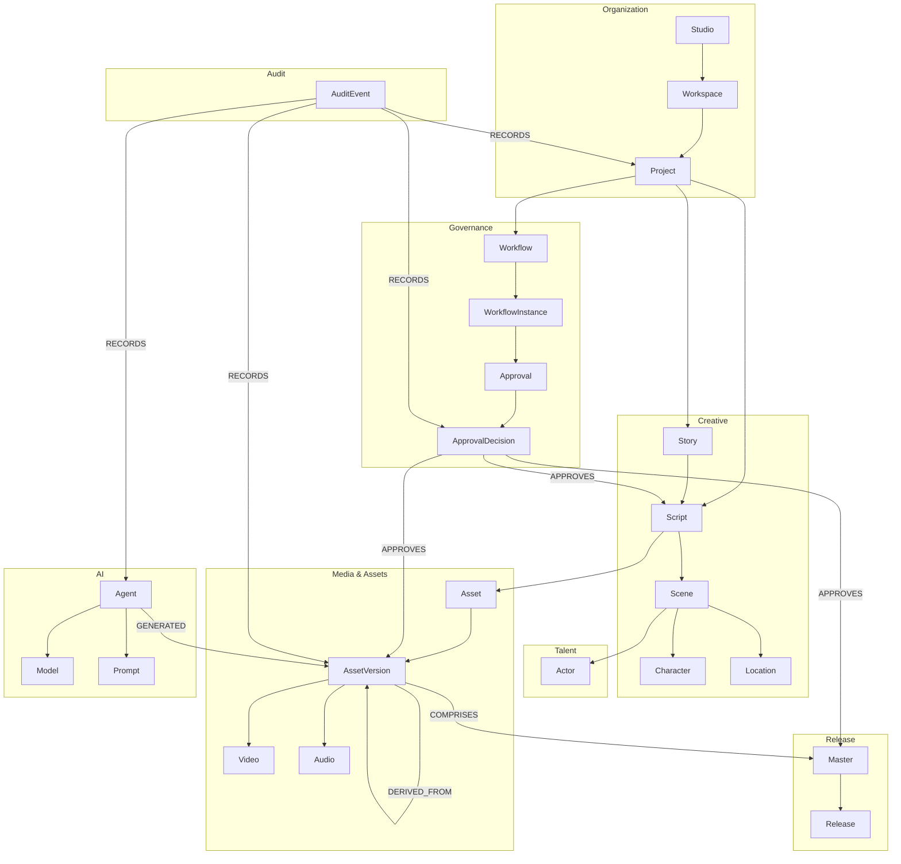
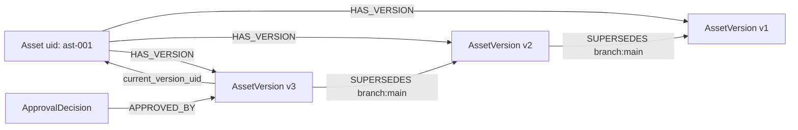
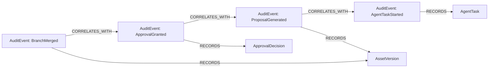

# AIMPOS — Enterprise Knowledge Graph

**Document Type:** Graph Schema & Semantic Model  
**Version:** 1.0  
**Status:** READ-ONLY REFERENCE — Frozen June 9, 2026. Neo4j deferred; PostgreSQL lineage_edges in MVP.
**Date:** June 8, 2026  
**Target Platforms:** Neo4j (primary), portable to Amazon Neptune, Azure Cosmos DB (Gremlin), ArangoDB, Memgraph  
**Parent Documents:**

- [Domain Driven Design.md](./Domain%20Driven%20Design.md)
- [Business Capabilities.md](./Business%20Capabilities.md)
- [Blueprint for a multi-year initiative.md](./Blueprint%20for%20a%20multi-year%20initiative.md)

---

## Table of Contents

1. [Purpose & Design Principles](#1-purpose--design-principles)
2. [Graph Architecture Overview](#2-graph-architecture-overview)
3. [Graph Schema](#3-graph-schema)
4. [Node Types](#4-node-types)
5. [Relationships](#5-relationships)
6. [Metadata Model](#6-metadata-model)
7. [Versioning Model](#7-versioning-model)
8. [Audit Model](#8-audit-model)
9. [Indexes & Constraints](#9-indexes--constraints)
10. [Query Patterns](#10-query-patterns)
11. [Ingestion & Synchronization](#11-ingestion--synchronization)
12. [Portability Guidelines](#12-portability-guidelines)

---

## 1. Purpose & Design Principles

The AIMPOS Enterprise Knowledge Graph is the **semantic layer** connecting all production entities—creative, media, AI, governance, and distribution—into a single queryable, auditable knowledge network.

It serves:

- **Lineage & provenance** — trace any asset from release back to script, model, and human decision
- **Impact analysis** — determine what is affected when a script, character, or model changes
- **Governance queries** — prove approvals, consent, and AI disclosure for any deliverable
- **Creative intelligence** — power agent context, recommendations, and continuity checks
- **Executive visibility** — cross-project discovery without duplicating operational stores

### 1.1 Design Principles

| Principle | Description |
|-----------|-------------|
| **Graph is a read-optimized projection** | Authoritative transactional state lives in bounded-context aggregates; the graph is synchronized via domain events |
| **Identity is global** | Every node carries a stable `uid` (UUID) aligned to DDD aggregate IDs |
| **Versions are nodes** | Versioned entities use `Version` nodes or versioned labels — never overwrite history |
| **Lineage is explicit** | Provenance captured as typed relationships, not inferred from timestamps |
| **Audit is append-only** | `AuditEvent` nodes are immutable; corrections create superseding events |
| **Labels are composable** | Neo4j multi-labels express specialization (`:Asset:Video`, `:Asset:Audio`) |
| **Portable schema** | Property names use `snake_case`; relationship types use `SCREAMING_SNAKE_CASE` |

### 1.2 Graph Layers

```
┌─────────────────────────────────────────────────────────────┐
│  LAYER 4 — AUDIT & COMPLIANCE                               │
│  AuditEvent, PolicyEvaluation, ConsentRecord                │
├─────────────────────────────────────────────────────────────┤
│  LAYER 3 — LINEAGE & PROVENANCE                             │
│  DERIVED_FROM, GENERATED_BY, APPROVED_BY, TRANSFORMED_BY    │
├─────────────────────────────────────────────────────────────┤
│  LAYER 2 — VERSION CHAIN                                    │
│  Version nodes, SUPERSEDES, HAS_VERSION, LOCKED_AT          │
├─────────────────────────────────────────────────────────────┤
│  LAYER 1 — DOMAIN ENTITIES                                  │
│  Project, Story, Script, Scene, Character, Asset, Workflow… │
└─────────────────────────────────────────────────────────────┘
```

---

## 2. Graph Architecture Overview

### 2.1 High-Level Schema Diagram



### 2.2 Node Count Summary

| Layer | Node Labels | Count |
|-------|-------------|-------|
| Organization | `Studio`, `Workspace`, `Project`, `Phase` | 4 |
| Creative | `Story`, `Script`, `Scene`, `Character`, `Location`, `ContinuityBible`, `Shot`, `Edit` | 8 |
| Talent | `Actor`, `Casting` | 2 |
| Media | `Asset`, `AssetVersion`, `Video`, `Audio`, `Image`, `Document`, `Proxy` | 7 |
| Production | `ShootDay`, `Episode`, `Chapter`, `Lesson`, `Mix`, `VFXShot` | 6 |
| Intelligence | `Model`, `ModelVersion`, `Agent`, `AgentTask`, `Prompt`, `PromptVersion` | 6 |
| Governance | `Workflow`, `WorkflowDefinition`, `WorkflowInstance`, `Approval`, `ApprovalDecision`, `Policy` | 6 |
| Release | `Master`, `Release`, `DistributionPackage`, `PublicationGate` | 4 |
| Audit | `AuditEvent`, `LineageRecord` | 2 |
| **Total primary labels** | | **45** |

*User-requested types in bold mapping: **Project**, **Story**, **Character**, **Location**, **Asset**, **Scene**, **Script**, **Actor**, **Audio**, **Video**, **Model**, **Workflow**, **Approval**, **Release** — all present as first-class labels.*

---

## 3. Graph Schema

### 3.1 Namespace Convention

| Element | Convention | Example |
|---------|------------|---------|
| Node label | PascalCase, singular | `AssetVersion` |
| Relationship type | SCREAMING_SNAKE_CASE, verb phrase | `DERIVED_FROM` |
| Property key | snake_case | `content_hash` |
| Global ID | `uid` (UUID v7 preferred) | `uid: "01932a7e-..."` |
| Bounded context | `context` property | `context: "Assets"` |
| Media type | `media_type` enum | `media_type: "FEATURE_FILM"` |

### 3.2 Required Properties (All Nodes)

Every node **must** carry:

| Property | Type | Description |
|----------|------|-------------|
| `uid` | string (UUID) | Global immutable identifier |
| `context` | string | Authoritative bounded context |
| `created_at` | datetime (ISO-8601) | First graph appearance |
| `updated_at` | datetime | Last projection update |
| `schema_version` | string | Graph schema version (e.g., `1.0`) |
| `is_deleted` | boolean | Soft-delete tombstone — node retained for audit |

### 3.3 Schema Registry (JSON-LD Context)

Portable type definitions for future graph databases:

```json
{
  "@context": {
    "aimpos": "https://aimpos.io/kg/v1/",
    "Project": "aimpos:Project",
    "Story": "aimpos:Story",
    "Script": "aimpos:Script",
    "Scene": "aimpos:Scene",
    "Character": "aimpos:Character",
    "Location": "aimpos:Location",
    "Actor": "aimpos:Actor",
    "Asset": "aimpos:Asset",
    "AssetVersion": "aimpos:AssetVersion",
    "Video": "aimpos:Video",
    "Audio": "aimpos:Audio",
    "Model": "aimpos:Model",
    "Workflow": "aimpos:Workflow",
    "Approval": "aimpos:Approval",
    "Release": "aimpos:Release",
    "BELONGS_TO": "aimpos:belongsTo",
    "DERIVED_FROM": "aimpos:derivedFrom",
    "APPROVED_BY": "aimpos:approvedBy",
    "GENERATED_BY": "aimpos:generatedBy"
  }
}
```

---

## 4. Node Types

### 4.1 Organization Nodes

#### `:Studio`

| Property | Type | Description |
|----------|------|-------------|
| `name` | string | Studio display name |
| `slug` | string | Unique URL-safe identifier |
| `tenant_id` | string | Olares tenancy reference |

#### `:Workspace`

| Property | Type | Description |
|----------|------|-------------|
| `name` | string | Workspace name |
| `policy_profile` | string | Bound policy set reference |
| `quota_gpu_hours` | float | GPU hour quota |

#### `:Project` ★

| Property | Type | Description |
|----------|------|-------------|
| `title` | string | Project title |
| `media_type` | enum | `FEATURE_FILM`, `TV_SERIES`, `DOCUMENTARY`, `PODCAST`, `AUDIOBOOK`, `ISLAMIC_EDUCATION`, `YOUTUBE`, `MARKETING`, `ANIMATION` |
| `status` | enum | `ACTIVE`, `ON_HOLD`, `ARCHIVED` |
| `current_phase` | enum | `DEVELOPMENT`, `PRE_PRODUCTION`, `PRODUCTION`, `POST`, `RELEASE` |
| `greenlight_at` | datetime | Optional greenlight timestamp |

#### `:Phase`

| Property | Type | Description |
|----------|------|-------------|
| `phase_name` | enum | Same as `current_phase` values |
| `started_at` | datetime | Phase entry |
| `completed_at` | datetime | Phase exit (nullable) |
| `gate_status` | enum | `OPEN`, `PENDING_APPROVAL`, `PASSED` |

---

### 4.2 Creative Nodes

#### `:Story` ★

| Property | Type | Description |
|----------|------|-------------|
| `title` | string | Story / treatment title |
| `logline` | string | One-line summary |
| `genre` | string[] | Genre tags |
| `status` | enum | `DRAFT`, `IN_REVIEW`, `APPROVED`, `SUPERSEDED` |
| `format` | enum | `TREATMENT`, `OUTLINE`, `BEAT_SHEET`, `PITCH` |

#### `:Script` ★

| Property | Type | Description |
|----------|------|-------------|
| `title` | string | Script title |
| `script_type` | enum | `SCREENPLAY`, `NARRATION`, `EPISODE`, `LESSON`, `AV_SCRIPT` |
| `page_count` | float | Total pages |
| `status` | enum | `DRAFT`, `IN_REVIEW`, `LOCKED` |
| `locked_at` | datetime | Lock timestamp (nullable) |
| `current_version_uid` | string | Pointer to active `AssetVersion` |

#### `:Scene` ★

| Property | Type | Description |
|----------|------|-------------|
| `scene_number` | string | Canonical number (e.g., `12A`) |
| `heading` | string | Scene heading / slugline |
| `int_ext` | enum | `INT`, `EXT`, `INT_EXT` |
| `day_night` | enum | `DAY`, `NIGHT`, `DAWN`, `DUSK` |
| `page_start` | float | Start page in script |
| `page_end` | float | End page in script |
| `synopsis` | string | Scene summary |

#### `:Character` ★

| Property | Type | Description |
|----------|------|-------------|
| `name` | string | Character name |
| `role_type` | enum | `LEAD`, `SUPPORTING`, `BACKGROUND`, `VOICE`, `NARRATOR` |
| `description` | string | Character biography |
| `arc_summary` | string | Character arc narrative |
| `first_appearance_scene` | string | Scene number reference |

#### `:Location` ★

| Property | Type | Description |
|----------|------|-------------|
| `name` | string | Location name |
| `location_type` | enum | `PRACTICAL`, `STAGE`, `VFX_ENV`, `ARCHIVAL`, `ANIMATED` |
| `address` | string | Physical address (nullable) |
| `geo_lat` | float | Latitude (nullable) |
| `geo_lon` | float | Longitude (nullable) |
| `permit_status` | enum | `PENDING`, `APPROVED`, `EXPIRED` |

#### `:ContinuityBible`

| Property | Type | Description |
|----------|------|-------------|
| `title` | string | Bible title |
| `version_label` | string | Human-readable version |
| `scope` | enum | `PROJECT`, `SERIES`, `FRANCHISE` |

#### `:Shot`

| Property | Type | Description |
|----------|------|-------------|
| `shot_number` | string | Shot identifier |
| `coverage` | enum | `WIDE`, `MEDIUM`, `CLOSE_UP`, `OTS`, `POV`, `AERIAL` |
| `description` | string | Shot description |
| `duration_estimate_sec` | float | Estimated duration |

#### `:Edit`

| Property | Type | Description |
|----------|------|-------------|
| `edit_name` | string | Edit version name |
| `status` | enum | `ROUGH`, `FINE`, `LOCKED`, `CONFORMED` |
| `timecode_in` | string | SMPTE in |
| `timecode_out` | string | SMPTE out |
| `runtime_sec` | float | Total runtime |

---

### 4.3 Talent Nodes

#### `:Actor` ★

| Property | Type | Description |
|----------|------|-------------|
| `legal_name` | string | Legal name |
| `display_name` | string | Credit name |
| `actor_type` | enum | `LIVE_ACTION`, `VOICE`, `MOTION_CAPTURE`, `PRESENTER` |
| `union_status` | string | Guild/union affiliation (nullable) |
| `consent_status` | enum | `PENDING`, `GRANTED`, `RESTRICTED`, `EXPIRED` |
| `likeness_allowed` | boolean | AI likeness use permitted |

#### `:Casting`

| Property | Type | Description |
|----------|------|-------------|
| `role_name` | string | Role being cast |
| `status` | enum | `AUDITION`, `OFFERED`, `CONFIRMED`, `WRAPPED` |
| `start_date` | date | Engagement start |
| `end_date` | date | Engagement end |

---

### 4.4 Media & Asset Nodes

#### `:Asset` ★

Logical asset root — the stable identity across versions.

| Property | Type | Description |
|----------|------|-------------|
| `name` | string | Asset display name |
| `asset_kind` | enum | `MEDIA`, `SCRIPT`, `DOCUMENT`, `IMAGE`, `PROMPT`, `CONFIG`, `MODEL_WEIGHT` |
| `classification` | enum | `PUBLIC`, `INTERNAL`, `CONFIDENTIAL`, `TALENT` |
| `current_version_uid` | string | Active version pointer |
| `main_branch` | string | Default branch name (e.g., `main`) |

#### `:AssetVersion` ★

Immutable version snapshot — **central to lineage**.

| Property | Type | Description |
|----------|------|-------------|
| `version_number` | integer | Monotonic per asset |
| `version_tag` | string | Semantic tag (`v1.0`, `locked`, `ai-draft`) |
| `branch` | string | Branch name |
| `content_hash` | string | Content-addressable hash (SHA-256) |
| `mime_type` | string | MIME type |
| `byte_size` | integer | File size in bytes |
| `storage_tier` | enum | `HOT`, `WARM`, `COLD`, `ARCHIVE` |
| `is_ai_generated` | boolean | AI generation flag |
| `ai_confidence` | float | Model confidence (0–1, nullable) |
| `duration_sec` | float | Media duration (nullable) |
| `resolution` | string | e.g., `3840x2160` (nullable) |
| `codec` | string | Video/audio codec (nullable) |
| `immutable_at` | datetime | When version became immutable |

#### `:Video` ★

Multi-label: `:Asset:AssetVersion:Video`

| Property | Type | Description |
|----------|------|-------------|
| `frame_rate` | float | FPS |
| `aspect_ratio` | string | e.g., `2.39:1` |
| `color_space` | string | e.g., `Rec.709`, `Rec.2020` |
| `video_type` | enum | `RAW`, `PROXY`, `DAILIES`, `EDIT`, `VFX_PLATE`, `VFX_COMP`, `GRADE`, `MASTER` |
| `timecode_start` | string | SMPTE start |
| `timecode_end` | string | SMPTE end |

#### `:Audio` ★

Multi-label: `:Asset:AssetVersion:Audio`

| Property | Type | Description |
|----------|------|-------------|
| `sample_rate_hz` | integer | e.g., `48000` |
| `bit_depth` | integer | e.g., `24` |
| `channels` | integer | Channel count |
| `loudness_lufs` | float | Integrated LUFS (nullable) |
| `audio_type` | enum | `PRODUCTION`, `DIALOGUE`, `ADR`, `FOLEY`, `MUSIC`, `MIX`, `STEM`, `MASTER`, `PODCAST` |

#### `:Image`

Multi-label: `:Asset:AssetVersion:Image`

| Property | Type | Description |
|----------|------|-------------|
| `image_type` | enum | `STORYBOARD`, `MOOD_BOARD`, `REFERENCE`, `THUMBNAIL`, `POSTER`, `AI_GENERATED` |
| `width_px` | integer | Width |
| `height_px` | integer | Height |

#### `:Document`

Multi-label: `:Asset:AssetVersion:Document`

| Property | Type | Description |
|----------|------|-------------|
| `document_type` | enum | `SCRIPT`, `BREAKDOWN`, `REPORT`, `CITATION`, `LEGAL`, `DELIVERABLE_SPEC` |

#### `:Proxy`

Multi-label: `:Asset:AssetVersion:Proxy`

| Property | Type | Description |
|----------|------|-------------|
| `source_version_uid` | string | High-res source version |
| `transcode_profile` | string | Profile name |
| `sync_timecode` | string | Sync reference |

---

### 4.5 Production Structure Nodes

#### `:ShootDay`

| Property | Type | Description |
|----------|------|-------------|
| `day_number` | integer | Shoot day index |
| `shoot_date` | date | Calendar date |
| `pages_scheduled` | float | Planned pages |
| `pages_shot` | float | Completed pages |

#### `:Episode`

| Property | Type | Description |
|----------|------|-------------|
| `season_number` | integer | Season index |
| `episode_number` | integer | Episode index |
| `title` | string | Episode title |

#### `:Chapter`

| Property | Type | Description |
|----------|------|-------------|
| `chapter_number` | integer | Chapter index |
| `title` | string | Chapter title |

#### `:Lesson`

| Property | Type | Description |
|----------|------|-------------|
| `lesson_number` | integer | Lesson index |
| `title` | string | Lesson title |
| `scholar_review_status` | enum | `PENDING`, `APPROVED`, `REJECTED` |

#### `:Mix`

| Property | Type | Description |
|----------|------|-------------|
| `mix_type` | enum | `STEM`, `PREMIX`, `FINAL`, `M_E` |
| `loudness_target_lufs` | float | Target LUFS |

#### `:VFXShot`

| Property | Type | Description |
|----------|------|-------------|
| `vfx_shot_name` | string | Shot name (e.g., `VFX_010_020`) |
| `status` | enum | `BIDDING`, `IN_PROGRESS`, `REVIEW`, `FINAL` |
| `frame_range` | string | Frame range |

---

### 4.6 Intelligence Nodes

#### `:Model` ★

| Property | Type | Description |
|----------|------|-------------|
| `name` | string | Model name |
| `capability` | enum | `LLM`, `DIFFUSION`, `TTS`, `ASR`, `VIDEO`, `EMBEDDING`, `UPSCALE` |
| `license` | string | OSS license identifier |
| `status` | enum | `DRAFT`, `APPROVED`, `DEPRECATED` |
| `current_version_uid` | string | Active model version |

#### `:ModelVersion`

| Property | Type | Description |
|----------|------|-------------|
| `version_label` | string | Version string |
| `quantization` | enum | `FP32`, `FP16`, `INT8`, `GGUF_Q4`, `GGUF_Q8` |
| `vram_required_mb` | integer | Minimum VRAM |
| `context_length` | integer | Token context (LLM) |

#### `:Agent`

| Property | Type | Description |
|----------|------|-------------|
| `name` | string | Agent persona name |
| `agent_role` | enum | `PLANNER`, `EXECUTOR`, `CRITIC`, `WRITER`, `VISUAL`, `AUDIO`, `COMPLIANCE` |
| `autonomy_level` | enum | `SUGGEST_ONLY`, `PROPOSE`, `EXECUTE_WITH_APPROVAL` |

#### `:AgentTask`

| Property | Type | Description |
|----------|------|-------------|
| `task_status` | enum | `QUEUED`, `RUNNING`, `AWAITING_REVIEW`, `COMPLETED`, `FAILED` |
| `budget_tokens` | integer | Token budget |
| `budget_gpu_minutes` | float | GPU minute budget |
| `started_at` | datetime | Start time |
| `completed_at` | datetime | End time |

#### `:Prompt`

| Property | Type | Description |
|----------|------|-------------|
| `name` | string | Prompt template name |
| `purpose` | string | Use case description |
| `status` | enum | `DRAFT`, `APPROVED`, `DEPRECATED` |

#### `:PromptVersion`

| Property | Type | Description |
|----------|------|-------------|
| `version_number` | integer | Monotonic version |
| `system_instruction` | string | System prompt text (truncated in graph; full in vault) |
| `template_hash` | string | Hash of full prompt content |

---

### 4.7 Governance Nodes

#### `:Workflow` ★

Logical workflow identity (template family).

| Property | Type | Description |
|----------|------|-------------|
| `name` | string | Workflow name |
| `workflow_type` | enum | `SCRIPT_DEVELOPMENT`, `STORYBOARD`, `DAILIES`, `EDITORIAL`, `VFX`, `MASTERING`, `PUBLICATION`, `CUSTOM` |
| `media_type_scope` | string[] | Applicable media types |

#### `:WorkflowDefinition`

| Property | Type | Description |
|----------|------|-------------|
| `version` | string | Definition semantic version |
| `step_count` | integer | Number of steps |
| `published_at` | datetime | Publication timestamp |
| `is_published` | boolean | Published flag |

#### `:WorkflowInstance` ★

| Property | Type | Description |
|----------|------|-------------|
| `status` | enum | `RUNNING`, `AWAITING_APPROVAL`, `COMPLETED`, `FAILED`, `CANCELLED` |
| `subject_uid` | string | Entity being orchestrated |
| `subject_type` | string | Label of subject node |
| `started_at` | datetime | Instance start |
| `completed_at` | datetime | Instance end |

#### `:Approval` ★

Pending approval request (mutable until decision).

| Property | Type | Description |
|----------|------|-------------|
| `approval_type` | enum | `CREATIVE`, `TECHNICAL`, `LEGAL`, `SCHOLARLY`, `DISTRIBUTION`, `AI_OUTPUT` |
| `status` | enum | `PENDING`, `GRANTED`, `REJECTED`, `DEFERRED`, `EXPIRED` |
| `required_quorum` | integer | Approvers required |
| `deadline_at` | datetime | SLA deadline |
| `subject_uid` | string | Entity under review |
| `subject_version_uid` | string | Specific version under review |

#### `:ApprovalDecision` ★

Immutable decision record.

| Property | Type | Description |
|----------|------|-------------|
| `decision` | enum | `GRANT`, `REJECT`, `DEFER` |
| `principal_uid` | string | Deciding principal |
| `principal_name` | string | Display name |
| `rationale` | string | Decision rationale |
| `decided_at` | datetime | Decision timestamp |
| `is_immutable` | boolean | Always `true` |

#### `:Policy`

| Property | Type | Description |
|----------|------|-------------|
| `name` | string | Policy name |
| `policy_type` | enum | `EGRESS`, `BURST`, `AI_USE`, `CLASSIFICATION`, `CONSENT` |
| `version` | string | Policy version |
| `deny_by_default` | boolean | Default deny flag |

---

### 4.8 Release Nodes

#### `:Master`

| Property | Type | Description |
|----------|------|-------------|
| `master_type` | enum | `VIDEO`, `AUDIO`, `IMF`, `DCP`, `PODCAST`, `EDUCATION` |
| `status` | enum | `DRAFT`, `QC_PENDING`, `CERTIFIED`, `SUPERSEDED` |
| `certified_at` | datetime | Certification timestamp |
| `deliverable_spec_uid` | string | Spec reference |

#### `:Release` ★

| Property | Type | Description |
|----------|------|-------------|
| `title` | string | Release title |
| `release_type` | enum | `THEATRICAL`, `STREAMING`, `BROADCAST`, `PODCAST`, `EDUCATION`, `CAMPAIGN` |
| `status` | enum | `PLANNED`, `SCHEDULED`, `PUBLISHED`, `PULLED` |
| `release_window_start` | datetime | Window open |
| `release_window_end` | datetime | Window close |
| `territories` | string[] | ISO territory codes |

#### `:DistributionPackage`

| Property | Type | Description |
|----------|------|-------------|
| `platform` | enum | `YOUTUBE`, `OTT`, `PODCAST_HOST`, `EDUCATION_PORTAL`, `BROADCAST` |
| `package_status` | enum | `ASSEMBLING`, `VALIDATED`, `DELIVERED` |
| `manifest_hash` | string | Package manifest hash |

#### `:PublicationGate`

| Property | Type | Description |
|----------|------|-------------|
| `gate_status` | enum | `OPEN`, `BLOCKED`, `AUTHORIZED` |
| `checklist_complete` | boolean | All checks passed |
| `authorized_at` | datetime | Authorization timestamp |
| `authorized_by_uid` | string | Authorizing principal |

---

### 4.9 Audit Nodes

#### `:AuditEvent`

| Property | Type | Description |
|----------|------|-------------|
| `event_type` | string | Domain event name (e.g., `ScriptLocked`) |
| `event_category` | enum | `CREATIVE`, `ASSET`, `AI`, `WORKFLOW`, `APPROVAL`, `COMPLIANCE`, `RELEASE`, `ACCESS` |
| `principal_uid` | string | Acting principal (nullable for system) |
| `principal_type` | enum | `HUMAN`, `AGENT`, `SYSTEM` |
| `occurred_at` | datetime | Event timestamp |
| `correlation_id` | string | Trace correlation |
| `payload_hash` | string | Hash of full event payload |
| `summary` | string | Human-readable summary |

#### `:LineageRecord`

Explicit provenance record for complex multi-parent transformations.

| Property | Type | Description |
|----------|------|-------------|
| `transformation_type` | enum | `AI_GENERATION`, `EDIT`, `TRANSCODE`, `MERGE`, `COMPOUND`, `EXTRACT` |
| `recorded_at` | datetime | Recording timestamp |
| `workflow_instance_uid` | string | Orchestrating workflow (nullable) |
| `agent_task_uid` | string | Agent task (nullable) |

---

## 5. Relationships

### 5.1 Relationship Catalog

Relationships are grouped by domain. All relationships may carry `created_at`, `created_by_uid`, and optional `properties_json`.

#### Organization

| Type | From → To | Description | Properties |
|------|-----------|-------------|------------|
| `OWNS` | Studio → Workspace | Tenancy ownership | — |
| `CONTAINS` | Workspace → Project | Project containment | — |
| `HAS_PHASE` | Project → Phase | Lifecycle phase | `sequence_order` |
| `IN_PHASE` | * → Project | Entity active in phase | `since` |

#### Creative Structure

| Type | From → To | Description | Properties |
|------|-----------|-------------|------------|
| `BELONGS_TO` ★ | Story, Script, Scene, Character, Location, Asset → Project | Project membership | — |
| `EVOLVES_INTO` | Story → Script | Narrative development | — |
| `HAS_SCRIPT` | Project → Script | Primary script | `is_primary` |
| `HAS_SCENE` | Script → Scene | Script composition | `sequence_order` |
| `FEATURES` | Scene → Character | Characters in scene | `dialogue_count` |
| `SET_IN` | Scene → Location | Scene location | — |
| `APPEARS_IN` | Character → Scene | Inverse navigation | `importance` |
| `HAS_SHOT` | Scene → Shot | Shot coverage | `sequence_order` |
| `REFERENCES` | Character → ContinuityBible | Bible reference | `section` |
| `PART_OF` | Scene → Episode / Chapter / Lesson | Vertical containment | — |

#### Talent

| Type | From → To | Description | Properties |
|------|-----------|-------------|------------|
| `PORTRAYS` | Actor → Character | Casting link | — |
| `CAST_AS` | Casting → Actor, Character | Casting decision | `confirmed_at` |
| `HAS_CONSENT` | Actor → ConsentRecord* | Consent linkage | `scope` |
| `PERFORMS_IN` | Actor → Scene | Performance (nullable) | `credit_type` |

*\*`ConsentRecord` modeled as node or embedded policy object per compliance context.*

#### Asset & Media

| Type | From → To | Description | Properties |
|------|-----------|-------------|------------|
| `HAS_VERSION` | Asset → AssetVersion | Version chain | — |
| `IS_VERSION_OF` | AssetVersion → Asset | Inverse | — |
| `SUPERSEDES` | AssetVersion → AssetVersion | Version lineage | `branch` |
| `MERGED_FROM` | AssetVersion → AssetVersion | Branch merge source | `merge_commit` |
| `HAS_PROXY` | AssetVersion → Proxy | Editorial proxy | — |
| `INSTANCE_OF` | Video, Audio, Image, Document → AssetVersion | Specialization | — |
| `REPRESENTS` | AssetVersion → Script, Scene, Shot, Edit, Mix, VFXShot | Domain representation | `role` |
| `SYNCED_TO` | Video → Audio | A/V sync | `timecode_offset` |
| `USED_IN` | AssetVersion → Edit, Scene, Release | Usage tracking | `usage_role` |

#### Lineage & Provenance ★

| Type | From → To | Description | Properties |
|------|-----------|-------------|------------|
| `DERIVED_FROM` | AssetVersion → AssetVersion | Direct derivation (1+:1) | `weight` |
| `COMPOSED_FROM` | AssetVersion → AssetVersion | Multi-parent composite | `layer_role` |
| `GENERATED_BY` | AssetVersion → AgentTask | AI generation source | `confidence` |
| `USED_MODEL` | AgentTask → ModelVersion | Model invocation | `invocation_count` |
| `USED_PROMPT` | AgentTask → PromptVersion | Prompt used | — |
| `TRANSFORMED_BY` | AssetVersion → WorkflowInstance | Workflow transformation | `step_id` |
| `RECORDED_IN` | * → LineageRecord | Complex lineage | — |

#### Intelligence

| Type | From → To | Description | Properties |
|------|-----------|-------------|------------|
| `HAS_MODEL_VERSION` | Model → ModelVersion | Model versioning | — |
| `EXECUTED_BY` | AgentTask → Agent | Agent execution | — |
| `PRODUCED` | AgentTask → AssetVersion | Output proposal | `proposal_status` |
| `CONSUMED` | AgentTask → AssetVersion | Input consumed | — |
| `ROUTED_TO` | AgentTask → ModelVersion | Routing decision | `backend` (`LOCAL`, `BURST`) |

#### Workflow & Approval ★

| Type | From → To | Description | Properties |
|------|-----------|-------------|------------|
| `DEFINED_BY` | Workflow → WorkflowDefinition | Template version | — |
| `INSTANTIATED_AS` | Workflow → WorkflowInstance | Running instance | — |
| `ORCHESTRATES` | WorkflowInstance → * | Subject under workflow | `current_step` |
| `REQUIRES_APPROVAL` | WorkflowInstance → Approval | Pending gate | `step_id` |
| `DECIDED_BY` | Approval → ApprovalDecision | Terminal decision | — |
| `APPROVED_BY` ★ | ApprovalDecision → AssetVersion, Script, Master, Release | What was approved | `version_uid` |
| `APPROVED_BY` | ApprovalDecision → Principal* | Who approved | — |
| `REJECTED_BY` | ApprovalDecision → AssetVersion | Rejection target | `rationale` |
| `BLOCKS` | Approval → WorkflowInstance | Gate blocking | — |
| `TRIGGERS` | WorkflowInstance → WorkflowInstance | Chained workflows | — |

#### Release ★

| Type | From → To | Description | Properties |
|------|-----------|-------------|------------|
| `CERTIFIED_FROM` | Master → AssetVersion | Source master version | — |
| `HAS_MASTER` | Release → Master | Release composition | `sequence_order` |
| `PACKAGED_AS` | Release → DistributionPackage | Distribution | `platform` |
| `GATED_BY` | Release → PublicationGate | Publication gate | — |
| `DERIVATIVE_OF` | Release → Release | Campaign/clip derivative | `variant_type` |
| `DISCLOSES` | Release → ModelVersion, AgentTask | AI disclosure linkage | `disclosure_level` |

#### Audit

| Type | From → To | Description | Properties |
|------|-----------|-------------|------------|
| `RECORDS` | AuditEvent → * | Event subject | `subject_role` |
| `CORRELATES_WITH` | AuditEvent → AuditEvent | Trace chain | — |
| `SUPERSEDES_EVENT` | AuditEvent → AuditEvent | Correction chain | `reason` |
| `EVALUATED_AGAINST` | AuditEvent → Policy | Policy check | `result` |

### 5.2 Relationship Cardinality Rules

| Rule | Description |
|------|-------------|
| **R-01** | `AssetVersion` → `DERIVED_FROM` → `AssetVersion` forms a **DAG** (no cycles) |
| **R-02** | Every `AssetVersion` with `is_ai_generated=true` must have ≥1 `DERIVED_FROM` or `GENERATED_BY` path |
| **R-03** | `ApprovalDecision` has exactly one `DECIDED_BY` inverse from `Approval` |
| **R-04** | `Script` with `status=LOCKED` must have ≥1 `APPROVED_BY` from `ApprovalDecision` |
| **R-05** | `Release` with `status=PUBLISHED` must traverse `GATED_BY` → `PublicationGate` with `gate_status=AUTHORIZED` |
| **R-06** | `Scene` must connect to exactly one `Script` via `HAS_SCENE` inverse |
| **R-07** | `Actor` → `PORTRAYS` → `Character` requires `consent_status != EXPIRED` for AI-generated likeness assets |

### 5.3 Neo4j Relationship Syntax Reference

```cypher
// Create typed relationship with properties
MATCH (child:AssetVersion {uid: $childUid})
MATCH (parent:AssetVersion {uid: $parentUid})
CREATE (child)-[:DERIVED_FROM {
  created_at: datetime(),
  transformation_type: 'AI_GENERATION',
  weight: 1.0
}]->(parent)
```

---

## 6. Metadata Model

### 6.1 Metadata Layers

| Layer | Storage | Purpose |
|-------|---------|---------|
| **Core properties** | Node/relationship properties | Indexed, queryable fields |
| **Technical metadata** | `AssetVersion` properties | Format, codec, resolution, hash |
| **Creative metadata** | `Scene`, `Character`, `Story` properties | Narrative context |
| **Governance metadata** | `classification`, `consent_status`, `is_ai_generated` | Policy enforcement |
| **Extended metadata** | `metadata_json` property (JSON blob) | Schema-flexible extensions |
| **External metadata** | `external_refs` property (JSON array) | NLE, MAM, distribution IDs |

### 6.2 Common Metadata Schema (`metadata_json`)

```json
{
  "$schema": "https://aimpos.io/schemas/metadata/v1",
  "tags": ["dailies", "circle-take"],
  "locale": "en-US",
  "custom_fields": {
    "production_code": "FILM_2026_001",
    "camera_unit": "A"
  },
  "embedding_ref": "vec:01932a7e-...",
  "thumbnail_uid": "01932a7e-..."
}
```

### 6.3 External Reference Schema (`external_refs`)

```json
[
  {
    "system": "davinci_resolve",
    "ref_type": "project",
    "ref_id": "resolve-proj-abc123",
    "synced_at": "2026-06-08T14:30:00Z"
  },
  {
    "system": "youtube",
    "ref_type": "video",
    "ref_id": "dQw4w9WgXcQ",
    "synced_at": "2026-06-08T18:00:00Z"
  }
]
```

### 6.4 Type-Specific Metadata Profiles

| Node Label | Required Metadata | Extended (`metadata_json`) |
|------------|-------------------|---------------------------|
| `Project` | `media_type`, `status`, `current_phase` | `production_code`, `budget_currency` |
| `Script` | `script_type`, `page_count`, `status` | `writers`, `formatting_standard` |
| `Scene` | `scene_number`, `heading` | `weather`, `special_equipment` |
| `Character` | `name`, `role_type` | `age_range`, `dialect` |
| `Location` | `name`, `location_type` | `permit_number`, `insurance_ref` |
| `AssetVersion` | `content_hash`, `mime_type`, `classification` | `camera_metadata`, `lens` |
| `Video` | `frame_rate`, `video_type` | `lut_applied`, `cdl_ref` |
| `Audio` | `sample_rate_hz`, `audio_type` | `mic_type`, `room_tone` |
| `Model` | `capability`, `license`, `status` | `eval_scores`, `benchmark_ref` |
| `Approval` | `approval_type`, `status`, `deadline_at` | `review_annotations_ref` |
| `Release` | `release_type`, `territories` | `rating`, `bbfc_ref` |

### 6.5 Classification & Governance Metadata

| Field | Applies To | Values |
|-------|-----------|--------|
| `classification` | Asset, AssetVersion | `PUBLIC`, `INTERNAL`, `CONFIDENTIAL`, `TALENT` |
| `is_ai_generated` | AssetVersion | `true` / `false` |
| `ai_disclosure_required` | Release, DistributionPackage | `true` / `false` |
| `consent_status` | Actor | `PENDING`, `GRANTED`, `RESTRICTED`, `EXPIRED` |
| `rights_territory` | AssetVersion (via relationship) | ISO 3166 codes |
| `embargo_until` | AssetVersion | datetime |

---

## 7. Versioning Model

### 7.1 Versioning Strategy

AIMPOS uses a **hybrid versioning model** in the graph:

1. **Logical entity** — stable node (`Asset`, `Script`, `Model`, `Workflow`)
2. **Version snapshot** — immutable child node (`AssetVersion`, `PromptVersion`, `ModelVersion`)
3. **Version chain** — `SUPERSEDES` relationships form a linked list per branch
4. **Branch** — named parallel lines (`main`, `ai-draft`, `director-cut`)
5. **Lock** — status transition on logical entity with `ApprovalDecision` edge



### 7.2 Version Properties

| Property | On | Description |
|----------|-----|-------------|
| `version_number` | Version nodes | Monotonic integer per asset per branch |
| `version_tag` | Version nodes | Human label (`locked`, `v2.1`) |
| `branch` | Version nodes | Branch name |
| `current_version_uid` | Logical nodes | Pointer to active version |
| `immutable_at` | Version nodes | Immutability timestamp |
| `locked_at` | Script, Edit, Mix | Domain lock timestamp |

### 7.3 Branch & Merge Model

| Operation | Graph Pattern |
|-----------|---------------|
| **Create branch** | New `AssetVersion` with `branch: "ai-draft"`, no `SUPERSEDES` to `main` initially |
| **Commit version** | `SUPERSEDES` link to prior version on same branch |
| **Merge to main** | `MERGED_FROM` edges from source branch tip; new `main` version `SUPERSEDES` prior main tip |
| **Promote on approval** | `APPROVED_BY` from `ApprovalDecision`; update `current_version_uid` on `Asset` |

### 7.4 Version Query Patterns (Cypher)

```cypher
// Get full version history for an asset on main branch
MATCH (a:Asset {uid: $assetUid})-[:HAS_VERSION]->(v:AssetVersion {branch: 'main'})
OPTIONAL MATCH path = (v)-[:SUPERSEDES*]->(older:AssetVersion)
RETURN v, path ORDER BY v.version_number DESC

// Get current approved version of a script
MATCH (s:Script {uid: $scriptUid})
MATCH (s)-[:REPRESENTS]-(v:AssetVersion)<-[:APPROVED_BY]-(d:ApprovalDecision {decision: 'GRANT'})
WHERE v.uid = s.current_version_uid
RETURN s, v, d
```

### 7.5 Temporal Validity (Optional Enhancement)

For future graph databases supporting temporal edges:

| Property | Description |
|----------|-------------|
| `valid_from` | Edge/node validity start |
| `valid_to` | Edge/node validity end (`null` = current) |
| `transaction_time` | When recorded in graph |
| `valid_time` | When true in production reality |

---

## 8. Audit Model

### 8.1 Audit Principles

| Principle | Implementation |
|-----------|----------------|
| **Append-only** | `AuditEvent` nodes never updated; `is_deleted` not used on audit nodes |
| **Tamper-evident** | `payload_hash` links to immutable event store (immudb) |
| **Correlatable** | `correlation_id` chains related events across contexts |
| **Attributable** | `principal_uid` + `principal_type` on every event |
| **Graph-linked** | `RECORDS` relationships to all affected entities |
| **Correctable** | Errors produce `SUPERSEDES_EVENT` — never delete |

### 8.2 Audit Event Categories

| Category | Example Events | Recorded Relationships |
|----------|---------------|------------------------|
| `CREATIVE` | `ScriptLocked`, `SceneAdded`, `CharacterUpdated` | → Script, Scene, Character |
| `ASSET` | `AssetIngested`, `VersionCreated`, `BranchMerged` | → Asset, AssetVersion |
| `AI` | `AgentTaskStarted`, `ProposalGenerated`, `ModelPromoted` | → AgentTask, Model, AssetVersion |
| `WORKFLOW` | `WorkflowStarted`, `StepCompleted`, `WorkflowFailed` | → WorkflowInstance |
| `APPROVAL` | `ApprovalGranted`, `ApprovalRejected` | → Approval, ApprovalDecision |
| `COMPLIANCE` | `PolicyEvaluated`, `EgressDenied`, `ConsentGranted` | → Policy, Actor |
| `RELEASE` | `MasterCertified`, `PublicationAuthorized` | → Master, Release |
| `ACCESS` | `PrincipalAuthenticated`, `AccessRevoked` | → Project, Asset |

### 8.3 Audit Node Schema

```json
{
  "uid": "aev-01932a7e-...",
  "event_type": "ApprovalGranted",
  "event_category": "APPROVAL",
  "principal_uid": "usr-director-001",
  "principal_type": "HUMAN",
  "occurred_at": "2026-06-08T15:42:00Z",
  "correlation_id": "wf-inst-abc-trace-001",
  "payload_hash": "sha256:9f86d081...",
  "summary": "Director Marcus granted storyboard approval for Scene 12",
  "context": "Workflow",
  "schema_version": "1.0"
}
```

### 8.4 Audit Graph Pattern



### 8.5 Lineage + Audit Integration

Every `DERIVED_FROM` / `GENERATED_BY` relationship **must** have a corresponding `AuditEvent` or `LineageRecord` node:

| Lineage Action | Required Audit |
|----------------|---------------|
| AI generation | `ProposalGenerated` + `GENERATED_BY` edge |
| Human approval | `ApprovalGranted` + `APPROVED_BY` edge |
| Version merge | `BranchMerged` + `MERGED_FROM` edges |
| Transcode/proxy | `AssetTranscoded` + `DERIVED_FROM` edge |
| Publication | `PublicationAuthorized` + `GATED_BY` path |

### 8.6 Compliance Query — Full Provenance to Release

```cypher
// Trace lineage from Release back to Script and Model
MATCH (rel:Release {uid: $releaseUid})-[:HAS_MASTER]->(m:Master)
      -[:CERTIFIED_FROM]->(masterVer:AssetVersion)
MATCH path = (masterVer)-[:DERIVED_FROM|COMPOSED_FROM|GENERATED_BY*1..10]->(source)
OPTIONAL MATCH (source)<-[:PRODUCED]-(task:AgentTask)-[:USED_MODEL]->(mv:ModelVersion)
OPTIONAL MATCH (source)<-[:APPROVED_BY]-(decision:ApprovalDecision)
OPTIONAL MATCH (audit:AuditEvent)-[:RECORDS]->(source)
RETURN rel, path, task, mv, decision, collect(audit) AS audit_trail
```

---

## 9. Indexes & Constraints

### 9.1 Neo4j Constraints (Unique)

```cypher
CREATE CONSTRAINT studio_uid IF NOT EXISTS FOR (n:Studio) REQUIRE n.uid IS UNIQUE;
CREATE CONSTRAINT project_uid IF NOT EXISTS FOR (n:Project) REQUIRE n.uid IS UNIQUE;
CREATE CONSTRAINT asset_uid IF NOT EXISTS FOR (n:Asset) REQUIRE n.uid IS UNIQUE;
CREATE CONSTRAINT asset_version_uid IF NOT EXISTS FOR (n:AssetVersion) REQUIRE n.uid IS UNIQUE;
CREATE CONSTRAINT script_uid IF NOT EXISTS FOR (n:Script) REQUIRE n.uid IS UNIQUE;
CREATE CONSTRAINT scene_uid IF NOT EXISTS FOR (n:Scene) REQUIRE n.uid IS UNIQUE;
CREATE CONSTRAINT character_uid IF NOT EXISTS FOR (n:Character) REQUIRE n.uid IS UNIQUE;
CREATE CONSTRAINT location_uid IF NOT EXISTS FOR (n:Location) REQUIRE n.uid IS UNIQUE;
CREATE CONSTRAINT actor_uid IF NOT EXISTS FOR (n:Actor) REQUIRE n.uid IS UNIQUE;
CREATE CONSTRAINT model_uid IF NOT EXISTS FOR (n:Model) REQUIRE n.uid IS UNIQUE;
CREATE CONSTRAINT workflow_instance_uid IF NOT EXISTS FOR (n:WorkflowInstance) REQUIRE n.uid IS UNIQUE;
CREATE CONSTRAINT approval_decision_uid IF NOT EXISTS FOR (n:ApprovalDecision) REQUIRE n.uid IS UNIQUE;
CREATE CONSTRAINT release_uid IF NOT EXISTS FOR (n:Release) REQUIRE n.uid IS UNIQUE;
CREATE CONSTRAINT audit_event_uid IF NOT EXISTS FOR (n:AuditEvent) REQUIRE n.uid IS UNIQUE;
```

### 9.2 Neo4j Indexes (Performance)

```cypher
CREATE INDEX project_media_type IF NOT EXISTS FOR (n:Project) ON (n.media_type);
CREATE INDEX project_status IF NOT EXISTS FOR (n:Project) ON (n.status);
CREATE INDEX asset_version_hash IF NOT EXISTS FOR (n:AssetVersion) ON (n.content_hash);
CREATE INDEX asset_version_ai IF NOT EXISTS FOR (n:AssetVersion) ON (n.is_ai_generated);
CREATE INDEX scene_number IF NOT EXISTS FOR (n:Scene) ON (n.scene_number);
CREATE INDEX approval_status IF NOT EXISTS FOR (n:Approval) ON (n.status);
CREATE INDEX audit_occurred IF NOT EXISTS FOR (n:AuditEvent) ON (n.occurred_at);
CREATE INDEX audit_correlation IF NOT EXISTS FOR (n:AuditEvent) ON (n.correlation_id);
CREATE INDEX release_status IF NOT EXISTS FOR (n:Release) ON (n.status);
CREATE TEXT INDEX asset_name IF NOT EXISTS FOR (n:Asset) ON (n.name);
CREATE TEXT INDEX character_name IF NOT EXISTS FOR (n:Character) ON (n.name);
```

### 9.3 Existence Constraints (Optional — Neo4j 5+)

```cypher
CREATE CONSTRAINT asset_version_hash_exists IF NOT EXISTS
  FOR (n:AssetVersion) REQUIRE n.content_hash IS NOT NULL;

CREATE CONSTRAINT approval_decision_immutable IF NOT EXISTS
  FOR (n:ApprovalDecision) REQUIRE n.is_immutable = true;
```

---

## 10. Query Patterns

### 10.1 Impact Analysis — Script Change

*What assets, scenes, and releases are affected if Scene 12 changes?*

```cypher
MATCH (sc:Scene {scene_number: '12'})<-[:HAS_SCENE]-(script:Script)
MATCH (sc)<-[:FEATURES|SET_IN|HAS_SHOT]-(related)
MATCH (av:AssetVersion)-[:REPRESENTS|USED_IN]->(sc)
OPTIONAL MATCH (av)<-[:CERTIFIED_FROM]-(m:Master)<-[:HAS_MASTER]-(rel:Release)
RETURN script, sc, collect(DISTINCT related) AS related_entities,
       collect(DISTINCT av) AS affected_assets,
       collect(DISTINCT rel) AS affected_releases
```

### 10.2 Character Continuity

*Which scenes, actors, and AI assets involve Character X?*

```cypher
MATCH (ch:Character {name: $characterName})<-[:FEATURES]-(sc:Scene)
OPTIONAL MATCH (actor:Actor)-[:PORTRAYS]->(ch)
OPTIONAL MATCH (av:AssetVersion)-[:DERIVED_FROM*]->(src)
WHERE (av)-[:REPRESENTS]->(ch) OR (av)-[:USED_IN]->(sc)
RETURN ch, collect(DISTINCT sc) AS scenes,
       collect(DISTINCT actor) AS actors,
       collect(DISTINCT av) AS assets
```

### 10.3 Unapproved AI Content Detection

*Find AI-generated versions in active releases without approval.*

```cypher
MATCH (rel:Release {status: 'PUBLISHED'})-[:HAS_MASTER]->(m:Master)
      -[:CERTIFIED_FROM]->(av:AssetVersion {is_ai_generated: true})
WHERE NOT (av)<-[:APPROVED_BY]-(:ApprovalDecision {decision: 'GRANT'})
RETURN rel, m, av
```

### 10.4 Project Knowledge Summary

```cypher
MATCH (p:Project {uid: $projectUid})
OPTIONAL MATCH (p)<-[:BELONGS_TO]-(entity)
OPTIONAL MATCH (p)<-[:BELONGS_TO]-(a:Asset)-[:HAS_VERSION]->(av:AssetVersion)
RETURN p,
       count(DISTINCT entity) AS entity_count,
       count(DISTINCT a) AS asset_count,
       count(DISTINCT av) AS version_count
```

---

## 11. Ingestion & Synchronization

### 11.1 Event-to-Graph Pipeline

```
Domain Event Bus
      │
      ▼
┌─────────────────┐
│ Graph Projector │  ← idempotent, at-least-once
└────────┬────────┘
         │
         ▼
┌─────────────────┐
│ Neo4j Upsert    │  ← MERGE on uid
└─────────────────┘
```

### 11.2 Projector Rules

| Rule | Description |
|------|-------------|
| **P-01** | Projector consumes domain events — never writes operational state back |
| **P-02** | All upserts use `MERGE (n:Label {uid: $uid})` — idempotent |
| **P-03** | Version nodes are **created**, never updated after `immutable_at` set |
| **P-04** | `ApprovalDecision` nodes created once — no updates |
| **P-05** | `AuditEvent` nodes created once — `SUPERSEDES_EVENT` for corrections |
| **P-06** | Relationship creation includes `created_at` from event timestamp |
| **P-07** | Soft delete sets `is_deleted: true` — relationships preserved |

### 11.3 Domain Event → Graph Mapping (Sample)

| Domain Event | Graph Mutation |
|--------------|----------------|
| `ProjectCreated` | `MERGE (:Project)` + `(:Workspace)-[:CONTAINS]->(:Project)` |
| `ScriptLocked` | `SET Script.status = 'LOCKED'` + `MERGE (:ApprovalDecision)-[:APPROVED_BY]->(:AssetVersion)` |
| `AssetVersionCreated` | `MERGE (:AssetVersion)` + `(:Asset)-[:HAS_VERSION]->` + optional `[:DERIVED_FROM]` |
| `ProposalGenerated` | `MERGE (:AgentTask)-[:PRODUCED]->(:AssetVersion)` + `[:GENERATED_BY]` + `(:AuditEvent)` |
| `ApprovalGranted` | `MERGE (:ApprovalDecision)` + `[:APPROVED_BY]->` + update `current_version_uid` |
| `MasterCertified` | `MERGE (:Master)` + `[:CERTIFIED_FROM]->` + `(:AuditEvent)` |
| `PublicationAuthorized` | `SET PublicationGate.gate_status = 'AUTHORIZED'` + `SET Release.status = 'SCHEDULED'` |

---

## 12. Portability Guidelines

### 12.1 Neo4j vs. Other Graph Databases

| Concept | Neo4j | Neptune (Gremlin) | ArangoDB |
|---------|-------|-------------------|----------|
| Node label | `:Label` | `label` property | `collection` + `type` field |
| Relationship | `:TYPE` | Edge label | Edge collection |
| Unique ID | Constraint on `uid` | Cardinality on `uid` | Unique index on `uid` |
| Version chain | `SUPERSEDES` edges | Same pattern | Same pattern |
| Full-text | TEXT index | OpenSearch integration | ArangoSearch |

### 12.2 Abstraction Layer Recommendations

- Define graph mutations in a **database-agnostic projector spec** (YAML/JSON)
- Use **repository interfaces** per bounded context — Neo4j as first adapter
- Store canonical event payloads in immutable log; graph is disposable/rebuildable projection
- Support **full graph rebuild** from event store for disaster recovery

### 12.3 Graph Rebuild Procedure

1. Drain projector queue
2. Snapshot Neo4j (optional)
3. `DETACH DELETE` all nodes (or new database)
4. Replay domain events chronologically
5. Validate constraint counts and sample provenance queries
6. Resume live projection

---

## Document Control

| Version | Date | Changes |
|---------|------|---------|
| 1.0 | 2026-06-08 | Initial enterprise knowledge graph schema |

| Related Document | Relationship |
|-----------------|--------------|
| Domain Driven Design.md | Upstream — aggregate IDs and domain events |
| Business Capabilities.md | Upstream — capability coverage |
| Blueprint for a multi-year initiative.md | Upstream — strategic context |

---

*The AIMPOS Enterprise Knowledge Graph is a projection of domain truth — not the system of record. Operational aggregates remain authoritative; the graph provides semantic connectivity, lineage traversal, and governance queries across the full production lifecycle.*

*End of document*
