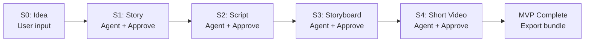
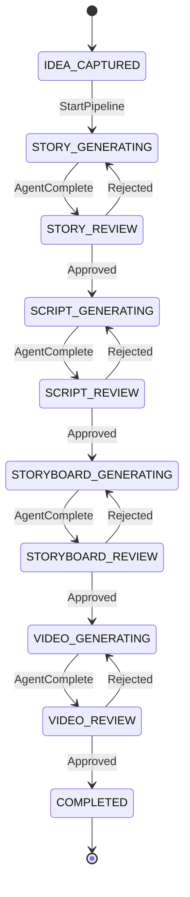
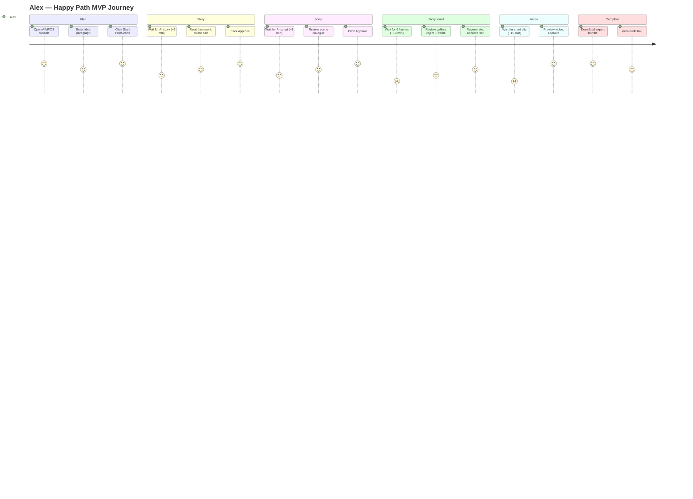
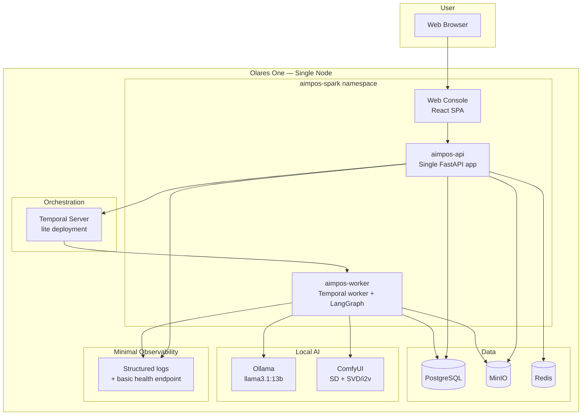

# AIMPOS — Minimum Viable Product (MVP) Definition

**Document Type:** MVP Scope & Delivery Plan  
**Version:** 1.0  
**Status:** ARCHIVED — Superseded by [MVP Scope Freeze.md](./MVP%20Scope%20Freeze.md). Do not use for execution.  
**Date:** June 8, 2026  
**Codename:** `AIMPOS-Spark`  
**Parent Documents:** [System Architecture.md](./System%20Architecture.md), [Blueprint for a multi-year initiative.md](./Blueprint%20for%20a%20multi-year%20initiative.md)

---

## Table of Contents

1. [MVP Purpose](#1-mvp-purpose)
2. [Scope Boundary](#2-scope-boundary)
3. [Pipeline Overview](#3-pipeline-overview)
4. [Features](#4-features)
5. [User Journeys](#5-user-journeys)
6. [Architecture](#6-architecture)
7. [Risks](#7-risks)
8. [Development Effort](#8-development-effort)
9. [Success Metrics](#9-success-metrics)
10. [Post-MVP Path](#10-post-mvp-path)

---

## 1. MVP Purpose

**AIMPOS-Spark** is the smallest deployable slice of AIMPOS that proves the platform concept on a single Olares One node:

> A creator can take a **one-paragraph idea**, produce an **approved story, script, storyboard, and short video** for **one scene**, with **local AI assistance**, **human approval at every stage**, **versioned assets**, and a **traceable audit trail** — without cloud GPU, multi-tenant complexity, or full studio operations.

### 1.1 What This MVP Proves

| Concept | How MVP Demonstrates It |
|---------|-------------------------|
| **Sovereign AI** | 100% inference on Olares (Ollama + ComfyUI) |
| **Workflow-driven production** | Linear 5-stage pipeline with gates |
| **Human-in-the-loop** | User approves or rejects at each stage |
| **Agentic assistance** | 3 agents propose; user decides |
| **Versioned assets** | Every output is a versioned file with history |
| **Auditability** | Who approved what, which model, which inputs |

### 1.2 What This MVP Is NOT

- Not a studio management platform
- Not multi-project / multi-tenant
- Not feature-film scale
- Not distribution / release ready
- Not a replacement for NLE, Open WebUI, or enterprise SSO

---

## 2. Scope Boundary

### 2.1 In Scope

| Area | MVP Scope |
|------|-----------|
| **Pipeline** | Idea → Story → Script → Storyboard → Short Video |
| **Granularity** | 1 project, 1 scene (60–90 second target video) |
| **Users** | 1 creator role (combined director/writer) |
| **AI** | Local Ollama (LLM) + ComfyUI (image + short video) |
| **Approvals** | 5 gates — one per stage |
| **Storage** | PostgreSQL (metadata) + MinIO (files) |
| **Workflow** | Single linear Temporal workflow |
| **Agents** | 3 agents: Story Architect, Screenwriter, Cinematography |
| **UI** | Minimal web console (5 screens) |

### 2.2 Explicitly Out of Scope

| Excluded | Rationale | Phase |
|----------|-----------|-------|
| Neo4j knowledge graph | Lineage in PostgreSQL is sufficient | Phase 1 |
| GPU burst to cloud | Local-only proves sovereignty | Phase 2 |
| Keycloak / multi-user RBAC | Single-user API token or local auth | Phase 1 |
| OPA policy engine | Hardcoded local-only rules | Phase 1 |
| LakeFS | Git-like branches as DB fields + MinIO paths | Phase 1 |
| immudb | Audit table in PostgreSQL | Phase 1 |
| 10-agent architecture | 3 agents cover the pipeline | Phase 1 |
| QA + Compliance critic agents | Human is the critic in MVP | Phase 1 |
| Producer Agent orchestration | Temporal workflow replaces coordinator | Phase 1 |
| Character bible, scene planning, audio, editing, release | Not needed for one-scene proof | Phase 1+ |
| Open WebUI integration | Optional sidecar; not in critical path | — |
| vLLM, Whisper, NAS tiers | Ollama + ComfyUI only | Phase 1 |
| Rework loops (automated) | User rejects → manual regenerate button | Phase 1 |
| WebSocket real-time | Polling for approval status | Phase 1 |
| Mobile / RTL / i18n | English desktop only | Phase 2 |

---

## 3. Pipeline Overview

### 3.1 Five-Stage Linear Pipeline



### 3.2 Stage Summary

| Stage | Human Action | AI Action | Output Asset |
|-------|--------------|-----------|--------------|
| **S0: Idea** | Write 1-paragraph idea + optional style note | None | `idea.txt` v1 |
| **S1: Story** | Approve / reject / edit | Story Architect → treatment + beat sheet | `story.md` v1 |
| **S2: Script** | Approve / reject / edit | Screenwriter → 1-scene screenplay | `script.fountain` v1 |
| **S3: Storyboard** | Approve frames / reject | Cinematography → 4–6 images | `frame_*.png` v1 |
| **S4: Short Video** | Approve / reject | Cinematography → 15–30s video clip | `scene_video.mp4` v1 |

### 3.3 MVP Workflow State Machine



---

## 4. Features

### 4.1 Feature List (MVP-Only)

| ID | Feature | Priority | Notes |
|----|---------|----------|-------|
| F-01 | Create single project | P0 | One project pre-created or simple create |
| F-02 | Capture idea (text input) | P0 | Title + paragraph + optional style |
| F-03 | Start production pipeline | P0 | Single button triggers Temporal workflow |
| F-04 | AI story generation | P0 | Story Architect agent via Ollama |
| F-05 | Story review & approval | P0 | View, edit text, approve/reject |
| F-06 | AI script generation | P0 | Screenwriter agent; 1 scene only |
| F-07 | Script review & approval | P0 | Fountain preview; approve/reject |
| F-08 | AI storyboard generation | P0 | 4–6 frames via ComfyUI |
| F-09 | Storyboard gallery review | P0 | Grid view; approve set or reject |
| F-10 | AI short video generation | P0 | Image-to-video or frame stitch via ComfyUI |
| F-11 | Video preview & approval | P0 | In-browser player; approve/reject |
| F-12 | Asset version history | P0 | List versions per stage; view prior |
| F-13 | Audit log viewer | P0 | Stage transitions, approvals, model used |
| F-14 | Lineage summary | P1 | Simple chain: idea → story → … → video |
| F-15 | Export final bundle | P1 | ZIP of all approved assets + manifest.json |
| F-16 | Pipeline status dashboard | P0 | Current stage, progress, errors |

**Total: 16 features. 14 P0, 2 P1.**

### 4.2 Feature — Non-Feature Distinction

| Shipped in MVP | Deferred |
|----------------|----------|
| Approve / reject per stage | Multi-approver quorum |
| Manual text edit before approve | Branching / merge |
| View version list | Visual lineage graph (Neo4j) |
| Audit log table | Compliance export PDF |
| Local model badge on assets | Model registry UI |
| Regenerate on reject | Automated rework loops |

### 4.3 Agent Scope (3 Agents Only)

| Agent | Stages | Model |
|-------|--------|-------|
| **Story Architect** | S1 | Ollama 13B |
| **Screenwriter** | S2 | Ollama 13B |
| **Cinematography** | S3, S4 | Ollama 13B (planning) + ComfyUI (image/video) |

Each agent: **propose only** → workflow pauses → human approves → workflow continues.

---

## 5. User Journeys

### 5.1 Primary Persona — *Alex, Independent Creator*

Alex has a film idea and wants to see one scene realized using local AI without sending data to the cloud.

### 5.2 Journey 1: Happy Path (First Complete Run)

**Goal:** Idea to approved short video in one session (~2–4 hours including GPU time and review).



| Step | Alex Does | System Does | Time |
|------|-----------|-------------|------|
| 1 | Opens `http://olares.local/aimpos` | Loads project dashboard | 10s |
| 2 | Enters idea: *"A lone astronaut discovers a garden on Mars"* | Saves `idea.txt` v1 | 2 min |
| 3 | Clicks **Start Production** | Temporal workflow starts | 5s |
| 4 | Waits | Story Architect generates treatment | 1–3 min |
| 5 | Reads story, tweaks one sentence, **Approve** | Records approval; advances to S2 | 5 min |
| 6 | Waits | Screenwriter generates 1-scene script | 2–4 min |
| 7 | Reviews script, **Approve** | Advances to S3 | 5 min |
| 8 | Waits | ComfyUI generates 6 storyboard frames | 8–15 min |
| 9 | Reviews gallery, **Approve** all | Advances to S4 | 5 min |
| 10 | Waits | ComfyUI generates 15–30s video | 10–25 min |
| 11 | Previews video, **Approve** | Pipeline complete | 5 min |
| 12 | Clicks **Export Bundle** | ZIP with manifest + assets | 30s |

**Total active time:** ~30 min human · **Total elapsed:** ~1–2 hours (GPU-dependent)

### 5.3 Journey 2: Reject and Regenerate

**Goal:** Prove human authority when AI output is wrong.

| Step | Action | Result |
|------|--------|--------|
| 1 | Story generated | Alex reads — tone is too comedic |
| 2 | Clicks **Reject**, adds note: "Make it contemplative, not comedic" | Workflow stays at S1 |
| 3 | Clicks **Regenerate** | Story Architect re-runs with rejection note in context |
| 4 | Reviews new story, **Approve** | Pipeline advances |

*Same pattern for script, storyboard, and video stages.*

### 5.4 Journey 3: Resume After Interruption

**Goal:** Prove durable workflow state.

| Step | Action | Result |
|------|--------|--------|
| 1 | Alex approves story, closes browser | Workflow paused at S2 generating |
| 2 | Returns next day, opens console | Dashboard shows "Script — Generating" or "Ready for Review" |
| 3 | Continues from current stage | No data loss; versions intact |

### 5.5 Journey 4: Audit & Lineage Check

**Goal:** Prove traceability for the platform concept.

| Step | Action | Result |
|------|--------|--------|
| 1 | Opens **Audit Log** | Sees: `StoryApproved by alex @ timestamp`, `Model: llama3.1:13b` |
| 2 | Opens **Lineage** | Sees chain: `idea.txt → story.md → script.fountain → frames → video.mp4` |
| 3 | Clicks video asset | Shows `ai_generated=true`, parent frames listed |

### 5.6 Screen Map (5 Screens)

| Screen | Purpose |
|--------|---------|
| **Dashboard** | Pipeline status, current stage, CTA buttons |
| **Review** | Stage-specific content viewer + Approve / Reject / Regenerate |
| **Assets** | Version list per stage; download individual files |
| **Audit** | Chronological event log |
| **Export** | Final bundle download + lineage summary |

---

## 6. Architecture

### 6.1 MVP Architecture Diagram



### 6.2 Component Count

| Component | Full Platform | MVP | Reduction |
|-----------|---------------|-----|-----------|
| FastAPI services | 9 | 1 | −89% |
| Agents | 10 | 3 | −70% |
| Workflows | 9 | 1 | −89% |
| Databases | 4 (PG, Neo4j, Redis, immudb) | 2 (PG, Redis) | −50% |
| Object storage | MinIO + LakeFS | MinIO only | −50% |
| Auth | Keycloak + OPA | API token / basic auth | −100% complexity |
| Observability | Full OTel stack | Logs + `/health` | −80% |
| Frontend modules | 12+ | 5 screens | −60% |

### 6.3 MVP Application Structure

```
aimpos-spark/
├── api/                    # Single FastAPI application
│   ├── routes/             # projects, pipeline, assets, approvals, audit
│   ├── domain/             # Project, AssetVersion, Approval, AuditEvent
│   └── db/                 # PostgreSQL models (SQLAlchemy)
├── worker/
│   ├── temporal/           # One workflow: SparkPipelineWorkflow
│   ├── activities/         # run_story, run_script, run_storyboard, run_video
│   └── agents/             # 3 LangGraph graphs
├── web/                    # React SPA (5 screens)
└── deploy/                 # Docker Compose or Helm (single chart)
```

### 6.4 Single Temporal Workflow

```python
# Conceptual — not implementation code
SparkPipelineWorkflow:
  1. activity: capture_idea          # already saved via API
  2. activity: run_story_agent       # → await human approval signal
  3. activity: run_script_agent      # → await human approval signal
  4. activity: run_storyboard_agent  # → await human approval signal
  5. activity: run_video_agent       # → await human approval signal
  6. activity: finalize_export
```

**Human approval:** Temporal `wait_condition` + `approve` / `reject` signals from API.

### 6.5 Data Model (Minimal)

| Table | Purpose |
|-------|---------|
| `projects` | 1 row for MVP demo project |
| `pipeline_runs` | Workflow instance state |
| `asset_versions` | All outputs with `stage`, `version`, `minio_key`, `content_hash` |
| `approvals` | Immutable approve/reject records |
| `audit_events` | Append-only log |
| `lineage_edges` | Simple `parent_id → child_id` in PostgreSQL (no Neo4j) |

### 6.6 Local Model Configuration

| Task | Model | Runtime | VRAM |
|------|-------|---------|------|
| Story + Script | `llama3.1:13b` (or `mistral:7b` fallback) | Ollama | ~8–16 GB |
| Storyboard frames | SDXL or Flux (quantized) | ComfyUI | ~8 GB |
| Short video | Stable Video Diffusion / AnimateDiff | ComfyUI | ~12–16 GB |

**GPU rule:** Do not run Ollama 13B and ComfyUI video simultaneously. Worker sequences GPU jobs.

### 6.7 Deployment (Simplest Path)

| Option | Recommendation |
|--------|----------------|
| **Phase 0 lab** | Docker Compose on Olares (fastest to first demo) |
| **Phase 0.5** | Single Helm chart, 1 namespace `aimpos-spark` |
| **Containers** | 8: api, worker, web, temporal, postgresql, minio, redis, ollama, comfyui |

---

## 7. Risks

| Risk | Likelihood | Impact | Mitigation |
|------|------------|--------|------------|
| **Video generation quality too poor** | High | High | MVP proves workflow not Hollywood quality; cap at 480p/15s; frame slideshow fallback |
| **GPU VRAM contention** | High | Medium | Serialize GPU jobs; unload Ollama model before ComfyUI video |
| **ComfyUI workflow instability** | Medium | High | Pin workflow JSON; test on target Olares hardware early (week 1) |
| **Temporal ops overhead** | Medium | Medium | Use Temporal lite + PostgreSQL persistence; Docker Compose bundle |
| **End-to-end takes too long to build** | Medium | High | Timebox to 10 weeks; cut F-14/F-15 if behind |
| **Single FastAPI becomes messy** | Medium | Low | Enforce module boundaries inside monolith; split later |
| **User rejects repeatedly — frustration** | Medium | Medium | Limit to 3 regenerations per stage; clear progress UI |
| **No auth — security gap** | Low | Medium | Olares LAN only; API token; document as lab-not-production |
| **Story/script quality inconsistent** | High | Medium | Human edits before approve; acceptable for concept proof |
| **Scope creep** | High | High | This document is the scope contract; change control for any addition |

### 7.1 MVP Kill Criteria (Stop / Pivot)

| Signal | Action |
|--------|--------|
| Cannot run Ollama + ComfyUI on Olares after 2 weeks | Pivot to Ollama images-only; slideshow "video" |
| Temporal setup blocks week 3 | Fallback: PostgreSQL state machine (document debt) |
| No complete run after 12 weeks | Re-scope to Idea → Story → Script only |

---

## 8. Development Effort

### 8.1 Team Assumption

| Role | FTE | Duration |
|------|-----|----------|
| Full-stack engineer (API + worker + deploy) | 1.0 | 10 weeks |
| Frontend engineer | 0.5 | 6 weeks |
| AI/ML engineer (ComfyUI workflows, Ollama prompts) | 0.5 | 8 weeks |
| **Total** | **2.0 FTE** | **10 weeks** |

*Solo developer with AI+full-stack skills: ~14–16 weeks.*

### 8.2 Sprint Breakdown

| Sprint | Weeks | Deliverables | Cumulative |
|--------|-------|--------------|------------|
| **S1: Foundation** | 1–2 | Docker Compose on Olares; PostgreSQL + MinIO + Ollama; health checks | Infra running |
| **S2: Pipeline skeleton** | 3–4 | Temporal workflow; API start/status/approve; audit table | Workflow runs empty stages |
| **S3: Story + Script** | 5–6 | 2 LangGraph agents; review screen; approve/reject | Idea → approved script |
| **S4: Storyboard** | 7–8 | ComfyUI integration; frame gallery; asset versions | Idea → approved frames |
| **S5: Video + finish** | 9–10 | Video generation; export bundle; lineage view; demo polish | **Full MVP** |

### 8.3 Effort by Area

| Area | Person-Days | % |
|------|-------------|---|
| Infrastructure & deploy | 12 | 17% |
| FastAPI (API + domain) | 15 | 21% |
| Temporal workflow + activities | 12 | 17% |
| LangGraph agents (3) | 10 | 14% |
| ComfyUI workflows (image + video) | 12 | 17% |
| React web console (5 screens) | 10 | 14% |
| **Total** | **~71 person-days** | **100%** |

*≈ 14 weeks at 1 FTE · ≈ 7 weeks at 2 FTE (with parallel frontend + AI tracks)*

### 8.4 Cost of Delay Items

| If delayed past MVP | Cost |
|---------------------|------|
| Neo4j graph projector | +2 weeks — defer |
| Keycloak integration | +1 week — defer |
| Multi-agent critics | +2 weeks — defer |
| LakeFS versioning | +1.5 weeks — defer |
| WebSocket notifications | +3 days — defer |

---

## 9. Success Metrics

### 9.1 Primary Success Criteria (Must All Pass)

| ID | Metric | Target | Measurement |
|----|--------|--------|-------------|
| **SC-01** | Complete pipeline run | ≥ 1 end-to-end completion | Idea → approved video |
| **SC-02** | Local inference ratio | 100% | Zero cloud API calls during run |
| **SC-03** | Human gates enforced | 5/5 approvals recorded | Audit log verification |
| **SC-04** | Asset versioning | ≥ 5 versioned assets per run | PostgreSQL + MinIO |
| **SC-05** | Audit completeness | 100% of AI calls logged | model_id, inputs, timestamp |
| **SC-06** | Workflow durability | Resume after browser close | Restart Olares worker; workflow continues |
| **SC-07** | Time to first story | < 5 min from idea submit | Instrumented in API |
| **SC-08** | Creator comprehension | User completes without docs | 1 non-engineer test participant |

### 9.2 Secondary Metrics (Nice to Have)

| ID | Metric | Target |
|----|--------|--------|
| SC-09 | Full pipeline elapsed time | < 3 hours (excluding human review) |
| SC-10 | Regenerate success rate | User accepts within 3 attempts ≥ 80% |
| SC-11 | Export bundle integrity | Manifest matches all asset hashes |
| SC-12 | GPU idle between stages | Ollama unloaded before ComfyUI video |

### 9.3 Demo Acceptance Script

Use this script to validate MVP readiness:

1. Enter idea on fresh project
2. Start pipeline
3. Approve story (with one text edit)
4. Reject script once → regenerate → approve
5. Approve all storyboard frames
6. Approve short video
7. Download export bundle
8. Open audit log — verify 5 approvals and 3+ model invocations
9. Open lineage — verify chain from idea to video
10. Restart API worker — confirm project state unchanged

**Pass:** All 10 steps complete without manual database intervention.

### 9.4 What Success Looks Like (Qualitative)

- A stakeholder says: *"I can see how this becomes the production OS — the approval and version trail already feel studio-grade."*
- MLOps confirms: *"Nothing left the box."*
- The creator says: *"The video isn't perfect, but the path from idea to visual was faster than my old process."*

---

## 10. Post-MVP Path

### 10.1 Incremental Additions (Ordered)

| Order | Addition | Unlocks |
|-------|----------|---------|
| 1 | Automated rework loops | Workflow Architecture compliance |
| 2 | QA + Compliance agents | Multi-Agent Architecture critics |
| 3 | Neo4j graph projector | Enterprise Knowledge Graph |
| 4 | Keycloak + roles | Identity plane |
| 5 | WF-02..WF-05 as separate workflows | Full pre-production |
| 6 | Multi-scene / multi-project | Real pilot film |
| 7 | GPU burst | Scale video quality |
| 8 | NLE integration | Post-production |

### 10.2 MVP → Phase 0 Mapping

| MVP Component | Phase 0 Evolution |
|---------------|-------------------|
| Single FastAPI | Split into domain services |
| 1 workflow | WF-01 + WF-02 + WF-05 |
| 3 agents | 10-agent architecture |
| PG lineage | Neo4j projection |
| Basic auth | Keycloak |
| Docker Compose | Helm + GitOps |

---

## Document Control

| Version | Date | Changes |
|---------|------|---------|
| 1.0 | 2026-06-08 | Initial MVP definition — AIMPOS-Spark |

---

## Summary

**AIMPOS-Spark** delivers one scene, five stages, three agents, one workflow, one API, local models only — enough to prove that AIMPOS can govern AI-assisted media production with human authority, versioned assets, and full auditability on Olares One.

| Dimension | MVP Choice |
|-----------|------------|
| **Pipeline** | Idea → Story → Script → Storyboard → Short Video |
| **Scope** | 1 project · 1 scene · 1 user |
| **Stack** | FastAPI + Temporal + LangGraph + PostgreSQL + MinIO + Ollama + ComfyUI |
| **Effort** | ~71 person-days · 10 weeks with 2 FTE |
| **Proof** | Local AI + HITL + versions + audit in one runnable demo |

*End of document*
