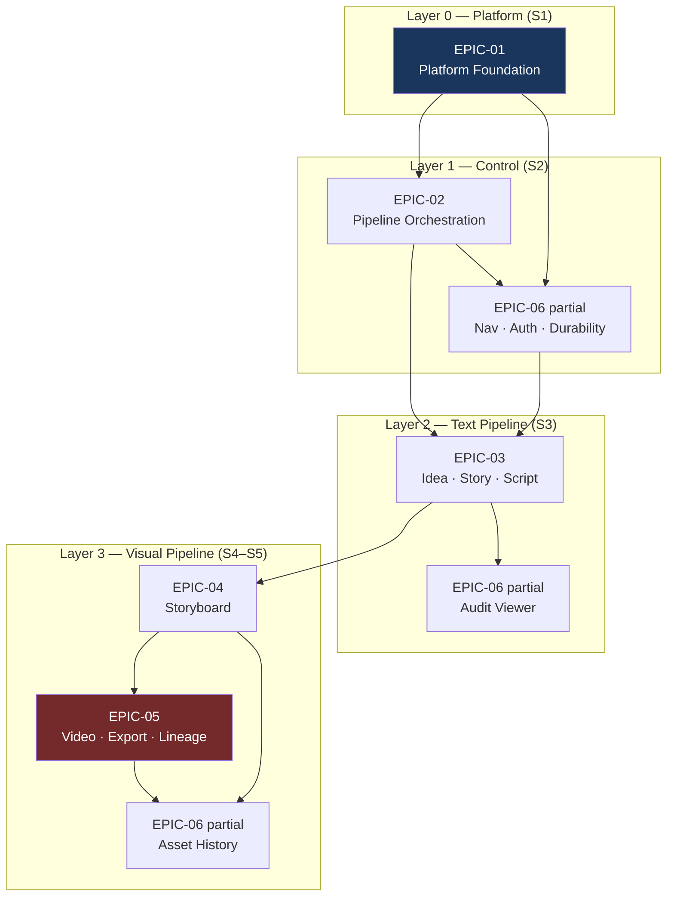
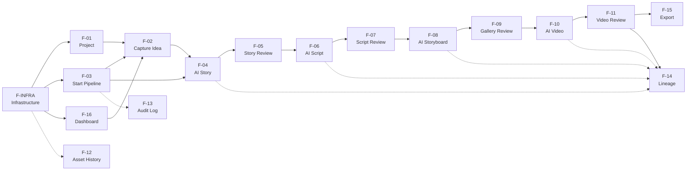
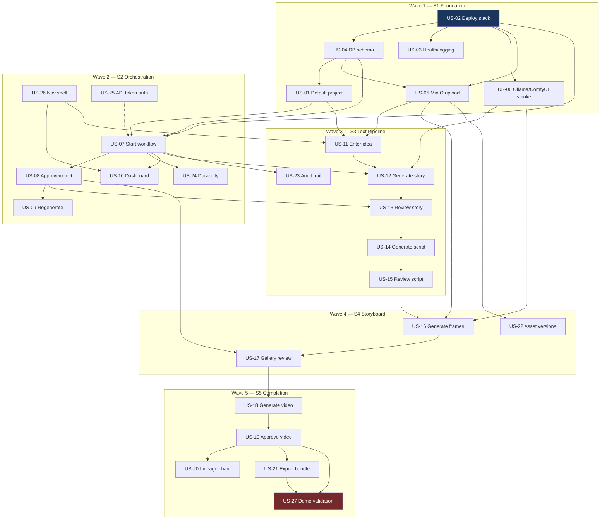
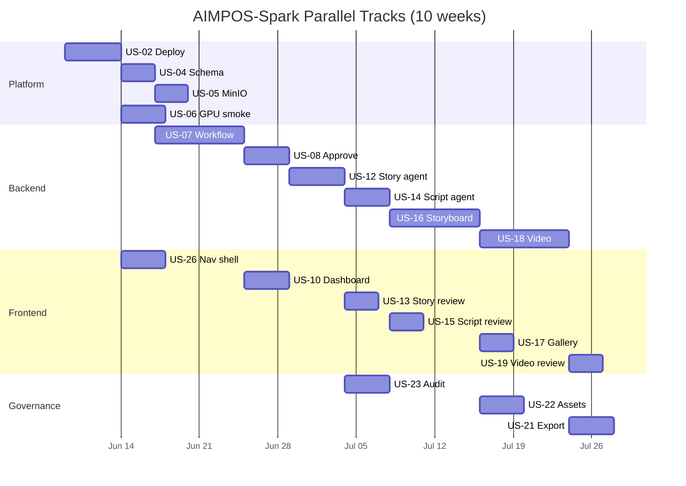

# AIMPOS-Spark — MVP Dependency Map

**Document Type:** Architecture Dependency Analysis  
**Version:** 1.0  
**Date:** June 8, 2026  
**Author Role:** Principal Enterprise Architect  
**Parent Documents:** [MVP Definition.md](./MVP%20Definition.md), [MVP Backlog.md](./MVP%20Backlog.md), [System Architecture.md](./System%20Architecture.md)

---

## Executive Summary

AIMPOS-Spark has a **strict linear pipeline dependency** (Idea → Story → Script → Storyboard → Video) overlaid on a **platform foundation layer** that must exist before any orchestration or agent work begins. Cross-cutting governance (assets, audit, UI shell) fans out from foundation primitives and converges at export and demo validation.

**Build order in one sentence:** Foundation → Orchestration shell → Text pipeline (Idea/Story/Script) → Visual pipeline (Storyboard/Video) → Export/Lineage → Demo sign-off.

**Critical path duration:** 10 weeks (S1–S5) if sequence is respected; **12–16+ weeks** if foundation or orchestration layers are skipped or reordered.

---

## Table of Contents

1. [Dependency Graph](#1-dependency-graph)
2. [Development Sequence](#2-development-sequence)
3. [Critical Path](#3-critical-path)
4. [Risks if Sequence Is Violated](#4-risks-if-sequence-is-violated)
5. [Epic Dependency Register](#5-epic-dependency-register)
6. [Feature Dependency Register](#6-feature-dependency-register)
7. [User Story Dependency Register](#7-user-story-dependency-register)
8. [Parallel Work Streams](#8-parallel-work-streams)

---

## 1. Dependency Graph

### 1.1 Epic-Level Graph

Epics form three layers: **Platform**, **Control**, **Pipeline Stages**, plus **Governance** as a horizontal cross-cut.



| Epic | Prerequisites | Blocks |
|------|---------------|--------|
| **EPIC-01** | Olares One hardware, Docker | All other epics |
| **EPIC-02** | EPIC-01 | EPIC-03, EPIC-04, EPIC-05 |
| **EPIC-03** | EPIC-01, EPIC-02, EPIC-06 (nav) | EPIC-04 |
| **EPIC-04** | EPIC-03 (approved script), EPIC-01 (ComfyUI) | EPIC-05 |
| **EPIC-05** | EPIC-04 (approved frames) | MVP completion (SC-01) |
| **EPIC-06** | EPIC-01; incremental per sub-feature | UX quality; SC-03, SC-04, SC-05 |

---

### 1.2 Feature-Level Graph

Features follow the MVP pipeline state machine. Hard dependencies are solid arrows; soft (can stub) are dashed.



| Feature | Hard Prerequisites | Soft Prerequisites | Blocks |
|---------|-------------------|-------------------|--------|
| **F-INFRA** | — | — | F-01, F-03, F-04, F-08, F-10, F-12 |
| **F-01** | F-INFRA (schema) | — | F-02, F-03 |
| **F-16** | F-INFRA, F-03 (status API) | F-26 nav shell | All UI features |
| **F-03** | F-INFRA, F-01, Temporal | F-25 auth | F-02, F-04–F-11, F-13 |
| **F-02** | F-01, F-05 (MinIO) | F-16, F-26 | F-04 |
| **F-04** | F-02, F-03, Ollama | F-13 audit | F-05 |
| **F-05** | F-04, F-03 (approve API) | F-26 Review UI | F-06 |
| **F-06** | F-05 (approved story) | F-13, lineage table | F-07 |
| **F-07** | F-06 | F-26 Review UI | F-08 |
| **F-08** | F-07 (approved script), ComfyUI | GPU sequencing | F-09 |
| **F-09** | F-08 | F-26 Review UI | F-10 |
| **F-10** | F-09 (approved frames), ComfyUI | Slideshow fallback | F-11 |
| **F-11** | F-10 | F-26 Review UI | F-14, F-15 |
| **F-12** | F-INFRA (MinIO), any assets | — | UX completeness |
| **F-13** | F-03 (audit writes) | F-26 Audit screen | SC-05 verification |
| **F-14** | F-04, F-06, F-08, F-10 (lineage edges) | F-11 complete | — |
| **F-15** | F-11 (pipeline COMPLETED) | F-13 audit in manifest | SC-11, demo step 10 |

---

### 1.3 User Story Dependency Graph

Full story-level DAG grouped by build wave.



---

## 2. Development Sequence

### 2.1 Recommended Build Waves

Each wave completes before the next begins, except where **parallel tracks** are noted.

| Wave | Sprint | Duration | Gate Criteria | Work Items (ordered) |
|------|--------|----------|---------------|----------------------|
| **W0** | Pre-S1 | 2–3 days | Olares hardware verified | GPU available, Docker installed, model pull plan |
| **W1** | S1 | 2 weeks | `docker compose up` healthy | US-02 → US-04 → US-03 → US-05 → US-06 → US-01 |
| **W2** | S2 | 2 weeks | Empty workflow runs with approve signals | US-26 → US-07 → US-08 → US-09 → US-24 → US-25 → US-10 |
| **W3** | S3 | 2 weeks | Idea → approved script E2E | US-11 → US-12 → US-13 → US-14 → US-15 → US-23 |
| **W4** | S4 | 2 weeks | Idea → approved frames E2E | US-16 → US-17 → US-22 |
| **W5** | S5 | 2 weeks | Full pipeline + export + sign-off | US-18 → US-19 → US-20 → US-21 → US-27 |

### 2.2 Within-Wave Ordering (Exact Sequence)

#### Wave 1 — Platform Foundation (S1)

| Order | ID | Rationale |
|-------|-----|-----------|
| 1 | **US-02** | Nothing runs without compose stack; blocks all integration |
| 2 | **US-04** | Schema is prerequisite for every persistence operation |
| 3 | **US-03** | Health probes validate W1 gate; depends on US-02 |
| 4 | **US-05** | Asset plane required before any stage output |
| 5 | **US-06** | De-risks GPU/ComfyUI early (MVP kill criterion week 2) |
| 6 | **US-01** | Project seed needs `projects` table from US-04 |

#### Wave 2 — Pipeline Orchestration (S2)

| Order | ID | Rationale |
|-------|-----|-----------|
| 1 | **US-26** | Nav shell unblocks all frontend screens in W3–W5 |
| 2 | **US-07** | Temporal workflow skeleton; root of all pipeline behavior |
| 3 | **US-08** | Human-in-the-loop gates; required before any agent stage |
| 4 | **US-09** | Reject/regenerate loop; depends on approve/reject contract |
| 5 | **US-24** | Durability (SC-06); validate before long GPU activities |
| 6 | **US-25** | Auth before exposing mutating APIs on LAN |
| 7 | **US-10** | Dashboard consumes status API from US-07 |

#### Wave 3 — Text Pipeline (S3)

| Order | ID | Rationale |
|-------|-----|-----------|
| 1 | **US-11** | Idea must exist before `StartPipeline` with real input |
| 2 | **US-12** | First agent activity; validates Ollama + audit + MinIO path |
| 3 | **US-13** | First review gate UI; validates approve signal E2E |
| 4 | **US-14** | Script agent consumes approved story asset |
| 5 | **US-15** | Script approval unblocks storyboard stage |
| 6 | **US-23** | Audit viewer needs events from US-07, US-12, US-14 |

#### Wave 4 — Storyboard (S4)

| Order | ID | Rationale |
|-------|-----|-----------|
| 1 | **US-16** | ComfyUI frames; highest technical risk after video |
| 2 | **US-17** | Gallery review; validates image approve path |
| 3 | **US-22** | Asset history needs multiple versions from W3–W4 |

#### Wave 5 — Video & Completion (S5)

| Order | ID | Rationale |
|-------|-----|-----------|
| 1 | **US-18** | Video generation; longest GPU activity |
| 2 | **US-19** | Final approval; sets pipeline COMPLETED |
| 3 | **US-20** | Lineage needs all edges from W3–W5 |
| 4 | **US-21** | Export needs all approved assets + audit |
| 5 | **US-27** | Demo validation is terminal gate |

### 2.3 Master Sequence List (All 27 Stories)

Single ordered list for sprint planning and import into ADO/Jira as `Implementation Order`:

```
 1. US-02   Deploy MVP stack on Olares
 2. US-04   Database schema foundation
 3. US-03   API health and logging
 4. US-05   MinIO asset upload service
 5. US-06   Ollama and ComfyUI smoke test
 6. US-01   Create default project
 7. US-26   App navigation shell
 8. US-07   Start pipeline workflow
 9. US-08   Approve or reject stage output
10. US-09   Regenerate after rejection
11. US-24   Pipeline survives worker restart
12. US-25   API token authentication
13. US-10   View pipeline status dashboard
14. US-11   Enter production idea
15. US-12   Generate story from idea
16. US-13   Review and edit story
17. US-14   Generate one-scene script
18. US-15   Review and approve script
19. US-23   View audit trail
20. US-16   Generate storyboard frames
21. US-17   Review storyboard gallery
22. US-22   Browse asset versions
23. US-18   Generate short video clip
24. US-19   Preview and approve video
25. US-20   View asset lineage chain
26. US-21   Download production bundle
27. US-27   MVP demo acceptance validation
```

---

## 3. Critical Path

### 3.1 Longest Dependency Chain

The **critical path** is the minimum sequence that determines MVP delivery date. Any delay on this chain delays the demo.


| # | Work Item | Est. Duration | Cumulative | Risk Factor |
|---|-----------|---------------|------------|-------------|
| 1 | US-02 Deploy stack | 3 d | 3 d | Medium — Olares env variance |
| 2 | US-04 Schema | 2 d | 5 d | Low |
| 3 | US-05 MinIO service | 2 d | 7 d | Low |
| 4 | US-07 Temporal workflow | 5 d | 12 d | **High** — kill criterion W3 |
| 5 | US-08 Approve/reject | 3 d | 15 d | Medium |
| 6 | US-11 Idea capture | 2 d | 17 d | Low |
| 7 | US-12 Story agent | 4 d | 21 d | Medium — prompt quality |
| 8 | US-13 Story review | 2 d | 23 d | Low |
| 9 | US-14 Script agent | 3 d | 26 d | Medium |
| 10 | US-15 Script review | 2 d | 28 d | Low |
| 11 | US-16 Storyboard ComfyUI | 5 d | 33 d | **High** — GPU, workflow stability |
| 12 | US-17 Gallery review | 2 d | 35 d | Low |
| 13 | US-18 Video ComfyUI | 5 d | 40 d | **Highest** — VRAM, quality |
| 14 | US-19 Video review | 2 d | 42 d | Low |
| 15 | US-21 Export bundle | 2 d | 44 d | Low |
| 16 | US-27 Demo validation | 2 d | 46 d | Medium — integration gaps |

**Critical path total:** ~46 working days (~9.2 weeks at 1 FTE on path) · **10 calendar weeks** with parallel frontend/AI tracks.

### 3.2 Near-Critical Paths (High Slack Sensitivity)

These paths are not on the main chain but have **< 3 days slack** before they become critical:

| Path | Items | Why Near-Critical |
|------|-------|-------------------|
| **GPU validation** | US-06 → US-16 → US-18 | Failure forces pivot to slideshow; adds 1–2 weeks |
| **UI shell** | US-26 → US-13, US-15, US-17, US-19 | Without Review screens, pipeline is API-only; blocks SC-08 |
| **Durability** | US-24 | SC-06 fails if not done before first long GPU run |
| **Audit completeness** | US-23 + audit in US-12/14/16/18 | SC-05 fails at demo if retrofitted |

### 3.3 Float (Can Slip Without Delaying MVP)

| Work Item | Max Float | Notes |
|-----------|-----------|-------|
| US-03 Health/logging | 1 week | Needed for ops, not demo path |
| US-01 Default project | 3 days | Can stub in US-07 tests |
| US-09 Regenerate | 1 week | Demo uses happy path; needed for UX |
| US-25 API token auth | 1 week | LAN lab can defer to mid-S2 |
| US-10 Dashboard polish | 1 week | Minimal status API sufficient for demo |
| US-20 Lineage summary | 1 week | P1 — cut if behind schedule |
| US-22 Asset versions | 1 week | P0 UX but demo completes without it |

---

## 4. Risks if Sequence Is Violated

### 4.1 Violation Matrix

| If You Build… | Before… | Risk | Severity | Likely Impact |
|---------------|---------|------|----------|---------------|
| **US-12 Story agent** | US-07 Workflow | No pause/resume; agent output orphaned | **Critical** | Rework entire agent integration |
| **US-16 Storyboard** | US-15 Script approved | No valid script input; wasted GPU cycles | **Critical** | 3–5 days lost + bad outputs |
| **US-18 Video** | US-17 Frames approved | Video from wrong/missing frames | **Critical** | Full video pipeline rework |
| **US-07 Workflow** | US-04 Schema | No persistence for runs, approvals, audit | **Critical** | Temporal state disconnected from truth |
| **US-11 Idea** | US-05 MinIO | Idea not versioned; breaks lineage | **High** | SC-04, SC-01 fail |
| **US-10 Dashboard** | US-07 Status API | UI with no data source | **Medium** | Wasted frontend sprint |
| **US-23 Audit viewer** | US-07 Audit writes | Empty audit screen; false "done" | **Medium** | SC-05 verification delayed |
| **US-21 Export** | US-19 Video approved | Incomplete bundle | **High** | SC-11 fail; demo step 10 blocked |
| **US-06 ComfyUI smoke** | US-02 Deploy (late) | GPU issues discovered in S4 not S1 | **High** | MVP kill criterion triggered late |
| **US-24 Durability** | US-18 Long GPU runs | Workflow lost mid-video | **High** | SC-06 fail; creator trust lost |
| **US-26 Nav shell** | Review screens (US-13+) | Fragmented UI; integration debt | **Medium** | +3–5 days frontend rework |
| **US-16 + US-12 parallel** | GPU sequencing rule | OOM on Olares | **High** | Hardware crash; 1–2 day recovery |
| **F-14 Lineage before agents** | Lineage edge writers | Empty lineage view | **Low** | Cosmetic until W5 |
| **Skip US-25 Auth** | LAN exposure | Open mutating API on network | **Low–Med** | Security finding; acceptable for lab |

### 4.2 Architectural Constraint Violations

From [System Architecture.md](./System%20Architecture.md) and [MVP Definition.md](./MVP%20Definition.md):

| Constraint | Required Order | Violation Consequence |
|------------|----------------|----------------------|
| **Agents propose only** | Workflow (US-07, US-08) before any agent (US-12+) | Agents bypass human gates; violates core architecture principle |
| **PostgreSQL = system of record** | US-04 before any asset or approval write | Split-brain between MinIO filenames and metadata |
| **Temporal = production control** | US-07 before stage activities | Ad-hoc scripts replace workflow; SC-06 impossible |
| **GPU serialization** | US-06 proves sequencing before US-16/US-18 | Concurrent Ollama + ComfyUI → OOM |
| **Content-addressable storage** | US-05 before US-11+ | Duplicate blobs; export hash mismatch (SC-11) |
| **Lineage in PostgreSQL** | US-04 `lineage_edges` before US-14+ | Neo4j temptation; scope creep |
| **Single linear workflow** | Stages built in pipeline order | Parallel stage development creates dead code |

### 4.3 Sprint-Level Anti-Patterns

| Anti-Pattern | What Happens | Recovery Cost |
|--------------|--------------|---------------|
| **"Start agents in S1"** | No workflow gates; mock-heavy tests that don't transfer | 1–2 weeks |
| **"Build all UI in S5"** | No review screens during S3 agent testing | 1 week + poor agent feedback |
| **"Defer ComfyUI to S5"** | Image + video risk stacked in final sprint | 2–4 weeks or scope cut |
| **"Skip Temporal, use DB state machine"** | Works short-term; durability and signals manual | +2 weeks debt or pivot acceptance |
| **"Export first, lineage later"** | Manifest missing parent refs | 3 days retrofit |
| **"Parallel EPIC-04 and EPIC-03"** | Storyboard agent built against mock script format | 2–3 days integration fix |

---

## 5. Epic Dependency Register

| Epic | Prerequisites | Dependencies (requires) | Blocking Items | Impl. Order |
|------|---------------|-------------------------|----------------|-------------|
| **EPIC-01** | Olares hardware | — | EPIC-02, EPIC-03, EPIC-04, EPIC-05, EPIC-06 | **1** |
| **EPIC-02** | EPIC-01 | US-02, US-04, US-01 | EPIC-03, EPIC-04, EPIC-05 | **2** |
| **EPIC-06** | EPIC-01 | US-02, US-04, US-05 (partial) | All UI stories; SC-03–05 | **2–5** (incremental) |
| **EPIC-03** | EPIC-01, EPIC-02 | US-05, US-06, US-07, US-08, US-26 | EPIC-04 | **3** |
| **EPIC-04** | EPIC-03, EPIC-01 | US-15 approved, US-06 ComfyUI | EPIC-05 | **4** |
| **EPIC-05** | EPIC-04 | US-17 approved, lineage + export infra | MVP sign-off | **5** |

---

## 6. Feature Dependency Register

| Feature | Prerequisites | Dependencies | Blocking Items | Impl. Order |
|---------|---------------|--------------|----------------|-------------|
| **F-INFRA** | — | — | All features | 1 |
| **F-01** | F-INFRA | US-04 | F-02, F-03 | 2 |
| **F-03** | F-INFRA, F-01 | US-04, US-02, Temporal | F-02, F-04–F-11, F-13 | 3 |
| **F-16** | F-INFRA, F-03 | US-07 status API, US-26 | F-02, all review UIs | 4 |
| **F-02** | F-01, F-INFRA | US-05, US-01 | F-04 | 5 |
| **F-04** | F-02, F-03 | US-06 Ollama, US-05 | F-05 | 6 |
| **F-05** | F-04, F-03 | US-08, US-26 | F-06 | 7 |
| **F-06** | F-05 | Approved story asset | F-07 | 8 |
| **F-07** | F-06 | US-08, US-26 | F-08 | 9 |
| **F-08** | F-07 | US-06 ComfyUI, approved script | F-09 | 10 |
| **F-09** | F-08 | US-08, US-26 | F-10 | 11 |
| **F-10** | F-09 | Approved frames, ComfyUI video | F-11 | 12 |
| **F-11** | F-10 | US-08, US-26 | F-14, F-15 | 13 |
| **F-13** | F-03 | Audit writes from workflow | SC-05 | 8* (parallel W3) |
| **F-12** | F-INFRA | Assets from W3+ | UX completeness | 11* (parallel W4) |
| **F-14** | F-04, F-06, F-08, F-10 | lineage_edges populated | — | 14 |
| **F-15** | F-11 | Pipeline COMPLETED | SC-11, demo | 15 |

*\* Order relative to pipeline stage; can build UI after first events exist.*

---

## 7. User Story Dependency Register

| Story | Prerequisites | Dependencies | Blocking Items | Order |
|-------|---------------|--------------|----------------|-------|
| **US-02** | Olares Docker | — | All stories | 1 |
| **US-04** | US-02 | — | US-01, US-05, US-07, US-23 | 2 |
| **US-03** | US-02 | — | Ops readiness | 3 |
| **US-05** | US-02, US-04 | — | US-11–US-22, US-21 | 4 |
| **US-06** | US-02 | — | US-12, US-16, US-18 | 5 |
| **US-01** | US-04 | — | US-07, US-11 | 6 |
| **US-26** | US-02 (API URL) | — | US-10–US-23 UI | 7 |
| **US-07** | US-02, US-04, US-01 | Temporal | US-08–US-19, US-23 | 8 |
| **US-08** | US-07 | — | US-09, US-13–US-19 | 9 |
| **US-09** | US-08 | — | Regenerate UX | 10 |
| **US-24** | US-07 | — | SC-06 before GPU | 11 |
| **US-25** | US-07 | — | LAN security | 12 |
| **US-10** | US-07, US-26 | — | Creator orientation | 13 |
| **US-11** | US-01, US-05, US-26 | — | US-12 | 14 |
| **US-12** | US-11, US-07, US-06, US-05 | Ollama | US-13 | 15 |
| **US-13** | US-12, US-08, US-26 | — | US-14 | 16 |
| **US-14** | US-13 (approved) | Approved story | US-15 | 17 |
| **US-15** | US-14, US-08, US-26 | — | US-16 | 18 |
| **US-23** | US-07 + agent events | US-12+ for data | SC-05 | 19 |
| **US-16** | US-15 (approved), US-06, US-05 | ComfyUI, GPU | US-17 | 20 |
| **US-17** | US-16, US-08, US-26 | — | US-18 | 21 |
| **US-22** | US-05, multi-version assets | W3+ assets | SC-04 UX | 22 |
| **US-18** | US-17 (approved), US-06 | ComfyUI video | US-19 | 23 |
| **US-19** | US-18, US-08, US-26 | — | US-20, US-21 | 24 |
| **US-20** | US-14, US-16, US-18 lineage | — | SC-01 traceability | 25 |
| **US-21** | US-19 (COMPLETED), US-05 | US-23 manifest | SC-11 | 26 |
| **US-27** | All P0 stories | — | MVP release | 27 |

---

## 8. Parallel Work Streams

Respecting dependencies, these tracks can run **concurrently** within the same sprint:



| Sprint | Track A (Backend/Worker) | Track B (Frontend) | Track C (AI/ML) |
|--------|--------------------------|--------------------|-----------------|
| **S1** | US-02, US-04, US-05 | — | US-06 ComfyUI/Ollama smoke |
| **S2** | US-07, US-08, US-09, US-24 | US-26, US-10 | — |
| **S3** | US-12, US-14 | US-11, US-13, US-15 | Story/Script prompts |
| **S4** | US-16 activity | US-17, US-22 | ComfyUI SDXL workflow |
| **S5** | US-18, US-21 activity | US-19, US-20 | ComfyUI video workflow |

**Team allocation (2 FTE):** Full-stack engineer owns Track A; frontend engineer owns Track B from S2; AI/ML engineer owns Track C from S1 (smoke) through S5.

---

## Appendix A — Dependency CSV

Import-ready dependency links: [backlog/aimpos-spark-dependencies.csv](./backlog/aimpos-spark-dependencies.csv)

Columns: `Source ID`, `Target ID`, `Dependency Type` (Blocks | Requires | Recommends), `Notes`

---

## Appendix B — Decision Rules for Sequencing Disputes

When two stories appear parallelizable, apply these rules in order:

1. **Data before consumers** — Schema and storage services precede any writer.
2. **Control before intelligence** — Temporal workflow precedes LangGraph agents.
3. **Approve before next stage** — Review gate N must work before stage N+1 agent.
4. **GPU proof before GPU features** — US-06 before US-16 and US-18.
5. **Human path before demo** — At least one full review screen per modality before next modality.
6. **P0 before P1** — F-14/F-15 slip only after all P0 paths green.

---

## Document Control

| Version | Date | Changes |
|---------|------|---------|
| 1.0 | 2026-06-08 | Initial dependency map for AIMPOS-Spark MVP |

*End of document*
