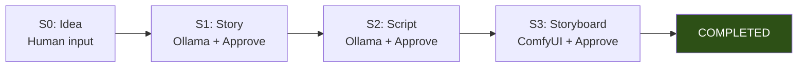

# AIMPOS-Spark Visual — MVP Scope Freeze

**Document Type:** Scope Contract & Change Control  
**Version:** 1.0  
**Status:** FROZEN — Effective June 8, 2026  
**Codename:** `AIMPOS-Spark-Visual`  
**Authority:** Lead Architect + Product Owner  
**Parent Documents:**

- [MVP Definition.md](./MVP%20Definition.md)
- [GitHub Issues - Visual MVP.md](./GitHub%20Issues%20-%20Visual%20MVP.md)
- [Business Capabilities.md](./Business%20Capabilities.md)
- [Repository Structure.md](./Repository%20Structure.md)

---

## Scope Freeze Declaration

This document **freezes** the MVP to a single deliverable:

> **Idea → Story → Script → Storyboard**  
> Local AI only (Ollama + ComfyUI) · One project · One scene · One creator · Human approval at every stage.

**Pipeline completes** when the creator **approves all storyboard frames**. Status = `COMPLETED`.

No feature, capability, technology, or user story outside this document may be added to the MVP backlog **without a formal scope change** (see [§ Change Control](#change-control)).

**Supersedes:** [MVP Definition.md](./MVP%20Definition.md) §2.1 pipeline line that includes Short Video as in-scope. Video and all downstream capabilities are **Deferred** under this freeze.

---

## Table of Contents

1. [Frozen Pipeline](#1-frozen-pipeline)
2. [Classification Legend](#2-classification-legend)
3. [MVP Features (F-01–F-16)](#3-mvp-features-f-01f-16)
4. [Business Capabilities (78)](#4-business-capabilities-78)
5. [Technology & Architecture](#5-technology--architecture)
6. [Agents & AI Scope](#6-agents--ai-scope)
7. [User Interface & Experience](#7-user-interface--experience)
8. [Success Criteria (Frozen)](#8-success-criteria-frozen)
9. [Explicitly Out of Scope](#9-explicitly-out-of-scope)
10. [Scope Creep Traps](#10-scope-creep-traps)
11. [Change Control](#11-change-control)

---

## 1. Frozen Pipeline

### 1.1 In scope — four stages only

| Stage | Human action | Local AI | Output asset | Approval gate |
|-------|--------------|----------|--------------|---------------|
| **S0: Idea** | Title + paragraph + optional style | None | `idea.txt` | — |
| **S1: Story** | View, edit, approve / reject / regenerate | Story Architect (Ollama) | `story.md` | Gate 1 |
| **S2: Script** | View, approve / reject / regenerate | Screenwriter (Ollama) | `script.fountain` (1 scene) | Gate 2 |
| **S3: Storyboard** | Gallery approve-all / reject / regenerate | Cinematography (Ollama plan + ComfyUI) | `frame_*.png` (4–6) | Gate 3 → **COMPLETED** |

### 1.2 Frozen constraints

| Dimension | Frozen value | Not negotiable in MVP |
|-----------|--------------|------------------------|
| Projects | 1 pre-seeded project | Multi-project |
| Scenes | 1 scene per script | Multi-scene breakdown |
| Users | 1 creator role | RBAC, teams, vendors |
| Workflow | 1 linear Temporal workflow | Branching, parallel stages |
| Approvals | 3 gates (story, script, storyboard) | Quorum, multi-approver |
| Inference | 100% local (Ollama + ComfyUI) | Cloud API, GPU burst |
| Video | **Out of scope** | Any motion output |
| Export ZIP | **Out of scope** | Bundle download |

---

## 2. Classification Legend

| Status | Meaning | Backlog rule |
|--------|---------|--------------|
| **Included** | Required for Visual MVP sign-off (US-V01) | May be implemented |
| **Deferred** | Approved for **next increment** (Spark Full / Phase 1) — not this freeze | Do not implement in Visual MVP |
| **Future** | Platform vision — Year 1+ | Do not discuss in sprint planning |

**Summary target:** Maximize **Included** count only for the four-stage path. Everything else is **Deferred** or **Future**.

---

## 3. MVP Features (F-01–F-16)

| ID | Feature | Status | Notes |
|----|---------|--------|-------|
| **F-01** | Create single project | **Included** | One seeded project only |
| **F-02** | Capture idea | **Included** | Title + paragraph + style note |
| **F-03** | Start production pipeline | **Included** | 4-stage workflow only |
| **F-04** | AI story generation | **Included** | Ollama Story Architect |
| **F-05** | Story review & approval | **Included** | Edit text, approve/reject |
| **F-06** | AI script generation | **Included** | 1 scene Fountain only |
| **F-07** | Script review & approval | **Included** | Fountain preview |
| **F-08** | AI storyboard generation | **Included** | 4–6 ComfyUI frames |
| **F-09** | Storyboard gallery review | **Included** | Approve-all → COMPLETED |
| **F-10** | AI short video generation | **Deferred** | Spark Full MVP |
| **F-11** | Video preview & approval | **Deferred** | Spark Full MVP |
| **F-12** | Asset version history | **Included** | List per stage; no merge/branch UI |
| **F-13** | Audit log viewer | **Included** | Table view; PostgreSQL only |
| **F-14** | Lineage summary | **Deferred** | P1 — simple chain optional; cut if behind |
| **F-15** | Export final bundle | **Deferred** | Spark Full MVP |
| **F-16** | Pipeline status dashboard | **Included** | 4-stage progress only |

**Included: 12 · Deferred: 4**

---

## 4. Business Capabilities (78)

All capabilities from [Business Capabilities.md](./Business%20Capabilities.md). Status applies to **AIMPOS-Spark-Visual** only.

### Domain 1 — Studio & Project Governance

| ID | Capability | Status | MVP slice (if Included) |
|----|------------|--------|-------------------------|
| 1.1 | Project Management | **Included** | Single pre-seeded project; no create/delete UI |
| 1.2 | Workspace & Tenancy Management | **Future** | — |
| 1.3 | Production Planning & Scheduling | **Future** | — |
| 1.4 | Budget & Resource Management | **Future** | — |
| 1.5 | Slate & Portfolio Management | **Future** | — |

### Domain 2 — Creative Development

| ID | Capability | Status | MVP slice (if Included) |
|----|------------|--------|-------------------------|
| 2.1 | Story Development | **Included** | AI treatment from idea; human edit + approve |
| 2.2 | Script Writing & Management | **Included** | 1-scene Fountain; human approve |
| 2.3 | Character Management | **Future** | — |
| 2.4 | World & Continuity Bible Management | **Future** | — |
| 2.5 | Writers' Room Collaboration | **Future** | — |
| 2.6 | Research & Reference Management | **Future** | — |

### Domain 3 — Pre-Production

| ID | Capability | Status | MVP slice (if Included) |
|----|------------|--------|-------------------------|
| 3.1 | Script Breakdown | **Deferred** | Spark Full — scene/shot breakdown |
| 3.2 | Shot List & Storyboard Management | **Included** | AI-generated frames only; no manual shot list editor |
| 3.3 | Pre-Visualization | **Deferred** | Tied to video stage |
| 3.4 | Production Design Management | **Future** | — |
| 3.5 | Casting & Talent Management | **Future** | — |
| 3.6 | Location & Set Management | **Future** | — |
| 3.7 | Production Calendar Management | **Future** | — |

### Domain 4 — Production (On-Set / Capture)

| ID | Capability | Status |
|----|------------|--------|
| 4.1 | Dailies Management | **Future** |
| 4.2 | On-Set Media Ingest | **Future** |
| 4.3 | Production Reporting | **Future** |
| 4.4 | On-Set Continuity Tracking | **Future** |

### Domain 5 — Video Post-Production

| ID | Capability | Status |
|----|------------|--------|
| 5.1 | Editorial Management | **Future** |
| 5.2 | VFX Management | **Future** |
| 5.3 | Color Grading Pipeline | **Future** |
| 5.4 | Conform & Assembly | **Future** |
| 5.5 | Video Mastering & QC | **Future** |

### Domain 6 — Audio Post-Production

| ID | Capability | Status |
|----|------------|--------|
| 6.1 | Audio Production | **Future** |
| 6.2 | Dialogue & ADR Management | **Future** |
| 6.3 | Sound Design | **Future** |
| 6.4 | Music & Score Management | **Future** |
| 6.5 | Audio Mixing & Mastering | **Future** |
| 6.6 | Podcast & Audiobook Production | **Future** |

### Domain 7 — Asset Management

| ID | Capability | Status | MVP slice (if Included) |
|----|------------|--------|-------------------------|
| 7.1 | Asset Ingest & Cataloging | **Included** | Pipeline outputs only; content-addressable MinIO |
| 7.2 | Asset Version Control | **Included** | Version list per stage; view/download |
| 7.3 | Asset Lineage & Provenance | **Deferred** | PostgreSQL edges; UI optional (F-14) |
| 7.4 | Rights & Licensing Management | **Future** | — |
| 7.5 | Storage Tier & Lifecycle Management | **Deferred** | MinIO hot tier only in MVP |
| 7.6 | Cross-Project Asset Library | **Future** | — |
| 7.7 | Proxy & Transcode Management | **Future** | — |

### Domain 8 — AI & Intelligent Automation

| ID | Capability | Status | MVP slice (if Included) |
|----|------------|--------|-------------------------|
| 8.1 | AI Model Management | **Deferred** | Hardcoded model IDs in config |
| 8.2 | Model Routing & Selection | **Deferred** | No router; fixed Ollama + ComfyUI |
| 8.3 | Agent Orchestration | **Included** | Temporal workflow; 3 agents (partial roles) |
| 8.4 | Agent Memory & Context Management | **Deferred** | Prompt injection only; no memory store |
| 8.5 | Prompt & Instruction Management | **Included** | Version-controlled prompts in repo |
| 8.6 | AI Quality Evaluation | **Future** | Human is the critic |
| 8.7 | Generative Media Assistance | **Included** | Text + storyboard images only; no video/audio |

### Domain 9 — Workflow & Orchestration

| ID | Capability | Status | MVP slice (if Included) |
|----|------------|--------|-------------------------|
| 9.1 | Workflow Orchestration | **Included** | Single `SparkPipelineWorkflow` (4 stages) |
| 9.2 | Workflow Template Management | **Future** | — |
| 9.3 | Human-in-the-Loop Approval | **Included** | Approve / reject / regenerate per stage |
| 9.4 | Task & Work Queue Management | **Deferred** | Temporal internal queue only; no UI |
| 9.5 | SLA & Escalation Management | **Future** | — |

### Domain 10 — Compute & Rendering

| ID | Capability | Status | MVP slice (if Included) |
|----|------------|--------|-------------------------|
| 10.1 | Local Compute Scheduling | **Included** | GPU sequencing: Ollama before ComfyUI |
| 10.2 | GPU Burst Management | **Future** | — |
| 10.3 | Cluster & Capacity Management | **Future** | — |
| 10.4 | Compute Cost Attribution | **Future** | — |
| 10.5 | Rendering | **Deferred** | ComfyUI still images only; video rendering deferred |
| 10.6 | Render Farm Coordination | **Future** | — |

### Domain 11 — Governance, Risk & Compliance

| ID | Capability | Status | MVP slice (if Included) |
|----|------------|--------|-------------------------|
| 11.1 | Compliance Management | **Future** | — |
| 11.2 | Audit & Traceability | **Included** | Append-only `audit_events`; viewer UI |
| 11.3 | Data Classification & Privacy | **Future** | — |
| 11.4 | Consent & Talent Rights Management | **Future** | — |
| 11.5 | Policy Management | **Deferred** | Hardcoded local-only; no OPA |
| 11.6 | Scholarly & Content Authenticity Review | **Future** | — |
| 11.7 | AI Disclosure & Labeling | **Included** | `is_ai_generated` flag + UI badge on frames |

### Domain 12 — Identity & Access

| ID | Capability | Status | MVP slice (if Included) |
|----|------------|--------|-------------------------|
| 12.1 | Identity & Access Management | **Deferred** | Bearer API token only |
| 12.2 | Role-Based Workspace Experience | **Future** | — |
| 12.3 | Vendor & External Collaborator Access | **Future** | — |

### Domain 13 — Integration & Ecosystem

| ID | Capability | Status |
|----|------------|--------|
| 13.1 | Creative Tool Integration | **Future** |
| 13.2 | Distribution Platform Integration | **Future** |
| 13.3 | Enterprise System Integration | **Future** |
| 13.4 | Plugin & Extension Management | **Future** |

### Domain 14 — Release & Distribution

| ID | Capability | Status |
|----|------------|--------|
| 14.1 | Release Management | **Deferred** |
| 14.2 | Deliverables Specification Management | **Future** |
| 14.3 | Distribution Packaging | **Deferred** (export bundle) |
| 14.4 | Campaign & Variant Management | **Future** |
| 14.5 | Publication Gate Management | **Future** |

### Domain 15 — Media Vertical Extensions

| ID | Capability | Status |
|----|------------|--------|
| 15.1 | Feature Film Production | **Future** |
| 15.2 | Documentary Production | **Future** |
| 15.3 | TV Series Production | **Future** |
| 15.4 | Islamic Educational Content Production | **Future** |
| 15.5 | Marketing & Social Content Production | **Future** |
| 15.6 | Animation Production | **Future** |

### Domain 16 — Platform Operations & Insights

| ID | Capability | Status | MVP slice (if Included) |
|----|------------|--------|-------------------------|
| 16.1 | Production Analytics & Reporting | **Future** | — |
| 16.2 | Observability & Health Management | **Included** | `/health` + structured JSON logs |
| 16.3 | Disaster Recovery & Business Continuity | **Deferred** | Workflow durability (US-24) only |
| 16.4 | Knowledge & Template Marketplace | **Future** | — |

### 4.1 Capability summary

| Status | Count | % of 78 |
|--------|-------|---------|
| **Included** | 18 | 23% |
| **Deferred** | 14 | 18% |
| **Future** | 46 | 59% |

---

## 5. Technology & Architecture

| Component | Status | MVP implementation |
|-----------|--------|-------------------|
| FastAPI (single monolith) | **Included** | `api/` |
| Temporal workflow | **Included** | 4-stage `SparkPipelineWorkflow` |
| LangGraph (3 agents) | **Included** | Story, Script, Cinematography (storyboard only) |
| PostgreSQL | **Included** | System of record |
| MinIO | **Included** | Hot asset storage |
| Redis | **Included** | Minimal / cache-ready |
| Ollama | **Included** | Story + Script + planning |
| ComfyUI | **Included** | Storyboard images only |
| React web console | **Included** | 4 primary screens |
| Docker Compose | **Included** | Local + Olares lab |
| Helm / Olares K8s | **Deferred** | Phase 0.5 deploy |
| Neo4j knowledge graph | **Deferred** | PostgreSQL `lineage_edges` |
| LakeFS | **Deferred** | DB branch fields + MinIO paths |
| immudb | **Deferred** | PostgreSQL audit table |
| Keycloak | **Deferred** | API token |
| OPA policy engine | **Deferred** | Hardcoded rules |
| OpenTelemetry full stack | **Deferred** | Structured logs only |
| WebSocket notifications | **Deferred** | HTTP polling |
| Open WebUI | **Future** | Optional sidecar |
| vLLM | **Future** | — |
| Whisper | **Future** | — |
| GPU burst / cloud | **Future** | — |
| NAS warm/cold tiers | **Future** | — |

---

## 6. Agents & AI Scope

| Agent | Status | MVP role |
|-------|--------|----------|
| **Story Architect** | **Included** | S1: idea → `story.md` |
| **Screenwriter** | **Included** | S2: story → `script.fountain` (1 scene) |
| **Cinematography** | **Included** | S3: script → `frame_*.png` only |
| Producer Agent | **Future** | Temporal replaces |
| QA Agent | **Future** | Human critic |
| Compliance Critic | **Future** | — |
| Editor Agent | **Future** | — |
| Character Agent | **Future** | — |
| Scene Planner | **Deferred** | — |
| Audio Agent | **Future** | — |
| All other agents (Multi-Agent Architecture) | **Future** | — |

| AI behavior | Status |
|-------------|--------|
| Agents propose only | **Included** |
| Human approves every stage | **Included** |
| Manual regenerate (max 3/stage) | **Included** |
| Automated rework loops | **Deferred** |
| Multi-model routing | **Deferred** |
| Agent long-term memory | **Future** |
| Cloud inference | **Out of scope** |

---

## 7. User Interface & Experience

| Screen / UX | Status | Notes |
|-------------|--------|-------|
| Dashboard (idea + pipeline status) | **Included** | 4-stage stepper |
| Review — story mode | **Included** | Editable textarea |
| Review — script mode | **Included** | Fountain preview |
| Review — storyboard gallery | **Included** | Approve-all |
| Review — video player | **Deferred** | — |
| Assets (version history) | **Included** | Per-stage tabs |
| Audit log | **Included** | Table |
| Export / download bundle | **Deferred** | — |
| Lineage graph UI | **Deferred** | — |
| Settings / admin | **Future** | — |
| Mobile layout | **Future** | Desktop ≥768px |
| RTL / i18n | **Future** | English only |
| WebSocket live updates | **Deferred** | Poll every 5s |

---

## 8. Success Criteria (Frozen)

Adapted from MVP Definition §9. **Visual MVP passes when all Included criteria pass.**

| ID | Criterion | Frozen target | Status |
|----|-----------|---------------|--------|
| **SC-V01** | Complete pipeline | Idea → **approved storyboard** | **Included** |
| **SC-02** | Local inference | 100% — zero cloud API | **Included** |
| **SC-V03** | Human gates | **3/3** approvals recorded | **Included** |
| **SC-V04** | Asset versioning | ≥4 versioned assets per run | **Included** |
| **SC-05** | Audit completeness | 100% AI calls logged with `model_id` | **Included** |
| **SC-06** | Workflow durability | Resume after worker restart | **Included** |
| **SC-07** | Time to first story | < 5 min from idea submit | **Included** |
| **SC-08** | Creator comprehension | Non-engineer completes without docs | **Included** |
| SC-01 (video E2E) | — | **Deferred** | Spark Full |
| SC-11 (export integrity) | — | **Deferred** | Spark Full |
| SC-09–SC-12 | — | **Deferred** / **Future** | Nice-to-have |

**Sign-off issue:** US-V01 (Visual MVP demo acceptance validation).

---

## 9. Explicitly Out of Scope

The following are **not Deferred** — they are **out of scope** for the entire AIMPOS-Spark program unless the program charter changes:

| Item | Classification |
|------|----------------|
| Multi-tenant SaaS | **Future** |
| Studio operations (budget, slate, calendar) | **Future** |
| On-set production / dailies | **Future** |
| NLE integration (Resolve, Premiere) | **Future** |
| Distribution to platforms | **Future** |
| Feature-film scale (100+ scenes) | **Future** |
| Non-local / cloud-first AI | **Out of scope** (sovereignty principle) |

---

## 10. Scope Creep Traps

Common requests that **violate this freeze** — default answer is **no**:

| Request | Why it violates freeze | Correct response |
|---------|------------------------|------------------|
| "Add video generation" | S4 not in Visual MVP | Deferred → Spark Full backlog |
| "Export ZIP download" | F-15 Deferred | Spark Full |
| "Second project support" | 1.1 Included = single project | Future |
| "Multi-scene script" | 1 scene frozen | Deferred |
| "Neo4j lineage graph" | F-14 Deferred | Phase 1 |
| "Keycloak login" | 12.1 Deferred | Phase 1 |
| "WebSocket live status" | Deferred | Phase 1 |
| "Open WebUI in the app" | Future | Not in critical path |
| "Automated QA agent" | Future | Human is critic |
| "Per-frame storyboard approve" | F-09 = approve-all set | Discuss in change control only |
| "5th approval gate for video" | Video out of scope | Spark Full |
| "Slideshow video fallback" | Video Deferred | Spark Full |

**WIP rule:** If a GitHub issue is not in [GitHub Issues - Visual MVP.md](./GitHub%20Issues%20-%20Visual%20MVP.md) (43 issues), it is **out of freeze**.

---

## 11. Change Control

### 11.1 Change request process

1. Open a **Scope Change Request** (SCR) with: proposed addition, business justification, effort estimate, what is removed to compensate.  
2. Classify as **Included**, **Deferred**, or **Future**.  
3. Lead Architect + Product Owner must **both approve** in writing.  
4. Update this document version; bump **Version** and **Date**.  
5. Re-baseline [GitHub Issues - Visual MVP.md](./GitHub%20Issues%20-%20Visual%20MVP.md) only after SCR approval.

### 11.2 Pre-approved cuts (if behind schedule)

May remove without SCR:

| Cut | Feature / Issue |
|-----|-----------------|
| Lineage UI | F-14, US-20 |
| API token auth | US-25 |
| Regenerate limit UI polish | US-09 (keep API; simplify UX) |

May **not** cut without SCR:

| Protected | Reason |
|-----------|--------|
| US-02, US-06 | Platform + GPU proof |
| US-07, US-08 | Workflow + human gates |
| US-12, US-14, US-16 | Core AI pipeline |
| US-17 | Terminal approval |
| US-V01 | Sign-off |

### 11.3 Version history

| Version | Date | Change | Approved by |
|---------|------|--------|-------------|
| **1.0** | 2026-06-08 | Initial freeze: Idea → Story → Script → Storyboard only. Video and export Deferred. | _Pending sign-off_ |
| **1.1** | 2026-06-09 | SCR-2026-001 (D-31): gate retiming — S1-SW + M1-DV; no scope cut; US-06/EPIC-01 remain required | PO + Lead Architect (in principle) |

### 11.4 Sign-off

| Role | Name | Date | Signature |
|------|------|------|-----------|
| Product Owner | | | |
| Lead Architect | | | |
| Solo Founder / Engineering | | | |

---

## Document Control

| Field | Value |
|-------|-------|
| Document ID | AIMPOS-SCOPE-FREEZE-001 |
| Effective date | June 8, 2026 |
| Next review | Upon Visual MVP sign-off (US-V01) or SCR |
| Related backlog | 43 issues — [GitHub Issues - Visual MVP.md](./GitHub%20Issues%20-%20Visual%20MVP.md) |

*This document is the scope contract for AIMPOS-Spark-Visual. When in conflict with informal discussion, email, or chat, **this document wins**.*

*End of document*
