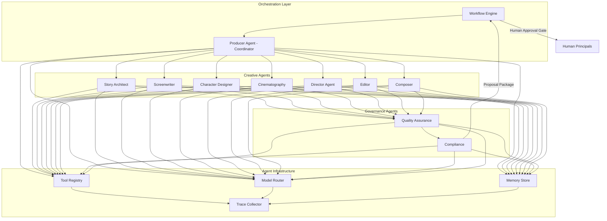
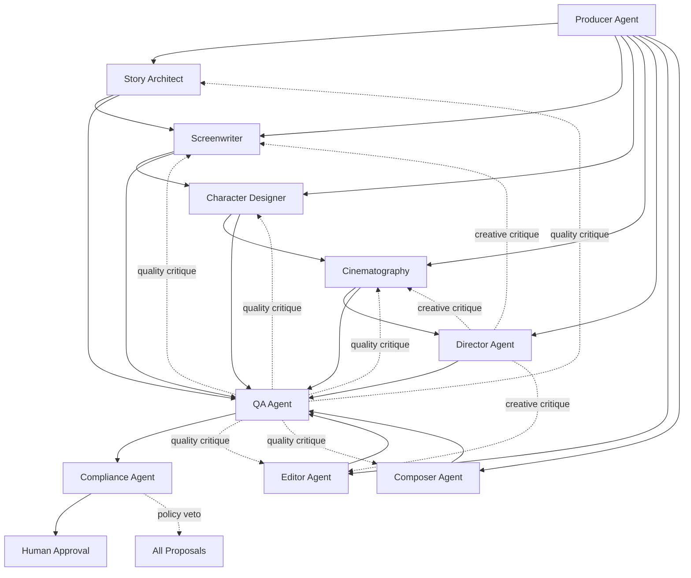
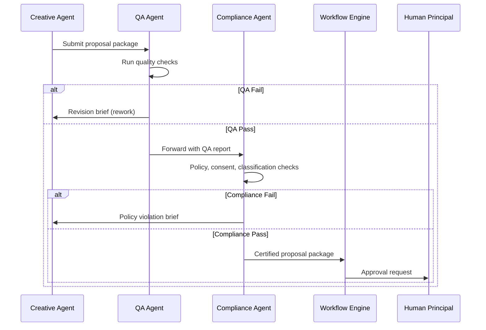
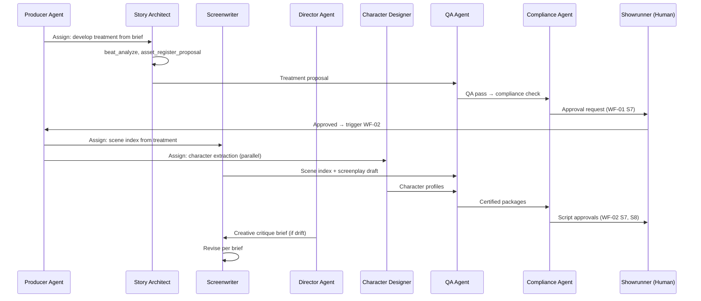
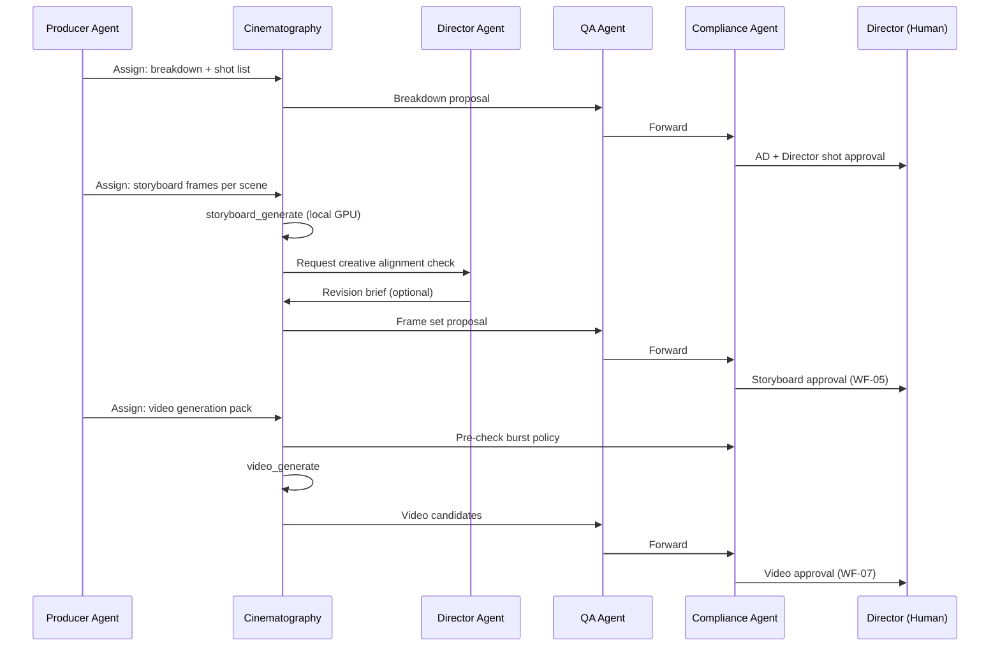
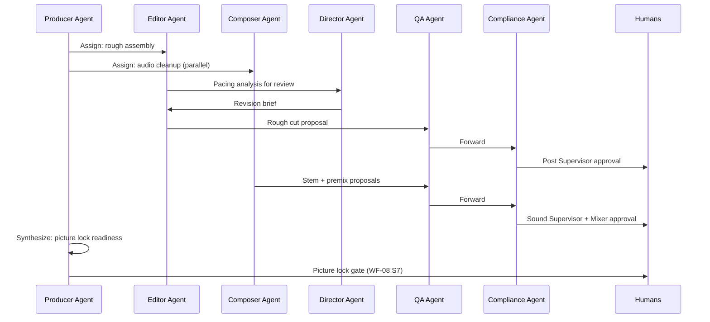
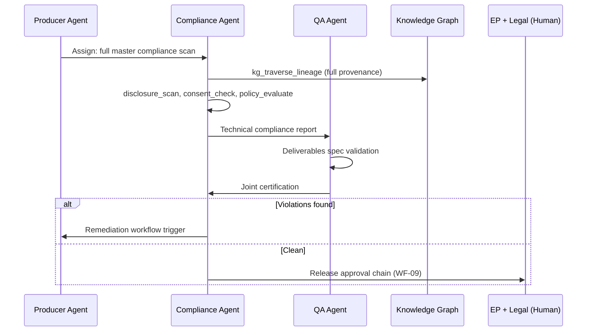
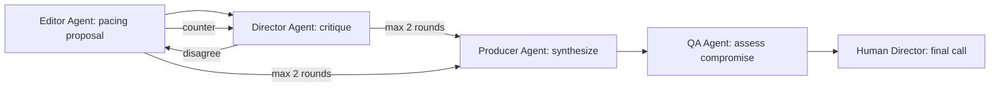
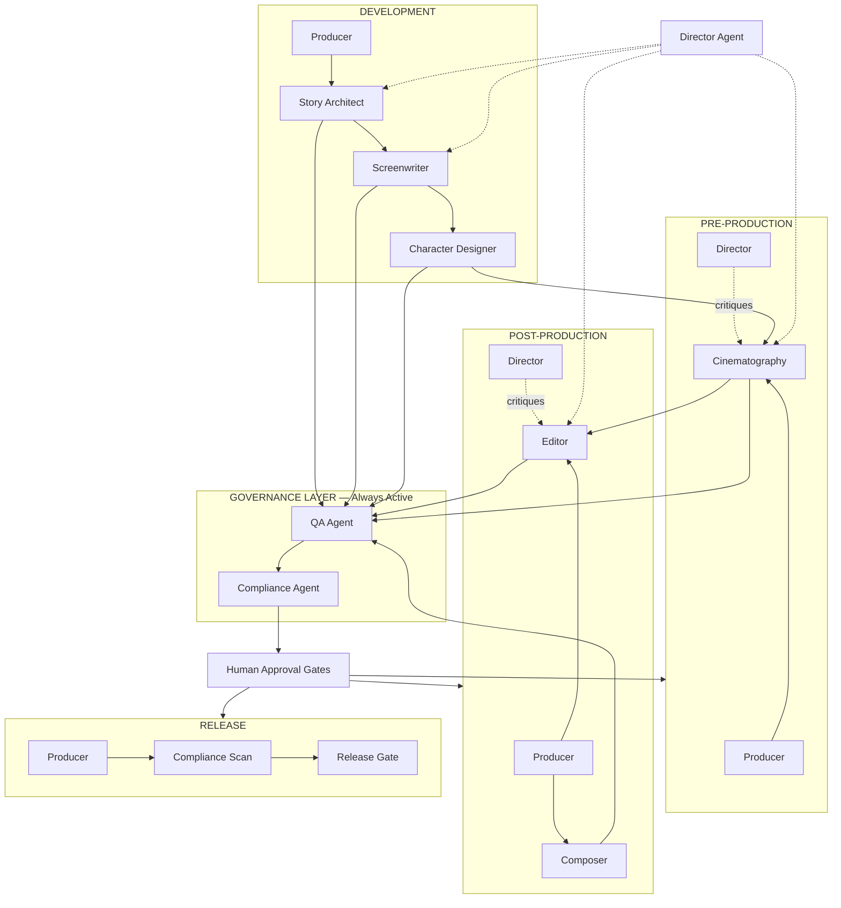

# AIMPOS — Multi-Agent Architecture

**Document Type:** Agentic Intelligence Architecture  
**Version:** 1.0  
**Status:** READ-ONLY REFERENCE — Frozen June 9, 2026. Implement 3 agents only (Story, Script, Cinematography).
**Date:** June 8, 2026  
**Parent Documents:**

- [Domain Driven Design.md](./Domain%20Driven%20Design.md)
- [Workflow Architecture.md](./Workflow%20Architecture.md)
- [Enterprise Knowledge Graph.md](./Enterprise%20Knowledge%20Graph.md)
- [Blueprint for a multi-year initiative.md](./Blueprint%20for%20a%20multi-year%20initiative.md)

---

## Table of Contents

1. [Architecture Overview](#1-architecture-overview)
2. [Agent Topology](#2-agent-topology)
3. [Collaboration Patterns](#3-collaboration-patterns)
4. [Shared Agent Infrastructure](#4-shared-agent-infrastructure)
5. [Agent Registry](#5-agent-registry)
6. [Producer Agent](#agent-01-producer-agent)
7. [Director Agent](#agent-02-director-agent)
8. [Story Architect Agent](#agent-03-story-architect-agent)
9. [Screenwriter Agent](#agent-04-screenwriter-agent)
10. [Character Designer Agent](#agent-05-character-designer-agent)
11. [Cinematography Agent](#agent-06-cinematography-agent)
12. [Editor Agent](#agent-07-editor-agent)
13. [Composer Agent](#agent-08-composer-agent)
14. [Compliance Agent](#agent-09-compliance-agent)
15. [Quality Assurance Agent](#agent-10-quality-assurance-agent)
16. [Collaboration Scenarios](#16-collaboration-scenarios)
17. [Orchestration & Handoff Protocol](#17-orchestration--handoff-protocol)
18. [Guardrails & Budgets](#18-guardrails--budgets)

---

## 1. Architecture Overview

AIMPOS agents are **bounded specialists** operating inside governed workflows. They plan, execute tools, and produce **proposals** — never final production truth. A **Producer Agent** acts as orchestration coordinator; **Compliance** and **Quality Assurance** agents form a mandatory critic layer before human approval.

### 1.1 Design Principles

| Principle | Rule |
|-----------|------|
| **Propose, never publish** | All agent outputs land on `ai-draft` branches |
| **Tool-gated actions** | Irreversible tools require pre-authorized workflow step |
| **Critic before human** | QA + Compliance review agent proposals before approval queue |
| **Scoped memory** | Memory is project-bound; no cross-project leakage |
| **Local-first models** | Default inference on Olares; burst requires Compliance clearance |
| **Full traceability** | Every tool call, model, and prompt recorded in `AgentTrace` |
| **Human authority** | Agents may recommend approval; only humans (or delegated principals) grant it |

### 1.2 System Diagram



### 1.3 Agent Role Matrix

| Agent | Role Class | Autonomy Level | Primary Phase | Workflow Affinity |
|-------|------------|----------------|---------------|-------------------|
| Producer Agent | **Orchestrator** | `EXECUTE_WITH_APPROVAL` | All | All WFs — coordination |
| Director Agent | **Creative Authority** | `PROPOSE` | Dev → Post | WF-01, 02, 04, 05, 07, 08 |
| Story Architect Agent | **Specialist** | `PROPOSE` | Development | WF-01, WF-02 |
| Screenwriter Agent | **Specialist** | `PROPOSE` | Development | WF-01, WF-02 |
| Character Designer Agent | **Specialist** | `PROPOSE` | Dev → Pre | WF-03 |
| Cinematography Agent | **Specialist** | `PROPOSE` | Pre-Production | WF-04, WF-05, WF-07 |
| Editor Agent | **Specialist** | `PROPOSE` | Post | WF-08 |
| Composer Agent | **Specialist** | `PROPOSE` | Post | WF-06 |
| Compliance Agent | **Critic / Gate** | `SUGGEST_ONLY` | All | All WFs — pre-approval |
| Quality Assurance Agent | **Critic** | `SUGGEST_ONLY` | All | All WFs — pre-approval |

---

## 2. Agent Topology

### 2.1 Three-Tier Agent Model

```
TIER 1 — ORCHESTRATION
  Producer Agent          → task decomposition, agent assignment, budget allocation

TIER 2 — CREATIVE EXECUTION
  Story Architect         → narrative structure
  Screenwriter            → script content
  Character Designer      → character profiles & visual identity
  Cinematography          → shots, boards, visual generation briefs
  Director Agent          → creative coherence & vision alignment
  Editor                  → editorial structure & pacing
  Composer                → audio & music proposals

TIER 3 — GOVERNANCE CRITICS
  Quality Assurance       → quality, continuity, spec compliance
  Compliance              → policy, consent, rights, AI disclosure
```

### 2.2 Topology Diagram



---

## 3. Collaboration Patterns

### 3.1 Pattern Catalog

| Pattern | ID | Description | Agents Involved |
|---------|-----|-------------|-----------------|
| **Coordinator-Worker** | `P-01` | Producer decomposes task, assigns specialists | Producer → any specialist |
| **Sequential Pipeline** | `P-02` | Output of agent A becomes input of agent B | Story Architect → Screenwriter → Character Designer |
| **Creative Critique Loop** | `P-03` | Director reviews and sends revision briefs | Director ↔ Screenwriter, Cinematography, Editor |
| **Dual-Critic Gate** | `P-04` | QA then Compliance must pass before human | QA → Compliance → Human |
| **Debate Panel** | `P-05` | Two agents argue; Producer synthesizes | Director vs Editor on pacing |
| **Parallel Fan-Out** | `P-06` | Producer assigns independent parallel tasks | Character Designer ∥ Cinematography (after script lock) |
| **Join & Synthesize** | `P-07` | Producer waits for parallel completions | Join before Storyboarding |
| **Compliance Veto** | `P-08` | Compliance blocks proposal; routes rework | Compliance → originating agent |
| **Human Escalation** | `P-09` | Low confidence or critic disagreement | Any → Human principal |

### 3.2 Dual-Critic Gate (Mandatory)

Every creative agent proposal **must** pass this sequence before entering the human approval queue:



### 3.3 Confidence Routing

| Combined Confidence | Route |
|--------------------|-------|
| ≥ 0.85 (QA + specialist) | Standard human approval queue |
| 0.60 – 0.84 | Flagged review — additional context attached |
| < 0.60 | Auto-rework to originating agent (max 3) then human escalation |
| Compliance veto (any) | Immediate rework regardless of confidence |

---

## 4. Shared Agent Infrastructure

### 4.1 Tool Registry (Shared)

| Tool Category | Tools Available to Agents |
|---------------|--------------------------|
| **Knowledge** | `kg_query`, `kg_traverse_lineage`, `kg_impact_analysis` |
| **Assets** | `asset_search`, `asset_read_metadata`, `asset_register_proposal`, `asset_read_version` |
| **Creative** | `script_parse`, `scene_extract`, `beat_analyze`, `continuity_check` |
| **Visual** | `storyboard_generate`, `image_generate`, `video_generate`, `style_match_score` |
| **Audio** | `audio_analyze`, `noise_reduce_propose`, `loudness_measure`, `music_mood_match` |
| **Editorial** | `edit_analyze`, `assembly_suggest`, `timecode_validate` |
| **Planning** | `schedule_query`, `budget_check`, `breakdown_generate` |
| **Compliance** | `policy_evaluate`, `consent_check`, `classification_verify`, `disclosure_scan` |
| **Workflow** | `workflow_status`, `approval_submit`, `task_update` *(Compliance/Producer only)* |

### 4.2 Memory Scopes

| Scope ID | Boundary | TTL | Agents |
|----------|----------|-----|--------|
| `MEM-PROJECT` | Single project | Project lifetime + 90d | All |
| `MEM-WORKFLOW` | Single workflow instance | Instance lifetime | All |
| `MEM-AGENT` | Agent's own task history | 30 days | Per agent |
| `MEM-CREATIVE` | Creative bible, style, tone | Project lifetime | Story, Screenwriter, Director, Character |
| `MEM-VISUAL` | Style refs, color palette, lens choices | Project lifetime | Cinematography, Director |
| `MEM-AUDIO` | Stem map, loudness targets, music refs | Project lifetime | Composer |
| `MEM-COMPLIANCE` | Policy decisions, consent map | Project lifetime + 7yr | Compliance |
| `MEM-SESSION` | Single agent run | Run duration only | All (ephemeral) |

### 4.3 Model Routing Tiers

| Tier | Use Case | Default Backend | Burst Eligible |
|------|----------|---------------|----------------|
| `T1-REASONING` | Planning, critique, compliance | Local LLM 13B–70B | Yes (policy) |
| `T2-WRITING` | Script, dialogue, narration | Local LLM 13B+ | Yes (policy) |
| `T3-VISION-LLM` | Image understanding, board review | Local VLM | Yes |
| `T4-DIFFUSION` | Storyboards, frames, concept art | Local ComfyUI / SD | Yes |
| `T5-VIDEO` | Previz, generated video | Local video model | Yes (approval) |
| `T6-AUDIO-ASR` | Transcription, alignment | Local Whisper | No |
| `T7-AUDIO-GEN` | Music/SFX proposals | Local audio model | Yes |
| `T8-EMBEDDING` | Semantic search, similarity | Local embedding model | No |

---

## 5. Agent Registry

| ID | Agent | Code | Tier | Critic |
|----|-------|------|------|--------|
| A-01 | Producer Agent | `agent.producer` | 1 | No |
| A-02 | Director Agent | `agent.director` | 2 | No |
| A-03 | Story Architect Agent | `agent.story_architect` | 2 | No |
| A-04 | Screenwriter Agent | `agent.screenwriter` | 2 | No |
| A-05 | Character Designer Agent | `agent.character_designer` | 2 | No |
| A-06 | Cinematography Agent | `agent.cinematography` | 2 | No |
| A-07 | Editor Agent | `agent.editor` | 2 | No |
| A-08 | Composer Agent | `agent.composer` | 2 | No |
| A-09 | Compliance Agent | `agent.compliance` | 3 | Yes |
| A-10 | Quality Assurance Agent | `agent.qa` | 3 | Yes |

---

## Agent 01: Producer Agent

**Code:** `agent.producer`  
**Role:** Orchestration coordinator — the only agent authorized to assign tasks to other agents within a workflow instance.

### Goals

| ID | Goal |
|----|------|
| G-01 | Decompose workflow stages into agent task packages with clear inputs and success criteria |
| G-02 | Assign tasks to appropriate specialist agents based on phase, media type, and budget |
| G-03 | Monitor agent task progress, budgets, and SLA adherence |
| G-04 | Synthesize multi-agent outputs into unified proposal packages for critic review |
| G-05 | Escalate blockers, budget overruns, and critic disagreements to human producers |
| G-06 | Maintain production schedule awareness and flag downstream impacts |

### Tools

| Tool | Purpose |
|------|---------|
| `workflow_status` | Read workflow instance state and pending gates |
| `task_assign` | Create AgentTask for specialist agents |
| `task_monitor` | Poll task status and budgets |
| `budget_check` | Verify GPU/token budget before assignment |
| `schedule_query` | Read production calendar and milestones |
| `kg_query` | Query project entity graph for context |
| `agent_synthesize` | Merge multi-agent outputs into proposal package |
| `escalation_raise` | Create human escalation task |
| `approval_submit` | Submit certified packages to workflow *(post-critic only)* |

### Inputs

| Input | Source |
|-------|--------|
| Workflow instance ID and current step | Workflow Engine |
| Project metadata, phase, media type | Studio / Project context |
| Production schedule and milestones | Planning context |
| Budget envelope and spend-to-date | Budget ledger |
| Prior stage outputs and versions | Asset & Provenance |
| Critic reports (QA, Compliance) | Governance agents |
| Human revision briefs | Approval rejections |

### Outputs

| Output | Destination |
|--------|-------------|
| Agent task assignments | Specialist agents |
| Task decomposition plans | Audit log, workflow trace |
| Synthesized proposal packages | QA Agent (via critic pipeline) |
| Escalation reports | Human Executive Producer |
| Schedule impact alerts | Planning, human producer |
| Production status summaries | Executive dashboard |

### Memory Requirements

| Scope | Content Retained |
|-------|------------------|
| `MEM-PROJECT` | Project charter, phase history, key decisions summary |
| `MEM-WORKFLOW` | Active task map, assignment history, iteration counts |
| `MEM-AGENT` | Specialist performance metrics, rework frequency |
| `MEM-SESSION` | Current decomposition plan, pending assignments |

**Retention:** Project lifetime. Summarize and compress after each phase completion.

### Model Requirements

| Capability | Tier | Min Spec | Notes |
|------------|------|----------|-------|
| Reasoning / planning | T1-REASONING | 13B+ local LLM | Strong tool-use and JSON planning |
| Scheduling logic | T1-REASONING | Same or rules engine hybrid | Deterministic rules preferred for dates |
| Embedding search | T8-EMBEDDING | Local | Project context retrieval |

**No diffusion, video, or audio generation models required.**

### Human Approval Points

| Point | Human Principal | Trigger |
|-------|-----------------|---------|
| AP-P01 | Executive Producer | Agent task plan for new phase (optional review) |
| AP-P02 | Executive Producer | Budget overrun escalation |
| AP-P03 | Executive Producer | Specialist agent disagreement unresolved after debate |
| AP-P04 | Line Producer | Schedule change recommendation affecting shoot dates |

*Producer Agent does not approve creative outputs — it routes to critics then humans.*

---

## Agent 02: Director Agent

**Code:** `agent.director`  
**Role:** Creative vision guardian — ensures coherence across story, visual, and editorial proposals.

### Goals

| ID | Goal |
|----|------|
| G-01 | Maintain and enforce the creative vision across all agent proposals |
| G-02 | Critique story, script, visual, and editorial outputs for tone and intent alignment |
| G-03 | Produce revision briefs when creative direction drifts |
| G-04 | Validate shot coverage and storyboard composition against directorial intent |
| G-05 | Assess editorial pacing and emotional arc in cut proposals |
| G-06 | Provide creative sign-off recommendations (advisory) to human director |

### Tools

| Tool | Purpose |
|------|---------|
| `script_parse` | Read and analyze script structure |
| `beat_analyze` | Evaluate emotional beats and pacing |
| `continuity_check` | Verify creative continuity |
| `storyboard_generate` | *(review only — not primary generator)* |
| `style_match_score` | Score visual proposals against style bible |
| `edit_analyze` | Analyze cut pacing and rhythm |
| `kg_traverse_lineage` | Trace creative decisions across versions |
| `asset_read_version` | Review proposed assets |
| `creative_brief_write` | Produce revision briefs for specialists |

### Inputs

| Input | Source |
|-------|--------|
| Creative brief and director's notes | Human director / project |
| Style bible, mood boards | Asset & Provenance |
| Story, script, shot list, storyboard versions | Specialist agent outputs |
| Edit versions and assembly proposals | Editor Agent |
| QA quality report | QA Agent |
| Human director annotations | Approval feedback |

### Outputs

| Output | Destination |
|--------|-------------|
| Creative critique reports | Originating specialist agents |
| Revision briefs | Screenwriter, Cinematography, Editor |
| Creative alignment scores | QA Agent, proposal package |
| Advisory sign-off recommendation | Human director approval queue |
| Vision coherence summary | Producer Agent |

### Memory Requirements

| Scope | Content Retained |
|-------|------------------|
| `MEM-CREATIVE` | Director's vision statement, tone pillars, reference films |
| `MEM-VISUAL` | Approved style bible, color palette, lens language |
| `MEM-PROJECT` | Key creative decisions log |
| `MEM-AGENT` | Critique history per specialist |

**Retention:** Project lifetime. Updated when human director provides new notes.

### Model Requirements

| Capability | Tier | Min Spec |
|------------|------|----------|
| Creative reasoning | T1-REASONING | 13B+ (prefer 70B for nuance) |
| Visual understanding | T3-VISION-LLM | Local VLM for board/frame review |
| Embedding similarity | T8-EMBEDDING | Style match scoring |

### Human Approval Points

| Point | Human Principal | Trigger |
|-------|-----------------|---------|
| AP-D01 | **Director (human)** | Story treatment alignment review — WF-01 |
| AP-D02 | **Director (human)** | Script creative review — WF-02 S8 |
| AP-D03 | **Director (human)** | Shot list approval — WF-04 S6 |
| AP-D04 | **Director (human)** | Storyboard frame approval — WF-05 S5 |
| AP-D05 | **Director (human)** | Generated video approval — WF-07 S6 |
| AP-D06 | **Director (human)** | Fine cut approval — WF-08 S5 |

*Director Agent recommendations are advisory; human director decisions are binding.*

---

## Agent 03: Story Architect Agent

**Code:** `agent.story_architect`  
**Role:** Narrative structure specialist — treatments, outlines, beat sheets, act structure.

### Goals

| ID | Goal |
|----|------|
| G-01 | Develop story structure from creative brief (acts, beats, arcs) |
| G-02 | Produce treatments and outlines aligned to genre and market constraints |
| G-03 | Ensure narrative coherence before scripting begins |
| G-04 | Map character arcs to structural beats |
| G-05 | Adapt story structure across formats (film → series → podcast) |
| G-06 | Flag structural weaknesses for human showrunner review |

### Tools

| Tool | Purpose |
|------|---------|
| `beat_analyze` | Generate and validate beat sheets |
| `script_parse` | *(for adaptation)* Parse existing material |
| `kg_query` | Research references, prior franchise stories |
| `asset_register_proposal` | Register treatment/outline versions |
| `asset_search` | Find reference materials |
| `continuity_check` | Validate arc completeness |

### Inputs

| Input | Source |
|-------|--------|
| Creative brief, genre constraints | Project / WF-01 S1 |
| Research reference pack | WF-01 S2 |
| Continuity bible (if sequel/series) | Project |
| Showrunner notes | Human feedback |
| Director creative brief | Director Agent |
| QA structural critique | QA Agent (rework) |

### Outputs

| Output | Destination |
|--------|-------------|
| Treatment / outline (`ai-draft`) | Asset & Provenance |
| Beat sheet | Asset & Provenance |
| Story structure report | Producer Agent, QA Agent |
| Character arc map (draft) | Character Designer Agent |
| Structural risk flags | Producer Agent, human showrunner |

### Memory Requirements

| Scope | Content Retained |
|-------|------------------|
| `MEM-CREATIVE` | Genre rules, act structure template, franchise canon |
| `MEM-PROJECT` | Brief, prior treatment iterations, rejection rationales |
| `MEM-WORKFLOW` | Current structure draft state |
| `MEM-SESSION` | Active outline workspace |

### Model Requirements

| Capability | Tier | Min Spec |
|------------|------|----------|
| Narrative reasoning | T1-REASONING | 13B+ local LLM |
| Long-context writing | T2-WRITING | 32K+ context preferred |
| Embedding retrieval | T8-EMBEDDING | Reference matching |

### Human Approval Points

| Point | Human Principal | Trigger |
|-------|-----------------|---------|
| AP-SA01 | **Showrunner / EP** | Treatment approval — WF-01 S7 |
| AP-SA02 | **Showrunner** | Beat sheet sign-off before script generation — WF-02 entry |

---

## Agent 04: Screenwriter Agent

**Code:** `agent.screenwriter`  
**Role:** Script content specialist — scenes, dialogue, sluglines, narration.

### Goals

| ID | Goal |
|----|------|
| G-01 | Draft scene lists and sluglines from approved outline |
| G-02 | Write screenplay dialogue and action lines in standard format |
| G-03 | Maintain character voice consistency across scenes |
| G-04 | Revise scripts per writers' room and director feedback |
| G-05 | Produce narration scripts for documentary, podcast, education formats |
| G-06 | Annotate script changes for version comparison |

### Tools

| Tool | Purpose |
|------|---------|
| `script_parse` | Parse and validate screenplay format |
| `scene_extract` | Generate scene index from outline |
| `beat_analyze` | Map scenes to beats |
| `continuity_check` | Dialogue and character consistency |
| `asset_register_proposal` | Register script versions |
| `asset_read_version` | Read prior script iterations |
| `kg_query` | Character and scene graph queries |

### Inputs

| Input | Source |
|-------|--------|
| Approved treatment / beat sheet | Story Architect output |
| Character profiles | Character Designer Agent |
| Writers' room notes | Human / WF-02 S6 |
| Director revision brief | Director Agent |
| Script formatting standards | Project config |
| QA dialogue critique | QA Agent (rework) |

### Outputs

| Output | Destination |
|--------|-------------|
| Scene index (`ai-draft`) | Asset & Provenance — WF-02 S2 |
| Screenplay draft (`ai-draft`) | Asset & Provenance — WF-02 S4 |
| Narration script (`ai-draft`) | Podcast / education workflows |
| Dialogue consistency report | QA Agent |
| Revision changelog | Audit log, writers' room |

### Memory Requirements

| Scope | Content Retained |
|-------|------------------|
| `MEM-CREATIVE` | Character voice guide, tone, banned phrases, vocabulary level |
| `MEM-PROJECT` | Approved outline, prior script versions summary |
| `MEM-AGENT` | Scene-level revision history |
| `MEM-SESSION` | Active draft scenes |

**Critical:** Character voice patterns updated after each human edit pass.

### Model Requirements

| Capability | Tier | Min Spec |
|------------|------|----------|
| Screenplay writing | T2-WRITING | 13B+ with format fine-tune or strong prompting |
| Dialogue consistency | T1-REASONING | Character voice checking |
| Format validation | Rule engine + T2 | Fountain/Final Draft schema |
| Long context | T2-WRITING | Full script in context (32K–128K) |

### Human Approval Points

| Point | Human Principal | Trigger |
|-------|-----------------|---------|
| AP-SW01 | **Lead Writer** | Script writer review — WF-02 S7 |
| AP-SW02 | **Director (human)** | Script director review — WF-02 S8 |
| AP-SW03 | **Showrunner** | Narration script approval (non-fiction verticals) |

---

## Agent 05: Character Designer Agent

**Code:** `agent.character_designer`  
**Role:** Character identity specialist — profiles, arcs, visual references, casting linkage.

### Goals

| ID | Goal |
|----|------|
| G-01 | Extract characters from script and build registry |
| G-02 | Develop character profiles, backstory, and arc summaries |
| G-03 | Propose visual identity references (concept, wardrobe direction) |
| G-04 | Maintain character consistency across scenes and generated media |
| G-05 | Link characters to actor casting and consent records |
| G-06 | Flag likeness/consent issues before visual generation |

### Tools

| Tool | Purpose |
|------|---------|
| `script_parse` | Extract speaking and featured roles |
| `scene_extract` | Map character scene appearances |
| `continuity_check` | Arc and appearance consistency |
| `image_generate` | Character concept proposals |
| `style_match_score` | Visual consistency scoring |
| `consent_check` | Verify likeness permissions |
| `asset_register_proposal` | Register profiles and concept art |
| `kg_query` | Character graph traversal |

### Inputs

| Input | Source |
|-------|--------|
| Locked or draft script | Screenwriter Agent |
| Story architect arc map | Story Architect Agent |
| Style bible | Project assets |
| Casting decisions | Human casting / WF-03 |
| Actor consent records | Compliance context |
| Director character notes | Director Agent |

### Outputs

| Output | Destination |
|--------|-------------|
| Character registry (`ai-draft`) | Knowledge graph — WF-03 S1 |
| Character profiles (`ai-draft`) | Asset & Provenance — WF-03 S3 |
| Concept art proposals (`ai-draft`) | Asset & Provenance |
| Consistency score report | QA Agent |
| Casting linkage recommendations | Human casting director |

### Memory Requirements

| Scope | Content Retained |
|-------|------------------|
| `MEM-CREATIVE` | Character bible, relationship map, arc states |
| `MEM-VISUAL` | Approved concept art, wardrobe palette per character |
| `MEM-PROJECT` | Casting status, consent flags |
| `MEM-AGENT` | Per-character revision history |

### Model Requirements

| Capability | Tier | Min Spec |
|------------|------|----------|
| Character analysis | T1-REASONING | 13B+ LLM |
| Concept art generation | T4-DIFFUSION | Local SD/Flux + character LoRA |
| Visual consistency | T3-VISION-LLM + T8 | Embedding similarity |
| Consent rule check | Rules + T1 | Compliance integration |

### Human Approval Points

| Point | Human Principal | Trigger |
|-------|-----------------|---------|
| AP-CD01 | **Showrunner** | Character profile approval — WF-03 S6 |
| AP-CD02 | **Casting Director** | Visual identity sign-off before storyboard |
| AP-CD03 | **Legal / Compliance** | Likeness consent verification for AI-generated character art |

---

## Agent 06: Cinematography Agent

**Code:** `agent.cinematography`  
**Role:** Visual planning specialist — breakdowns, shot lists, storyboards, video generation briefs.

### Goals

| ID | Goal |
|----|------|
| G-01 | Generate script breakdowns (scenes, elements, VFX tags) |
| G-02 | Draft shot lists with coverage mapping per scene |
| G-03 | Produce storyboard frame proposals aligned to shot list |
| G-04 | Prepare video generation control packs (prompts, refs, camera notes) |
| G-05 | Score visual proposals for style and coverage compliance |
| G-06 | Coordinate with Director Agent on visual language consistency |

### Tools

| Tool | Purpose |
|------|---------|
| `breakdown_generate` | Script breakdown sheets |
| `scene_extract` | Scene element tagging |
| `storyboard_generate` | Frame generation via ComfyUI |
| `image_generate` | Concept frames |
| `video_generate` | Previz/video candidates |
| `style_match_score` | Visual consistency |
| `schedule_query` | Shoot day mapping |
| `asset_register_proposal` | Register shots, boards, video |
| `budget_check` | GPU budget before generation |

### Inputs

| Input | Source |
|-------|--------|
| Locked script | WF-02 output |
| Character visual refs | Character Designer Agent |
| Location registry | Pre-production |
| Shot list standards | Project config |
| Style bible, lens notes | Director Agent / MEM-VISUAL |
| Approved storyboard refs | Prior iterations |

### Outputs

| Output | Destination |
|--------|-------------|
| Breakdown sheet (`ai-draft`) | WF-04 S1 |
| Shot list (`ai-draft`) | WF-04 S3 |
| Storyboard frames (`ai-draft`) | WF-05 S2 |
| Video generation control pack | WF-07 S1 |
| Generated video candidates (`ai-draft`) | WF-07 S3 |
| Coverage gap report | QA Agent, AD human |

### Memory Requirements

| Scope | Content Retained |
|-------|------------------|
| `MEM-VISUAL` | Lens package, aspect ratio, color script, shot grammar |
| `MEM-PROJECT` | Location-scene map, approved boards |
| `MEM-WORKFLOW` | Per-scene generation state |
| `MEM-SESSION` | Active ComfyUI workflow refs |

### Model Requirements

| Capability | Tier | Min Spec |
|------------|------|----------|
| Breakdown reasoning | T1-REASONING | 13B+ LLM |
| Image generation | T4-DIFFUSION | ComfyUI pipeline on Olares GPU |
| Video generation | T5-VIDEO | Local video model; burst for 4K+ |
| Visual QA scoring | T3-VISION-LLM | Frame composition analysis |
| Embedding | T8-EMBEDDING | Style reference matching |

### Human Approval Points

| Point | Human Principal | Trigger |
|-------|-----------------|---------|
| AP-CI01 | **1st AD** | Shot list logistics review — WF-04 S5 |
| AP-CI02 | **Director (human)** | Shot list creative approval — WF-04 S6 |
| AP-CI03 | **Director (human)** | Storyboard approval — WF-05 S5 |
| AP-CI04 | **Director / VFX Sup** | Generated video approval — WF-07 S6 |

---

## Agent 07: Editor Agent

**Code:** `agent.editor`  
**Role:** Editorial specialist — assembly suggestions, pacing analysis, cut proposals.

### Goals

| ID | Goal |
|----|------|
| G-01 | Propose rough assembly from dailies, proxies, and generated video |
| G-02 | Analyze pacing, rhythm, and scene transitions |
| G-03 | Flag continuity errors and missing coverage |
| G-04 | Incorporate director notes into cut revision proposals |
| G-05 | Prepare conform-ready EDL/XML metadata |
| G-06 | Support podcast/audiobook episode assembly suggestions |

### Tools

| Tool | Purpose |
|------|---------|
| `edit_analyze` | Timeline and pacing analysis |
| `assembly_suggest` | Automated assembly proposals |
| `timecode_validate` | Sync validation |
| `continuity_check` | Visual and dialogue continuity |
| `scene_extract` | Map script scenes to edit |
| `asset_read_version` | Read dailies, proxies, masters |
| `asset_register_proposal` | Register edit proposals |
| `audio_analyze` | Sync with audio stems |

### Inputs

| Input | Source |
|-------|--------|
| Dailies and proxies | WF-08 S1 |
| Locked script | Production |
| Approved generated video | WF-07 output |
| Director pacing notes | Director Agent |
| Circle take designations | Dailies management |
| QA continuity report | QA Agent (rework) |

### Outputs

| Output | Destination |
|--------|-------------|
| Assembly proposal (`ai-draft`) | WF-08 S2 |
| Pacing analysis report | Director Agent, QA Agent |
| Continuity issue list | Human editor, QA Agent |
| EDL/XML metadata proposal | NLE integration |
| Cut revision proposal (`ai-draft`) | WF-08 S4 rework |

### Memory Requirements

| Scope | Content Retained |
|-------|------------------|
| `MEM-PROJECT` | Script-to-scene map, take preferences |
| `MEM-WORKFLOW` | Edit version history, director note log |
| `MEM-AGENT` | Pacing benchmarks for genre |
| `MEM-SESSION` | Active timeline analysis state |

### Model Requirements

| Capability | Tier | Min Spec |
|------------|------|----------|
| Editorial reasoning | T1-REASONING | 13B+ LLM |
| Video understanding | T3-VISION-LLM | Scene content analysis |
| Assembly logic | T1 + rules | Deterministic where possible |
| Timecode/sync | Rule engine | SMPTE validation |

**No generative video models** — Editor works with existing footage.

### Human Approval Points

| Point | Human Principal | Trigger |
|-------|-----------------|---------|
| AP-ED01 | **Post Supervisor** | Rough cut approval — WF-08 S3 |
| AP-ED02 | **Director (human)** | Fine cut approval — WF-08 S5 |
| AP-ED03 | **Producer (human)** | Fine cut producer approval — WF-08 S6 |

---

## Agent 08: Composer Agent

**Code:** `agent.composer`  
**Role:** Audio specialist — cleanup proposals, sound design assists, music mood matching, mix prep.

### Goals

| ID | Goal |
|----|------|
| G-01 | Propose audio cleanup and alignment for production recordings |
| G-02 | Suggest sound design elements and Foley replacements |
| G-03 | Match music mood to scene emotion and director intent |
| G-04 | Analyze loudness and prepare premix recommendations |
| G-05 | Support podcast/audiobook chapter audio treatment |
| G-06 | Verify audio technical spec compliance before mix approval |

### Tools

| Tool | Purpose |
|------|---------|
| `audio_analyze` | Spectral, noise, dialogue isolation analysis |
| `noise_reduce_propose` | Cleanup parameter proposals |
| `loudness_measure` | LUFS / true peak measurement |
| `music_mood_match` | Scene-to-music mood mapping |
| `audio_generate` | SFX/music proposal generation |
| `timecode_validate` | A/V sync check |
| `asset_register_proposal` | Register stems, mixes |
| `consent_check` | Voice clone / talent audio rights |

### Inputs

| Input | Source |
|-------|--------|
| Production audio, stems | WF-06 S1 |
| Locked picture / edit ref | WF-08 output |
| Director sonic vision notes | Director Agent |
| Music license library | Asset library |
| Loudness spec | Deliverables spec |
| Composer human notes | Rework feedback |

### Outputs

| Output | Destination |
|--------|-------------|
| Cleaned stem proposals (`ai-draft`) | WF-06 S2 |
| SFX / Foley proposals (`ai-draft`) | WF-06 S4 |
| Music mood map | Human composer |
| Premix analysis report | WF-06 S5 |
| Loudness validation report | WF-06 S8 |
| Podcast chapter markers | Podcast workflow |

### Memory Requirements

| Scope | Content Retained |
|-------|------------------|
| `MEM-AUDIO` | Stem map, loudness targets, music palette, motif refs |
| `MEM-CREATIVE` | Director sonic notes, scene emotion map |
| `MEM-PROJECT` | Music rights clearance status |
| `MEM-SESSION` | Active analysis parameters |

### Model Requirements

| Capability | Tier | Min Spec |
|------------|------|----------|
| Audio analysis | T6-AUDIO-ASR + signal processing | Whisper + DSP libs |
| SFX/music proposal | T7-AUDIO-GEN | Local audio gen model |
| Mood reasoning | T1-REASONING | Scene emotion mapping |
| Loudness metering | Rule engine | EBU R128 / ATSC A/85 |

### Human Approval Points

| Point | Human Principal | Trigger |
|-------|-----------------|---------|
| AP-CO01 | **Sound Supervisor** | Premix approval — WF-06 S6 |
| AP-CO02 | **Re-recording Mixer** | Final mix approval — WF-06 S9 |
| AP-CO03 | **Composer (human)** | AI music proposal selection (advisory) |

---

## Agent 09: Compliance Agent

**Code:** `agent.compliance`  
**Role:** Policy gate — consent, classification, rights, AI disclosure, scholarly verification.

### Goals

| ID | Goal |
|----|------|
| G-01 | Evaluate all proposals against studio and project policies |
| G-02 | Verify data classification and egress rules before burst/external calls |
| G-03 | Validate talent consent for likeness, voice, and AI-generated use |
| G-04 | Ensure AI-generated content is flagged and disclosure-ready |
| G-05 | Verify source citations for documentary and Islamic education content |
| G-06 | Issue compliance certificates or veto with remediation brief |
| G-07 | Produce exportable compliance reports for release |

### Tools

| Tool | Purpose |
|------|---------|
| `policy_evaluate` | Run policy engine checks |
| `consent_check` | Actor/character consent validation |
| `classification_verify` | Data classification audit |
| `disclosure_scan` | AI disclosure completeness |
| `kg_traverse_lineage` | Full provenance audit |
| `asset_read_metadata` | Rights, embargo, territory tags |
| `approval_submit` | Forward certified packages *(authorized critic)* |

**Restricted:** No generative creative tools. Read-only + evaluation only.

### Inputs

| Input | Source |
|-------|--------|
| QA-certified proposal package | QA Agent |
| Policy definitions | Compliance context |
| Consent registry | Actor/character records |
| Asset lineage graph | Knowledge graph |
| Scholarly citation index | Islamic ed / documentary |
| Territory distribution plan | Release workflow |

### Outputs

| Output | Destination |
|--------|-------------|
| Compliance certificate | Workflow Engine → human approval |
| Policy violation report | Originating agent (rework) |
| AI disclosure manifest | Release workflow |
| Consent gap alert | Human legal, casting |
| Scholarly authenticity report | Scholar human reviewer |
| Compliance audit export | Studio security officer |

### Memory Requirements

| Scope | Content Retained |
|-------|------------------|
| `MEM-COMPLIANCE` | Policy versions, evaluation history, veto reasons |
| `MEM-PROJECT` | Consent map, classification overrides, territory rules |
| `MEM-AGENT` | Violation patterns by agent type |

**Retention:** Project lifetime + 7 years (regulatory).

### Model Requirements

| Capability | Tier | Min Spec |
|------------|------|----------|
| Policy reasoning | T1-REASONING | 13B+ with rule-engine hybrid |
| Citation verification | T1 + retrieval | RAG over approved sources |
| Lineage analysis | Graph queries | No ML required |
| Disclosure classification | T1-REASONING | Regulatory template matching |

**No generative media models. Deterministic rules preferred for policy.**

### Human Approval Points

| Point | Human Principal | Trigger |
|-------|-----------------|---------|
| AP-CP01 | **Legal / Compliance Officer** | Release legal approval — WF-09 S6 |
| AP-CP02 | **Scholar (Dr. Hassan)** | Islamic content authenticity — vertical gate |
| AP-CP03 | **Security Officer** | Egress/burst policy exception requests |
| AP-CP04 | **Casting / Legal** | Consent gap resolution |

*Compliance Agent can **veto** proposals without human approval, but cannot **grant** creative approval.*

---

## Agent 10: Quality Assurance Agent

**Code:** `agent.qa`  
**Role:** Quality critic — spec compliance, continuity, format, technical validation.

### Goals

| ID | Goal |
|----|------|
| G-01 | Validate proposal quality against workflow stage requirements |
| G-02 | Check format compliance (script, audio, video, deliverables) |
| G-03 | Detect continuity errors across script, visual, and editorial |
| G-04 | Score creative proposals against project quality thresholds |
| G-05 | Produce structured revision briefs for rework loops |
| G-06 | Certify proposals for Compliance Agent review |

### Tools

| Tool | Purpose |
|------|---------|
| `script_parse` | Format and structure validation |
| `continuity_check` | Cross-entity consistency |
| `style_match_score` | Visual quality scoring |
| `loudness_measure` | Audio spec check |
| `timecode_validate` | Sync validation |
| `edit_analyze` | Pacing metrics |
| `beat_analyze` | Story structure validation |
| `asset_read_metadata` | Technical metadata verification |
| `kg_impact_analysis` | Change impact assessment |

**Restricted:** No generative tools. Analysis and scoring only.

### Inputs

| Input | Source |
|-------|--------|
| Specialist agent proposal package | Any creative agent |
| Workflow stage validation rules | Workflow definition |
| Deliverables specifications | Project config |
| Continuity bible | Production |
| Prior QA reports | Rework iterations |
| Director alignment scores | Director Agent (optional) |

### Outputs

| Output | Destination |
|--------|-------------|
| QA pass certificate | Compliance Agent |
| QA failure report + revision brief | Originating agent |
| Quality score (0–1) | Producer Agent, proposal metadata |
| Continuity violation list | Director Agent, human reviewer |
| Technical validation report | Workflow validation stage |

### Memory Requirements

| Scope | Content Retained |
|-------|------------------|
| `MEM-PROJECT` | Quality thresholds, spec versions, known issues |
| `MEM-WORKFLOW` | Per-stage validation history |
| `MEM-AGENT` | Rework patterns by agent and stage |

### Model Requirements

| Capability | Tier | Min Spec |
|------------|------|----------|
| Multi-domain validation | T1-REASONING | 13B+ general |
| Visual QA | T3-VISION-LLM | Frame/video analysis |
| Audio QA | T6 + metering | Signal analysis |
| Format validation | Rule engines | Fountain, EBU, delivery specs |
| Embedding similarity | T8-EMBEDDING | Continuity matching |

### Human Approval Points

| Point | Human Principal | Trigger |
|-------|-----------------|---------|
| AP-QA01 | **Post Supervisor** | QC escalation when QA/Compliance disagree |
| AP-QA02 | **MLOps** | Quality threshold override request |
| AP-QA03 | **Department Head** | Third rework iteration exceeded — quality waiver |

*QA Agent certifies for Compliance; humans approve creative merit.*

---

## 16. Collaboration Scenarios

### 16.1 Scenario: Story to Script Pipeline



### 16.2 Scenario: Visual Production Chain



### 16.3 Scenario: Post-Production Convergence



### 16.4 Scenario: Release Compliance Scan



### 16.5 Scenario: Director–Editor Debate (P-05)



---

## 17. Orchestration & Handoff Protocol

### 17.1 Task Handoff Envelope

Every inter-agent handoff uses a standard envelope:

```yaml
handoff:
  envelope_id: uuid
  from_agent: agent.screenwriter
  to_agent: agent.qa
  workflow_instance_id: uuid
  project_id: uuid
  proposal_package:
    asset_version_refs: [uuid, ...]
    domain_entity_refs: [{type: Script, uid: uuid}]
    confidence_score: 0.82
    iteration: 2
    branch: ai-draft
  context_summary: string        # max 2K tokens
  revision_brief: string?        # if rework
  trace_id: uuid
```

### 17.2 Producer Assignment Logic

| Workflow Stage | Primary Agent | Support Agents | Critics |
|----------------|---------------|----------------|---------|
| WF-01 S2 Research | Story Architect | — | QA → Compliance |
| WF-01 S4 Story Draft | Story Architect | Director (critique) | QA → Compliance |
| WF-02 S2 Scene Index | Screenwriter | Story Architect | QA → Compliance |
| WF-02 S4 Screenplay | Screenwriter | Director, Character Designer | QA → Compliance |
| WF-03 S1–S3 Character | Character Designer | Screenwriter | QA → Compliance |
| WF-04 S1–S3 Planning | Cinematography | Director | QA → Compliance |
| WF-05 S2 Storyboard | Cinematography | Director, Character Designer | QA → Compliance |
| WF-06 S2–S4 Audio | Composer | — | QA → Compliance |
| WF-07 S1–S3 Video | Cinematography | Director | QA → Compliance |
| WF-08 S2 Assembly | Editor | Director | QA → Compliance |
| WF-09 S3 Disclosure | Compliance | QA | Human only |

### 17.3 Collaboration Matrix

|  | Producer | Director | Story Arch | Screenwriter | Character | Cinematography | Editor | Composer | Compliance | QA |
|--|:--------:|:--------:|:----------:|:------------:|:---------:|:--------------:|:------:|:--------:|:----------:|:--:|
| **Producer** | — | assigns | assigns | assigns | assigns | assigns | assigns | assigns | assigns | assigns |
| **Director** | escalates | — | critiques | critiques | critiques | critiques | critiques | advises | — | — |
| **Story Arch** | reports | receives | — | hands off | informs | — | — | — | — | submits |
| **Screenwriter** | reports | revises | receives | — | informs | — | — | — | — | submits |
| **Character** | reports | receives | receives | receives | — | informs | — | — | — | submits |
| **Cinematography** | reports | receives | — | — | receives | — | — | — | — | submits |
| **Editor** | reports | receives | — | — | — | receives | — | — | — | submits |
| **Composer** | reports | receives | — | — | — | — | — | — | — | submits |
| **Compliance** | escalates | — | — | — | — | — | — | — | — | receives |
| **QA** | reports | informs | receives | receives | receives | receives | receives | receives | forwards | — |

*Legend: assigns = Producer task assignment · submits = proposal to QA · receives = input from · critiques = Director revision brief · forwards = QA → Compliance*

---

## 18. Guardrails & Budgets

### 18.1 Global Agent Guardrails

| Guardrail | Rule |
|-----------|------|
| **G-01** | No agent may call `asset_promote_to_main` — workflow only |
| **G-02** | No agent may call `approval_grant` — human principals only |
| **G-03** | Compliance and QA agents have no write access to creative assets |
| **G-04** | Burst GPU tools require `policy_evaluate(pass)` in same task |
| **G-05** | Max 5 rework iterations per stage before human escalation |
| **G-06** | Agent memory purge on project archive |
| **G-07** | CONFIDENTIAL/TALENT classified inputs excluded from burst paths |
| **G-08** | All tool invocations logged in `AgentTrace` |

### 18.2 Default Action Budgets (Per Task)

| Agent | Token Budget | GPU Minutes | Max Tool Calls |
|-------|-------------|-------------|----------------|
| Producer | 32K | 0 | 20 |
| Director | 16K | 0 | 15 |
| Story Architect | 64K | 0 | 10 |
| Screenwriter | 128K | 0 | 15 |
| Character Designer | 32K | 30 | 20 |
| Cinematography | 32K | 120 | 30 |
| Editor | 64K | 0 | 25 |
| Composer | 32K | 60 | 20 |
| Compliance | 32K | 0 | 30 |
| QA | 32K | 15 | 25 |

### 18.3 Full Collaboration Topology



---

## Document Control

| Version | Date | Changes |
|---------|------|---------|
| 1.0 | 2026-06-08 | Initial multi-agent architecture — 10 agents |

| Related Document | Relationship |
|-----------------|--------------|
| Domain Driven Design.md | Intelligence bounded context |
| Workflow Architecture.md | Stage-to-agent mapping |
| Enterprise Knowledge Graph.md | Agent lineage projection |

---

*AIMPOS agents form a governed creative ensemble: specialists propose, critics validate, the Producer coordinates, and humans decide. No agent is a shortcut around approval.*

*End of document*
