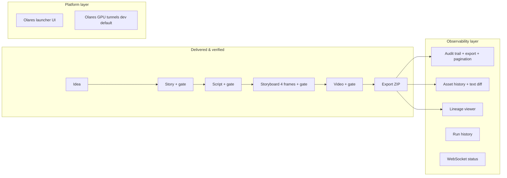

# AIMPOS-Spark — Roadmap Recommendation (Post Phase 3C)

**Date:** 2026-06-17  
**Prepared by:** Product Analyst · Repository Custodian · Verification Lead  
**Baseline:** Phase 3C CLOSED · Olares deployment operational · AIMPOS available from Olares launcher  
**Authority:** Evidence from mission closures, acceptance packages, governance briefs, `DECISIONS.md`, and verification logs  
**Scope of this document:** Planning only — no implementation authorized

---

## Executive summary

AIMPOS-Spark has completed the Visual MVP, Spark Full (production pipeline through video + export), Phase 2 observability, and Phase 3A–3C (trust, creator experience, platform readiness). The **core creator workflow is operational** on Olares: idea → story → script → storyboard → video → export, with human gates, versioned assets, audit trail, lineage, history, and a hosted web UI.

The platform is **production-capable for a solo creator on a single project and single scene**, but **not yet production-ready for distribution, collaboration, or studio-scale workflows**. The highest-value next step is **Option B — Platform Maturity**, which converts Phase 3C operational wins into a releasable, installable product before expanding scope.

**Recommended next mission:** **Phase 4B — Platform Maturity & Release Hardening** (Option B, prioritized track).

---

## 1. Current platform assessment

### 1.1 Program status

| Program / phase | Status | Release / evidence |
|-----------------|--------|-------------------|
| Visual MVP (M5) | **CLOSED** | `v0.4.0-usv01` |
| Spark Full Phase 1 (M6) | **CLOSED** | `v0.7.0-usv02` |
| Spark Full Phase 2 (M7) | **CLOSED** | `v0.12.0-usv03` |
| Phase 3A — Trust & Visibility | **CLOSED** | `PHASE-3A-MISSION-CLOSURE.md` |
| Phase 3B — Asset Intelligence | **CLOSED** | `PHASE-3B-MISSION-CLOSURE.md` |
| Phase 3C — Platform Readiness | **CLOSED** | `PHASE-3C-MISSION-CLOSURE.md` |

### 1.2 Operational attestation (2026-06-17)

| Signal | Local | Olares cluster |
|--------|-------|----------------|
| Phase 3C verify | FAIL=0 | FAIL=0 |
| Phase 3B regression (nested) | FAIL=0 | — |
| API unit tests | 114 passed | — |
| Web vitest | 43 passed | — |
| Web build | PASS | — |
| Pipeline runs observed | 12 | 10+ |
| Audit events | 111 | 175 (paginated) / 447 cumulative |
| Asset history stages | 5 (IDEA→VIDEO) | HTTP 200 |
| Olares web entrance | — | `aimposingress:8080` HTTP 200 |
| Application CR | — | `state=running` |
| Deployed images | — | `aimpos-api:dev`, `aimpos-web:phase3c` |

### 1.3 Creator workflow maturity

**Maturity rating by dimension:**

| Dimension | Rating (1–5) | Notes |
|-----------|--------------|-------|
| Core pipeline correctness | **5** | D-37..D-54 frozen; US-V02/V03 re-attested |
| Creator UX / transparency | **4** | Phase 3B closed major gaps; run summary rows still thin |
| AI output quality | **4** | Flux + WAN i2v on Olares 24GB; fallback path proven |
| Operational deployability | **3** | Web on Olares works; manual image import, unpinned tags |
| Multi-user / security | **1** | Bearer token only (D-09); Keycloak deferred |
| Content scale (scenes/projects) | **1** | Single project, single scene frozen |
| Release / distribution | **2** | No Phase 3C tag; no Olares Market one-click stack |

---

## 2. Product strengths

Evidence-backed capabilities that differentiate AIMPOS today:

1. **Sovereign local AI pipeline** — End-to-end inference on Olares (Ollama `qwen3:14b`, ComfyUI Flux/Z-Image/RealVisXL, WAN 2.2 i2v) with zero cloud egress (D-63, D-62, D-61).

2. **Governed human-in-the-loop workflow** — Four approval gates, append-only versioning, rejection-note-driven regeneration (D-37..D-51).

3. **Traceability** — Audit trail (175+ events on active project), CSV/JSON export (D-66), lineage API/UI (D-55/D-56), export manifest with SHA-256 integrity (D-52/D-53).

4. **Creator transparency (Phase 3)** — Asset history with Story/Script diff (D-67), inline video playback, pipeline run history (D-68), paginated audit browser (D-69).

5. **Realtime dashboard** — WebSocket push on state transitions with polling fallback (D-59); reduces stale UI during long GPU stages.

6. **Quality upgrade path** — Swappable storyboard engines via `COMFYUI_WORKFLOW`; cinematic slideshow fallback when i2v fails (D-61).

7. **Verification discipline** — Layered verify scripts (`make verify-phase3b`, `verify-phase3c`, Olares variants); 114 API + 43 web tests; acceptance packages archived under `evidence/`.

8. **Olares-native hosting** — Launcher tile + same-origin web/API proxy (D-70); no developer-only `npm run dev` required for hosted UI.

9. **Dev ergonomics** — `make up-dev` auto-starts Olares AI tunnels; bootstrap migration gate prevents storyboard schema failures (D-65).

---

## 3. Product weaknesses

| Weakness | Evidence | Impact |
|----------|----------|--------|
| **Single project, single scene** | MVP Scope Freeze §1.2; Phase 3A forbidden list | Cannot produce episodic or multi-shot productions |
| **Static Bearer token auth** | D-09; PO must paste cluster secret | No users, roles, or session management |
| **Long GPU wall-clock** | `comfyui-quality.md`: ~26–42s/frame stills; ~12 min/clip i2v × 4 | Full run can exceed 2–4 hours |
| **i2v fallback to slideshow** | D-61; Phase 3A US-V04 note | Creators may get motion-free output without expecting it |
| **Flux default license** | D-62: Flux.1-dev non-commercial | Blocks commercial use without engine switch |
| **Manual Olares deploy** | Phase 3C PO validation; `deploy/olares/aimpos/README.md` | `docker save` → `ctr import` → `helm upgrade` — operator-heavy |
| **Unpinned release images** | Phase 3C: `:dev`, `:phase3c` tags | Cluster drift from local dev; rollback unclear |
| **No one-click Market install** | Phase 3C remaining backlog | Friction for non-engineer adopters |
| **US-V04 i2v attestation gap** | Phase 3A closure: "when VIDEO run completes" | Release evidence for `source=comfyui_i2v` not fully captured |
| **No integration CI on PRs** | D-29 defers compose/GPU CI; Phase 3C recommendation | Verify scripts run manually, not nightly |
| **No asset lifecycle writes** | Phase 2/3 exclusions: restore, rollback, promote | Creators cannot recover from bad approvals |
| **No audio / narration** | Phase 3B backlog; Spark Full exclusions | Video is silent; not broadcast-ready |
| **No character bible / continuity** | Phase 3A forbidden; BC 2.3/2.4 Future | Character consistency across regenerations is prompt-only |
| **Branch protection absent** | D-15: GitHub free plan | Governance by convention only |

---

## 4. Creator workflow bottlenecks

Ranked by frequency and severity from Phase 3A validation, Phase 3B PO findings, and operational runbooks.

| Rank | Bottleneck | Status | Evidence |
|------|------------|--------|----------|
| 1 | **GPU wait time during STORYBOARD + VIDEO** | Open | 4 × ~30s stills + up to ~48 min i2v; dashboard shows status but creator is blocked |
| 2 | **Opaque failure messages on approve/regenerate** | Partially fixed | Phase 3B WP-5: Temporal signal detail + `formatReviewActionError()` |
| 3 | **Slideshow vs real motion confusion** | Partially fixed | Phase 3B: video source badge + `fallback_reason` in metadata panel |
| 4 | **Token login UX** | Open | PO pastes `AIMPOS_API_TOKEN` from k8s secret — no user accounts |
| 5 | **Comparing rejected drafts** | Fixed (text only) | D-67 Story/Script diff; no STORYBOARD frame diff or VIDEO A/B compare |
| 6 | **Historical run context** | Partially fixed | D-68 run list; no per-run asset summary counts on dashboard rows |
| 7 | **Fresh-clone bootstrap failures** | Fixed | D-65 migration gate in `make up-dev` |
| 8 | **Review during long RUNNING states** | Open | Must poll/wait; no ETA or stage progress granularity beyond `current_stage` |
| 9 | **Commercial output engine selection** | Open | Requires operator knowledge of `COMFYUI_WORKFLOW` env |
| 10 | **Export only after COMPLETED** | By design | D-52 409 gate — correct but blocks partial exports for failed runs |

---

## 5. Operational bottlenecks

| Rank | Bottleneck | Evidence | Severity |
|------|------------|----------|----------|
| 1 | **Manual image deploy to Olares** | Phase 3C PO finding #4; Phase 3B deploy script | High — every API/web change needs operator SSH |
| 2 | **API/web image drift** | Phase 3B risk: cluster on `:dev` while local evolves | High |
| 3 | **Olares launcher tile sync lag** | Phase 3C PO finding #1 | Medium |
| 4 | **Large audit export via proxy** | Phase 3C risk: 1800s nginx timeout | Medium |
| 5 | **PowerShell vs curl for exports** | Phase 3B lesson: `Invoke-WebRequest` hangs on attachments | Low (documented) |
| 6 | **Verify scripts not in CI** | Phase 3C recommendation #5 | Medium |
| 7 | **No `make verify-all` aggregator** | Phase 3C recommendation #4 | Low |
| 8 | **WAN weight provisioning** | `comfyui-quality.md`: I2V vs T2V weight confusion | Medium |
| 9 | **Single-GPU sequencing** | D-08: Ollama unload before ComfyUI | Architectural constraint |
| 10 | **Postgres secret naming on Olares** | Phase 3B lesson: `aimpos-postgres-auth` not `aimpos-postgres` | Low (documented) |

---

## 6. Platform maturity gaps

| Gap area | Current state | Target state |
|----------|---------------|--------------|
| **Release engineering** | Uncommitted Phase 3 changes; no `v0.13.0-phase3c` tag | Semver tags, pinned images, changelog |
| **Distribution** | Helm chart + README; manual deploy | Olares Market one-click full stack |
| **Identity** | Shared Bearer token | Keycloak/OIDC (US-25 full) |
| **Tenancy** | One seeded project | Multi-project CRUD |
| **Content model** | One scene | Multi-scene breakdown (BC 3.1) |
| **Graph intelligence** | PostgreSQL `lineage_edges` | Neo4j projector (Technology Recommendations) |
| **Observability** | Request ID + audit rows | OpenTelemetry full stack |
| **CI depth** | Unit tests on PR | Compose verify nightly; GPU smoke on Olares schedule |
| **Asset governance** | Append-only read | Restore / rollback / promote (explicitly deferred) |
| **Collaboration** | Solo creator | RBAC, notifications, sharing |

---

## 7. Technical debt ranking

Prioritized by **risk × remediation cost**. Resolved items (TD-21, TD-22, TD-26) omitted.

| Rank | ID | Item | Risk | Effort | Recommendation |
|------|-----|------|------|--------|----------------|
| 1 | **TD-RELEASE** | Unpinned Olares images (`:dev`, `:phase3c`) | High | S | Pin semver images in Helm; tag `v0.13.0-phase3c` |
| 2 | **TD-CI-INT** | No compose/integration CI (`integration.yml` deferred) | High | M | Nightly `make verify-all`; non-blocking on PR initially |
| 3 | **TD-25** | MinIO orphan blobs on DB failure after upload | Medium | M | Compensating delete or two-phase commit |
| 4 | **TD-17** | API Docker image excludes `alembic/` | Medium | S | Include alembic in image; simplify migrate |
| 5 | **TD-15** | No GitHub branch protection | Medium | S | Upgrade to Pro or make public; run `protect_and_audit.py` |
| 6 | **TD-WS-REPLAY** | WebSocket at-most-once, no replay buffer | Low | L | Defer unless collaboration phase |
| 7 | **TD-19** | Uvicorn plaintext startup banners | Low | S | Cosmetic; fix when touching logging |
| 8 | **TD-11** | No DB-level append-only triggers on audit/approvals | Low | M | Defer unless compliance audit required |
| 9 | **TD-AUTH** | Bearer token in localStorage | Medium | L | Address with Keycloak phase |
| 10 | **TD-PAGINATION** | Audit offset pagination only (no keyset cursor) | Low | S | Phase 3C backlog; needed at 500+ events/run |

---

## 8. Completed story inventory (reference)

Stories closed through Phase 3C that form the evidence base:

| Track | Stories / WPs | Phase |
|-------|---------------|-------|
| Platform skeleton | Sprint 0–1, US-02, US-06 | Visual MVP |
| Workflow | US-07, US-08, US-09, US-12 | Visual MVP |
| Idea → Storyboard | US-11, US-13..US-17 | Visual MVP |
| Visual acceptance | US-V01 | M5 |
| Video + export | US-18, US-19 | Spark Full P1 |
| Spark acceptance | US-V02 | M6 |
| Observability | US-20, US-21, US-22, US-23 | Spark Full P2 |
| Phase 2 acceptance | US-V03 | M7 |
| Quality re-acceptance | US-V04 | Phase 3A |
| Audit browser | US-23b | Phase 3A |
| Bootstrap gate | WP-3 | Phase 3A |
| Audit export | WP-1 | Phase 3B |
| Version diff | US-30 | Phase 3B |
| Run history | US-31 | Phase 3B |
| History media UX | WP-4 | Phase 3B |
| PO error UX | WP-5 | Phase 3B |
| Olares web | WP-1 | Phase 3C |
| Audit pagination | WP-2 | Phase 3C |
| Verify integration | WP-3 | Phase 3C |

---

## 9. Roadmap options

Three mutually exclusive **strategic directions** for Phase 4. Each requires a new governance brief and SCR where scope boundaries change.

---

### Option A — Product Depth

**Thesis:** Expand what a creator can produce within AIMPOS — more scenes, richer media, and in-app creative tools — while keeping single-user lab auth.

#### Scope (illustrative work packages)

| WP | Deliverable | SCR required |
|----|-------------|--------------|
| A-1 | Multi-scene script breakdown + N-scene workflow extension | **Yes** — pipeline semantic change |
| A-2 | Character / continuity bible (prompt context store) | **Yes** |
| A-3 | Audio narration track (TTS or upload) on VIDEO stage | **Yes** |
| A-4 | STORYBOARD frame diff + selective regen (per-frame reject) | **Yes** — breaks D-46 batch approve |
| A-5 | In-app idea/story editing UX polish | Minor / no SCR |
| A-6 | Commercial engine preset profiles (Z-Image / RealVisXL UI toggle) | No |

#### Assessment

| Criterion | Rating |
|-----------|--------|
| **Business value** | **High** for creator output quality and production length; directly addresses "one scene only" weakness |
| **Technical risk** | **High** — Temporal workflow, schema, and D-37..D-51 contracts are frozen; multi-scene touches every stage |
| **Estimated effort** | **L–XL** (12–20 weeks solo); A-1 alone is multi-sprint |
| **Dependencies** | Stable release baseline (Option B first recommended); GPU headroom for N-scene video |
| **Governance concerns** | SCR mandatory for pipeline stages; must not regress US-V02/V03 paths; new acceptance gate (US-V05?) |

#### Cost vs value

| Cost | Value |
|------|-------|
| Highest engineering surface area | Unlocks episodic / serial content |
| Regression risk to proven pipeline | Differentiated vs "AI slideshow tools" |
| Long GPU runs multiply by scene count | Creator retention if quality gap closed |

**Verdict:** High reward but ** premature without release hardening**. Recommend as **Phase 5** after Option B.

---

### Option B — Platform Maturity

**Thesis:** Make Phase 3C deliverables **releasable, installable, and operable** by non-engineers — without changing pipeline semantics.

#### Scope (aligned with Phase 3C closure recommendations)

| WP | Deliverable | SCR required |
|----|-------------|--------------|
| B-1 | Release tag `v0.13.0-phase3c` + pinned container images | No |
| B-2 | Olares Market chart — full stack one-click install | No |
| B-3 | US-V04 completion — promote i2v run to COMPLETED; capture `source=comfyui_i2v` evidence | No |
| B-4 | `make verify-all` (bootstrap + phase3b + phase3c) | No |
| B-5 | CI nightly compose verify (non PR-blocking) | No |
| B-6 | Run history row enrichment — asset counts by stage (Phase 3B backlog #3) | No |
| B-7 | Helm values for commercial engine presets + i2v tuning docs | No |
| B-8 | Automated image build/push pipeline for Olares | No |

#### Assessment

| Criterion | Rating |
|-----------|--------|
| **Business value** | **High** for adoption, trust, and handoff to PO/users; converts engineering wins to product |
| **Technical risk** | **Low** — no schema/workflow changes per Phase 3C governance |
| **Estimated effort** | **S–M** (3–6 weeks) |
| **Dependencies** | Commit authorization for Phase 3C artifacts; Olares Market access |
| **Governance concerns** | Minimal — extends Phase 3C charter; tag/push requires explicit authorization per release protocol |

#### Cost vs value

| Cost | Value |
|------|-------|
| Mostly ops/docs/CI, not feature work | First "real release" after Phase 3C |
| Market submission process unknown duration | Reduces deploy friction (top operational bottleneck) |
| Nightly CI may flake on GPU-less runners | Closes US-V04 evidence gap |

**Verdict:** **Best cost/value ratio.** Directly addresses Phase 3C remaining backlog and operational bottlenecks #1–#3.

---

### Option C — Studio Scale

**Thesis:** Prepare AIMPOS for multiple creators, projects, and enterprise governance — identity, RBAC, multi-project, and collaboration primitives.

#### Scope (illustrative work packages)

| WP | Deliverable | SCR required |
|----|-------------|--------------|
| C-1 | Keycloak / OIDC integration (US-25 full) | **Yes** — auth model change |
| C-2 | Multi-project CRUD UI + API | **Yes** — tenancy model |
| C-3 | RBAC roles (creator, reviewer, admin) | **Yes** |
| C-4 | Project-scoped audit + asset isolation | **Yes** |
| C-5 | Notification hooks (email/webhook on gate transitions) | Minor |
| C-6 | Neo4j lineage projector (Technology Recommendations) | **Yes** — new infrastructure class |
| C-7 | GitHub branch protection + team CI | No |

#### Assessment

| Criterion | Rating |
|-----------|--------|
| **Business value** | **Medium–High** for studio/team adoption; **Low** for solo Olares creator today |
| **Technical risk** | **High** — touches auth middleware (D-09), all routes, data isolation, WebSocket auth |
| **Estimated effort** | **L** (8–14 weeks); Keycloak alone is multi-week |
| **Dependencies** | Stable release (Option B); identity provider on Olares; SCR for every security boundary |
| **Governance concerns** | Highest — MVP Scope Freeze deferred Keycloak to "Phase 1"; requires formal SCR + security review |

#### Cost vs value

| Cost | Value |
|------|-------|
| Weeks before creator-visible features | Enables team review workflows |
| New infra (Keycloak, possibly Neo4j) on Olares RAM budget | Compliance narrative strengthens |
| Migration from Bearer token breaks existing verify scripts | Foundation for SaaS / multi-tenant future |

**Verdict:** Strategic but **not the immediate need** — current PO validation succeeded with single token on single project. Schedule after Option B; pair with Option A only if team customers confirmed.

---

## 10. Cost vs value comparison

| Dimension | Option A — Product Depth | Option B — Platform Maturity | Option C — Studio Scale |
|-----------|--------------------------|------------------------------|-------------------------|
| Time to first user value | 12–20 weeks | **3–6 weeks** | 8–14 weeks |
| Engineering risk | High | **Low** | High |
| SCR / governance load | Heavy | **Light** | Heavy |
| Addresses top creator bottleneck (GPU time) | Partially (more content = more wait) | Indirectly (better docs/tuning) | No |
| Addresses top ops bottleneck (deploy) | No | **Yes** | Partially |
| Revenue / adoption unlock | Creative differentiation | **Installability** | Team sales |
| Regression risk to D-37..D-54 | **High** | **Minimal** | Medium |
| Fits solo-founder capacity | Stretch | **Fit** | Stretch |

---

## 11. Recommended next mission

### Primary recommendation: **Phase 4 — Platform Maturity & Release Hardening (Option B)**

**Mission charter (draft):**

> Convert Phase 3C operational readiness into a semver release, pinned Olares deployment, and completed US-V04 i2v evidence — without schema, workflow, or auth model changes.

**Authorized work packages (priority order):**

1. **B-1** — Release hygiene: tag, pinned images, README/DECISIONS sync  
2. **B-3** — US-V04 i2v completion evidence (`source=comfyui_i2v`)  
3. **B-2** — Olares Market full-stack chart submission  
4. **B-4/B-5** — `make verify-all` + nightly CI smoke  
5. **B-6** — Run history asset summary rows (quick creator win, no SCR)  
6. **B-7** — Commercial engine preset documentation + Helm values  

**Exit criteria:**

- [ ] Tag `v0.13.0-phase3c` (or next semver) with evidence package  
- [ ] Olares deploy uses pinned digests, not `:dev`  
- [ ] US-V04 acceptance shows `source=comfyui_i2v` on authoritative run  
- [ ] `make verify-all` FAIL=0 local + Olares  
- [ ] PO signs off: launcher → login → full pipeline → export on hosted UI only  

**Governance:** Extend Phase 3C stop conditions — no pipeline/schema/auth changes.

---

### Secondary track (Phase 5 planning — do not start concurrently)

| Priority | Option | Trigger to authorize |
|----------|--------|----------------------|
| 1 | **Option A** (multi-scene) | PO confirms episodic content is top user request post-release |
| 2 | **Option C** (Keycloak + multi-project) | Second creator needs concurrent access or compliance audit scheduled |
| 3 | Option A-3 (audio) | User research confirms silent video blocks publishing |

---

## 12. Evidence index

| Artifact | Path |
|----------|------|
| Phase 3C mission closure | `PHASE-3C-MISSION-CLOSURE.md` |
| Phase 3B mission closure | `PHASE-3B-MISSION-CLOSURE.md` |
| Phase 3A mission closure | `PHASE-3A-MISSION-CLOSURE.md` |
| Phase 3C acceptance | `evidence/phase-3c-verification/local-2026-06-17/PHASE-3C-ACCEPTANCE-PACKAGE.md` |
| Phase 3B acceptance | `evidence/phase-3b-verification/local-2026-06-17/PHASE-3B-ACCEPTANCE-PACKAGE.md` |
| PO operational validation | `docs/sprints/phase-3c-po-operational-validation.md` |
| Olares deploy guide | `deploy/olares/aimpos/README.md` |
| Quality / GPU runbook | `docs/runbooks/comfyui-quality.md` |
| Decisions log (D-01..D-70) | `DECISIONS.md` |
| Scope contract | `MVP Scope Freeze.md` |
| Spark Full vision + deferrals | `docs/sprints/spark-full-governance-brief.md` |
| Phase 2 closure backlog | `docs/sprints/spark-full-phase2-repository-closure-summary.md` |
| Program status | `README.md` |

---

## 13. Document control

| Field | Value |
|-------|-------|
| Document ID | AIMPOS-ROADMAP-REC-001 |
| Version | 1.0 |
| Classification | Planning — no implementation authorized |
| Next review | Upon Phase 4 governance brief ACCEPT |

*This recommendation is evidence-based on repository state as of 2026-06-17. Implementation, commits, tags, and pushes require separate explicit authorization.*
