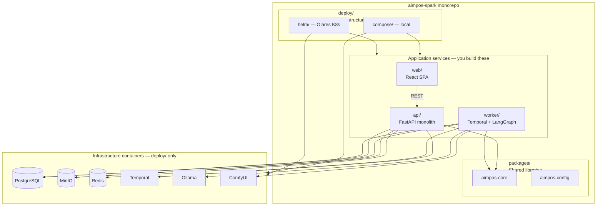

# AIMPOS-Spark — Repository Structure

**Document Type:** Monorepo Architecture — Folder Design  
**Version:** 1.0  
**Status:** FROZEN — Effective June 9, 2026. Monorepo layout locked for Visual MVP.  
**Date:** June 8, 2026  
**Author Role:** Lead Architect  
**Codename:** `aimpos-spark`  
**Parent Documents:**

- [MVP Definition.md](./MVP%20Definition.md)
- [System Architecture.md](./System%20Architecture.md)
- [Domain Driven Design.md](./Domain%20Driven%20Design.md)
- [Technology Recommendations.md](./Technology%20Recommendations.md)
- [Workflow Architecture.md](./Workflow%20Architecture.md)
- [Multi-Agent Architecture.md](./Multi-Agent%20Architecture.md)

---

## Table of Contents

1. [Design Principles](#1-design-principles)
2. [Service Boundaries](#2-service-boundaries)
3. [Repository Tree](#3-repository-tree)
4. [Folder Reference](#4-folder-reference)
5. [Shared Libraries](#5-shared-libraries)
6. [Local Development vs Olares](#6-local-development-vs-olares)
7. [Bounded Context Mapping](#7-bounded-context-mapping)
8. [Evolution Path](#8-evolution-path)

---

## 1. Design Principles

| Principle | Repository implication |
|-----------|------------------------|
| **Monorepo** | One git repo; shared types and contracts versioned with services |
| **Local development first** | `deploy/compose/` is the default entry point; hot-reload for `api`, `worker`, `web` |
| **Docker-first** | Every runnable component has a Dockerfile; no “works on my machine” without containers |
| **Olares deployment later** | `deploy/helm/` and `deploy/olares/` are additive — compose is not replaced |
| **MVP monolith** | Single FastAPI app and single worker process; module boundaries inside folders, not separate repos |
| **DDD module boundaries** | Folders mirror bounded contexts; no cross-context imports except via `packages/` |
| **Agents propose only** | Agent code lives in `worker/agents/`; never in `api/` or `web/` |
| **Workflow governs** | Temporal workflows in `worker/temporal/`; API only sends signals |

---

## 2. Service Boundaries

MVP runs **four deployable application containers** plus **five infrastructure containers**. Logical boundaries are strict; physical deployment is consolidated.



### 2.1 Application services (deployable)

| Service | Folder | Process | Responsibility |
|---------|--------|---------|----------------|
| **Web Console** | `web/` | Node → static/nginx | 4–5 screens: Dashboard, Review, Assets, Audit, Export |
| **API** | `api/` | uvicorn | REST: projects, ideas, pipeline, assets, approvals, audit, lineage, export |
| **Worker** | `worker/` | Temporal worker + activities | `SparkPipelineWorkflow`, LangGraph agents, ComfyUI/Ollama tools |

### 2.2 Infrastructure services (configured, not coded)

| Service | Defined in | MVP role |
|---------|------------|----------|
| PostgreSQL | `deploy/compose/`, `deploy/helm/` | System of record |
| MinIO | `deploy/` | Asset bytes (hot tier) |
| Redis | `deploy/` | Cache, optional pub/sub (MVP: minimal) |
| Temporal Server | `deploy/` | Workflow orchestration |
| Ollama | `deploy/` | Local LLM (Story, Script, planning) |
| ComfyUI | `deploy/` | Local image/video diffusion |

### 2.3 What is NOT a separate service in MVP

Per [MVP Definition.md](./MVP%20Definition.md) §6.2, these full-platform containers are **modules inside `api/`**, not separate deployables:

- Studio Service → `api/domain/studio/`
- Production Service → `api/domain/production/`
- Asset Service → `api/domain/assets/`
- Workflow API → `api/routes/pipeline/`
- Agent Service → `worker/agents/` (no HTTP in MVP)
- Compliance, Release, Graph Projector, Keycloak, OPA, Neo4j — **deferred**

---

## 3. Repository Tree

```
aimpos-spark/
│
├── README.md                          # Quick start: compose up, env, health check
├── LICENSE
├── .gitignore
├── .env.example                       # Template for all local env vars
├── Makefile                           # dev shortcuts: up, down, test, migrate
│
├── .github/                           # CI/CD and GitHub metadata
│   ├── workflows/
│   │   ├── ci-api.yml                 # Lint + test api on PR
│   │   ├── ci-worker.yml              # Lint + test worker on PR
│   │   ├── ci-web.yml                 # Lint + test web on PR
│   │   └── integration.yml            # Compose-based integration (nightly)
│   ├── ISSUE_TEMPLATE/
│   └── PULL_REQUEST_TEMPLATE.md
│
├── docs/                              # Human documentation (not code)
│   ├── architecture/                  # Links/summaries of approved arch docs
│   │   └── README.md                  # Pointer to workspace architecture set
│   ├── adr/                           # Architecture Decision Records
│   │   ├── 0001-monorepo-single-api.md
│   │   ├── 0002-temporal-over-custom-state-machine.md
│   │   └── 0003-postgres-lineage-not-neo4j-mvp.md
│   ├── runbooks/                      # Operational procedures
│   │   ├── local-development.md
│   │   ├── olares-deployment.md
│   │   ├── gpu-sequencing.md
│   │   └── temporal-troubleshooting.md
│   ├── api/                           # Generated OpenAPI snapshots (committed on release)
│   └── onboarding/                    # Solo-founder / contributor setup
│
├── packages/                          # Shared Python libraries (installed editable)
│   ├── aimpos-core/                   # Domain primitives shared by api + worker
│   │   ├── pyproject.toml
│   │   └── aimpos_core/
│   │       ├── enums/                 # PipelineStage, ApprovalDecision, AssetStage
│   │       ├── models/                # Pydantic DTOs (not SQLAlchemy)
│   │       ├── events/                # AuditEventType, domain event payloads
│   │       └── exceptions/            # Shared error types
│   ├── aimpos-config/                 # Settings, env loading, logging setup
│   │   ├── pyproject.toml
│   │   └── aimpos_config/
│   │       ├── settings.py            # Pydantic Settings from env
│   │       └── logging.py             # Structured JSON logger
│   └── README.md
│
├── api/                               # BACKEND: Single FastAPI application
│   ├── pyproject.toml                 # Depends on aimpos-core, aimpos-config
│   ├── Dockerfile
│   ├── README.md
│   ├── alembic.ini
│   ├── alembic/                       # Database migrations
│   │   └── versions/
│   ├── app/
│   │   ├── main.py                    # FastAPI app factory
│   │   ├── dependencies.py            # DI: db session, minio, settings
│   │   ├── middleware/
│   │   │   ├── request_id.py
│   │   │   ├── auth.py                # Bearer token (MVP)
│   │   │   └── logging.py
│   │   ├── routes/                    # HTTP adapters — thin controllers
│   │   │   ├── health.py
│   │   │   ├── projects.py
│   │   │   ├── ideas.py
│   │   │   ├── pipeline.py            # start, status, approve, reject, regenerate
│   │   │   ├── assets.py
│   │   │   ├── audit.py
│   │   │   ├── lineage.py
│   │   │   └── export.py
│   │   ├── domain/                    # DDD modules — business logic, no HTTP
│   │   │   ├── studio/                # Project aggregate (BC: Studio Governance)
│   │   │   ├── production/            # Idea, pipeline run (BC: Production Lifecycle)
│   │   │   ├── assets/                # AssetVersion, store/retrieve (BC: Asset & Provenance)
│   │   │   ├── workflow/              # Approval, signal bridge to Temporal (BC: Governed Workflow)
│   │   │   └── audit/                 # AuditEvent append (BC: Compliance — simplified)
│   │   ├── infrastructure/            # Adapters — DB, MinIO, Redis, Temporal client
│   │   │   ├── db/
│   │   │   │   ├── session.py
│   │   │   │   ├── models/            # SQLAlchemy ORM (persistence model)
│   │   │   │   └── repositories/      # Repository implementations
│   │   │   ├── storage/
│   │   │   │   └── minio_client.py
│   │   │   ├── cache/
│   │   │   │   └── redis_client.py
│   │   │   └── temporal/
│   │   │       └── client.py          # Start workflow, send signals
│   │   └── seed/
│   │       └── default_project.py     # US-01 seed on startup
│   └── tests/                         # API unit + integration tests
│       ├── unit/
│       ├── integration/
│       └── conftest.py
│
├── worker/                            # BACKEND: Temporal worker + agents
│   ├── pyproject.toml
│   ├── Dockerfile
│   ├── README.md                      # GPU sequencing rules documented here
│   ├── app/
│   │   ├── main.py                    # Worker entrypoint — register workflows/activities
│   │   ├── temporal/
│   │   │   ├── workflows/
│   │   │   │   └── spark_pipeline.py  # SparkPipelineWorkflow (4–5 stages)
│   │   │   └── activities/
│   │   │       ├── story.py           # run_story_agent
│   │   │       ├── script.py
│   │   │       ├── storyboard.py
│   │   │       ├── video.py           # Deferred in Visual MVP; folder exists
│   │   │       └── export.py          # finalize_export
│   │   ├── agents/                    # LangGraph graphs (BC: Agentic Intelligence)
│   │   │   ├── story_architect/
│   │   │   │   ├── graph.py
│   │   │   │   └── prompts/
│   │   │   ├── screenwriter/
│   │   │   │   ├── graph.py
│   │   │   │   └── prompts/
│   │   │   └── cinematography/
│   │   │       ├── graph.py
│   │   │       └── prompts/
│   │   ├── tools/                     # Agent tools — external system adapters
│   │   │   ├── ollama_tool.py
│   │   │   ├── comfyui_tool.py
│   │   │   └── asset_store_tool.py    # Write outputs via MinIO + metadata
│   │   └── infrastructure/
│   │       ├── db/                    # Worker-side DB access for activities
│   │       ├── gpu/
│   │       │   └── sequencer.py       # Unload Ollama before ComfyUI
│   │       └── audit/
│   │           └── emitter.py         # AgentTaskCompleted events
│   └── tests/
│       ├── unit/
│       ├── integration/
│       └── conftest.py
│
├── web/                               # FRONTEND: React SPA
│   ├── package.json
│   ├── Dockerfile
│   ├── README.md
│   ├── index.html
│   ├── vite.config.ts
│   ├── public/
│   └── src/
│       ├── main.tsx
│       ├── App.tsx
│       ├── routes/                    # React Router pages
│       │   ├── DashboardPage.tsx
│       │   ├── ReviewPage.tsx         # Story / Script / Storyboard / Video modes
│       │   ├── AssetsPage.tsx
│       │   ├── AuditPage.tsx
│       │   └── ExportPage.tsx
│       ├── components/                # Reusable UI
│       │   ├── layout/
│       │   │   ├── AppShell.tsx
│       │   │   └── NavBar.tsx
│       │   ├── pipeline/
│       │   │   ├── StageStepper.tsx
│       │   │   └── StatusBadge.tsx
│       │   ├── review/
│       │   │   ├── StoryEditor.tsx
│       │   │   ├── ScriptPreview.tsx
│       │   │   ├── FrameGallery.tsx
│       │   │   └── VideoPlayer.tsx
│       │   └── common/
│       ├── api/                       # Typed API client
│       │   ├── client.ts
│       │   └── types.ts               # Mirrors OpenAPI / aimpos-core DTOs
│       ├── hooks/
│       │   └── usePipelineStatus.ts   # Polling hook
│       └── tests/
│           └── components/
│
├── configs/                           # Runtime configuration artifacts (not secrets)
│   ├── ollama/
│   │   └── models.json                # Pinned model tags per stage
│   ├── comfyui/
│   │   ├── workflows/
│   │   │   ├── sdxl_storyboard.json   # Pinned workflow graphs
│   │   │   └── svd_video.json         # Post–Visual MVP
│   │   └── README.md
│   └── temporal/
│       └── development.yaml           # Namespace / retention dev settings
│
├── deploy/                            # INFRASTRUCTURE: all deployment artifacts
│   ├── README.md                      # Compose first; Helm when moving to Olares
│   ├── compose/                       # LOCAL DEV FIRST — primary entry point
│   │   ├── docker-compose.yml         # Full 9-service stack
│   │   ├── docker-compose.dev.yml     # Overrides: volume mounts, hot reload
│   │   ├── docker-compose.ci.yml      # CI: slim images, no GPU
│   │   └── .env.compose.example
│   ├── docker/                        # Dockerfiles for infra customization
│   │   ├── api.Dockerfile             # Symlink or reference to api/Dockerfile
│   │   ├── worker.Dockerfile
│   │   ├── web.Dockerfile
│   │   └── web.nginx.conf             # Production static serving
│   ├── init/                          # Container init scripts
│   │   ├── postgres/
│   │   │   └── 01-extensions.sql
│   │   └── minio/
│   │       └── create-buckets.sh
│   ├── helm/                          # OLARES / K8s — Phase 0.5+
│   │   ├── aimpos-spark/              # Umbrella chart
│   │   │   ├── Chart.yaml
│   │   │   ├── values.yaml
│   │   │   └── templates/
│   │   └── charts/                    # Subcharts
│   │       ├── api/
│   │       ├── worker/
│   │       ├── web/
│   │       ├── postgresql/
│   │       ├── minio/
│   │       ├── redis/
│   │       ├── temporal/
│   │       ├── ollama/
│   │       └── comfyui/
│   ├── olares/                        # Olares-specific overlays
│   │   ├── values-olares-one.yaml     # GPU, storage class, zero-egress
│   │   ├── network-policies/
│   │   └── README.md
│   └── k8s/                           # Raw manifests (optional escape hatch)
│       └── namespaces.yaml
│
├── scripts/                           # Developer and smoke-test scripts
│   ├── dev/
│   │   ├── setup.sh                   # First-time local setup
│   │   └── seed-demo.sh
│   ├── smoke/
│   │   ├── test_ollama.py             # US-06
│   │   ├── test_comfyui.py
│   │   └── test_health.sh
│   └── release/
│       └── export-openapi.sh
│
└── tests/                             # CROSS-SERVICE tests
    ├── e2e/                           # Full pipeline tests (require GPU)
    │   ├── test_visual_mvp_happy_path.py
    │   └── README.md                  # Run manually on Olares
    ├── integration/                   # Multi-container via compose
    │   ├── test_pipeline_stub.py
    │   └── docker-compose.test.yml
    └── fixtures/
        ├── ideas/
        ├── stories/
        └── scripts/
```

---

## 4. Folder Reference

### 4.1 Root and governance

| Path | Why it exists |
|------|---------------|
| `README.md` | Single entry point: `make up`, URLs, health check |
| `.env.example` | Documents all env vars for api, worker, web without secrets |
| `Makefile` | Solo-founder ergonomics — one command for common tasks |
| `.github/workflows/` | CI per service boundary; integration uses `deploy/compose/` |

### 4.2 `docs/` — Documentation folders

| Path | Why it exists |
|------|---------------|
| `docs/architecture/` | In-repo pointers to approved architecture; onboarding context |
| `docs/adr/` | Records decisions (Temporal, monolith, PostgreSQL lineage) — complements root workspace docs |
| `docs/runbooks/` | How to run locally, deploy to Olares, debug GPU/Temporal |
| `docs/api/` | Committed OpenAPI snapshots for contract review and web type generation |
| `docs/onboarding/` | Setup guide aligned with [Solo Founder Development Plan.md](./Solo%20Founder%20Development%20Plan.md) |

Architecture source-of-truth remains the workspace design documents; `docs/` is the **repo-local operational layer**.

### 4.3 `packages/` — Shared libraries

| Package | Consumers | Why it exists |
|---------|-----------|---------------|
| `aimpos-core` | `api/`, `worker/` | Single definition of `PipelineStage`, `AssetStage`, audit event types — prevents API/worker drift |
| `aimpos-config` | `api/`, `worker/` | Unified settings and structured logging per [Technology Recommendations.md](./Technology%20Recommendations.md) |

**Rule:** `api/domain/` and `worker/agents/` import enums and DTOs from `aimpos-core`. SQLAlchemy models stay in `api/infrastructure/db/` only — not shared (persistence ≠ domain).

### 4.4 `api/` — Backend service (FastAPI monolith)

| Path | Why it exists |
|------|---------------|
| `routes/` | HTTP layer only — maps requests to domain services; OpenAPI surface |
| `domain/` | DDD modules with business rules; no FastAPI imports inside |
| `infrastructure/` | Adapters (PostgreSQL, MinIO, Redis, Temporal client) — replaceable |
| `middleware/` | Cross-cutting: auth, logging, request ID per MVP §6.1 |
| `alembic/` | Schema migrations — PostgreSQL is system of record |
| `seed/` | Default project bootstrap (US-01) |
| `tests/` | Fast unit tests colocated with API; mock infrastructure |

**Service boundary:** API **never** calls Ollama or ComfyUI directly. It starts workflows and sends signals only ([System Architecture.md](./System%20Architecture.md) — agents propose via worker).

### 4.5 `worker/` — Backend service (Temporal + LangGraph)

| Path | Why it exists |
|------|---------------|
| `temporal/workflows/` | Durable orchestration — `SparkPipelineWorkflow` |
| `temporal/activities/` | Side-effecting units: invoke agents, store assets, wait for approval |
| `agents/` | LangGraph graphs — Story Architect, Screenwriter, Cinematography ([Multi-Agent Architecture.md](./Multi-Agent%20Architecture.md)) |
| `tools/` | Tool registry implementations: Ollama, ComfyUI, asset store |
| `infrastructure/gpu/` | GPU sequencing — unload Ollama before ComfyUI (MVP §6.6) |
| `infrastructure/audit/` | Emit `AgentTaskCompleted` with `model_id` (SC-05) |

**Service boundary:** Worker **never** exposes HTTP. It polls Temporal task queue and calls external runtimes.

### 4.6 `web/` — Frontend app (React SPA)

| Path | Why it exists |
|------|---------------|
| `routes/` | One page per MVP screen (Dashboard, Review, Assets, Audit, Export) |
| `components/review/` | Stage-specific review UIs — single Review route, multiple modes |
| `api/client.ts` | All backend communication; attaches Bearer token |
| `hooks/` | Polling for pipeline status (MVP defers WebSocket) |

**Service boundary:** Web talks **only** to `api/` REST — never to Temporal, Ollama, or ComfyUI.

### 4.7 `configs/` — Configuration artifacts

| Path | Why it exists |
|------|---------------|
| `configs/ollama/` | Pinned model manifest — version-controlled, not in `.env` |
| `configs/comfyui/workflows/` | Pinned ComfyUI JSON — addresses ComfyUI instability risk (MVP §7) |
| `configs/temporal/` | Dev server settings |

Workflow JSON is configuration, not application code — changes are reviewed independently of Python.

### 4.8 `deploy/` — Infrastructure folders

| Path | Why it exists |
|------|---------------|
| `deploy/compose/` | **Primary path** — `docker compose up` for local and Olares Docker mode |
| `deploy/compose/docker-compose.dev.yml` | Bind-mounts `api/`, `worker/`, `web/` for hot reload without image rebuild |
| `deploy/docker/` | Production-oriented multi-stage builds |
| `deploy/init/` | First-run scripts: MinIO buckets, PostgreSQL extensions |
| `deploy/helm/` | Kubernetes/Olares Phase 0.5 — same services, different packaging ([System Architecture.md](./System%20Architecture.md) §16.5) |
| `deploy/olares/` | GPU resource limits, storage classes, network policies for Olares One |
| `deploy/k8s/` | Optional raw manifests when Helm is overkill |

**Docker-first rule:** If it runs in production, it must be defined under `deploy/` before application code depends on it.

### 4.9 `scripts/` — Automation (not application logic)

| Path | Why it exists |
|------|---------------|
| `scripts/dev/` | One-time setup, demo seed |
| `scripts/smoke/` | US-06 Ollama/ComfyUI verification — run in CI and Week 2 gate |
| `scripts/release/` | OpenAPI export for `docs/api/` |

### 4.10 `tests/` — Cross-service testing

| Path | Why it exists |
|------|---------------|
| `tests/integration/` | API + PostgreSQL + MinIO + Temporal (mocked AI) via compose |
| `tests/e2e/` | Full pipeline on GPU hardware — manual or nightly; not PR-blocking initially |
| `tests/fixtures/` | Sample idea/story/script inputs for deterministic tests |
| `api/tests/`, `worker/tests/`, `web/src/tests/` | **Colocated** fast tests per service boundary |

---

## 5. Shared Libraries

### 5.1 Dependency graph

```
aimpos-config  (no internal aimpos deps)
      ↑
aimpos-core    (may use aimpos-config for logging)
      ↑
api / worker   (depend on both packages)
web            (TypeScript types — generated or hand-synced from OpenAPI; no Python package)
```

### 5.2 What belongs in shared packages vs not

| Belongs in `packages/` | Stays in `api/` or `worker/` |
|------------------------|------------------------------|
| Stage enums, status enums | SQLAlchemy ORM models |
| Pydantic request/response DTOs | Repository implementations |
| Audit event type constants | LangGraph graph definitions |
| Shared exception classes | ComfyUI workflow execution |
| Settings schema | Temporal workflow logic |

### 5.3 Future shared packages (post-MVP)

| Package | When |
|---------|------|
| `aimpos-events` | Event schema versioning when Neo4j projector added |
| `aimpos-clients` | Generated Temporal/MinIO clients if services split |
| `aimpos-ts-types` | npm package if web splits to multiple frontends |

---

## 6. Local Development vs Olares

### 6.1 Local development (default)

```bash
# From repo root
cp .env.example .env
make up          # runs deploy/compose/docker-compose.yml + dev overrides
make migrate     # alembic upgrade head
make logs-api
```

| Concern | Local approach |
|---------|----------------|
| Hot reload | `docker-compose.dev.yml` mounts `api/app`, `worker/app`, `web/src` |
| GPU | Optional — skip ComfyUI GPU flags on machines without NVIDIA |
| Temporal UI | Exposed on localhost for debugging approvals |
| Secrets | `.env` gitignored; never in `configs/` |

### 6.2 Olares deployment (later)

| Phase | Path | Trigger |
|-------|------|---------|
| **0 — Lab** | `deploy/compose/` on Olares Docker | Week 2 solo plan |
| **0.5 — K8s** | `deploy/helm/` + `deploy/olares/values-olares-one.yaml` | Multi-replica or GitOps need |
| **1 — Namespaces** | `deploy/olares/network-policies/` | Zero-egress enforcement |

Same container images built from `api/Dockerfile`, `worker/Dockerfile`, `web/Dockerfile` — compose and Helm share Dockerfiles in `deploy/docker/`.

---

## 7. Bounded Context Mapping

MVP collapses 14 bounded contexts into **five `api/domain/` modules** and **one `worker/agents/` tree**. Folders exist now so extraction later does not require rename.

| Bounded context (DDD) | MVP folder | Full platform future |
|-----------------------|------------|----------------------|
| Studio & Project Governance | `api/domain/studio/` | Studio Service |
| Production Lifecycle | `api/domain/production/` | Production Service |
| Asset & Provenance | `api/domain/assets/` | Asset Service |
| Governed Workflow & Approval | `api/domain/workflow/` | Workflow API Service |
| Compliance & Policy | `api/domain/audit/` | Compliance Service (OPA deferred) |
| Agentic Intelligence | `worker/agents/` | Agent Service + LangGraph pool |
| Compute & Rendering | `worker/tools/`, `worker/infrastructure/gpu/` | Burst Orchestrator (deferred) |
| Release & Publication | `api/routes/export.py` only | Release Service |
| Knowledge Graph | `api/routes/lineage.py` (PostgreSQL edges) | Graph Projector + Neo4j |

---

## 8. Evolution Path

| Trigger | Repo change |
|---------|-------------|
| Split API monolith | Extract `api/domain/X/` → new service folder at root; keep `packages/` |
| Add Neo4j | New `projector/` service; `api/routes/lineage.py` becomes read proxy |
| Add Keycloak | `api/middleware/auth.py` → OIDC; `deploy/helm/charts/keycloak/` |
| Add WebSocket | `api/routes/ws.py` + `web/hooks/usePipelineStream.ts` |
| Video stage (post–Visual MVP) | `worker/temporal/activities/video.py` already reserved |
| Open WebUI sidecar | `deploy/compose/` optional profile — not in `web/` |

---

## Document Control

| Version | Date | Changes |
|---------|------|---------|
| 1.0 | 2026-06-08 | Initial monorepo structure for AIMPOS-Spark MVP |

*End of document*
