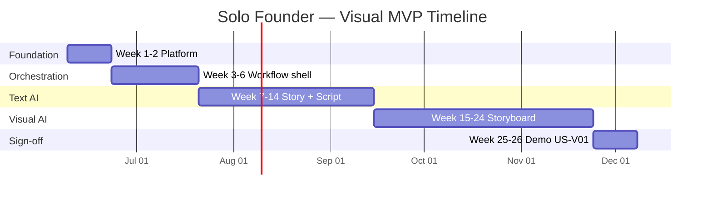

# AIMPOS-Spark Visual — Solo Founder Development Plan

**Document Type:** Solo Founder Execution Plan  
**Version:** 1.0  
**Status:** ARCHIVED — Superseded by [Sprint 0 — Platform Skeleton.md](./Sprint%200%20%E2%80%94%20Platform%20Skeleton.md) and [Sprint Reclassification.md](./Sprint%20Reclassification.md). Do not use for execution.  
**Date:** June 8, 2026  
**Audience:** Solo founder working evenings and weekends  
**Product:** AIMPOS-Spark Visual (`Idea → Story → Script → Storyboard`)  
**Parent Documents:**

- [GitHub Issues - Visual MVP.md](./GitHub%20Issues%20-%20Visual%20MVP.md)
- [MVP Dependency Map.md](./MVP%20Dependency%20Map.md)
- [MVP Definition.md](./MVP%20Definition.md)

---

## Table of Contents

1. [Executive Summary](#1-executive-summary)
2. [Assumptions & Working Model](#2-assumptions--working-model)
3. [Development Effort Estimate](#3-development-effort-estimate)
4. [First 10 Issues to Implement](#4-first-10-issues-to-implement)
5. [AI-Generatable vs Manual Design Issues](#5-ai-generatable-vs-manual-design-issues)
6. [Week 1 Development Plan](#6-week-1-development-plan)
7. [Week 2 Development Plan](#7-week-2-development-plan)
8. [Week 3 Development Plan](#8-week-3-development-plan)
9. [Appendices](#9-appendices)

---

## 1. Executive Summary

This plan translates the **43-issue Visual MVP backlog** into a realistic schedule for one person working **12–15 hours per week** on evenings and weekends.

| Question | Answer |
|----------|--------|
| **How long to Visual MVP?** | **20–26 calendar weeks** (~5–6 months) |
| **Focused effort required?** | **~54 person-days** |
| **What to build first?** | US-02 → US-04 → US-05 → US-06 (platform + GPU proof) |
| **Highest risk weeks?** | Week 2 (GPU smoke), Week 3 (Temporal), Week 24 (ComfyUI frames) |
| **How much can AI write?** | ~70% of boilerplate LOC; you own integration, Olares config, and design decisions |
| **Week 3 outcome?** | Empty 4-stage workflow: start → approve × 4 → `COMPLETED` |

**Three rules for solo execution:**

1. **Week 2 gate is non-negotiable** — prove Ollama + ComfyUI before Temporal or agents.  
2. **WIP limit = 1** — one GitHub issue in progress at a time.  
3. **Saturday = hard problems** — GPU, Temporal, ComfyUI get the long focus block.

---

## 2. Assumptions & Working Model

### 2.1 Time budget

| Slot | Hours | Notes |
|------|-------|-------|
| Weeknights (Mon–Wed) | 6–9 h | 2–3 h × 3 nights; small, committable tasks |
| Weekend (Sat) | 5–7 h | Deep work — hardest issue of the week |
| Weekend (Sun) | 2–4 h | Integration, tests, close issues, docs |
| **Weekly total** | **12–15 h** | ≈ **2 effective person-days** at 6–7 h focus per day |

### 2.2 Environment

| Item | Assumption |
|------|------------|
| Hardware | Olares One target; local Docker acceptable Week 1 |
| AI tooling | Cursor / LLM for scaffolding; founder reviews all merges |
| Skills | Full-stack capable; learning Temporal + ComfyUI during build |
| Scope | Visual MVP only — video and export deferred |

### 2.3 Weekly rhythm

| Day | Purpose |
|-----|---------|
| **Monday** | Plan week; pick one issue; small commit |
| **Tuesday** | Backend / worker |
| **Wednesday** | Backend or Olares deployment |
| **Thursday** | Off or 1 h triage only |
| **Saturday** | Deep work (GPU, Temporal, ComfyUI) |
| **Sunday** | Integration, README, close GitHub issues |

---

## 3. Development Effort Estimate

### 3.1 Summary table

| Metric | 2 FTE team (reference) | Solo evenings/weekends |
|--------|------------------------|-------------------------|
| Backlog size | 43 GitHub issues | 43 GitHub issues |
| User story points | 81 SP | 81 SP |
| Focused person-days | ~48–52 d | **~54 d** (includes learning overhead) |
| Throughput | ~10 d/week | **~2 d/week** |
| **Calendar duration** | 8 weeks | **20–26 weeks** |

### 3.2 Effort by technical area

| Area | Person-days | % of total | Solo risk | AI assist |
|------|-------------|------------|-----------|-----------|
| Infrastructure & deploy | 10 | 19% | Medium | High |
| FastAPI + domain layer | 12 | 22% | Low | High |
| Temporal workflow + activities | 10 | 19% | **High** | Medium |
| LangGraph agents (Story + Script + planner) | 8 | 15% | Medium | Medium |
| ComfyUI storyboard workflow | 6 | 11% | **High** | Low |
| React web console (4 screens) | 8 | 15% | Low | High |
| **Total** | **~54** | **100%** | | |

### 3.3 Milestone calendar



| Milestone | Target week | Gate |
|-----------|-------------|------|
| M1 — Stack healthy | Week 2 | `docker compose up`; Ollama + ComfyUI smoke pass |
| M2 — Workflow skeleton | Week 6 | 4-stage stub run → `COMPLETED` |
| M3 — Text pipeline | Week 14 | Idea → approved script E2E |
| M4 — Visual pipeline | Week 24 | Idea → approved storyboard frames |
| M5 — Visual MVP signed | Week 26 | US-V01 demo script passes |

### 3.4 Scenario ranges

| Scenario | Hours/week | Effective d/week | Weeks to MVP |
|----------|------------|------------------|--------------|
| Optimistic | 15–18 h | 2.5 | ~20 |
| **Realistic** | **12–15 h** | **2.0** | **24–26** |
| Pessimistic | 8–10 h | 1.5 | 32–35 |

### 3.5 Solo vs team — what changes

You **cannot** parallelize backend, frontend, and AI tracks. Required serialization:

```
Platform (Wk 1–2)
  → Workflow shell (Wk 3–6)
    → Text agents (Wk 7–14)
      → ComfyUI storyboard (Wk 15–24)
        → Demo sign-off (Wk 25–26)
```

---

## 4. First 10 Issues to Implement

Epics (`EPIC-01`, `EPIC-02`) and Features (`FEAT-INFRA`, `FEAT-03`) are **parent tracking issues** in GitHub — create them for structure, but **write code against user stories**.

### 4.1 The first 10 (dependency order)

| Rank | ID | Type | Title | Sprint | Est. hours | Why this order |
|------|-----|------|-------|--------|------------|----------------|
| 1 | **US-02** | Story | Deploy MVP stack on Olares | S1 | 8–12 h | Blocks everything — no services, no dev |
| 2 | **US-04** | Story | Database schema foundation | S1 | 4–6 h | All persistence depends on schema |
| 3 | **US-03** | Story | API health and logging | S1 | 3–4 h | Validates API + deps; essential for debugging |
| 4 | **US-05** | Story | MinIO asset upload service | S1 | 4–6 h | Every pipeline output is a versioned asset |
| 5 | **US-06** | Story | Ollama and ComfyUI smoke test | S1 | 6–10 h | **Week 2 kill check** — GPU path must work early |
| 6 | **US-01** | Story | Create default project | S1 | 2–3 h | Pipeline and idea capture need `project_id` |
| 7 | **US-26** | Story | App navigation shell | S2 | 3–4 h | Unblocks all React screens |
| 8 | **US-07** | Story | Start pipeline workflow | S2 | 10–14 h | Temporal 4-stage skeleton — steepest learning |
| 9 | **US-08** | Story | Approve or reject stage output | S2 | 6–8 h | Human-in-the-loop contract |
| 10 | **US-10** | Story | View pipeline status dashboard | S2 | 4–6 h | See workflow state while building agents |

**Combined effort for first 10:** ~50–73 hours ≈ **4–5 weeks** at 12–15 h/week.

### 4.2 Parent issues to open (no code)

| ID | Action |
|----|--------|
| EPIC-01 | Create milestone parent; link US-01–US-06 |
| FEAT-INFRA | Sub-issue group under EPIC-01 |
| EPIC-02 | Open at start of Week 3; link US-07, US-08, US-10 |

### 4.3 Next 5 issues (Week 4–6)

| Rank | ID | Title |
|------|-----|-------|
| 11 | US-09 | Regenerate after rejection |
| 12 | US-24 | Pipeline survives worker restart |
| 13 | US-25 | API token authentication |
| 14 | US-11 | Enter production idea |
| 15 | US-12 | Generate story from idea |

---

## 5. AI-Generatable vs Manual Design Issues

### 5.1 Classification key

| Symbol | Meaning |
|--------|---------|
| 🤖 **AI-heavy** | AI can draft 70–90% of code; you integrate and test |
| 🔀 **Hybrid** | AI drafts scaffolding; you make design decisions + tune |
| 🧠 **Manual** | Founder must decide architecture/creative behavior first |

### 5.2 Full backlog classification (43 issues)

| ID | Title | Class | Rationale |
|----|-------|-------|-----------|
| EPIC-01 | Platform Foundation | 🧠 | Sequencing and scope boundaries |
| FEAT-INFRA | Infrastructure Enabler | 🔀 | Compose layout needs your Olares context |
| US-02 | Deploy MVP stack | 🔀 | AI: compose skeleton · You: GPU, ports, Olares |
| US-04 | Database schema | 🤖 | AI: models + migration · You: verify against MVP §6.5 |
| US-03 | API health/logging | 🤖 | AI: middleware + probes · You: service names |
| US-05 | MinIO upload | 🤖 | AI: client wrapper · You: bucket config + test |
| US-06 | Ollama/ComfyUI smoke | 🧠 | Model choice, workflow JSON, GPU sequencing |
| US-01 | Default project | 🤖 | AI: seed + endpoint · You: idempotent startup |
| EPIC-02 | Pipeline Orchestration | 🧠 | 4-stage state machine design |
| FEAT-03 | Start Production Pipeline | 🧠 | Workflow ID, start semantics |
| FEAT-16 | Pipeline Status Dashboard | 🔀 | 4-stage UX labels |
| US-26 | Nav shell | 🤖 | AI: React Router layout · You: route names |
| US-07 | Start pipeline workflow | 🧠 | Temporal signals, wait conditions, idempotency |
| US-08 | Approve/reject | 🧠 | Immutable approval shape; reject semantics |
| US-09 | Regenerate | 🔀 | AI: endpoint · You: retry limits, note injection |
| US-24 | Worker durability | 🔀 | AI: shutdown config · You: timeout values |
| US-25 | API token auth | 🤖 | AI: Bearer middleware · You: exempt routes |
| US-10 | Dashboard | 🤖 | AI: stepper + polling · You: state mapping |
| EPIC-03 | Idea, Story & Script | 🧠 | Agent sequencing and gates |
| FEAT-01 | Project Bootstrap | 🤖 | Covered by US-01 |
| FEAT-02 | Capture Idea | 🔀 | AI: form · You: validation rules |
| FEAT-04 | AI Story Generation | 🔀 | AI: LangGraph skeleton · You: prompt design |
| FEAT-05 | Story Review | 🤖 | AI: review UI · You: approve wiring |
| FEAT-06 | AI Script Generation | 🔀 | AI: graph skeleton · You: Fountain rules |
| FEAT-07 | Script Review | 🤖 | AI: Fountain preview · You: approve wiring |
| FEAT-13 | Audit Log Viewer | 🤖 | AI: table + API client |
| US-11 | Enter idea | 🤖 | AI: form + POST endpoint |
| US-12 | Generate story | 🔀 | AI: prompt draft · You: quality tuning |
| US-13 | Review story | 🤖 | AI: editor UI |
| US-14 | Generate script | 🔀 | AI: prompt draft · You: 1-scene constraint |
| US-15 | Review script | 🤖 | AI: preview UI |
| US-23 | Audit trail | 🤖 | AI: audit table screen |
| EPIC-04 | Storyboard Stage | 🧠 | Terminal MVP epic — COMPLETED on frame approval |
| FEAT-08 | AI Storyboard | 🧠 | ComfyUI graph, frame count, GPU unload |
| FEAT-09 | Gallery Review | 🔀 | Approve-all semantics |
| FEAT-12 | Asset Version History | 🤖 | AI: stage tabs + list |
| FEAT-14 | Lineage Summary | 🤖 | AI: chain UI (P1 — cut if behind) |
| US-16 | Generate frames | 🧠 | Highest technical risk — ComfyUI + shot planning |
| US-17 | Gallery review | 🔀 | AI: grid UI · You: COMPLETED trigger |
| US-20 | Lineage chain | 🤖 | AI: list/tree component |
| US-22 | Asset versions | 🤖 | AI: version browser |
| EPIC-06 | Governance & Console | 🔀 | Cross-cutting umbrella |
| US-V01 | Visual MVP demo validation | 🧠 | You run demo; document pass/fail |

### 5.3 Summary counts

| Class | Count | Examples |
|-------|-------|----------|
| 🤖 AI-heavy | 18 | US-04, US-05, US-26, US-10, US-11, US-13, US-23 |
| 🔀 Hybrid | 12 | US-02, US-09, US-12, US-14, US-17 |
| 🧠 Manual design | 13 | US-06, US-07, US-08, US-16, US-V01, EPIC-02 |

### 5.4 Manual design decision log (create `DECISIONS.md` Week 1)

| # | Decision | Decide by | Default if unsure |
|---|----------|-----------|-------------------|
| D-01 | Local Docker Week 1 vs Olares immediately | Week 1 Mon | Local Docker first |
| D-02 | Ollama model | Week 2 Wed | `mistral:7b` if VRAM < 16 GB |
| D-03 | ComfyUI workflow | Week 2 Sat | Pin SDXL workflow JSON from US-06 test |
| D-04 | Temporal deployment | Week 2 Tue | Full Temporal in compose (per architecture) |
| D-05 | 4-stage state enum names | Week 3 Tue | Match MVP Definition §3.3 (minus video) |
| D-06 | Approve signal contract | Week 3 Wed | `approve` / `reject` signals + `stage` in payload |
| D-07 | COMPLETED trigger | Week 17 | Storyboard approve-all (US-17) |
| D-08 | GPU rule | Week 2 Sat | Never run Ollama 13B + ComfyUI concurrently |

---

## 6. Week 1 Development Plan

**Sprint alignment:** S1 (partial)  
**Goal:** Repository live, core compose healthy, schema migrated, API `/health` returns 200, default project seeded.  
**Hours budget:** 12–15 h  
**GitHub issues:** US-02, US-04, US-03, US-01  
**Week 1 gate:** `curl localhost:8000/health` → `200` with PostgreSQL + MinIO + Redis statuses.

### 6.1 Issue checklist

| Issue | Tasks | AI? | Hours |
|-------|-------|-----|-------|
| US-02 | Monorepo, compose (pg, minio, redis, api stub) | 🤖/🔀 | 5–6 h |
| US-04 | Models, Alembic migration, apply | 🤖 | 3–4 h |
| US-03 | `/health`, structlog, request ID | 🤖 | 2–3 h |
| US-01 | Seed project, `GET /projects` | 🤖 | 2 h |

### 6.2 Day-by-day schedule

#### Monday — 2 hours · Bootstrap

- [ ] Create GitHub repo `aimpos-spark-visual`
- [ ] Import milestones: `Sprint 1` … `Sprint 4`; labels from [GitHub Issues - Visual MVP.md](./GitHub%20Issues%20-%20Visual%20MVP.md)
- [ ] Open issues: EPIC-01, FEAT-INFRA, US-02, US-04, US-03, US-01
- [ ] **Decision D-01:** Develop on local Docker Desktop this week
- [ ] AI-generate monorepo: `api/`, `worker/`, `web/`, `deploy/`, `README.md`
- [ ] First commit: project skeleton

#### Tuesday — 2 hours · US-02 (partial)

- [ ] AI-generate `deploy/docker-compose.yml`: `postgresql`, `minio`, `redis`
- [ ] Create `.env.example` (DB URL, MinIO keys, API port)
- [ ] Run `docker compose up -d postgresql minio redis`
- [ ] Verify containers healthy

#### Wednesday — 2 hours · US-04

- [ ] **Decision:** Confirm 6 tables per MVP Definition §6.5
- [ ] AI-generate SQLAlchemy models: `projects`, `pipeline_runs`, `asset_versions`, `approvals`, `audit_events`, `lineage_edges`
- [ ] AI-generate Alembic initial migration
- [ ] `alembic upgrade head` against local PostgreSQL

#### Saturday — 5 hours · US-02 + US-03 + US-01 (main block)

- [ ] Add `api` service to compose; FastAPI entrypoint
- [ ] US-03: implement `/health` with PostgreSQL, MinIO, Redis probes
- [ ] US-03: structured JSON logging + `request_id` middleware
- [ ] US-01: startup seed — project `AIMPOS Spark Demo`, status `ACTIVE`
- [ ] US-01: `GET /projects` returns seeded project; empty pipeline list
- [ ] Manual test: hit `/health` and `/projects` via curl
- [ ] **Week 1 gate check**

#### Sunday — 2 hours · Document + prep

- [ ] README: prerequisites, `docker compose up`, env vars, health check
- [ ] Start `DECISIONS.md` with D-01 recorded
- [ ] Close or move to review: US-04, US-03, US-01; US-02 stays open until Week 2
- [ ] Prep Week 2: read Ollama + ComfyUI compose examples; check GPU access

### 6.3 Week 1 exit criteria

| # | Criterion | Pass |
|---|-----------|------|
| 1 | `docker compose up` starts PostgreSQL, MinIO, Redis, API | ☐ |
| 2 | Alembic migration applied without error | ☐ |
| 3 | `GET /health` → 200 with dependency JSON | ☐ |
| 4 | `GET /projects` → `AIMPOS Spark Demo` | ☐ |
| 5 | Code on `main`; at least 3 commits | ☐ |

### 6.4 Week 1 — do not start

- Temporal (US-07) — no workflow until stack is proven  
- Ollama / ComfyUI (US-06) — scheduled Week 2  
- React UI beyond stub — US-26 starts Week 3  

---

## 7. Week 2 Development Plan

**Sprint alignment:** S1 (complete)  
**Goal:** Full 9-container stack; MinIO upload service; Ollama + ComfyUI smoke tests pass on Olares (or GPU machine).  
**Hours budget:** 12–15 h  
**GitHub issues:** US-05, US-06, US-02 (complete), US-03 (harden)  
**Week 2 gate (MVP kill check):** Ollama generates text + ComfyUI writes PNG to MinIO; sequential GPU — no OOM.

### 7.1 Issue checklist

| Issue | Tasks | AI? | Hours |
|-------|-------|-----|-------|
| US-05 | `store_asset()`, SHA-256 keys, integration test | 🤖 | 4–5 h |
| US-02 | Add ollama, comfyui, temporal, worker, web | 🔀 | 4–5 h |
| US-06 | Ollama test, ComfyUI workflow, GPU sequencing doc | 🧠 | 6–8 h |
| US-03 | Add temporal + ollama to health probes | 🤖 | 1 h |

### 7.2 Day-by-day schedule

#### Monday — 2 hours · US-05

- [ ] AI-generate MinIO client: `store_asset(bytes, stage, project_id) → AssetVersion`
- [ ] Content-hash object key; create `asset_versions` row
- [ ] Integration test: upload → download → SHA-256 match
- [ ] Close US-05

#### Tuesday — 2 hours · US-02 (complete stack)

- [ ] Add containers: `ollama`, `comfyui`, `temporal`, `worker` (stub), `web` (stub)
- [ ] **Decision D-04:** Temporal in compose with PostgreSQL persistence
- [ ] Wire `aimpos-spark` internal network; document port map in README
- [ ] `docker compose up` — all 9 services start (worker/web may be stubs)

#### Wednesday — 2 hours · Olares deployment

- [ ] Deploy compose to Olares One (or local GPU workstation)
- [ ] **Decision D-02:** Pull `llama3.1:13b` or `mistral:7b` based on available VRAM
- [ ] Verify zero egress during startup (MVP sovereignty requirement)
- [ ] Fix Olares-specific volume mounts / GPU device paths

#### Saturday — 6 hours · US-06 (critical path)

- [ ] Write `scripts/test_ollama.py` — generate response in < 30 s
- [ ] **Decision D-03:** Select and pin ComfyUI SDXL workflow JSON
- [ ] Write `scripts/test_comfyui.py` — workflow → PNG → `store_asset()` → MinIO
- [ ] **Decision D-08:** Document GPU rule in `worker/README.md`: unload Ollama before ComfyUI
- [ ] Run sequential test: Ollama → unload → ComfyUI — confirm no OOM
- [ ] Close US-06

#### Sunday — 2 hours · Harden + close S1

- [ ] US-03: extend `/health` with `temporal`, `ollama` status
- [ ] US-02: all 9 containers healthy within 5 min — document timing
- [ ] Close US-02, US-03; mark EPIC-01 / FEAT-INFRA ready for review
- [ ] **Week 2 gate check** — if fail, do not proceed to Week 3

### 7.3 Week 2 exit criteria

| # | Criterion | Pass |
|---|-----------|------|
| 1 | 9 containers reach healthy state within 5 min | ☐ |
| 2 | MinIO upload round-trip passes (US-05) | ☐ |
| 3 | Ollama generates text locally in < 30 s | ☐ |
| 4 | ComfyUI produces PNG stored in MinIO | ☐ |
| 5 | Sequential GPU test — no OOM | ☐ |
| 6 | EPIC-01 child stories US-01–US-06 closable | ☐ |

### 7.4 Week 2 failure protocol

If Ollama or ComfyUI fails after 2 remediation attempts:

1. Document blocker in GitHub issue US-06  
2. Pivot: stub storyboard with placeholder PNGs generated locally (no ComfyUI)  
3. Do **not** invest in Temporal until GPU path has a fallback  
4. Revisit ComfyUI in parallel during Week 3–4 orchestration work  

---

## 8. Week 3 Development Plan

**Sprint alignment:** S2 (start)  
**Goal:** 4-stage Temporal workflow skeleton; React nav shell; pipeline start/status/approve APIs; stub E2E to `COMPLETED`.  
**Hours budget:** 12–15 h  
**GitHub issues:** US-26, US-07, US-08, US-10 (US-09/US-24/US-25 opened for Week 4)  
**Week 3 gate:** Start workflow → manually approve 4 times (stub activities) → `COMPLETED`; dashboard reflects state.

### 8.1 Issue checklist

| Issue | Tasks | AI? | Hours |
|-------|-------|-----|-------|
| US-26 | React Router, nav, empty states, API client | 🤖 | 3–4 h |
| US-07 | Temporal workflow, worker, start/status API | 🧠 | 8–10 h |
| US-08 | Approve/reject API + signals | 🧠 | 4–5 h |
| US-10 | Dashboard stepper + polling | 🤖 | 3–4 h |

### 8.2 Day-by-day schedule

#### Monday — 2 hours · US-26

- [ ] AI-generate React app with Vite + TypeScript
- [ ] Routes: `/` (Dashboard), `/review`, `/assets`, `/audit`
- [ ] Nav bar on all pages; empty-state components per route
- [ ] `apiClient.ts` with `VITE_API_URL` + fetch wrapper
- [ ] Close US-26

#### Tuesday — 2 hours · US-07 design

- [ ] **Decision D-05:** Draw 4-stage state diagram on paper or in `DECISIONS.md`:

```
IDEA_CAPTURED → STORY_GENERATING → STORY_REVIEW → SCRIPT_GENERATING
→ SCRIPT_REVIEW → STORYBOARD_GENERATING → STORYBOARD_REVIEW → COMPLETED
```

- [ ] AI-generate `SparkPipelineWorkflow` with `wait_condition` at each review gate
- [ ] Stub activities (no Ollama yet): log stage name → set status → wait for signal
- [ ] Register Temporal worker; verify connection to compose Temporal

#### Wednesday — 2 hours · US-07 API

- [ ] `POST /pipeline/start` → create `pipeline_runs` row + start workflow
- [ ] `GET /pipeline/status` → `current_stage`, `status`, `workflow_id`
- [ ] Duplicate active run → `409 Conflict`
- [ ] Append `PipelineStarted` to `audit_events`
- [ ] Open EPIC-02, FEAT-03 in GitHub; link US-07

#### Saturday — 5 hours · US-08 + US-10

- [ ] **Decision D-06:** `POST /pipeline/approve` body: `{ stage, decision: GRANT|REJECT, note? }`
- [ ] On GRANT: immutable `approvals` row + Temporal `approve` signal
- [ ] On REJECT: store note; workflow stays at current stage
- [ ] US-10: Dashboard 4-step stepper (Idea · Story · Script · Storyboard)
- [ ] US-10: poll `/pipeline/status` every 5 s when `GENERATING`
- [ ] US-10: `Go to Review` CTA when status = `REVIEW`
- [ ] Manual integration test with Temporal Web UI or curl

#### Sunday — 2 hours · E2E stub + document

- [ ] Full stub run: start → approve × 4 → verify `COMPLETED`
- [ ] Record D-05, D-06 in `DECISIONS.md`
- [ ] Open issues for Week 4: US-09, US-24, US-25
- [ ] Close US-07, US-08, US-10 (or mark in review)
- [ ] **Week 3 gate check**

### 8.3 Week 3 exit criteria

| # | Criterion | Pass |
|---|-----------|------|
| 1 | Nav shell renders 4 routes with empty states | ☐ |
| 2 | `POST /pipeline/start` creates Temporal workflow | ☐ |
| 3 | `GET /pipeline/status` returns accurate stage | ☐ |
| 4 | Approve signal advances workflow to next stage | ☐ |
| 5 | Reject keeps workflow at current stage | ☐ |
| 6 | Dashboard stepper matches live status | ☐ |
| 7 | Stub run: 4 approvals → `COMPLETED` | ☐ |

### 8.4 Week 3 — do not start

- US-12 (Story agent) — needs US-08 gate passed  
- US-16 (ComfyUI frames) — needs text pipeline first  
- Real Ollama activities — Week 5+ after US-11  

---

## 9. Appendices

### Appendix A — Weeks 4–26 roadmap (summary)

| Weeks | Focus | Key issues | Cumulative outcome |
|-------|-------|------------|-------------------|
| 4–6 | Finish orchestration | US-09, US-24, US-25 | Durable, secure workflow shell |
| 7–10 | Idea + story | US-11, US-12, US-13 | First real Ollama agent |
| 11–14 | Script + audit | US-14, US-15, US-23 | Idea → approved script |
| 15–20 | Storyboard agent | US-16 (split across weeks) | ComfyUI frames generating |
| 21–24 | Storyboard UI + assets | US-17, US-22, US-20 | Gallery + lineage |
| 25–26 | Sign-off | US-V01 | Visual MVP demo passes |

### Appendix B — Scope cut order (if behind)

Cut in this order only:

1. US-20 / FEAT-14 (lineage UI) — P1  
2. US-25 (auth) — LAN lab acceptable  
3. US-09 (regenerate) — happy-path demo only  
4. US-24 (durability) — document as known limitation  

**Never cut:** US-02, US-06, US-07, US-08, US-12, US-16, US-17, US-V01

### Appendix C — GitHub issue import

```bash
# Week 1 — example
gh issue create \
  --title "[US-02] Deploy MVP stack on Olares" \
  --label "aimpos-spark,visual-mvp,user-story,sprint:s1,priority:p0,devops" \
  --milestone "Sprint 1" \
  --body-file issues/US-02.md
```

Issue bodies: copy from [GitHub Issues - Visual MVP.md](./GitHub%20Issues%20-%20Visual%20MVP.md).

### Appendix D — Related documents

| Document | Use when |
|----------|----------|
| [MVP Dependency Map.md](./MVP%20Dependency%20Map.md) | Checking blockers between issues |
| [GitHub Issues - Visual MVP.md](./GitHub%20Issues%20-%20Visual%20MVP.md) | Full AC, tasks, labels per issue |
| [MVP Definition.md](./MVP%20Definition.md) | Scope contract; kill criteria |
| [System Architecture.md](./System%20Architecture.md) | Architectural decisions |

---

## Document Control

| Version | Date | Author | Changes |
|---------|------|--------|---------|
| 1.0 | 2026-06-08 | Product / Architecture | Initial solo founder plan — effort, first 10, AI/manual split, Weeks 1–3 |

*End of document*
