# AIMPOS — Production-Grade System Architecture

**Document Type:** Solution Architecture — C4 Model & Deployment  
**Version:** 1.0  
**Status:** READ-ONLY REFERENCE — Frozen June 9, 2026. MVP subset in MVP Scope Freeze §5.
**Date:** June 8, 2026  
**Parent Documents:**

- [Blueprint for a multi-year initiative.md](./Blueprint%20for%20a%20multi-year%20initiative.md)
- [Domain Driven Design.md](./Domain%20Driven%20Design.md)
- [Technology Recommendations.md](./Technology%20Recommendations.md)
- [Workflow Architecture.md](./Workflow%20Architecture.md)
- [Multi-Agent Architecture.md](./Multi-Agent%20Architecture.md)
- [Enterprise Knowledge Graph.md](./Enterprise%20Knowledge%20Graph.md)

---

## Table of Contents

1. [Architecture Overview](#1-architecture-overview)
2. [C4 Level 1 — System Context](#2-c4-level-1--system-context)
3. [C4 Level 2 — Container Diagram](#3-c4-level-2--container-diagram)
4. [C4 Level 3 — Component Diagrams](#4-c4-level-3--component-diagrams)
5. [Frontend](#5-frontend)
6. [Backend](#6-backend)
7. [Workflow Engine](#7-workflow-engine)
8. [Agent Runtime](#8-agent-runtime)
9. [Knowledge Graph](#9-knowledge-graph)
10. [Asset Storage](#10-asset-storage)
11. [Model Runtime](#11-model-runtime)
12. [Observability](#12-observability)
13. [Security](#13-security)
14. [Identity](#14-identity)
15. [GPU Burst Execution](#15-gpu-burst-execution)
16. [Deployment Architecture](#16-deployment-architecture)
17. [Network & Trust Zones](#17-network--trust-zones)
18. [Critical Data Flows](#18-critical-data-flows)

---

## 1. Architecture Overview

AIMPOS is a **sovereign, production-grade media operating system** deployed on Olares One (Kubernetes + Docker). It separates **control** (workflows, approvals), **intelligence** (agents, models), **assets** (versioned media), and **compute** (local GPU + ephemeral burst) into distinct runtime planes connected by event-driven integration.

### 1.1 Architecture Principles

| Principle | Implementation |
|-----------|----------------|
| **Local-first sovereignty** | Default runtime on Olares; deny-by-default egress |
| **Workflow-governed AI** | Temporal gates all production actions; agents propose only |
| **Single transactional truth** | PostgreSQL owns aggregates; all other stores are projections or blobs |
| **Defense in depth** | Identity → policy → network → encryption → audit |
| **Observable by default** | OpenTelemetry on every cross-plane call |
| **Burst as exception** | Ephemeral cloud GPU; encrypted job package; auto-teardown |

### 1.2 Logical Planes

```
┌────────────────────────────────────────────────────────────────────────┐
│  EXPERIENCE PLANE     │ Web Console, Open WebUI, Integrations         │
├───────────────────────┼────────────────────────────────────────────────┤
│  API PLANE            │ FastAPI services, BFF, WebSocket gateway      │
├───────────────────────┼────────────────────────────────────────────────┤
│  CONTROL PLANE        │ Temporal, Approval Service, Policy (OPA)      │
├───────────────────────┼────────────────────────────────────────────────┤
│  INTELLIGENCE PLANE   │ LangGraph, Model Router, Tool Registry        │
├───────────────────────┼────────────────────────────────────────────────┤
│  ASSET PLANE          │ MinIO, LakeFS, Proxy/Transcode, Metadata API │
├───────────────────────┼────────────────────────────────────────────────┤
│  KNOWLEDGE PLANE      │ Neo4j, Graph Projector, Lineage API           │
├───────────────────────┼────────────────────────────────────────────────┤
│  MODEL PLANE          │ Ollama, vLLM, ComfyUI, Whisper                │
├───────────────────────┼────────────────────────────────────────────────┤
│  COMPUTE PLANE        │ K8s GPU scheduler, Burst Orchestrator         │
├───────────────────────┼────────────────────────────────────────────────┤
│  PLATFORM PLANE       │ Identity, Security, Observability, NAS       │
└────────────────────────────────────────────────────────────────────────┘
```

---

## 2. C4 Level 1 — System Context

Shows AIMPOS as a system and its relationships with users and external systems.

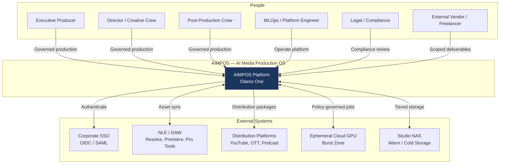

### 2.1 Context Descriptions

| Element | Type | Description |
|---------|------|-------------|
| **AIMPOS Platform** | System | Sovereign media production OS on Olares One |
| **Creative Crew** | Person | Directors, writers, editors — human approval authority |
| **Executive Producer** | Person | Slate oversight, budget, distribution sign-off |
| **MLOps Engineer** | Person | Models, GPU, burst policy, platform health |
| **Corporate SSO** | External | Identity provider — Keycloak/Zitadel or enterprise IdP |
| **NLE / DAW** | External | Creative tools via watch-folder / S3 / API |
| **Distribution Platforms** | External | Publication targets after Publication Gate |
| **Ephemeral Cloud GPU** | External | Burst-only compute; no persistent data |
| **Studio NAS** | External | Warm/cold asset tier; backup target |

---

## 3. C4 Level 2 — Container Diagram

Containers (deployable applications/data stores) inside AIMPOS.

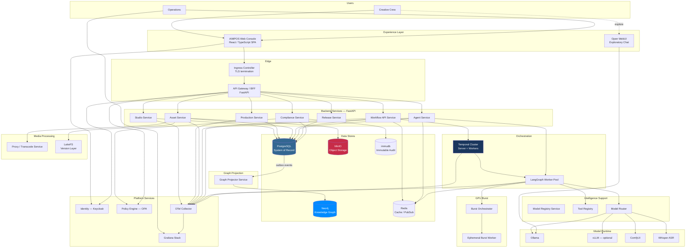

### 3.1 Container Catalog

| Container | Technology | Responsibility |
|-----------|------------|----------------|
| AIMPOS Web Console | React, TypeScript, Vite | Role-based production UI, approvals, lineage viewer |
| API Gateway / BFF | FastAPI | AuthZ, request routing, WebSocket, response aggregation |
| Studio Service | FastAPI | Projects, workspaces, teams, slate |
| Production Service | FastAPI | Scripts, scenes, characters, edits |
| Asset Service | FastAPI | Metadata, versions, ingest, pre-signed URLs |
| Workflow API Service | FastAPI | Workflow triggers, approval signals, task queues |
| Agent Service | FastAPI | Agent task management, trace API |
| Release Service | FastAPI | Masters, releases, publication gates |
| Compliance Service | FastAPI | Policy, consent, disclosure, audit export |
| Temporal Cluster | Temporal + Python workers | WF-01–09 durable orchestration |
| LangGraph Worker Pool | LangGraph + Python | 10-agent runtime |
| Graph Projector | Python / FastAPI | PG outbox → Neo4j sync |
| PostgreSQL | PostgreSQL 16 | Transactional SoR |
| Neo4j | Neo4j 5 Community | Knowledge graph projection |
| MinIO | MinIO | S3-compatible hot storage |
| LakeFS | LakeFS | Git-like version layer over MinIO |
| Redis | Redis 7 | Cache, pub/sub, checkpoints |
| immudb | immudb | Immutable audit supplement |
| Ollama | Ollama | Local LLM inference |
| ComfyUI | ComfyUI | Diffusion / storyboard generation |
| Burst Orchestrator | FastAPI + K8s job API | Ephemeral cloud GPU lifecycle |
| Keycloak | Keycloak | OIDC, RBAC, vendor sandboxes |
| OPA | Open Policy Agent | Policy evaluation sidecar |
| OTel Collector | OpenTelemetry | Trace/metric/log collection |

---

## 4. C4 Level 3 — Component Diagrams

### 4.1 Backend — API Gateway / BFF Components

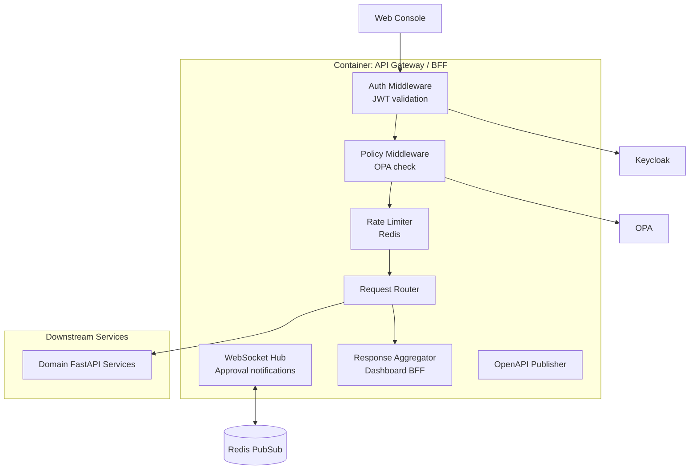

### 4.2 Backend — Asset Service Components

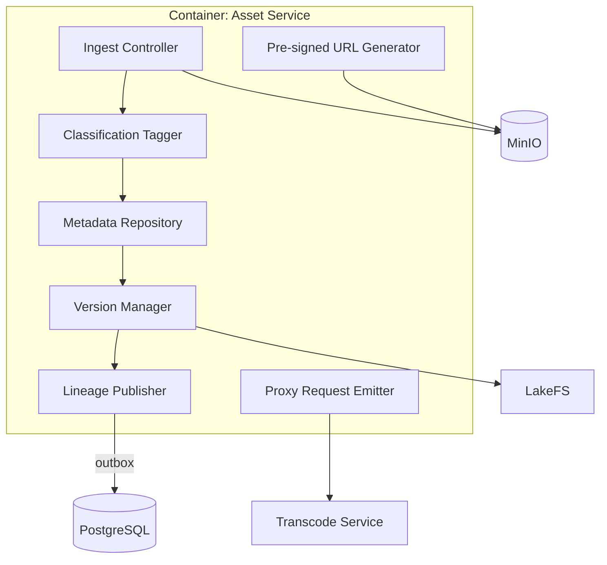

### 4.3 Workflow Engine Components

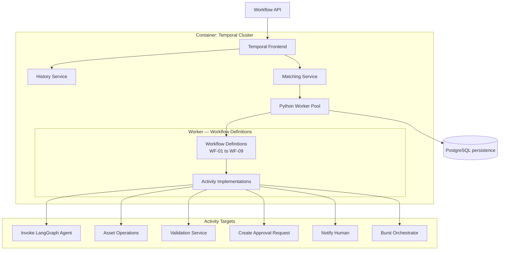

### 4.4 Agent Runtime Components

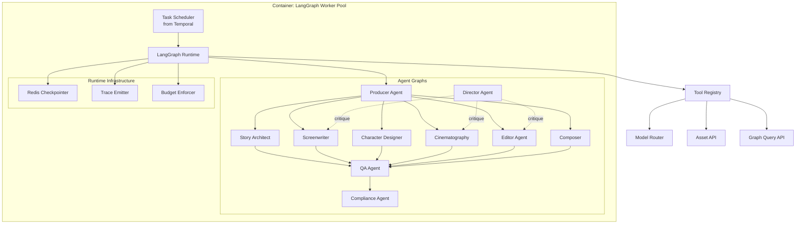

---

## 5. Frontend

### 5.1 Architecture

| Attribute | Specification |
|-----------|---------------|
| **Application** | AIMPOS Web Console |
| **Framework** | React 18 + TypeScript |
| **Build** | Vite |
| **State** | TanStack Query (server state) + Zustand (UI state) |
| **Auth** | OIDC via Keycloak (PKCE flow) |
| **Real-time** | WebSocket to BFF for approvals, agent traces |
| **Styling** | Role-adaptive layouts per persona (Director, EP, MLOps) |
| **i18n** | EN + AR (RTL) by Phase 2 |
| **Accessibility** | WCAG 2.1 AA |

### 5.2 Frontend Module Map

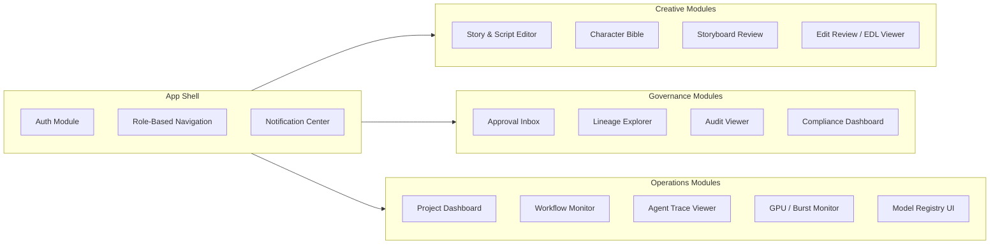

### 5.3 Frontend — Backend Contract

| Module | API Surface | Real-time |
|--------|-------------|-----------|
| Approval Inbox | `Workflow API` REST | WebSocket `approval.{userId}` |
| Storyboard Review | `Asset Service` + `Production Service` | — |
| Lineage Explorer | `Graph Query API` (Neo4j read) | — |
| Workflow Monitor | `Workflow API` + Temporal UI embed | WebSocket `workflow.{projectId}` |
| Agent Trace Viewer | `Agent Service` | WebSocket `agent.{taskId}` |
| GPU Monitor | `Observability API` / Grafana embed | SSE metrics stream |

### 5.4 Open WebUI (Adjacent — Not Production Console)

Deployed in `aimpos-sandbox` namespace. Used for exploratory Ollama chat only. Does not call Workflow API or Asset promote endpoints.

---

## 6. Backend

### 6.1 Service Architecture

| Service | Bounded Context | PostgreSQL Schemas | Key APIs |
|---------|----------------|-------------------|----------|
| `aimpos-studio` | Studio & Project | `studio.*` | `/projects`, `/workspaces`, `/teams` |
| `aimpos-production` | Production Lifecycle | `production.*` | `/scripts`, `/scenes`, `/characters`, `/edits` |
| `aimpos-assets` | Asset & Provenance | `assets.*` | `/assets`, `/versions`, `/ingest`, `/presign` |
| `aimpos-workflow` | Governed Workflow | `workflow.*` | `/workflows`, `/approvals`, `/tasks` |
| `aimpos-agents` | Agentic Intelligence | `agents.*` | `/agent-tasks`, `/traces`, `/prompts` |
| `aimpos-release` | Release & Publication | `release.*` | `/masters`, `/releases`, `/gates` |
| `aimpos-compliance` | Compliance & Policy | `compliance.*` | `/policies`, `/consent`, `/audit-export` |
| `aimpos-graph` | Graph read API | — (Neo4j read) | `/graph/query`, `/graph/lineage`, `/graph/impact` |
| `aimpos-burst` | GPU Burst | `compute.*` | `/burst/request`, `/burst/status` |

### 6.2 Backend Cross-Cutting

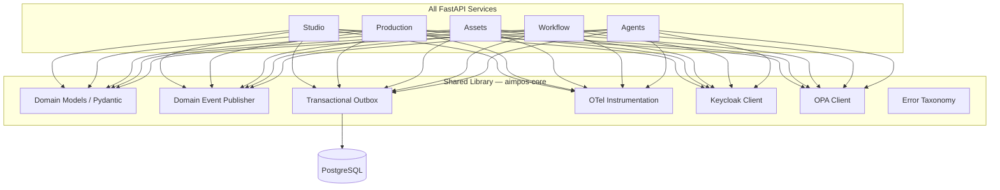

### 6.3 Event-Driven Integration

| Event | Publisher | Consumers |
|-------|-----------|-----------|
| `AssetVersionCreated` | Asset Service | Graph Projector, Workflow (activity) |
| `ApprovalGranted` | Workflow API | Asset Service (promote), Graph Projector |
| `ProposalGenerated` | Agent Service | Asset Service, Graph Projector |
| `ScriptLocked` | Production Service | Temporal (child workflow) |
| `PublicationAuthorized` | Release Service | Integration connectors |

**Pattern:** Transactional outbox in PostgreSQL → async dispatcher → Redis Streams / direct HTTP → consumers.

### 6.4 Backend Deployment Unit

| Phase | Strategy |
|-------|----------|
| Phase 0 | 2 pods: `aimpos-platform` (studio+production+workflow+compliance), `aimpos-media` (assets+agents+release) |
| Phase 1 | 1 pod per service (8 services) |
| Phase 2 | HPA per service; dedicated `aimpos-graph` read replicas |

---

## 7. Workflow Engine

### 7.1 Temporal Architecture

| Component | Replicas (Phase 0) | Replicas (Phase 2) | Storage |
|-----------|------------------|--------------------|---------|
| Temporal Frontend | 1 | 2 | — |
| Temporal History | 1 | 2 | PostgreSQL |
| Temporal Matching | 1 | 2 | PostgreSQL |
| Temporal Worker | 2 | 4–8 (specialized queues) | — |

### 7.2 Task Queues

| Queue | Worker Pool | Workflows / Activities |
|-------|-------------|------------------------|
| `aimpos-creative` | creative-workers | WF-01, WF-02, WF-03, agent story/script |
| `aimpos-preprod` | preprod-workers | WF-04, WF-05, WF-07-previz |
| `aimpos-post` | post-workers | WF-06, WF-07, WF-08 |
| `aimpos-release` | release-workers | WF-09, compliance scan |
| `aimpos-gpu` | gpu-workers | ComfyUI, burst dispatch, transcode |

### 7.3 Human-in-the-Loop Integration

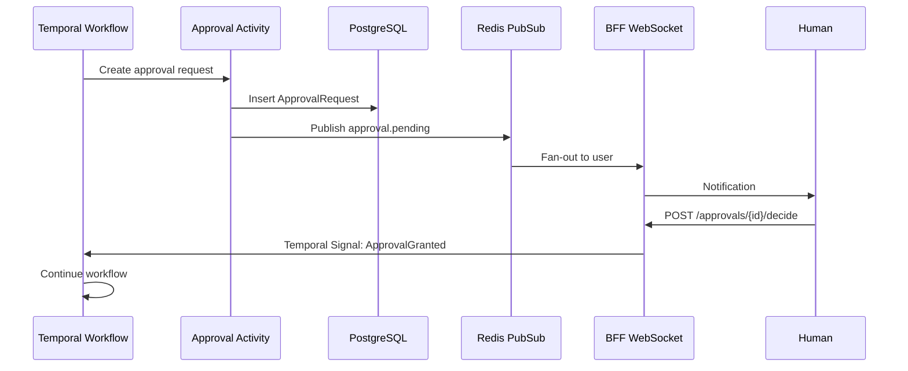

### 7.4 Workflow Engine Diagram

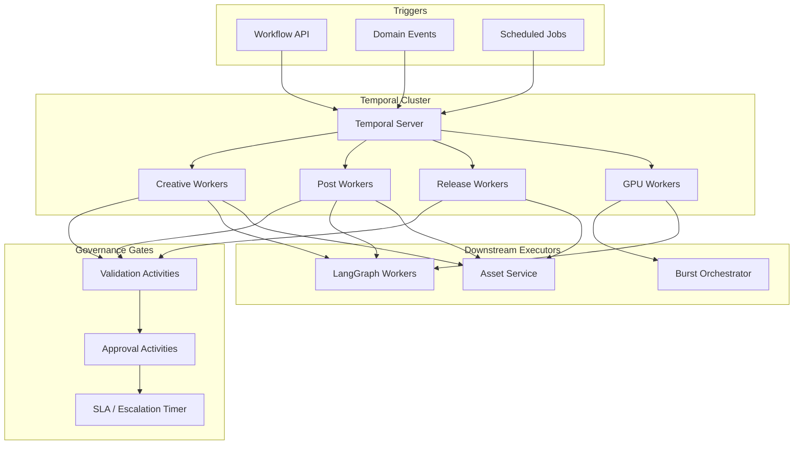

---

## 8. Agent Runtime

### 8.1 Runtime Architecture

| Component | Technology | Scaling |
|-----------|------------|---------|
| Agent API | FastAPI (`aimpos-agents`) | 2+ pods |
| LangGraph workers | Python processes in K8s Deployment | 2–4 pods; GPU node affinity for visual |
| Tool Registry | In-process + Redis catalog | Shared |
| Checkpointer | Redis | 2 GB dedicated |
| Trace store | PostgreSQL + OTel | Append-only |

### 8.2 Agent Execution Flow

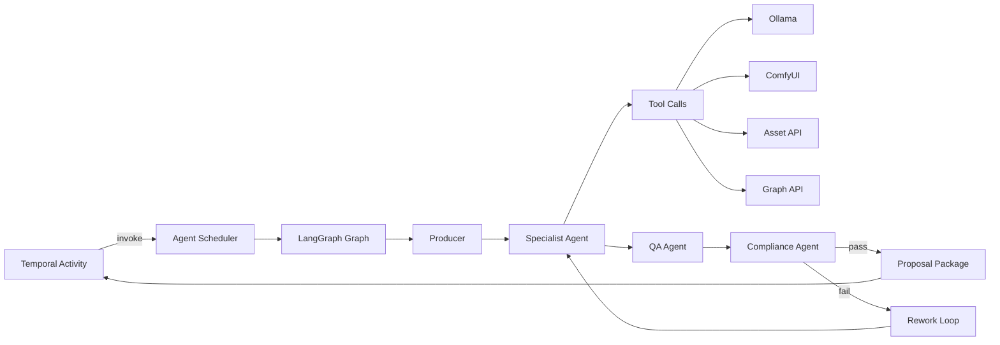

### 8.3 Agent Pod Specification

| Pod Type | GPU | RAM | Agents |
|----------|-----|-----|--------|
| `agent-llm` | Optional | 4 GB | Story, Screenwriter, Producer, QA, Compliance, Director |
| `agent-visual` | 1× RTX 5090 shared | 8 GB | Cinematography, Character Designer |
| `agent-audio` | — | 4 GB | Composer (CPU + Whisper sidecar) |

**GPU scheduling:** K8s `nvidia.com/gpu` resource limits; max 2 concurrent GPU agent tasks on single Olares One.

---

## 9. Knowledge Graph

### 9.1 Architecture

| Layer | Component | Responsibility |
|-------|-----------|----------------|
| **Write path** | Domain services → PG outbox | Authoritative events |
| **Projection** | Graph Projector service | Idempotent Neo4j MERGE |
| **Read path** | Graph Query API (`aimpos-graph`) | Cypher queries; read-only |
| **Agent path** | `kg_query` tool | LangGraph read access |

### 9.2 Knowledge Graph Diagram

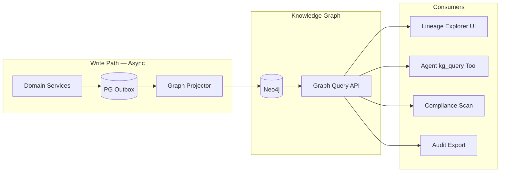

### 9.3 Graph Projector Guarantees

| Guarantee | Implementation |
|-----------|----------------|
| Idempotency | MERGE on `uid`; event_id dedup |
| Ordering | Per-aggregate sequence number |
| Lag target | < 5 seconds p95 |
| Recovery | Full rebuild from outbox < 4 hours |
| Consistency | Eventual — critical path reads PostgreSQL |

### 9.4 Neo4j Deployment

| Attribute | Phase 0 | Phase 2 |
|-----------|---------|---------|
| Edition | Community | Community / Enterprise (RBAC) |
| Heap | 4 GB | 8 GB |
| Storage | 50 GB PVC | 200 GB PVC |
| Backups | Daily to NAS | Hourly incremental |

---

## 10. Asset Storage

### 10.1 Storage Tier Architecture

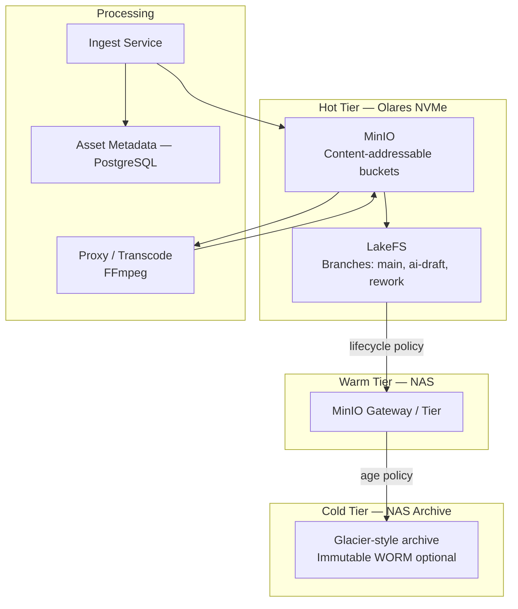

### 10.2 Bucket Strategy

| Bucket | Content | Classification |
|--------|---------|----------------|
| `aimpos-hot-assets` | All production media | Per-object tags |
| `aimpos-proxies` | Editorial proxies | INTERNAL |
| `aimpos-ai-draft` | Unapproved AI outputs | Per-project |
| `aimpos-deliverables` | Certified masters | CONFIDENTIAL |
| `aimpos-burst-temp` | Encrypted burst job packages | Auto-expire 24h |

### 10.3 Version Model

| Layer | System | Responsibility |
|-------|--------|----------------|
| Bytes | MinIO | Content-hash addressed blobs |
| Branches | LakeFS | `main`, `ai-draft`, `rework-{n}` |
| Metadata | PostgreSQL | Version records, tags, classification |
| Lineage | Neo4j | `DERIVED_FROM`, `APPROVED_BY` edges |

### 10.4 Ingest Pipeline

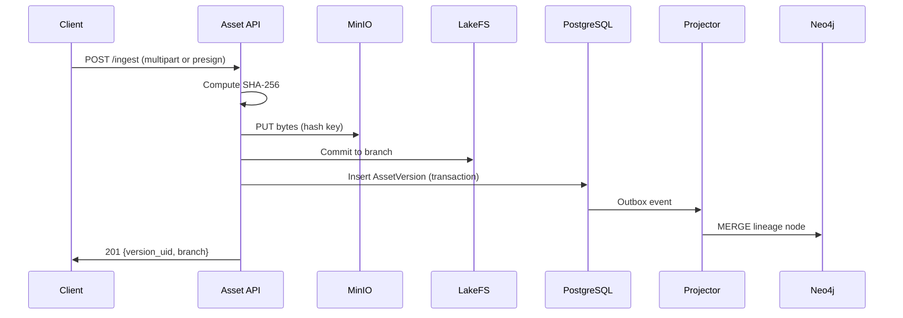

---

## 11. Model Runtime

### 11.1 Model Plane Architecture

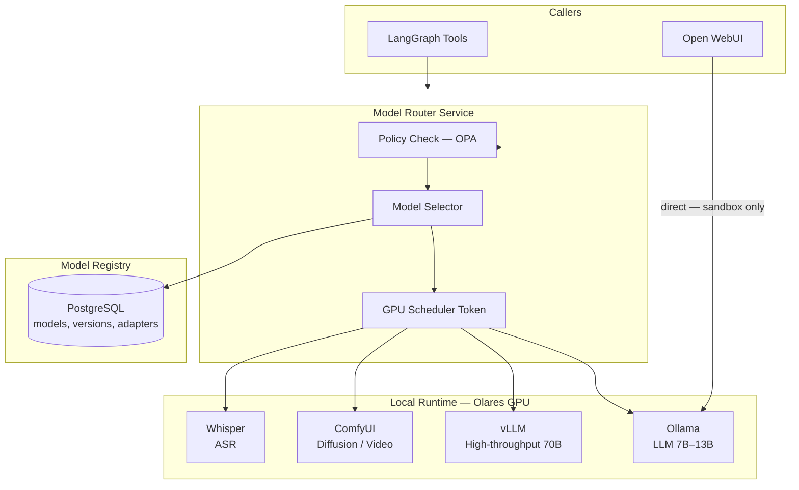

### 11.2 Model Deployment Matrix

| Model Type | Runtime | Olares VRAM | Phase |
|------------|---------|-------------|-------|
| LLM 7B–13B | Ollama | 8–16 GB | P0 |
| LLM 70B (quantized) | Ollama / vLLM | 20–24 GB | P1 |
| Image diffusion | ComfyUI + SD/Flux | 8–12 GB | P0 |
| Video generation | ComfyUI + video model | 16–24 GB | P1 |
| ASR | Whisper container | CPU / 2 GB VRAM | P1 |
| Embeddings | Ollama / dedicated | 2 GB | P1 |

### 11.3 GPU Scheduling Rules

| Priority | Workload | Preemption |
|----------|----------|------------|
| P0 — Interactive | Human-triggered agent chat | Never |
| P1 — Workflow | Temporal GPU activities | On P0 |
| P2 — Batch | Transcode, embedding index | On P0–P1 |
| P3 — Burst candidate | Jobs routed to cloud | Local queue timeout |

**Constraint:** Only one VRAM-heavy model (ComfyUI video OR 70B LLM) at a time on single Olares One.

---

## 12. Observability

### 12.1 Observability Architecture

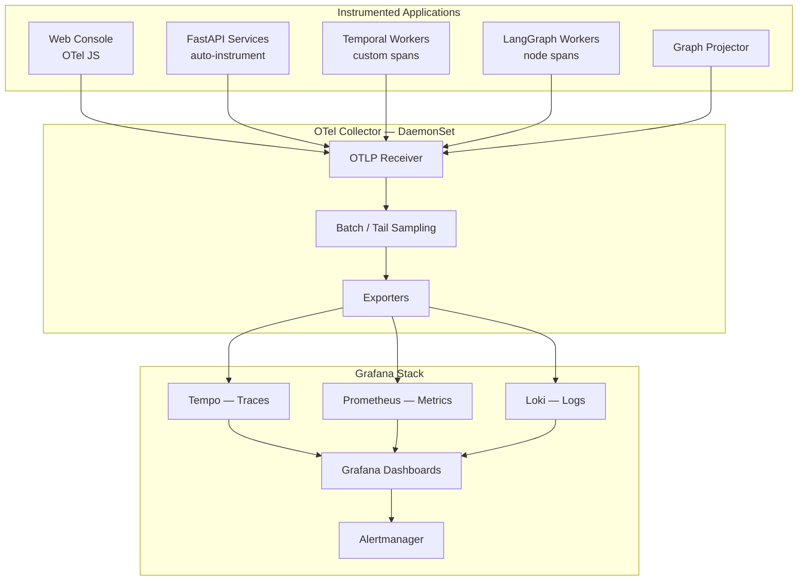

### 12.2 Golden Signals per Plane

| Plane | Metrics | Traces | Logs |
|-------|---------|--------|------|
| Frontend | LCP, API latency, WS reconnects | User session traces | Client errors |
| Backend | Request rate, p95 latency, error % | Per-service spans | Structured JSON |
| Workflow | Workflow duration, stuck approvals | Workflow → activity chain | Temporal worker logs |
| Agent | Token usage, GPU minutes, rework count | Agent → tool → model spans | Agent trace IDs |
| Assets | Ingest throughput, storage usage | Ingest → MinIO spans | Ingest failures |
| Model | GPU util, queue depth, inference latency | Model invocation spans | OOM / CUDA errors |
| Graph | Projector lag, query p95 | Projector batch spans | MERGE failures |
| Burst | Job cost, provision time, teardown | Burst lifecycle spans | Policy denials |

### 12.3 Sampling Strategy

| Path | Sample Rate |
|------|-------------|
| AI agent → model → tool | 100% |
| Approval grant/reject | 100% |
| Burst job lifecycle | 100% |
| Standard API reads | 10% |
| Health checks | 1% |

### 12.4 Key Dashboards

| Dashboard | Audience |
|-----------|----------|
| Executive Production | EP — projects, approvals, SLA |
| Agent Operations | MLOps — GPU, model, agent budgets |
| Compliance Audit | Legal — AI usage, egress, consent |
| Platform Health | SRE — pod health, DB, queue depth |

---

## 13. Security

### 13.1 Security Architecture

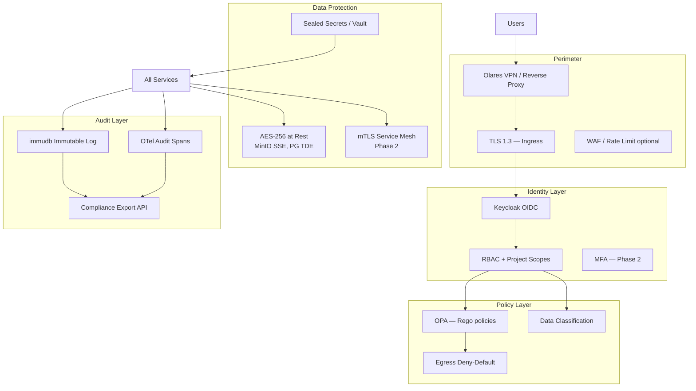

### 13.2 Security Controls Matrix

| Control | Implementation | NFR |
|---------|----------------|-----|
| Authentication | Keycloak OIDC + PKCE | FR-84 |
| Authorization | RBAC project + asset + action | NFR-34 |
| Policy enforcement | OPA sidecar on BFF + burst orchestrator | FR-41 |
| Encryption at rest | MinIO SSE-S3; PG volume encryption | NFR-30 |
| Encryption in transit | TLS 1.3 external; mTLS internal Phase 2 | NFR-31 |
| Secrets | K8s Sealed Secrets; no secrets in workflows | NFR-33 |
| Egress | NetworkPolicy deny-all; allowlist per project | NFR-32 |
| Audit | immudb + PostgreSQL audit tables + OTel | FR-70 |
| Vendor isolation | Scoped pre-signed URLs; time-limited grants | FR vendor sandbox |
| Air-gap | Full offline 72h — no external deps required | NFR-35 |

### 13.3 Kubernetes Security

| Measure | Scope |
|---------|-------|
| Namespace per studio | `aimpos-studio-{id}` |
| NetworkPolicy | Deny cross-namespace except mesh |
| Pod Security Standards | Restricted profile |
| Non-root containers | All AIMPOS images |
| GPU pod isolation | Dedicated SA for GPU workloads |
| Image scanning | Trivy in CI pipeline |

---

## 14. Identity

### 14.1 Identity Architecture

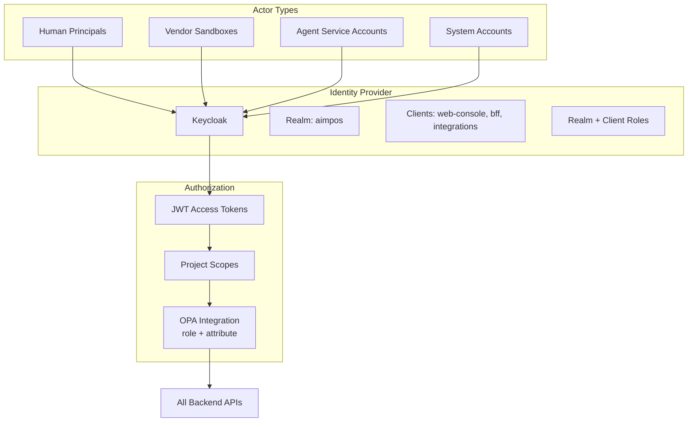

### 14.2 Role Mapping (Personas → Keycloak Roles)

| Keycloak Role | Persona | Permissions |
|---------------|---------|-------------|
| `ep` | Executive Producer | Slate, budget, distribution sign-off |
| `director` | Director | Creative approvals, storyboard, cut |
| `writer` | Lead Writer | Script review, writers' room |
| `post-supervisor` | Post Supervisor | Editorial, QC, conform |
| `sound-supervisor` | Sound Supervisor | Audio approvals |
| `vfx-artist` | VFX / AI Artist | Agent tasks, GPU requests |
| `mlops` | MLOps | Model registry, burst policy |
| `security` | Security Officer | Audit export, policy admin |
| `vendor` | External Vendor | Scoped project upload only |
| `agent-sa` | Agent Service Account | Tool execution — no approve |

### 14.3 Vendor Sandbox Flow

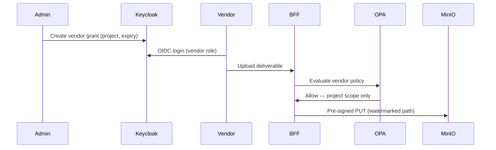

---

## 15. GPU Burst Execution

### 15.1 Burst Architecture

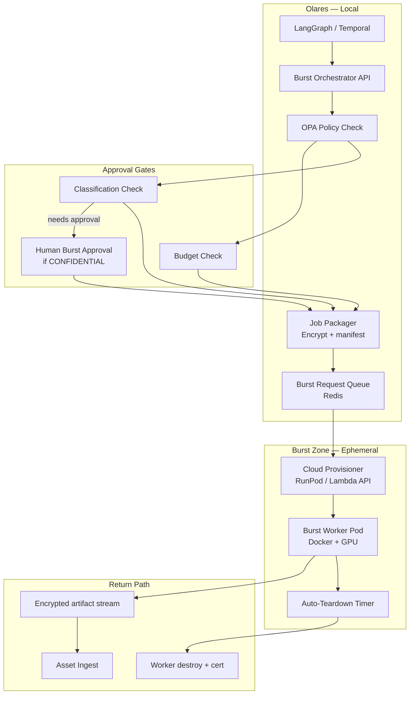

### 15.2 Burst Job Lifecycle

```mermaid
stateDiagram-v2
    [*] --> REQUESTED: BurstRequestCreated
    REQUESTED --> POLICY_CHECK: EvaluatePolicy
    POLICY_CHECK --> REJECTED: PolicyDeny
    POLICY_CHECK --> AWAITING_APPROVAL: ClassificationTalent
    AWAITING_APPROVAL --> PACKAGING: HumanApproved
    POLICY_CHECK --> PACKAGING: PolicyPass
    PACKAGING --> PROVISIONING: CloudProvisionStarted
    PROVISIONING --> RUNNING: WorkerReady
    RUNNING --> RETURNING: JobComplete
    RETURNING --> INGESTED: AssetRegistered
    INGESTED --> TEARING_DOWN: TeardownInitiated
    TEARING_DOWN --> RECONCILED: CostRecorded
    RECONCILED --> [*]
    REJECTED --> [*]
```

### 15.3 Burst Security Requirements

| Requirement | Implementation |
|-------------|----------------|
| No persistent cloud storage | Worker PVC ephemeral; wipe on teardown |
| Encrypted transit | TLS 1.3 + encrypted job tarball (AES-256-GCM) |
| Data minimization | Job package contains proxies only — not full masters unless approved |
| Auto-teardown | Max runtime 4h; kill on completion + 15m |
| Cost reconciliation | Per-job cost → `CostRecord` in PostgreSQL |
| Audit | 100% OTel trace; immudb burst event |
| Deny by default | OPA: `burst_allowed == false` unless explicit policy |

### 15.4 Burst vs Local Decision

| Condition | Route |
|-----------|-------|
| Classification PUBLIC / INTERNAL + budget OK | Local GPU first |
| Local queue > 30 min + policy allows | Burst eligible |
| Classification CONFIDENTIAL | Local only — no burst |
| Classification TALENT | Human approval + burst with encrypted package |
| Video 4K+ generation | Burst recommended after policy pass |

---

## 16. Deployment Architecture

### 16.1 Phase 0 — Single Olares One Deployment

```mermaid
flowchart TB
    subgraph OlaresOne["Olares One — Single Node K8s"]
        subgraph NS_Platform["namespace: aimpos-platform"]
            INGRESS[Ingress NGINX]
            BFF[BFF — 2 replicas]
            PLATFORM[Platform Services Pod<br/>studio, production, workflow, compliance]
            MEDIA[Media Services Pod<br/>assets, agents, release]
            PROJECTOR[Graph Projector — 1]
            BURST[Burst Orchestrator — 1]
        end

        subgraph NS_Data["namespace: aimpos-data"]
            PG[(PostgreSQL)]
            NEO[(Neo4j)]
            REDIS[(Redis)]
            MINIO[(MinIO)]
            LAKEFS[LakeFS]
            IMMU[(immudb)]
        end

        subgraph NS_Orchestration["namespace: aimpos-orchestration"]
            TEMP[Temporal Server]
            TW[Temporal Workers — 2]
            LG[LangGraph Workers — 2]
        end

        subgraph NS_GPU["namespace: aimpos-gpu"]
            OLLAMA[Ollama]
            COMFY[ComfyUI]
            PROXY[Transcode]
        end

        subgraph NS_Observability["namespace: aimpos-observability"]
            OTEL[OTel Collector DS]
            GRAF[Grafana Stack]
        end

        subgraph NS_Identity["namespace: aimpos-identity"]
            KC[Keycloak]
            OPA[OPA]
        end

        subgraph NS_Sandbox["namespace: aimpos-sandbox"]
            OWUI[Open WebUI]
        end
    end

    subgraph External_Storage["External"]
        NAS[NAS — Warm Tier]
    end

    subgraph External_Burst["Burst Zone"]
        CLOUD[Ephemeral GPU]
    end

    INGRESS --> BFF --> PLATFORM & MEDIA
    PLATFORM --> PG & TEMP & KC
    MEDIA --> PG & MINIO & LG
    LG --> OLLAMA & COMFY
    TEMP --> TW --> LG
    MINIO --> NAS
    BURST --> CLOUD
    PLATFORM & MEDIA & TEMP & LG --> OTEL --> GRAF
```

### 16.2 Resource Allocation — Olares One Phase 0

| Namespace | CPU Request | RAM Request | GPU | Storage |
|-----------|-------------|-------------|-----|---------|
| aimpos-platform | 4 cores | 8 GB | — | — |
| aimpos-data | 4 cores | 20 GB | — | 600 GB PVC |
| aimpos-orchestration | 4 cores | 8 GB | — | 50 GB |
| aimpos-gpu | 4 cores | 24 GB | 1 | 100 GB |
| aimpos-observability | 2 cores | 4 GB | — | 100 GB |
| aimpos-identity | 1 core | 2 GB | — | 10 GB |
| **Total** | **19 cores** | **66 GB** | **1** | **~860 GB** |
| Headroom | 5 cores | 30 GB | shared | 1.1 TB |

### 16.3 Phase 2 — Multi-Node Olares Cluster

```mermaid
flowchart TB
    subgraph Cluster["Olares K8s Cluster"]
        subgraph Node1["Node 1 — Control + API"]
            INGRESS[Ingress]
            BFF[BFF + All FastAPI Services]
            TEMP[Temporal Server]
            PG[(PostgreSQL Primary)]
            KC[Keycloak]
        end

        subgraph Node2["Node 2 — GPU Primary"]
            OLLAMA[Ollama]
            COMFY[ComfyUI]
            VLLM[vLLM]
            LG[LangGraph GPU Workers]
            TW_GPU[Temporal GPU Workers]
        end

        subgraph Node3["Node 3 — Data + Graph"]
            NEO[(Neo4j)]
            MINIO[(MinIO Distributed)]
            REDIS[(Redis Sentinel)]
            PG_REP[(PostgreSQL Replica)]
            PROJECTOR[Graph Projector]
        end
    end

    subgraph NAS_Ext["NAS"]
        WARM[Warm / Cold Tier]
        BACKUP[Backups]
    end

    subgraph Burst_Ext["Burst Zone"]
        CLOUD[Cloud GPU Pool]
    end

    Node1 <--> Node2 & Node3
    MINIO --> WARM
    PG & NEO --> BACKUP
    Node2 --> CLOUD
```

### 16.4 Deployment Diagram — Network View

```mermaid
flowchart TB
    subgraph Internet["Remote Access"]
        USER[Remote Users]
    end

    subgraph OlaresNet["Olares Local Network"]
        VPN[Olares VPN / Reverse Proxy]

        subgraph K8s["Kubernetes Cluster"]
            ING[Ingress :443]
            SVC[ClusterIP Services]
            GPU[GPU Node Pool]
        end

        NAS[NAS :2049/NFS]
    end

    subgraph CloudBurst["Cloud — Burst Only"]
        PROV[GPU Provider API]
        WORKER[Ephemeral Worker]
    end

    USER -->|VPN/TLS| VPN --> ING --> SVC
    SVC --> GPU
    SVC --> NAS
    SVC -->|policy-gated| PROV --> WORKER
    WORKER -->|encrypted return| ING
```

### 16.5 GitOps Deployment Model

| Element | Tool | Repository |
|---------|------|------------|
| Helm charts | Helm 3 | `aimpos-deploy/charts/` |
| Values per env | Kustomize overlays | `aimpos-deploy/overlays/olares-one/` |
| Secrets | Sealed Secrets | `aimpos-deploy/sealed/` |
| CI | GitHub Actions / Gitea | Image build + scan |
| CD | Argo CD (on Olares) | Auto-sync from Git |

---

## 17. Network & Trust Zones

```mermaid
flowchart TB
    subgraph Untrusted["Untrusted Zone"]
        INTERNET[Internet]
        VENDOR_NET[Vendor Networks]
    end

    subgraph DMZ["DMZ — Ingress"]
        INGRESS[Ingress + TLS]
        VPN[VPN Gateway]
    end

    subgraph Trusted["Trusted Zone — Olares LAN"]
        K8S[K8s Cluster]
        NAS[NAS]
    end

    subgraph Restricted["Restricted Zone — GPU / Data"]
        GPU_NS[aimpos-gpu]
        DATA_NS[aimpos-data]
    end

    subgraph Ephemeral["Ephemeral Zone — Burst"]
        BURST[Cloud GPU Workers]
    end

    INTERNET & VENDOR_NET --> VPN --> INGRESS --> K8S
    K8S --> NAS
    K8S --> GPU_NS & DATA_NS
    K8S -->|encrypted job only| BURST
    BURST -.-x|no inbound except return| K8S
```

### 17.1 NetworkPolicy Summary

| From | To | Port | Allow |
|------|-----|------|-------|
| Ingress | BFF | 8000 | Yes |
| BFF | All services | 8000 | Yes |
| Services | PostgreSQL | 5432 | Yes |
| Services | Redis | 6379 | Yes |
| Services | MinIO | 9000 | Yes |
| LangGraph | Ollama | 11434 | Yes |
| LangGraph | ComfyUI | 8188 | Yes |
| Any | Burst cloud | 443 | Policy-gated |
| Sandbox (OWUI) | Ollama only | 11434 | Yes — no platform access |

---

## 18. Critical Data Flows

### 18.1 End-to-End Production Flow

```mermaid
sequenceDiagram
    participant User as Director
    participant Web as Web Console
    participant BFF as BFF
    participant WF as Temporal
    participant LG as LangGraph
    participant Ollama
    participant Asset as Asset Service
    participant MinIO
    participant PG as PostgreSQL
    participant Neo as Neo4j

    User->>Web: Trigger storyboard generation
    Web->>BFF: POST /workflows/storyboard
    BFF->>WF: StartWorkflow(WF-05)
    WF->>LG: Activity: run Cinematography Agent
    LG->>Ollama: Tool: plan shots
    LG->>Asset: Tool: fetch script refs
    LG->>MinIO: Tool: store frames (ai-draft)
    LG->>WF: Proposal package
    WF->>BFF: Approval request created
    BFF->>User: WebSocket notification
    User->>BFF: Approve frames
    BFF->>WF: Signal: ApprovalGranted
    WF->>Asset: Promote to main
    Asset->>PG: Version commit
    PG->>Neo: Project lineage
```

### 18.2 System Component Interaction Matrix

|  | Frontend | Backend | Temporal | LangGraph | Neo4j | MinIO | Ollama | OTel | Keycloak | Burst |
|--|:--------:|:-------:|:--------:|:---------:|:-----:|:-----:|:------:|:----:|:--------:|:-----:|
| **Frontend** | — | REST/WS | via API | via API | via API | presign | — | JS SDK | OIDC | — |
| **Backend** | WS push | — | SDK | HTTP | read | S3 API | — | SDK | validate | API |
| **Temporal** | — | activities | — | activity | — | activity | — | SDK | — | activity |
| **LangGraph** | — | tools | callback | — | tool | tool | HTTP | SDK | SA | request |
| **Neo4j** | — | — | — | — | — | — | — | — | — | — |
| **MinIO** | presign | S3 | — | S3 | — | — | — | — | — | temp |
| **Ollama** | — | — | — | HTTP | — | — | — | span | — | — |
| **Burst** | — | API | activity | tool | — | temp | remote | SDK | policy | — |

---

## Document Control

| Version | Date | Changes |
|---------|------|---------|
| 1.0 | 2026-06-08 | Initial production-grade system architecture with C4 and deployment diagrams |

| Related Document | Relationship |
|-----------------|--------------|
| Technology Recommendations.md | Technology choices for each container |
| Domain Driven Design.md | Bounded context → service mapping |
| Blueprint §6 | High-level plane alignment |

---

*AIMPOS production architecture: sovereign on Olares, governed by Temporal, intelligent via LangGraph, truthful in PostgreSQL, connected in Neo4j, stored in MinIO, observed through OpenTelemetry, secured by Keycloak and OPA, with burst as the exception — not the rule.*

*End of document*
