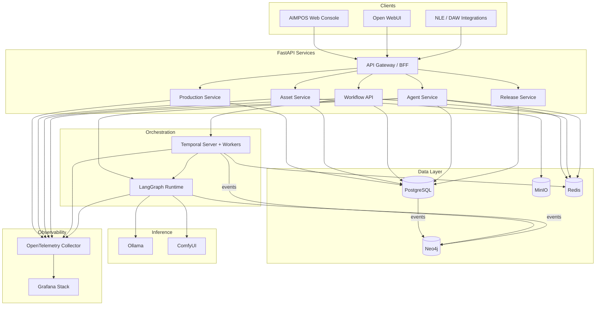

# AIMPOS — Technology Recommendations

**Document Type:** Architecture Decision Record — Technology Stack  
**Version:** 1.0  
**Status:** Approved — Pre-Implementation  
**Date:** June 8, 2026  
**Parent Documents:**

- [Blueprint for a multi-year initiative.md](./Blueprint%20for%20a%20multi-year%20initiative.md)
- [Domain Driven Design.md](./Domain%20Driven%20Design.md)
- [Workflow Architecture.md](./Workflow%20Architecture.md)
- [Multi-Agent Architecture.md](./Multi-Agent%20Architecture.md)
- [Enterprise Knowledge Graph.md](./Enterprise%20Knowledge%20Graph.md)

---

## Table of Contents

1. [Executive Summary](#1-executive-summary)
2. [Platform Context](#2-platform-context)
3. [Recommended Stack Topology](#3-recommended-stack-topology)
4. [Technology Evaluations](#4-technology-evaluations)
5. [Cross-Technology Concerns](#5-cross-technology-concerns)
6. [Phase Alignment](#6-phase-alignment)
7. [Technologies Not in Scope](#7-technologies-not-in-scope)

---

## 1. Executive Summary

This document evaluates eight candidate technologies against the approved AIMPOS architecture, constrained to deployment on **Olares One** with **Docker**, **Kubernetes**, **Ollama**, and **Open WebUI** as platform anchors.

### 1.1 Decision Matrix

| Technology | Decision | Role in AIMPOS | Confidence |
|------------|----------|----------------|------------|
| **FastAPI** | **Adopt** | Primary API layer for bounded-context services | High |
| **LangGraph** | **Adopt** | Multi-agent orchestration runtime | High |
| **Temporal** | **Adopt** | Production workflow orchestration (WF-01–09) | High |
| **PostgreSQL** | **Adopt** | System of record — transactional aggregates | High |
| **Neo4j** | **Adopt** | Enterprise knowledge graph projection | Medium-High |
| **MinIO** | **Adopt** | Content-addressable asset storage (hot tier) | High |
| **Redis** | **Adopt** | Cache, pub/sub, agent memory hot layer | High |
| **OpenTelemetry** | **Adopt** | Unified observability instrumentation | High |

**All eight technologies are recommended for adoption**, with defined boundaries, complementary roles, and noted risks mitigated by architecture rules already approved in DDD and Workflow Architecture documents.

### 1.2 Stack at a Glance

```
┌─────────────────────────────────────────────────────────────────┐
│  EXPERIENCE: Open WebUI (chat) + AIMPOS Web Console (FastAPI)   │
├─────────────────────────────────────────────────────────────────┤
│  ORCHESTRATION: Temporal (workflows) + LangGraph (agents)       │
├─────────────────────────────────────────────────────────────────┤
│  API: FastAPI services per bounded context                      │
├─────────────────────────────────────────────────────────────────┤
│  DATA: PostgreSQL (SoR) │ Neo4j (graph) │ MinIO (assets)        │
│        Redis (cache/queue)                                      │
├─────────────────────────────────────────────────────────────────┤
│  INFERENCE: Ollama (+ vLLM/ComfyUI where needed) on Olares GPU │
├─────────────────────────────────────────────────────────────────┤
│  PLATFORM: Olares One → Kubernetes → Docker                   │
├─────────────────────────────────────────────────────────────────┤
│  OBSERVABILITY: OpenTelemetry → Grafana / Loki / Tempo          │
└─────────────────────────────────────────────────────────────────┘
```

---

## 2. Platform Context

### 2.1 Fixed Platform Choices

| Component | Role | Implication for Stack |
|-----------|------|----------------------|
| **Olares One** | Primary hardware (RTX 5090 24GB, 96GB RAM, 2TB NVMe) | Favor memory-efficient services; single-node viable for Phase 0; cluster-ready |
| **Kubernetes** | Olares OS orchestration | Helm/GitOps deployment; namespace-per-studio; GPU device plugin |
| **Docker** | Container runtime | All services containerized; OCI images for reproducibility |
| **Ollama** | Local LLM inference | LangGraph tool calls route to Ollama API; complement with vLLM for throughput |
| **Open WebUI** | Human LLM chat interface | Adjacent to AIMPOS — not the production console; integrate via API |

### 2.2 Architectural Constraints (Non-Negotiable)

- PostgreSQL owns **transactional truth**; Neo4j is a **projection**
- Temporal owns **workflow state**; LangGraph owns **agent reasoning loops**
- MinIO owns **asset bytes**; PostgreSQL owns **asset metadata and versions**
- All AI outputs require workflow approval — neither LangGraph nor Open WebUI bypasses Temporal gates
- Local-first inference via Ollama; burst is policy-governed exception

### 2.3 Olares One Resource Budget (Planning Assumption)

| Resource | Available | Allocation Guidance |
|----------|-----------|---------------------|
| GPU VRAM | 24 GB | Ollama models + ComfyUI — schedule via K8s GPU sharing |
| RAM | 96 GB | PostgreSQL 8G, Neo4j 8G, Redis 2G, Temporal 4G, services 16G, Ollama 24G, headroom 34G |
| NVMe | 2 TB | MinIO hot tier 1–1.5 TB; DB volumes 200 GB; container images 100 GB |
| CPU | 24 cores | Temporal workers, API pods, transcode CPU fallback |

---

## 3. Recommended Stack Topology



### 3.1 Service Boundaries (FastAPI)

| Service | Bounded Context | Primary Store |
|---------|----------------|---------------|
| `aimpos-studio` | Studio & Project | PostgreSQL |
| `aimpos-production` | Production Lifecycle | PostgreSQL |
| `aimpos-assets` | Asset & Provenance | PostgreSQL + MinIO |
| `aimpos-workflow` | Governed Workflow & Approval | PostgreSQL + Temporal |
| `aimpos-agents` | Agentic Intelligence | PostgreSQL + Redis + LangGraph |
| `aimpos-release` | Release & Publication | PostgreSQL |
| `aimpos-compliance` | Compliance & Policy | PostgreSQL |
| `aimpos-graph-projector` | Knowledge Graph sync | Neo4j (write), PostgreSQL (read events) |

---

## 4. Technology Evaluations

---

### 4.1 FastAPI

**Decision: Adopt** — Primary HTTP API framework for all AIMPOS bounded-context services.

#### Role in AIMPOS

- REST/GraphQL facade over DDD aggregates
- Webhook receivers for Temporal and LangGraph callbacks
- OpenAPI contract generation for integrations (NLE, Open WebUI)
- Async I/O for asset metadata, agent tool endpoints, approval queues

#### Pros

| Pro | Relevance |
|-----|-----------|
| Native async (`asyncio`) | Efficient concurrent API under mixed human + agent load |
| Automatic OpenAPI / JSON Schema | Contract-first integration with external tools |
| Pydantic v2 validation | Strong typing aligned to DDD value objects |
| Python ecosystem | Same language as LangGraph, ML tooling, Olares AI stack |
| Lightweight | Low memory footprint on Olares single-node |
| Dependency injection | Clean separation of repository / domain / API layers |
| WebSocket support | Real-time approval notifications, agent trace streaming |

#### Cons

| Con | Mitigation |
|-----|------------|
| Python GIL limits CPU-bound parallelism | Offload compute to Temporal workers, GPU pods, or `ProcessPoolExecutor` |
| Not ideal for very long-lived streaming at huge scale | Use dedicated streaming service or SSE with backpressure |
| Less opinionated than Django | Enforce internal project template, shared `aimpos-core` library |
| Async complexity (blocking ORM calls) | Use `asyncpg` + SQLAlchemy 2 async; never block event loop |
| Multiple services = multiple deployables | Monorepo with shared packages; BFF pattern for web console |

#### Alternatives

| Alternative | When to Prefer | Why Not Primary |
|-------------|----------------|-----------------|
| **Django + DRF** | Rapid admin CRUD, ORM-heavy CRUD apps | Heavier; admin not core need; async less mature |
| **NestJS (TypeScript)** | Team is TS-primary | Splits stack from LangGraph Python; two languages |
| **Go (Fiber/Gin)** | Extreme API throughput | Worse ML/agent integration; slower iteration |
| **GraphQL-only (Strawberry/Ariadne)** | Client-driven queries | Supplement REST; not replace — approvals need explicit contracts |

#### Decision Rationale

FastAPI is the **lowest-friction API layer** for a Python-centric, agent-heavy, Olares-local stack. It maps cleanly to bounded-context microservices, produces OpenAPI for vendor integrations, and shares tooling with LangGraph. The blueprint already assumes Python-adjacent AI tooling; FastAPI completes that coherence.

#### Scalability Considerations

| Scale | Approach |
|-------|----------|
| **Single Olares One (Phase 0)** | 2–4 uvicorn workers per service; consolidate services into fewer pods |
| **Multi-node cluster (Phase 2)** | Horizontal pod autoscaling per service; stateless API pods behind ingress |
| **Enterprise (Phase 3+)** | Service mesh (optional); read replicas on PostgreSQL; CDN for MinIO proxies |
| **Bottleneck** | PostgreSQL connections — use PgBouncer in transaction mode |

---

### 4.2 LangGraph

**Decision: Adopt** — Multi-agent orchestration runtime for the ten approved agents.

#### Role in AIMPOS

- Implements Producer → Specialist → QA → Compliance agent topology
- Manages agent state machines, tool calls, memory scopes, rework loops
- Invoked **by Temporal activities** — LangGraph does not own workflow gates
- Routes LLM calls to Ollama (and ComfyUI tools for visual agents)

#### Pros

| Pro | Relevance |
|-----|-----------|
| Graph-based agent flows | Maps directly to Multi-Agent Architecture collaboration patterns |
| Stateful agent execution | Supports multi-turn rework, debate (Director vs Editor) |
| Tool binding | Clean integration with FastAPI tool registry |
| Checkpointing | Agent run recovery after Olares restart |
| LangChain ecosystem | Ollama integration available; broad model adapters |
| Human-in-the-loop nodes | Native `interrupt()` for approval gates before continue |
| Composability | Subgraphs per agent (Story Architect, Cinematography, etc.) |

#### Cons

| Con | Mitigation |
|-----|------------|
| LangChain dependency surface | Pin versions; isolate in `aimpos-agents` service; abstract behind internal interface |
| Rapid API churn | Wrap LangGraph in `AgentRuntime` adapter; semver internal API |
| Not a workflow engine | **Never** use for WF-01–09 lifecycle — Temporal owns that |
| Debugging complexity on long graphs | OpenTelemetry spans per node; LangSmith optional (local-only if used) |
| GPU tool calls need careful isolation | ComfyUI/Ollama as external tools, not in-process |
| Memory growth on long projects | Scoped checkpointers with TTL; Redis-backed checkpoint store |

#### Alternatives

| Alternative | When to Prefer | Why Not Primary |
|-------------|----------------|-----------------|
| **CrewAI** | Simple role-based crews | Less control over critic gates and rework routing |
| **Microsoft AutoGen** | Research / conversational agents | Heavier; less predictable for production governance |
| **Custom orchestrator** | Maximum control | Higher build cost; reinvents checkpointing |
| **Temporal alone** | Simple linear AI steps | Poor fit for multi-agent debate, branching reasoning |
| **Haystack Agents** | RAG-heavy Q&A | Less suited to tool-rich media production agents |

#### Decision Rationale

LangGraph is the **best fit for the approved multi-agent model** — particularly dual-critic gates, Director critique loops, and Producer coordination. The blueprint explicitly references "LangGraph-style patterns." Pairing LangGraph (agent reasoning) with Temporal (production workflow) preserves separation of concerns mandated in DDD.

#### Scalability Considerations

| Scale | Approach |
|-------|----------|
| **Phase 0** | Single LangGraph worker pod; Redis checkpoint backend |
| **Phase 1** | Separate worker pool for agent tasks; GPU node affinity for visual agents |
| **Phase 2+** | Queue-backed agent dispatch via Redis; max concurrent agent runs per project quota |
| **Bottleneck** | Ollama throughput — scale to vLLM sidecar for parallel requests; serialize GPU-heavy tools |
| **Olares constraint** | Cap concurrent agent tasks to 3–5 on single GPU; Producer enforces budgets |

---

### 4.3 Temporal

**Decision: Adopt** — Authoritative workflow engine for WF-01 through WF-09.

#### Role in AIMPOS

- Executes production DAGs with HITL approval nodes, rework loops, SLA timers
- Durable workflow state survives Olares restarts
- Activities invoke LangGraph agent runs, MinIO operations, validation services
- Signals for human approval (`ApprovalGranted`, `ApprovalRejected`)

#### Pros

| Pro | Relevance |
|-----|-----------|
| Durable execution | Critical for multi-day film post workflows |
| Native retry / timeout | Matches workflow architecture rework policies |
| Human task signals | First-class HITL without custom state machines |
| Workflow versioning | Safe template updates per workflow definition versions |
| Strong audit trail | Every transition logged — aligns to compliance requirements |
| Language SDKs | Python SDK pairs with FastAPI + LangGraph |
| Visibility UI | Ops dashboard for stuck approvals, SLA breaches |

#### Cons

| Con | Mitigation |
|-----|------------|
| Operational overhead | Deploy Temporal server + Cassandra/PostgreSQL persistence on K8s; use Helm chart |
| Learning curve | Training for team; start with linear workflows in Phase 0 |
| Resource footprint | ~4 GB RAM for server; acceptable on 96 GB Olares |
| Overkill for trivial scripts | Use only for governed production workflows |
| Not media-aware | All domain logic in activities — keep workflows thin |
| Cluster complexity at scale | Start single-cluster on Olares; externalize only in Phase 3 |

#### Alternatives

| Alternative | When to Prefer | Why Not Primary |
|-------------|----------------|-----------------|
| **Argo Workflows** | K8s-native batch DAGs, render farms | Weaker HITL signals; better as **supplement** for GPU render jobs |
| **Windmill** | Low-code workflow UI | Less durable execution guarantees for multi-day production |
| **Prefect / Dagster** | Data pipeline orchestration | Not designed for human approval gates |
| **Custom state machine** | Minimal MVP | Fails audit, retry, versioning requirements at studio grade |
| **Camunda** | BPMN enterprise shops | Heavier Java stack; BPMN mismatch with agentic flows |

#### Decision Rationale

Temporal is the **only evaluated option that fully satisfies** the universal stage contract: durable state, HITL signals, rework routing, SLA escalation, and immutable audit compatibility. The blueprint ADR already selects "workflow engine + event-driven agents" — Temporal is the engine; LangGraph is the agent executor inside activities.

#### Scalability Considerations

| Scale | Approach |
|-------|----------|
| **Phase 0** | Single Temporal cluster on Olares; 2–4 worker pods |
| **Phase 1** | Task queue per domain (creative, post, release); worker specialization |
| **Phase 2** | Multi-node: Temporal frontend on node 1; workers on GPU nodes |
| **Limits** | 1,000 concurrent workflow instances (NFR-13) — Temporal handles easily with worker scaling |
| **Olares single-node** | SQLite/PostgreSQL persistence backend; avoid Cassandra until multi-node |

**Recommendation:** Use **PostgreSQL as Temporal persistence store** on Olares (not Cassandra) until cluster exceeds 3 nodes.

---

### 4.4 PostgreSQL

**Decision: Adopt** — System of record for all transactional aggregates.

#### Role in AIMPOS

- Stores: projects, scripts, approvals, asset metadata, versions, workflow refs, agent task records
- Event outbox table for Neo4j graph projection
- Temporal persistence backend (Phase 0–2)
- JSONB for flexible metadata without schemaless document store

#### Pros

| Pro | Relevance |
|-----|-----------|
| ACID transactions | Enforces aggregate rules (AR-01: one aggregate per transaction) |
| Mature, well-understood | Team hiring, tooling, Olares K8s operators available |
| JSONB columns | `metadata_json`, workflow context without MongoDB |
| Row-level security | Multi-tenant studio isolation |
| Full-text search | Script/scene search (supplement to Neo4j) |
| Extensions | `pgvector` for embedding search; `pg_trgm` for fuzzy asset search |
| Replication | Streaming replicas for read scaling Phase 2+ |

#### Cons

| Con | Mitigation |
|-----|------------|
| Not a graph database | Neo4j handles lineage traversal; PG stores authoritative refs |
| Not object storage | MinIO for media bytes |
| Large blob storage expensive | Never store media in PG — metadata + hash only |
| Connection exhaustion | PgBouncer mandatory |
| Schema migration discipline | Alembic migrations per bounded context |

#### Alternatives

| Alternative | When to Prefer | Why Not Primary |
|-------------|----------------|-----------------|
| **CockroachDB** | Multi-region active-active | Overkill for Olares local-first; higher ops cost |
| **SQLite** | Edge/offline single user | Insufficient for concurrent studio workflows |
| **MongoDB** | Fully schemaless documents | Weak aggregate transaction boundaries |
| **EventStoreDB** | Pure event sourcing | Add as audit supplement (immudb), not primary SoR |
| **MySQL/MariaDB** | Existing team expertise | PostgreSQL JSONB + extensions stronger for AIMPOS |

#### Decision Rationale

PostgreSQL is the **authoritative transactional store** for DDD aggregates. Every bounded context persists here. Asset versions store `content_hash` + MinIO key — not bytes. This matches the knowledge graph design principle: "graph is a projection."

#### Scalability Considerations

| Scale | Approach |
|-------|----------|
| **Phase 0** | Single PG instance, 50 GB PVC, daily backups to NAS |
| **Phase 1** | PgBouncer; read replica for analytics queries |
| **Phase 2** | 100TB assets in MinIO; PG stays metadata-only (< 500 GB) |
| **Phase 3** | Partitioning on `audit_events` by month; archive cold partitions |
| **pgvector** | Add in Phase 1 for semantic asset search (reduces Neo4j load for similarity) |

---

### 4.5 Neo4j

**Decision: Adopt** — Enterprise knowledge graph projection for lineage, impact analysis, and compliance queries.

#### Role in AIMPOS

- Read-optimized projection synced from PostgreSQL event outbox
- Stores: `DERIVED_FROM`, `APPROVED_BY`, `GENERATED_BY` lineage
- Powers: provenance-to-release queries, impact analysis, agent `kg_query` tool
- **Not** the system of record

#### Pros

| Pro | Relevance |
|-----|-----------|
| Native graph traversal | `script → scene → asset → model → release` in single query |
| Cypher expressiveness | Compliance provenance queries (see Knowledge Graph doc) |
| Relationship-first model | Lineage is edges, not JOIN hell |
| Visual browser | Neo4j Bloom for producer/compliance investigation |
| Constraint / index support | `uid` uniqueness matches graph schema |
| GDS library | Centrality, community detection for franchise analysis (Phase 3) |

#### Cons

| Con | Mitigation |
|-----|------------|
| Second database to operate | Event projection is async; PG remains SoR; rebuild graph from events |
| Memory hungry | Cap heap at 8 GB on Olares; prune properties; don't store blob metadata |
| Not multi-model | Keep asset bytes in MinIO; metadata split with PG |
| Community vs Enterprise | Community Edition sufficient for Phase 0–2; evaluate Enterprise for RBAC later |
| Sync lag | Accept eventual consistency (seconds); critical path reads PG |
| License awareness | Community OK for internal studio; review for SaaS offering |

#### Alternatives

| Alternative | When to Prefer | Why Not Primary |
|-------------|----------------|-----------------|
| **Apache AGE (PG extension)** | Minimize ops — graph in PostgreSQL | Weaker traversal performance at scale; less mature tooling |
| **Amazon Neptune** | AWS-only deployment | Violates Olares local-first sovereignty |
| **ArangoDB** | Multi-model (doc + graph) | Less aligned to approved Cypher schema |
| **Memgraph** | In-memory speed | RAM pressure on Olares; persistence concerns |
| **PostgreSQL recursive CTEs** | Very shallow graphs | Fails 10-hop lineage queries at production scale |

#### Decision Rationale

The approved **Enterprise Knowledge Graph** document targets Neo4j explicitly with Cypher examples, constraints, and portability notes. Graph traversal is a **core differentiator** for AIMPOS (provenance, compliance, impact analysis). PostgreSQL cannot replace this without significant query complexity.

#### Scalability Considerations

| Scale | Approach |
|-------|----------|
| **Phase 0** | Single Neo4j Community; ~1M nodes sufficient for pilot |
| **Phase 1** | Dedicated PVC 100 GB; graph projector as K8s deployment |
| **Phase 2** | Sharding not needed until 100M+ edges; vertical scale RAM first |
| **Rebuild** | Full graph rebuild from event store < 4 hours (NFR-22 alignment) |
| **Olares** | Run Neo4j on non-GPU node; avoid competing with Ollama for RAM |

---

### 4.6 MinIO

**Decision: Adopt** — S3-compatible content-addressable storage for asset hot tier.

#### Role in AIMPOS

- Stores: media bytes keyed by `content_hash`
- Tiers: hot (Olares NVMe), warm (NAS via MinIO gateway), cold (future)
- Serves: proxies, dailies, AI-generated candidates, masters
- Integrates: NLE watch folders via S3 API; pre-signed URLs for vendor sandbox

#### Pros

| Pro | Relevance |
|-----|-----------|
| S3 API compatibility | Standard SDKs; LakeFS integration for version semantic layer |
| Content-addressable layout | `bucket/sha256/ab/cd/ef...` deduplication |
| Kubernetes operator | Native Helm deploy on Olares |
| Erasure coding (distributed mode) | Phase 2 multi-node durability |
| Pre-signed URLs | Scoped vendor access without proxying bytes through API |
| Lightweight vs Ceph | Runs on single Olares node for Phase 0 |
| Encryption at rest | SSE-S3 for NFR-30 compliance |

#### Cons

| Con | Mitigation |
|-----|------------|
| Single-node mode lacks HA | NAS backup; cluster mode in Phase 2 |
| Not a version control system | LakeFS or custom version layer in `aimpos-assets` service |
| Large video storage fills NVMe | Storage tier policy; warm tier on Thunderbolt NAS |
| No built-in transcoding | Separate FFmpeg / proxy service |
| Operator maturity | Pin MinIO release; test upgrades in lab |

#### Alternatives

| Alternative | When to Prefer | Why Not Primary |
|-------------|----------------|-----------------|
| **SeaweedFS** | Many small files, simpler topology | Less S3 ecosystem compatibility |
| **Garage** | Rust, lightweight edge | Smaller community; fewer K8s operators |
| **Local filesystem + hash** | Minimal MVP | No pre-signed URLs, no tiering, no S3 integrations |
| **Ceph/Rook** | Petabyte scale | Massive ops overhead for Olares single-node |
| **Cloud S3** | Burst storage | Violates sovereign default; burst zone only per policy |

#### Decision Rationale

MinIO is the **blueprint's named object store**, S3-compatible, and proven on Kubernetes. It satisfies content-addressable storage (FR-51), integrates with the asset version model, and supports tiering to NAS — critical on 2 TB Olares NVMe.

#### Scalability Considerations

| Scale | Approach |
|-------|----------|
| **Phase 0** | Single MinIO standalone; 1 TB hot bucket |
| **Phase 1** | NAS warm tier via MinIO lifecycle policies |
| **Phase 2** | Distributed MinIO 4+ drives; 100 TB studio target (NFR-11) |
| **Dedup** | Content-hash keys deliver 30%+ savings (success KPI) |
| **GPU egress** | Pre-signed URLs for burst workers — no persistent cloud copy |

---

### 4.7 Redis

**Decision: Adopt** — Cache, pub/sub, short-lived agent state, and task coordination.

#### Role in AIMPOS

- LangGraph checkpoint store (hot checkpoints)
- Agent memory hot layer (`MEM-SESSION`, `MEM-WORKFLOW`)
- Approval notification pub/sub to web console
- Temporal activity idempotency keys (short TTL)
- Rate limiting and GPU queue tokens
- **Not** durable workflow or asset state

#### Pros

| Pro | Relevance |
|-----|-----------|
| Sub-millisecond latency | Real-time approval notifications, agent session state |
| Pub/sub | WebSocket fan-out via FastAPI subscribers |
| TTL natively | Agent session memory auto-expiry per MEM scopes |
| LangGraph checkpointer backend | Official Redis checkpointer support |
| Simple K8s deployment | Redis Operator or single StatefulSet |
| Streams | Lightweight event bus alternative to Kafka for Phase 0 |
| Atomic operations | GPU budget token bucket per project |

#### Cons

| Con | Mitigation |
|-----|------------|
| Ephemeral by design | Never store authoritative state; PG + Temporal own durability |
| Memory-bound | Cap at 2–4 GB; enforce TTLs aggressively |
| Single-node failure loses cache | Cache miss acceptable; checkpoints rebuild from PG |
| Not a message queue at scale | Migrate hot paths to NATS in Phase 3 if needed |
| Persistence confusion | Use AOF for checkpoints only; not for domain data |

#### Alternatives

| Alternative | When to Prefer | Why Not Primary |
|-------------|----------------|-----------------|
| **Valkey** | Redis license concerns | Drop-in replacement if Redis licensing changes |
| **NATS JetStream** | Durable event bus | Heavier for Phase 0 cache needs; adopt Phase 2 for events |
| **RabbitMQ** | Complex routing | Overkill for pub/sub + cache |
| **PostgreSQL LISTEN/NOTIFY** | Minimize components | Poor performance at notification scale |
| **In-memory only (no Redis)** | Tiny MVP | Fails agent checkpoint recovery |

#### Decision Rationale

Redis fills **gaps neither PostgreSQL nor Temporal should touch**: sub-second cache, pub/sub notifications, and LangGraph checkpoint hot storage. Low footprint on Olares (2 GB) with clear TTL discipline.

#### Scalability Considerations

| Scale | Approach |
|-------|----------|
| **Phase 0** | Single Redis instance, 2 GB limit, `allkeys-lru` eviction |
| **Phase 1** | Redis Sentinel for failover (2-node cluster) |
| **Phase 2** | Separate Redis instances: cache vs checkpoints vs pub/sub |
| **Phase 3** | Evaluate NATS for cross-studio event bus; Redis remains cache |
| **Olares** | Monitor memory; agent checkpoint TTL 24h default |

---

### 4.8 OpenTelemetry

**Decision: Adopt** — Unified observability standard across all services.

#### Role in AIMPOS

- Distributed tracing: FastAPI → Temporal → LangGraph → Ollama tool calls
- Metrics: GPU utilization per project, approval SLA, agent budget consumption
- Logs: Correlated via `trace_id` / `correlation_id` (matches audit model)
- Export to Grafana Tempo + Prometheus + Loki on Olares

#### Pros

| Pro | Relevance |
|-----|-----------|
| Vendor-neutral standard | Avoid lock-in; works with Grafana OSS stack |
| Auto-instrumentation | FastAPI, PostgreSQL, Redis, HTTP clients |
| Trace context propagation | Links agent runs to workflow instances to approvals |
| Semantic conventions | `gen_ai.*` attributes for LLM spans (emerging convention) |
| Collector architecture | Single OTel Collector on K8s; fan-out to backends |
| Aligns to NFR-40 | 100% sampling on AI paths achievable |

#### Cons

| Con | Mitigation |
|-----|------------|
| Storage volume at 100% AI sampling | Tail-based sampling; always sample errors and approvals |
| LangGraph/LangChain tracing maturity | Manual spans around graph nodes; contribute upstream |
| Ollama limited native OTel | Wrap Ollama HTTP calls with manual spans |
| Operational stack needed | Deploy Grafana + Tempo + Prometheus via kube-prometheus-stack |
| Learning curve | Provide span naming conventions in `aimpos-core` library |

#### Alternatives

| Alternative | When to Prefer | Why Not Primary |
|-------------|----------------|-----------------|
| **Prometheus only** | Metrics-only Phase 0 | Insufficient for distributed agent/workflow tracing |
| **Jaeger direct** | Jaeger-native shop | OTel exports to Jaeger anyway — start with OTel |
| **Datadog / Honeycomb** | Managed SaaS | Violates local-first; optional external burst monitoring only |
| **Custom logging** | Minimal MVP | Fails NFR-40, audit correlation requirements |
| **Grafana Alloy** | All-in-one collector | Can replace Collector later; OTel instrumentation stays |

#### Decision Rationale

OpenTelemetry is the **only option that spans the full AIMPOS call chain** — human API, Temporal workflow, LangGraph agent, Ollama inference, MinIO upload — with correlated `correlation_id` matching the audit and knowledge graph models.

#### Scalability Considerations

| Scale | Approach |
|-------|----------|
| **Phase 0** | OTel Collector → Tempo + Prometheus; 7-day trace retention |
| **Phase 1** | Tail sampling: 100% errors/approvals, 10% success paths |
| **Phase 2** | Per-project GPU cost metrics dashboards |
| **Storage** | ~5 GB/day at studio load; rotate Tempo blocks to NAS |
| **Olares** | Run observability stack on non-GPU node |

---

## 5. Cross-Technology Concerns

### 5.1 Division of Responsibility (Critical)

| Concern | Owner | Never Use For |
|---------|-------|---------------|
| **Transactional truth** | PostgreSQL | Graph traversal, blob storage |
| **Workflow state** | Temporal | Agent reasoning loops |
| **Agent orchestration** | LangGraph | Production phase gates, approval immutability |
| **Asset bytes** | MinIO | Metadata, permissions |
| **Lineage queries** | Neo4j | Authoritative approval records |
| **Hot ephemeral state** | Redis | Durable audit, asset versions |
| **LLM inference** | Ollama | Workflow decisions without human gate |
| **Human chat UX** | Open WebUI | Governed production approvals |

### 5.2 Integration Patterns

| From | To | Pattern |
|------|-----|---------|
| FastAPI | PostgreSQL | Repository pattern; async SQLAlchemy |
| FastAPI | Temporal | Start workflow / send signal via Python SDK |
| Temporal activity | LangGraph | Invoke agent graph; return proposal refs |
| LangGraph tool | Ollama | HTTP API via `OLLAMA_HOST` |
| LangGraph tool | MinIO | S3 API via `asset_register_proposal` |
| LangGraph tool | Neo4j | Read-only Cypher via `kg_query` |
| All services | Redis | Cache-aside; pub/sub; checkpoint |
| All services | OpenTelemetry | Auto-instrument + manual AI spans |
| Domain events | Neo4j | Outbox → `aimpos-graph-projector` → MERGE nodes |
| Open WebUI | Ollama | Direct (exploratory chat only) |
| AIMPOS Console | FastAPI BFF | Governed production path |

### 5.3 Open WebUI Positioning

| Use Open WebUI For | Do NOT Use Open WebUI For |
|--------------------|---------------------------|
| Exploratory LLM chat | Script lock approval |
| Model comparison sandbox | Asset promotion to `main` |
| Prompt prototyping (export to AIMPOS) | Compliance certification |
| Crew informal Q&A | Release publication gates |

**Integration:** Open WebUI and AIMPOS share Ollama but run in separate K8s namespaces. Approved prompts export to AIMPOS `PromptVersion` via FastAPI import endpoint.

### 5.4 Ollama Positioning

| Use Ollama For | Complement With |
|----------------|-----------------|
| Local LLM inference (7B–13B default) | vLLM for high-throughput 70B (Phase 2) |
| LangGraph tool calls | ComfyUI for diffusion (Cinematography Agent) |
| Open WebUI backend | Whisper container for ASR (Composer Agent) |

**Olares constraint:** Load one large model (13B) or two small models (7B) concurrently within 24 GB VRAM including ComfyUI headroom.

### 5.5 Failure Mode Summary

| Component Failure | Impact | Recovery |
|-------------------|--------|----------|
| PostgreSQL down | Platform halt | PG restore from backup; RTO ≤ 4h |
| Neo4j down | Lineage queries fail; production continues | Rebuild from event outbox |
| MinIO down | Asset ingest/read fails | Restore from NAS replica |
| Redis down | Cache miss; agent checkpoint loss | Restart agents; PG audit intact |
| Temporal down | No new workflow steps | Temporal persistence recovers; workers resume |
| Ollama down | Agent LLM tools fail | Queue tasks; alert MLOps |
| LangGraph worker down | Agent tasks retry | Temporal activity retry policy |

---

## 6. Phase Alignment

### 6.1 Phase 0 — Sovereign Core (Months 0–3)

| Component | Deployment |
|-----------|------------|
| FastAPI | 2 merged services: `aimpos-core`, `aimpos-assets` |
| Temporal | Single server + 2 workers; PostgreSQL persistence |
| LangGraph | Embedded in `aimpos-agents`; Producer + Story Architect + Screenwriter only |
| PostgreSQL | Single instance |
| Neo4j | Single instance; manual projector |
| MinIO | Standalone 500 GB |
| Redis | Single 1 GB instance |
| OpenTelemetry | Collector + Prometheus + Grafana |
| Ollama | Pre-loaded 7B + 13B models |
| Open WebUI | Olares Market deploy; isolated namespace |

### 6.2 Phase 1 — Production Pilot (Months 4–9)

| Addition | Technology |
|----------|------------|
| All 10 agents in LangGraph | Full Multi-Agent Architecture |
| WF-01 through WF-08 in Temporal | Complete workflow templates |
| Neo4j auto-projector | Event-driven from outbox |
| pgvector | Semantic asset search |
| PgBouncer | Connection pooling |
| ComfyUI pod | Cinematography Agent GPU tools |
| vLLM (optional) | Higher-throughput inference |

### 6.3 Phase 2 — Studio Grade (Months 10–18)

| Addition | Technology |
|----------|------------|
| Multi-node Olares cluster | Temporal + MinIO distributed |
| Redis Sentinel | Failover |
| NATS (evaluate) | Cross-service event bus |
| Argo Workflows (supplement) | Render farm batch jobs — not replacement for Temporal |
| Read replica PostgreSQL | Analytics, reporting |

---

## 7. Technologies Not in Scope

Technologies referenced in blueprint but **not in this evaluation** — recommended separately:

| Technology | Recommended Role | Notes |
|------------|------------------|-------|
| **Keycloak / Zitadel** | Identity (Generic domain) | OIDC for FastAPI |
| **Open Policy Agent** | Compliance policy evaluation | Sidecar or library |
| **LakeFS** | Asset version semantic layer | Over MinIO |
| **immudb** | Immutable audit supplement | Append-only audit |
| **ComfyUI** | Diffusion inference | Cinematography Agent |
| **vLLM** | High-throughput LLM | Phase 2+ on Olares |
| **Whisper** | ASR | Composer Agent |
| **Grafana/Loki/Tempo** | OTel backends | Deploy with kube-prometheus-stack |

---

## Document Control

| Version | Date | Changes |
|---------|------|---------|
| 1.0 | 2026-06-08 | Initial technology recommendations — 8 components evaluated |

| Related Document | Relationship |
|-----------------|--------------|
| Blueprint §6.6 | Reference technology stack |
| Domain Driven Design.md | Bounded context service mapping |
| Multi-Agent Architecture.md | LangGraph + Ollama agent runtime |

---

## Summary Decision Statement

> **Adopt FastAPI, LangGraph, Temporal, PostgreSQL, Neo4j, MinIO, Redis, and OpenTelemetry** as the AIMPOS core stack on Olares One. PostgreSQL and Temporal govern production truth and workflow durability. LangGraph and Ollama power governed agent proposals. MinIO stores sovereign assets. Neo4j projects lineage for compliance. Redis accelerates ephemeral coordination. OpenTelemetry proves the audit chain. FastAPI unifies the API surface. Open WebUI remains an exploratory adjunct — not a production gate.

*End of document*
