# AIMPOS — Workflow Architecture for AI-Assisted Media Production

**Document Type:** Workflow & Orchestration Architecture  
**Version:** 1.0  
**Status:** Approved — Pre-Implementation  
**Date:** June 8, 2026  
**Parent Documents:**

- [Domain Driven Design.md](./Domain%20Driven%20Design.md)
- [Enterprise Knowledge Graph.md](./Enterprise%20Knowledge%20Graph.md)
- [Business Capabilities.md](./Business%20Capabilities.md)
- [Blueprint for a multi-year initiative.md](./Blueprint%20for%20a%20multi-year%20initiative.md)

---

## Table of Contents

1. [Architecture Overview](#1-architecture-overview)
2. [Universal Stage Contract](#2-universal-stage-contract)
3. [Workflow Engine Model](#3-workflow-engine-model)
4. [Shared State Machine](#4-shared-state-machine)
5. [Workflow Catalog](#5-workflow-catalog)
6. [WF-01: Story Creation](#wf-01-story-creation)
7. [WF-02: Script Generation](#wf-02-script-generation)
8. [WF-03: Character Creation](#wf-03-character-creation)
9. [WF-04: Scene Planning](#wf-04-scene-planning)
10. [WF-05: Storyboarding](#wf-05-storyboarding)
11. [WF-06: Audio Production](#wf-06-audio-production)
12. [WF-07: Video Generation](#wf-07-video-generation)
13. [WF-08: Editing](#wf-08-editing)
14. [WF-09: Release](#wf-09-release)
15. [Cross-Workflow Orchestration](#15-cross-workflow-orchestration)
16. [Audit & Versioning Standards](#16-audit--versioning-standards)

---

## 1. Architecture Overview

AIMPOS workflows are **governed, auditable DAGs** where every stage — human or AI — follows an identical contract. AI agents **propose**; humans **approve**; versions **accumulate**; audit **never deletes**.

### 1.1 Design Principles

| Principle | Rule |
|-----------|------|
| **Stage parity** | Every stage has inputs, outputs, validation, approval, rework, audit, versioning |
| **AI is propose-only** | Agent outputs land on a branch (`ai-draft`); promotion requires approval |
| **Validation before approval** | Automated checks run before human review queue |
| **Rework is first-class** | Rejection routes to a defined rework stage — not workflow restart |
| **Immutable decisions** | `ApprovalDecision` records are append-only |
| **Version on every output** | Each stage output creates a new `AssetVersion` or domain version |
| **Event-sourced audit** | Every transition emits an `AuditEvent` linked in the knowledge graph |

### 1.2 Architecture Diagram

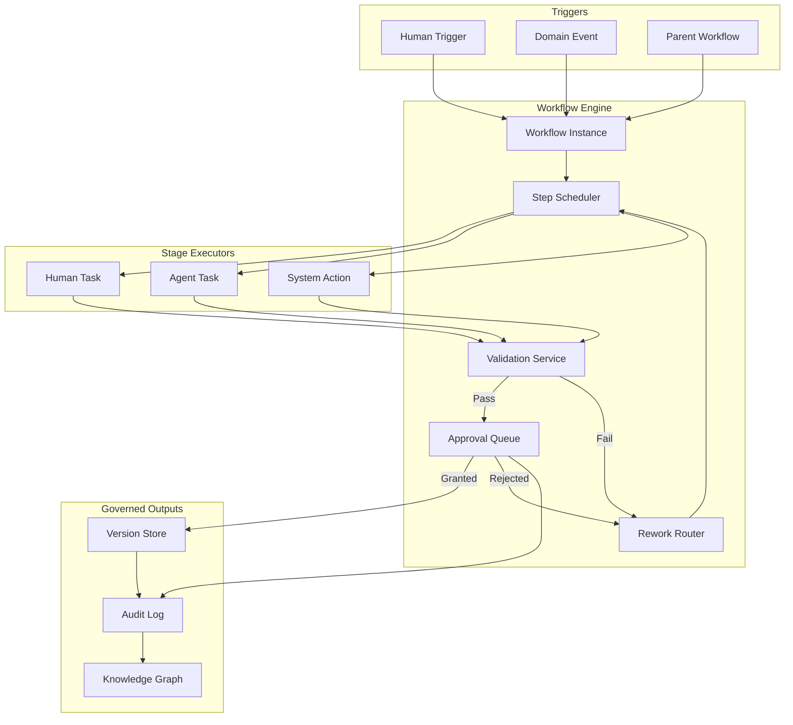

### 1.3 Workflow ID Registry

| ID | Workflow | Template Code | Primary Phase |
|----|----------|---------------|---------------|
| WF-01 | Story Creation | `story.creation` | Development |
| WF-02 | Script Generation | `script.generation` | Development |
| WF-03 | Character Creation | `character.creation` | Development / Pre-Production |
| WF-04 | Scene Planning | `scene.planning` | Pre-Production |
| WF-05 | Storyboarding | `storyboard.production` | Pre-Production |
| WF-06 | Audio Production | `audio.production` | Post-Production |
| WF-07 | Video Generation | `video.generation` | Pre-Production / Post |
| WF-08 | Editing | `editorial.pipeline` | Post-Production |
| WF-09 | Release | `release.publication` | Release |

---

## 2. Universal Stage Contract

Every workflow stage **must** implement this contract. No exceptions.

### 2.1 Stage Schema

```
Stage {
  stage_id          : string          // unique within workflow definition
  stage_name        : string
  stage_type        : enum            // INGEST | AGENT | HUMAN | VALIDATE | APPROVE | PUBLISH | SYSTEM
  inputs[]          : StageInput[]
  outputs[]         : StageOutput[]
  validation_rules[]: ValidationRule[]
  approval_gate     : ApprovalGate?   // null only for pure-ingest stages
  rework_policy     : ReworkPolicy
  audit_events[]    : string[]        // events emitted on completion
  versioning_policy : VersioningPolicy
}
```

### 2.2 Contract Elements

| Element | Required | Description |
|---------|----------|-------------|
| **Inputs** | Yes | Typed references to assets, domain entities, prior stage outputs, or config |
| **Outputs** | Yes | Versioned artifacts or domain state changes produced by the stage |
| **Validation** | Yes | Automated rules that must pass before approval queue |
| **Human approval** | Yes* | Approval chain, quorum, SLA — *waived only for `INGEST` with downstream validation |
| **Rework loops** | Yes | Defined target stage on validation failure or rejection |
| **Audit logs** | Yes | Minimum one `AuditEvent` per stage transition |
| **Versioning** | Yes | Branch, version tag, supersession link for every material output |

### 2.3 Standard Stage Types

| Type | Executor | Approval | Typical Rework Target |
|------|----------|----------|----------------------|
| `INGEST` | System | Deferred to next stage | Re-ingest |
| `AGENT` | AI Agent | Required before merge | Same agent stage with revised prompt |
| `HUMAN` | Crew member | Peer or lead review | Prior human or agent stage |
| `VALIDATE` | System | N/A (gate only) | Stage that produced invalid output |
| `APPROVE` | Designated approver | Terminal for stage | Rework target from `rework_policy` |
| `PUBLISH` | System | Preceded by `APPROVE` | Certification stage |
| `SYSTEM` | Platform | Audit only | Previous system stage |

### 2.4 Rework Policy Template

```yaml
rework_policy:
  max_iterations: 5                    # per stage pair before escalation
  on_validation_fail: <stage_id>         # route target
  on_approval_reject: <stage_id>       # route target
  on_defer: <stage_id>                 # optional hold point
  escalation_after: 3                  # SLA breaches → executive producer
  preserve_versions: true              # rejected outputs retained on branch
  branch_on_rework: "rework-{n}"       # version branch naming
```

### 2.5 Versioning Policy Template

```yaml
versioning_policy:
  output_entity: AssetVersion | Script | Character | Scene | Edit | Master
  branch_strategy:
    agent_output: "ai-draft"
    human_edit: "human-edit"
    approved: "main"
  version_tag_format: "{workflow}-{stage}-v{n}"
  supersede_on_approval: true
  lineage_required: true               # DERIVED_FROM edges in knowledge graph
```

---

## 3. Workflow Engine Model

### 3.1 Instance Lifecycle

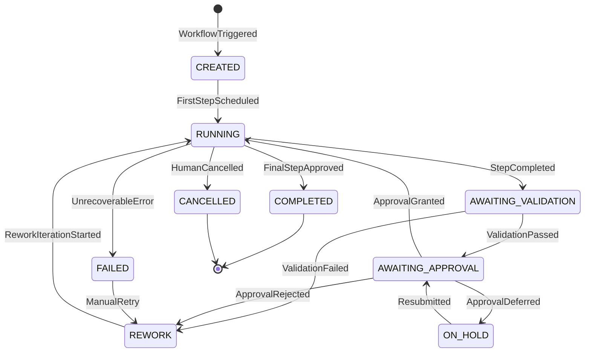

### 3.2 Step Execution Lifecycle

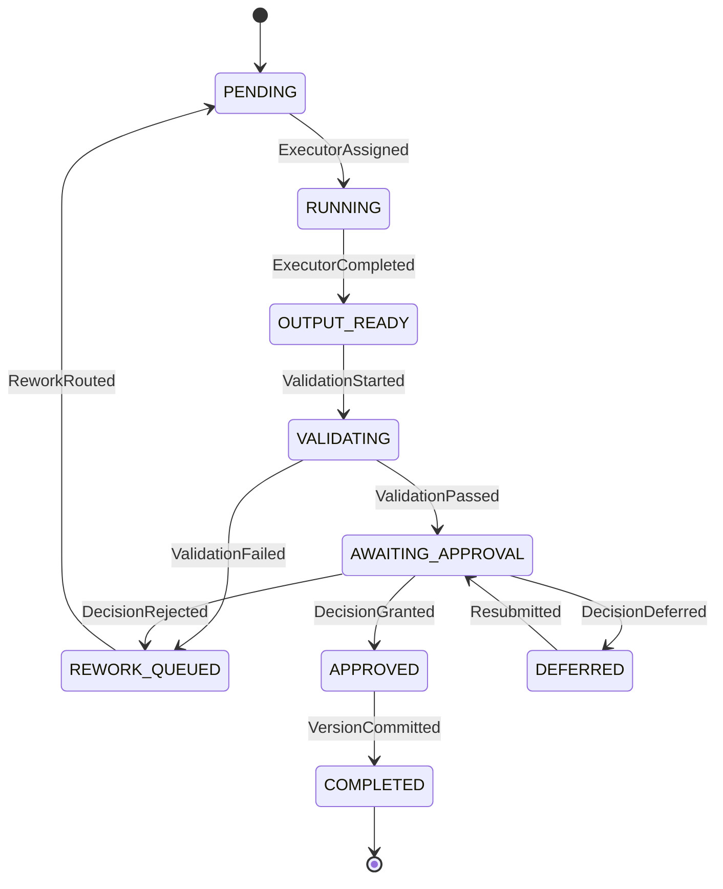

### 3.3 Step Type Icons in Diagrams

| Symbol | Meaning |
|--------|---------|
| `[H]` | Human task |
| `[A]` | Agent task |
| `{V}` | Validation gate |
| `<<AP>>` | Approval gate |
| `[/S/]` | System action |
| `((○))` | Rework loop entry |

---

## 4. Shared State Machine

### 4.1 Approval Gate State Machine

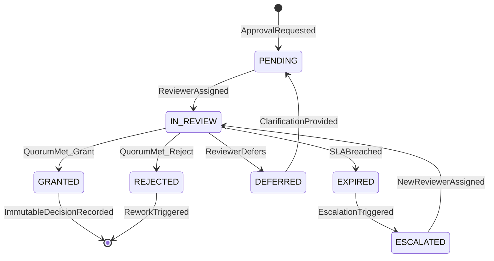

### 4.2 Version State Machine (Per Output)

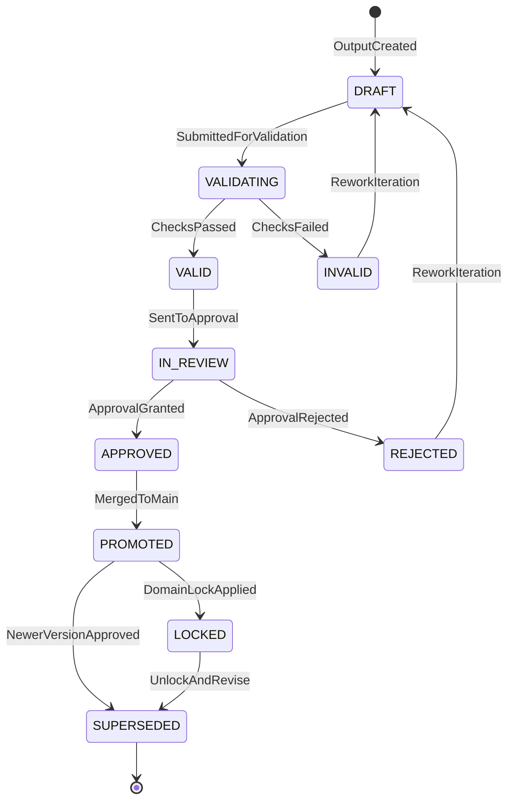

### 4.3 Universal Transition Table

| From State | Event | To State | Side Effects |
|------------|-------|----------|--------------|
| `PENDING` | `StepStarted` | `RUNNING` | AuditEvent: `StepStarted` |
| `RUNNING` | `AgentProposalReady` | `OUTPUT_READY` | AssetVersion on `ai-draft` branch |
| `OUTPUT_READY` | `ValidationStarted` | `VALIDATING` | — |
| `VALIDATING` | `ValidationPassed` | `AWAITING_APPROVAL` | ApprovalRequest created |
| `VALIDATING` | `ValidationFailed` | `REWORK_QUEUED` | AuditEvent: `ValidationFailed` |
| `AWAITING_APPROVAL` | `ApprovalGranted` | `APPROVED` | ApprovalDecision immutable |
| `AWAITING_APPROVAL` | `ApprovalRejected` | `REWORK_QUEUED` | AuditEvent: `ApprovalRejected` |
| `APPROVED` | `VersionCommitted` | `COMPLETED` | Merge to `main`; lineage recorded |
| `REWORK_QUEUED` | `ReworkRouted` | `PENDING` | New branch `rework-{n}` |

---

## 5. Workflow Catalog

### 5.1 Master Production Pipeline

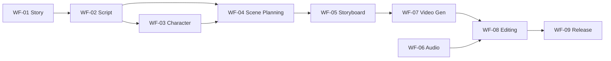

### 5.2 Workflow Comparison Matrix

| Workflow | AI Stages | Human Approvals | Typical Iterations | Locking Event |
|----------|-----------|-----------------|-------------------|---------------|
| Story Creation | 2 | 2 | 3–8 | Treatment approved |
| Script Generation | 3 | 3 | 5–15 | Script locked |
| Character Creation | 2 | 2 | 2–6 | Character bible approved |
| Scene Planning | 2 | 2 | 2–5 | Shot list approved |
| Storyboarding | 2 | 2 | 4–12 | Storyboard approved |
| Audio Production | 3 | 4 | 3–10 | Final mix approved |
| Video Generation | 2 | 2 | 3–20 | Generated video approved |
| Editing | 1 | 4 | 5–25 | Picture locked |
| Release | 1 | 3 | 1–3 | Publication authorized |

---

## WF-01: Story Creation

**Template:** `story.creation`  
**Subject:** `Story` entity  
**Entry trigger:** Project enters `DEVELOPMENT` phase  
**Exit condition:** Approved treatment promoted to `main`; triggers WF-02

### WF-01 Diagram

```mermaid
flowchart TD
    START([Project Development Start]) --> S1

    S1["S1: Brief Ingest [/S/]
    Inputs: creative brief, genre constraints
    Outputs: brief asset v1"]

    S1 --> S2

    S2["S2: Research Assist [A]
    Agent: Research Agent
    Outputs: reference pack on ai-draft"]

    S2 --> S3{S3: Reference Validation {V}}

    S3 -->|Fail| S2
    S3 -->|Pass| S4

    S4["S4: Story Draft [A]
    Agent: Writer Agent
    Outputs: treatment/outline on ai-draft"]

    S4 --> S5{S5: Structure Validation {V}
    Checks: act structure, beat completeness}

    S5 -->|Fail| S4
    S5 -->|Pass| S6

    S6["S6: Human Refinement [H]
    Outputs: treatment on human-edit"]

    S6 --> S7

    S7["S7: Showrunner Review <<AP>>
    Approver: Showrunner / EP"]

    S7 -->|Reject| S6
    S7 -->|Defer| S6
    S7 -->|Grant| S8

    S8["S8: Promote & Version [/S/]
    Merge to main; Story v1 approved"]

    S8 --> END([Triggers WF-02])

    S2 -.->|rework loop| S2
    S4 -.->|rework loop| S4
```

### WF-01 Stage Specification

| Stage | Inputs | Outputs | Validation | Approval | Rework → | Audit Event | Version |
|-------|--------|---------|------------|----------|----------|-------------|---------|
| **S1: Brief Ingest** | Creative brief, project charter | `Document` brief v1 | Format, classification set | Deferred | S1 | `BriefIngested` | `brief-v1` |
| **S2: Research Assist** | Brief v1, reference queries | Reference pack (`ai-draft`) | Source count ≥ 3, classification | Deferred | S2 | `AgentTaskCompleted` | `research-ai-v{n}` |
| **S3: Reference Validation** | Reference pack | Gate result | Citations present, no CONFIDENTIAL leak | N/A | S2 | `ValidationPassed/Failed` | — |
| **S4: Story Draft** | Brief, references, genre rules | Treatment/outline (`ai-draft`) | Beat sheet complete, logline present | Deferred | S4 | `ProposalGenerated` | `story-ai-v{n}` |
| **S5: Structure Validation** | Treatment | Gate result | 3-act or equivalent structure valid | N/A | S4 | `ValidationPassed/Failed` | — |
| **S6: Human Refinement** | Treatment `ai-draft` | Treatment (`human-edit`) | Format compliance | Deferred | S6 | `StoryDraftRevised` | `story-human-v{n}` |
| **S7: Showrunner Review** | Treatment `human-edit` | `ApprovalDecision` | N/A | **Showrunner** (quorum: 1) | S6 | `ApprovalGranted/Rejected` | — |
| **S8: Promote & Version** | Approved treatment | `Story` status=APPROVED | Approval ref exists | System verify | S7 | `StoryApproved` | `story-main-v1` |

### WF-01 State Transitions

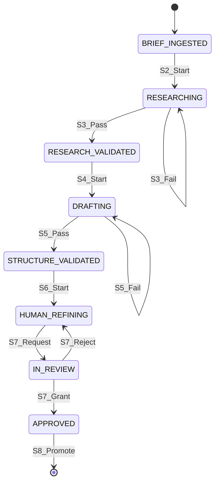

---

## WF-02: Script Generation

**Template:** `script.generation`  
**Subject:** `Script` entity  
**Entry trigger:** WF-01 complete OR direct script brief  
**Exit condition:** Script `LOCKED` with approval chain complete

### WF-02 Diagram

```mermaid
flowchart TD
    START([Story Approved / Script Brief]) --> S1

    S1["S1: Outline Sync [/S/]
    Inputs: approved story, beat sheet
    Outputs: script outline asset"]

    S1 --> S2

    S2["S2: Scene Structure Draft [A]
    Agent: Writer Agent
    Outputs: scene list + sluglines ai-draft"]

    S2 --> S3{S3: Scene Index Validation {V}}

    S3 -->|Fail| S2
    S3 -->|Pass| S4

    S4["S4: Screenplay Draft [A]
    Agent: Writer Agent
    Outputs: full script ai-draft"]

    S4 --> S5{S5: Format Validation {V}
    Checks: page count, scene headings, dialogue format}

    S5 -->|Fail| S4
    S5 -->|Pass| S6

    S6["S6: Writers' Room Edit [H]
    Outputs: script human-edit branch"]

    S6 --> S7

    S7["S7: Writer Review <<AP>>
    Approver: Lead Writer"]

    S7 -->|Reject| S6
    S7 -->|Grant| S8

    S8["S8: Director Script Review <<AP>>
    Approver: Director"]

    S8 -->|Reject| S6
    S8 -->|Grant| S9

    S9["S9: Lock Script [/S/]
    Script status=LOCKED; triggers WF-03, WF-04"]

    S9 --> END([Script Locked])
```

### WF-02 Stage Specification

| Stage | Inputs | Outputs | Validation | Approval | Rework → | Audit Event | Version |
|-------|--------|---------|------------|----------|----------|-------------|---------|
| **S1: Outline Sync** | Approved story, beat sheet | Script outline v1 | Story ref approved | Deferred | S1 | `ScriptOutlineCreated` | `outline-v1` |
| **S2: Scene Structure** | Outline, bible refs | Scene index (`ai-draft`) | Scene numbers unique | Deferred | S2 | `ProposalGenerated` | `scenes-ai-v{n}` |
| **S3: Scene Index Validation** | Scene index | Gate | Continuity with story beats | N/A | S2 | `ValidationPassed/Failed` | — |
| **S4: Screenplay Draft** | Scene index, character refs | Full script (`ai-draft`) | Page count within ±10% target | Deferred | S4 | `ProposalGenerated` | `script-ai-v{n}` |
| **S5: Format Validation** | Script draft | Gate | Fountain/Final Draft schema valid | N/A | S4 | `ValidationPassed/Failed` | — |
| **S6: Writers' Room Edit** | Script `ai-draft`, room notes | Script (`human-edit`) | Track changes preserved | Deferred | S6 | `ScriptDraftRevised` | `script-human-v{n}` |
| **S7: Writer Review** | Script `human-edit` | `ApprovalDecision` | N/A | **Lead Writer** | S6 | `ApprovalGranted/Rejected` | — |
| **S8: Director Review** | Script post-writer | `ApprovalDecision` | N/A | **Director** | S6 | `ApprovalGranted/Rejected` | — |
| **S9: Lock Script** | Dual approvals | `Script.LOCKED` | 2 approval refs | System | S8 | `ScriptLocked` | `script-main-locked` |

### WF-02 State Transitions

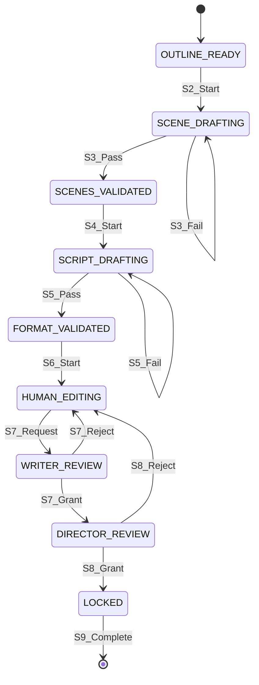

---

## WF-03: Character Creation

**Template:** `character.creation`  
**Subject:** `Character` + `ContinuityBible`  
**Entry trigger:** WF-02 script draft available (parallel track) or script locked  
**Exit condition:** Character registry approved for production use

### WF-03 Diagram

```mermaid
flowchart TD
    START([Script Available]) --> S1

    S1["S1: Character Extraction [A]
    Agent: Script Analyst
    Outputs: character list ai-draft"]

    S1 --> S2{S2: Extraction Validation {V}
    All speaking roles captured?}

    S2 -->|Fail| S1
    S2 -->|Pass| S3

    S3["S3: Profile Generation [A]
    Agent: Character Agent
    Outputs: profiles + arcs ai-draft"]

    S3 --> S4{S4: Bible Consistency {V}
    Matches story genre/rules?}

    S4 -->|Fail| S3
    S4 -->|Pass| S5

    S5["S5: Human Enrichment [H]
    Outputs: profiles human-edit"]

    S5 --> S6

    S6["S6: Showrunner Approval <<AP>>"]

    S6 -->|Reject| S5
    S6 -->|Grant| S7

    S7["S7: Casting Link Prep [/S/]
    Character registry published"]

    S7 --> END([Character Registry Active])
```

### WF-03 Stage Specification

| Stage | Inputs | Outputs | Validation | Approval | Rework → | Audit Event | Version |
|-------|--------|---------|------------|----------|----------|-------------|---------|
| **S1: Character Extraction** | Script version, scene list | Character list (`ai-draft`) | ≥1 character per speaking role | Deferred | S1 | `ProposalGenerated` | `chars-ai-v{n}` |
| **S2: Extraction Validation** | Character list | Gate | Script coverage 100% speaking roles | N/A | S1 | `ValidationPassed/Failed` | — |
| **S3: Profile Generation** | Character list, story bible | Profiles + arcs (`ai-draft`) | Arc present for leads | Deferred | S3 | `ProposalGenerated` | `profiles-ai-v{n}` |
| **S4: Bible Consistency** | Profiles | Gate | No bible rule violations | N/A | S3 | `ValidationPassed/Failed` | — |
| **S5: Human Enrichment** | Profiles `ai-draft` | Profiles (`human-edit`) | Required fields complete | Deferred | S5 | `CharacterEnriched` | `profiles-human-v{n}` |
| **S6: Showrunner Approval** | Profiles | `ApprovalDecision` | N/A | **Showrunner** | S5 | `ApprovalGranted/Rejected` | — |
| **S7: Casting Link Prep** | Approved profiles | `Character` registry | Approval ref | System | S6 | `CharacterRegistryPublished` | `characters-main-v1` |

### WF-03 State Transitions

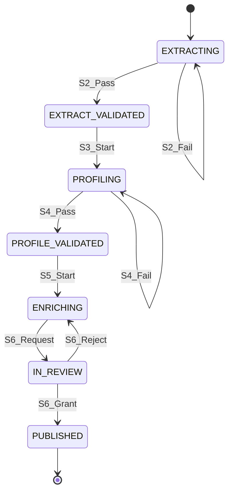

---

## WF-04: Scene Planning

**Template:** `scene.planning`  
**Subject:** `Scene`, `Shot`, `Breakdown`  
**Entry trigger:** Script `LOCKED`  
**Exit condition:** Approved shot list and breakdown ready for storyboard + shoot

### WF-04 Diagram

```mermaid
flowchart TD
    START([Script Locked]) --> S1

    S1["S1: Script Breakdown [A]
    Agent: AD Agent
    Outputs: breakdown sheet ai-draft"]

    S1 --> S2{S2: Breakdown Validation {V}
    All scenes mapped? Elements tagged?}

    S2 -->|Fail| S1
    S2 -->|Pass| S3

    S3["S3: Shot List Draft [A]
    Agent: Visual Planning Agent
    Outputs: shot list ai-draft"]

    S3 --> S4{S4: Coverage Validation {V}
    Every scene has coverage?}

    S4 -->|Fail| S3
    S4 -->|Pass| S5

    S5["S5: AD Review [H]
    Outputs: shot list human-edit"]

    S5 --> S6

    S6["S6: Director Approval <<AP>>"]

    S6 -->|Reject| S5
    S6 -->|Grant| S7

    S7["S7: Schedule Bind [/S/]
    Link to production calendar"]

    S7 --> END([Triggers WF-05])
```

### WF-04 Stage Specification

| Stage | Inputs | Outputs | Validation | Approval | Rework → | Audit Event | Version |
|-------|--------|---------|------------|----------|----------|-------------|---------|
| **S1: Script Breakdown** | Locked script, characters, locations | Breakdown (`ai-draft`) | Scene count matches script | Deferred | S1 | `ProposalGenerated` | `breakdown-ai-v{n}` |
| **S2: Breakdown Validation** | Breakdown | Gate | 100% scene coverage; elements typed | N/A | S1 | `ValidationPassed/Failed` | — |
| **S3: Shot List Draft** | Breakdown, director brief | Shot list (`ai-draft`) | Shots reference valid scenes | Deferred | S3 | `ProposalGenerated` | `shots-ai-v{n}` |
| **S4: Coverage Validation** | Shot list | Gate | No scene without coverage | N/A | S3 | `ValidationPassed/Failed` | — |
| **S5: AD Review** | Shot list `ai-draft` | Shot list (`human-edit`) | Safety/logistics flags | Deferred | S5 | `ShotListRevised` | `shots-human-v{n}` |
| **S6: Director Approval** | Shot list | `ApprovalDecision` | N/A | **Director** | S5 | `ApprovalGranted/Rejected` | — |
| **S7: Schedule Bind** | Approved shot list | Calendar events | Approval ref | System | S6 | `ShotListApproved` | `breakdown-main`, `shots-main` |

### WF-04 State Transitions

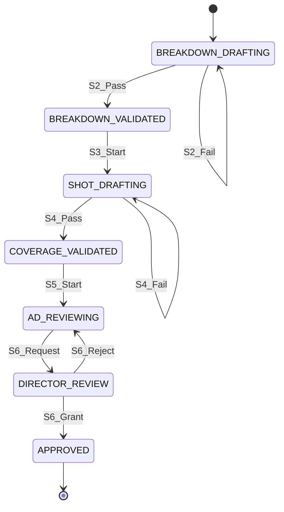

---

## WF-05: Storyboarding

**Template:** `storyboard.production`  
**Subject:** `StoryboardFrame`, `Shot`  
**Entry trigger:** WF-04 shot list approved  
**Exit condition:** Storyboard frames approved per scene

### WF-05 Diagram

```mermaid
flowchart TD
    START([Shot List Approved]) --> S1

    S1["S1: Style Bible Bind [/S/]
    Inputs: style refs, character visuals"]

    S1 --> S2

    S2["S2: Frame Generation [A]
    Agent: Visual Agent + ComfyUI
    Outputs: frames ai-draft per shot"]

    S2 --> S3{S3: Visual Validation {V}
    Resolution, style match, shot coverage}

    S3 -->|Fail| S2
    S3 -->|Pass| S4

    S4["S4: Storyboard Assembly [H]
    Outputs: ordered frame set human-edit"]

    S4 --> S5

    S5["S5: Director Review <<AP>>
    Side-by-side: AI vs human notes"]

    S5 -->|Reject| S2
    S5 -->|Grant| S6

    S6["S6: Frame Version Commit [/S/]
    Approved frames → main branch"]

    S6 --> END([Triggers WF-07 previz path])
```

### WF-05 Stage Specification

| Stage | Inputs | Outputs | Validation | Approval | Rework → | Audit Event | Version |
|-------|--------|---------|------------|----------|----------|-------------|---------|
| **S1: Style Bible Bind** | Shot list, character refs, style bible | Style context package | Refs approved | Deferred | S1 | `StyleBibleBound` | `style-ctx-v1` |
| **S2: Frame Generation** | Shots, style context, prompts | `Image` frames (`ai-draft`) | GPU budget; local-first policy | Deferred | S2 | `ProposalGenerated` | `frame-ai-v{n}` |
| **S3: Visual Validation** | Frames | Gate | Resolution ≥ spec; style score ≥ threshold | N/A | S2 | `ValidationPassed/Failed` | — |
| **S4: Storyboard Assembly** | Frames `ai-draft` | Ordered set (`human-edit`) | Shot order matches list | Deferred | S4 | `StoryboardAssembled` | `board-human-v{n}` |
| **S5: Director Review** | Storyboard set | `ApprovalDecision` | N/A | **Director** | S2 or S4 | `ApprovalGranted/Rejected` | — |
| **S6: Frame Version Commit** | Approved frames | Frames on `main` | Approval + lineage | System | S5 | `StoryboardApproved` | `frames-main-v1` |

### WF-05 State Transitions

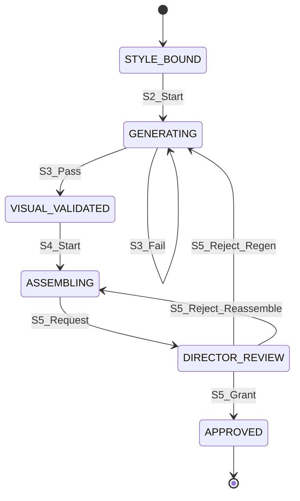

---

## WF-06: Audio Production

**Template:** `audio.production`  
**Subject:** `AudioSession`, `Mix`  
**Entry trigger:** Picture available (rough cut minimum) OR podcast/script for audio-first  
**Exit condition:** Final mix approved and stems delivered

### WF-06 Diagram

```mermaid
flowchart TD
    START([Audio Source Ready]) --> S1

    S1["S1: Audio Ingest [/S/]
    Inputs: production audio, recordings
    Outputs: organized sessions v1"]

    S1 --> S2

    S2["S2: Cleanup & Alignment [A]
    Agent: Audio Agent
    Outputs: cleaned stems ai-draft"]

    S2 --> S3{S3: Technical Validation {V}
    Sample rate, sync, noise floor}

    S3 -->|Fail| S2
    S3 -->|Pass| S4

    S4["S4: Sound Design [H/A]
    Human lead; AI assist for Foley proposals"]

    S4 --> S5

    S5["S5: Premix [H]
    Outputs: premix human-edit"]

    S5 --> S6

    S6["S6: Sound Supervisor Review <<AP>>"]

    S6 -->|Reject| S4
    S6 -->|Grant| S7

    S7["S7: Final Mix [H]
    Outputs: final mix"]

    S7 --> S8{S8: Loudness Validation {V}
    LUFS, true peak per spec}

    S8 -->|Fail| S7
    S8 -->|Pass| S9

    S9["S9: Re-recording Mixer Approval <<AP>>"]

    S9 -->|Reject| S7
    S9 -->|Grant| S10

    S10["S10: Stem Delivery [/S/]
    M&E, dialogue, music stems versioned"]

    S10 --> END([Feeds WF-08])
```

### WF-06 Stage Specification

| Stage | Inputs | Outputs | Validation | Approval | Rework → | Audit Event | Version |
|-------|--------|---------|------------|----------|----------|-------------|---------|
| **S1: Audio Ingest** | Raw audio, metadata | `Audio` sessions v1 | Format recognized; sync map | Deferred | S1 | `AudioIngested` | `audio-raw-v1` |
| **S2: Cleanup & Alignment** | Raw sessions, edit ref | Cleaned stems (`ai-draft`) | Sync offset ≤ threshold | Deferred | S2 | `ProposalGenerated` | `stems-ai-v{n}` |
| **S3: Technical Validation** | Stems | Gate | Noise floor, clipping, sync | N/A | S2 | `ValidationPassed/Failed` | — |
| **S4: Sound Design** | Stems, creative brief | SFX/M&E (`human-edit`/`ai-draft`) | Asset rights cleared | Deferred | S4 | `SoundDesignCompleted` | `sfx-v{n}` |
| **S5: Premix** | All stems | Premix (`human-edit`) | No missing channels | Deferred | S5 | `PremixCreated` | `premix-v{n}` |
| **S6: Supervisor Review** | Premix | `ApprovalDecision` | N/A | **Sound Supervisor** | S4 | `ApprovalGranted/Rejected` | — |
| **S7: Final Mix** | Approved premix | Final mix | — | Deferred | S7 | `FinalMixCreated` | `mix-v{n}` |
| **S8: Loudness Validation** | Final mix | Gate | LUFS ± spec; true peak OK | N/A | S7 | `ValidationPassed/Failed` | — |
| **S9: Mixer Approval** | Final mix | `ApprovalDecision` | N/A | **Re-recording Mixer** | S7 | `ApprovalGranted/Rejected` | — |
| **S10: Stem Delivery** | Approved mix | Stem package on `main` | Approval + spec | System | S9 | `FinalMixApproved` | `mix-main-final` |

### WF-06 State Transitions

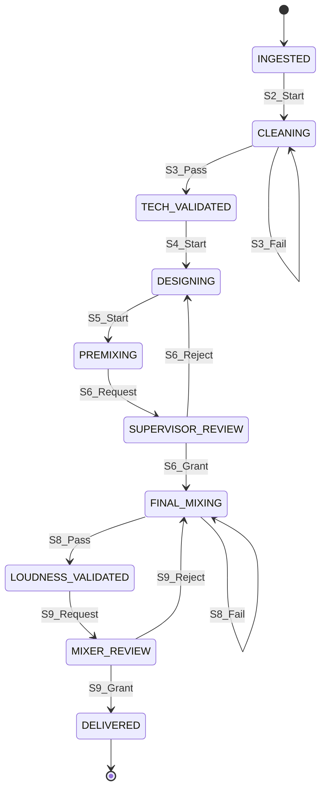

---

## WF-07: Video Generation

**Template:** `video.generation`  
**Subject:** `Video` (generated), `PrevizSequence`  
**Entry trigger:** WF-05 storyboard approved OR direct generation brief  
**Exit condition:** Generated video approved for editorial integration

### WF-07 Diagram

```mermaid
flowchart TD
    START([Visual Brief Ready]) --> S1

    S1["S1: Prompt & Control Pack [H/A]
    Human brief + Agent prompt drafting
    Outputs: approved prompt version"]

    S1 --> S2

    S2["S2: Policy & Budget Check {V}
    Classification, burst eligibility, GPU budget"]

    S2 -->|Fail| S1
    S2 -->|Pass| S3

    S3["S3: Video Generation [A]
    Agent + diffusion/video model
    Outputs: video candidates ai-draft"]

    S3 --> S4{S4: Technical QC {V}
    Resolution, duration, artifact score}

    S4 -->|Fail| S3
    S4 -->|Pass| S5

    S5["S5: Creative Review [H]
    Select best candidate; annotate"]

    S5 --> S6

    S6["S6: Director / VFX Sup Review <<AP>>"]

    S6 -->|Reject| S1
    S6 -->|Grant| S7

    S7["S7: Version & Lineage Commit [/S/]
    AI disclosure tagged; lineage recorded"]

    S7 --> END([Feeds WF-08])
```

### WF-07 Stage Specification

| Stage | Inputs | Outputs | Validation | Approval | Rework → | Audit Event | Version |
|-------|--------|---------|------------|----------|----------|-------------|---------|
| **S1: Prompt & Control Pack** | Storyboard, shot ref, style bible | `PromptVersion` approved | Prompt approved status | Deferred | S1 | `PromptVersionCreated` | `prompt-v{n}` |
| **S2: Policy & Budget Check** | Prompt, classification | Gate | Egress/burst policy pass; budget OK | N/A | S1 | `PolicyEvaluated` | — |
| **S3: Video Generation** | Prompt, refs, model routing | `Video` candidates (`ai-draft`) | `is_ai_generated=true` | Deferred | S3 | `ProposalGenerated` | `video-ai-v{n}` |
| **S4: Technical QC** | Candidates | Gate | Resolution, codec, duration, artifact score | N/A | S3 | `ValidationPassed/Failed` | — |
| **S5: Creative Review** | Candidates | Selected video (`human-edit`) | Timecode valid | Deferred | S5 | `VideoCandidateSelected` | `video-select-v{n}` |
| **S6: Director/VFX Review** | Selected video | `ApprovalDecision` | N/A | **Director** or **VFX Sup** | S1 or S3 | `ApprovalGranted/Rejected` | — |
| **S7: Version & Lineage Commit** | Approved video | Video on `main` | Lineage + AI flag + consent | System | S6 | `VideoGenerationApproved` | `video-main-v1` |

### WF-07 State Transitions

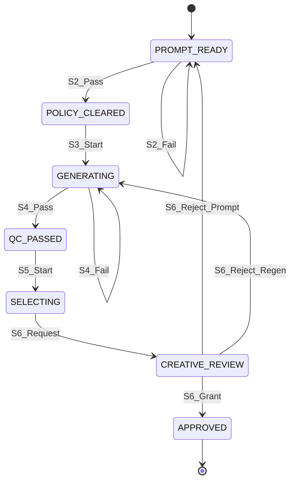

---

## WF-08: Editing

**Template:** `editorial.pipeline`  
**Subject:** `Edit`  
**Entry trigger:** Dailies/generate video available  
**Exit condition:** Picture locked; handoff to conform + final audio

### WF-08 Diagram

```mermaid
flowchart TD
    START([Media Available]) --> S1

    S1["S1: Assembly Ingest [/S/]
    Dailies, proxies, generated video"]

    S1 --> S2

    S2["S2: Rough Cut [H]
    Optional: AI assembly suggestions ai-draft"]

    S2 --> S3

    S3["S3: Editor Review <<AP>>
    Approver: Post Supervisor"]

    S3 -->|Reject| S2
    S3 -->|Grant| S4

    S4["S4: Fine Cut [H]
    Director notes incorporated"]

    S4 --> S5

    S5["S5: Director Review <<AP>>"]

    S5 -->|Reject| S4
    S5 -->|Grant| S6

    S6["S6: Producer Review <<AP>>"]

    S6 -->|Reject| S4
    S6 -->|Grant| S7

    S7["S7: Picture Lock [/S/]
    Edit status=LOCKED"]

    S7 --> END([Triggers conform, WF-06 final, WF-09 prep])
```

### WF-08 Stage Specification

| Stage | Inputs | Outputs | Validation | Approval | Rework → | Audit Event | Version |
|-------|--------|---------|------------|----------|----------|-------------|---------|
| **S1: Assembly Ingest** | Dailies, proxies, approved generated video | Edit project v1 | Proxy-to-master map valid | Deferred | S1 | `EditProjectCreated` | `edit-v1` |
| **S2: Rough Cut** | Edit v1, script, AI suggestions | Rough cut (`human-edit`) | Runtime within target ±20% | Deferred | S2 | `RoughCutCreated` | `edit-rough-v{n}` |
| **S3: Editor Review** | Rough cut | `ApprovalDecision` | N/A | **Post Supervisor** | S2 | `ApprovalGranted/Rejected` | — |
| **S4: Fine Cut** | Approved rough, director notes | Fine cut (`human-edit`) | Scene order matches script | Deferred | S4 | `FineCutCreated` | `edit-fine-v{n}` |
| **S5: Director Review** | Fine cut | `ApprovalDecision` | N/A | **Director** | S4 | `ApprovalGranted/Rejected` | — |
| **S6: Producer Review** | Fine cut | `ApprovalDecision` | N/A | **Producer** | S4 | `ApprovalGranted/Rejected` | — |
| **S7: Picture Lock** | Triple approvals | `Edit.LOCKED` | 3 approval refs | System | S6 | `PictureLocked` | `edit-main-locked` |

### WF-08 State Transitions

```mermaid
stateDiagram-v2
    [*] --> INGESTED
    INGESTED --> ROUGH_CUTTING: S2_Start
    ROUGH_CUTTING --> ROUGH_APPROVED: S3_Grant
    ROUGH_CUTTING --> ROUGH_CUTTING: S3_Reject
    ROUGH_APPROVED --> FINE_CUTTING: S4_Start
    FINE_CUTTING --> DIRECTOR_REVIEW: S5_Request
    DIRECTOR_REVIEW --> PRODUCER_REVIEW: S5_Grant
    DIRECTOR_REVIEW --> FINE_CUTTING: S5_Reject
    PRODUCER_REVIEW --> PICTURE_LOCKED: S6_Grant
    PRODUCER_REVIEW --> FINE_CUTTING: S6_Reject
    PICTURE_LOCKED --> [*]
```

---

## WF-09: Release

**Template:** `release.publication`  
**Subject:** `Master`, `Release`, `PublicationGate`  
**Entry trigger:** Certified master from editorial + audio + QC  
**Exit condition:** `PublicationAuthorized` — content cleared for distribution

### WF-09 Diagram

```mermaid
flowchart TD
    START([Master Ready]) --> S1

    S1["S1: Master Ingest [/S/]
    Inputs: locked edit, final mix, VFX
    Outputs: master candidate v1"]

    S1 --> S2{S2: Deliverables QC {V}
    Spec compliance: codec, loudness, bars}

    S2 -->|Fail| S1
    S2 -->|Pass| S3

    S3["S3: AI Disclosure & Rights Check [A]
    Agent: Compliance Agent
    Outputs: disclosure report"]

    S3 --> S4{S4: Compliance Validation {V}
    All AI tagged? Rights clear? Consent valid?}

    S4 -->|Fail| FIX[Remediation Workflow]
    FIX --> S1
    S4 -->|Pass| S5

    S5["S5: Post Supervisor QC Approval <<AP>>"]

    S5 -->|Reject| FIX
    S5 -->|Grant| S6

    S6["S6: Legal / Compliance Approval <<AP>>"]

    S6 -->|Reject| FIX
    S6 -->|Grant| S7

    S7["S7: EP Distribution Sign-off <<AP>>"]

    S7 -->|Reject| FIX
    S7 -->|Grant| S8

    S8["S8: Package Assembly [/S/]
    Distribution package per platform"]

    S8 --> S9

    S9["S9: Publication Gate [/S/]
    Gate status=AUTHORIZED"]

    S9 --> END([Distribution Enabled])
```

### WF-09 Stage Specification

| Stage | Inputs | Outputs | Validation | Approval | Rework → | Audit Event | Version |
|-------|--------|---------|------------|----------|----------|-------------|---------|
| **S1: Master Ingest** | Locked edit, final mix, VFX finals | `Master` candidate v1 | Source refs locked | Deferred | S1 | `MasterSubmitted` | `master-v1` |
| **S2: Deliverables QC** | Master, deliverables spec | `QCReport` | Automated spec pass | N/A | S1 | `ValidationPassed/Failed` | — |
| **S3: AI Disclosure & Rights** | Master, lineage graph | Disclosure report | N/A | Deferred | S3 | `ComplianceScanCompleted` | `disclosure-v1` |
| **S4: Compliance Validation** | Report, rights, consent | Gate | 0 unapproved AI; rights valid | N/A | Remediation | `ValidationPassed/Failed` | — |
| **S5: Post Supervisor QC** | Master + QC report | `ApprovalDecision` | N/A | **Post Supervisor** | S1 | `ApprovalGranted/Rejected` | — |
| **S6: Legal / Compliance** | Master, disclosure | `ApprovalDecision` | N/A | **Legal / Compliance** | S1 | `ApprovalGranted/Rejected` | — |
| **S7: EP Distribution Sign-off** | Full package | `ApprovalDecision` | N/A | **Executive Producer** | S1 | `ApprovalGranted/Rejected` | — |
| **S8: Package Assembly** | Certified master | `DistributionPackage` | 3 approvals present | System | S7 | `PackageAssembled` | `package-v1` |
| **S9: Publication Gate** | Package, checklist | `PublicationGate.AUTHORIZED` | All gates pass | System | S7 | `PublicationAuthorized` | `release-main-v1` |

### WF-09 State Transitions

```mermaid
stateDiagram-v2
    [*] --> MASTER_INGESTED
    MASTER_INGESTED --> QC_PASSED: S2_Pass
    MASTER_INGESTED --> MASTER_INGESTED: S2_Fail
    QC_PASSED --> COMPLIANCE_SCANNING: S3_Start
    COMPLIANCE_SCANNING --> COMPLIANCE_PASSED: S4_Pass
    COMPLIANCE_SCANNING --> REMEDIATION: S4_Fail
    REMEDIATION --> MASTER_INGESTED: Fixed
    COMPLIANCE_PASSED --> POST_QC_REVIEW: S5_Request
    POST_QC_REVIEW --> LEGAL_REVIEW: S5_Grant
    POST_QC_REVIEW --> REMEDIATION: S5_Reject
    LEGAL_REVIEW --> EP_REVIEW: S6_Grant
    LEGAL_REVIEW --> REMEDIATION: S6_Reject
    EP_REVIEW --> PACKAGING: S7_Grant
    EP_REVIEW --> REMEDIATION: S7_Reject
    PACKAGING --> AUTHORIZED: S9_Complete
    AUTHORIZED --> [*]
```

---

## 15. Cross-Workflow Orchestration

### 15.1 Parent-Child Workflow Relationships

```mermaid
flowchart TB
    subgraph Development["Development Phase"]
        WF01[WF-01 Story]
        WF02[WF-02 Script]
        WF03[WF-03 Character]
    end

    subgraph PreProd["Pre-Production Phase"]
        WF04[WF-04 Scene Planning]
        WF05[WF-05 Storyboard]
        WF07A[WF-07 Video Gen - Previz]
    end

    subgraph Post["Post-Production Phase"]
        WF08[WF-08 Editing]
        WF06[WF-06 Audio]
        WF07B[WF-07 Video Gen - VFX]
    end

    subgraph ReleasePhase["Release Phase"]
        WF09[WF-09 Release]
    end

    WF01 -->|on complete| WF02
    WF02 -->|parallel| WF03
    WF02 -->|on lock| WF04
    WF03 -.->|feeds| WF04
    WF04 --> WF05
    WF05 --> WF07A
    WF05 --> WF08
    WF07A --> WF08
    WF08 -->|picture lock| WF06
    WF08 --> WF07B
    WF06 --> WF09
    WF08 -->|master| WF09
```

### 15.2 Chained Workflow Trigger Events

| Parent Event | Child Workflow | Condition |
|--------------|----------------|-----------|
| `StoryApproved` | WF-02 Script Generation | Project media type ∈ scripted |
| `ScriptLocked` | WF-03, WF-04 | Parallel start |
| `ShotListApproved` | WF-05 Storyboarding | — |
| `StoryboardApproved` | WF-07 Video Generation | `mode=previz` |
| `PictureLocked` | WF-06 Audio (final), WF-07 (`mode=vfx`) | — |
| `FinalMixApproved` | WF-09 Release (prep) | Master ingest readiness |
| `MasterCertified` | WF-09 Release | Auto-start if not running |

### 15.3 Parallel Workflow Coordination

When WF-03 and WF-04 run in parallel, a **join gate** blocks WF-05 until both emit:

- `CharacterRegistryPublished`
- `ShotListApproved`

```mermaid
stateDiagram-v2
    [*] --> PARALLEL_RUNNING
    PARALLEL_RUNNING --> JOIN_WAITING: BothWFsActive
    JOIN_WAITING --> JOIN_SATISFIED: CharacterRegistry AND ShotListApproved
    JOIN_WAITING --> JOIN_WAITING: OneComplete
    JOIN_SATISFIED --> WF05_TRIGGERED
    WF05_TRIGGERED --> [*]
```

---

## 16. Audit & Versioning Standards

### 16.1 Mandatory Audit Events (All Workflows)

| Event | When | Graph Link |
|-------|------|------------|
| `WorkflowStarted` | Instance created | → Project, WorkflowInstance |
| `StepStarted` | Stage execution begins | → StepExecution |
| `ProposalGenerated` | Agent output created | → AgentTask, AssetVersion |
| `ValidationPassed` / `ValidationFailed` | Gate result | → Stage, subject version |
| `ApprovalRequested` | Human review queued | → Approval |
| `ApprovalGranted` / `ApprovalRejected` | Decision recorded | → ApprovalDecision, subject |
| `VersionCommitted` | Promoted to main | → AssetVersion, lineage |
| `WorkflowCompleted` | Terminal success | → Project, subject |
| `ReworkInitiated` | Loop entered | → source + target stage |

### 16.2 Version Branch Convention

| Branch | Purpose | Merge Trigger |
|--------|---------|---------------|
| `ai-draft` | Agent proposals | Approval granted |
| `human-edit` | Human creative work | Approval granted |
| `rework-{n}` | Rejection iterations | Next submission |
| `main` | Approved production truth | Lock events |
| `locked` | Immutable domain state | Script/edit/mix lock |

### 16.3 Lineage Requirements Per Workflow

| Workflow | Required `DERIVED_FROM` Chain |
|----------|------------------------------|
| Story Creation | `research-ai` → `story-ai` → `story-main` |
| Script Generation | `story-main` → `script-ai` → `script-main` |
| Character Creation | `script` → `profiles-ai` → `characters-main` |
| Scene Planning | `script-locked` → `breakdown-ai` → `shots-main` |
| Storyboarding | `shots-main` + `prompt` → `frames-ai` → `frames-main` |
| Audio Production | `audio-raw` → `stems-ai` → `mix-main` |
| Video Generation | `prompt` + `storyboard` → `video-ai` → `video-main` |
| Editing | `dailies` + `video-main` → `edit-rough` → `edit-locked` |
| Release | `edit-locked` + `mix-main` → `master` → `release-main` |

### 16.4 Validation Rule Library (Reusable)

| Rule ID | Name | Applies To |
|---------|------|------------|
| `VAL-001` | `ClassificationSet` | All ingested assets |
| `VAL-002` | `ApprovalRefExists` | All promote-to-main actions |
| `VAL-003` | `LineageComplete` | All AI-generated outputs |
| `VAL-004` | `ConsentValid` | Talent likeness in visual/audio |
| `VAL-005` | `FormatCompliance` | Script, master, package |
| `VAL-006` | `CoverageComplete` | Scene planning, storyboard |
| `VAL-007` | `LoudnessSpec` | Audio mix stages |
| `VAL-008` | `BudgetNotExceeded` | Agent and burst stages |
| `VAL-009` | `PolicyEgressPass` | Cloud burst, external API |
| `VAL-010` | `AIDisclosureComplete` | Release workflow |

---

## Document Control

| Version | Date | Changes |
|---------|------|---------|
| 1.0 | 2026-06-08 | Initial workflow architecture — 9 production workflows |

| Related Document | Relationship |
|-----------------|--------------|
| Domain Driven Design.md | Workflow bounded context, aggregates |
| Enterprise Knowledge Graph.md | Audit and lineage projection |
| Business Capabilities.md | Capability domain 9 — Workflow Orchestration |

---

*Every AIMPOS production workflow is a governed pipeline: agents propose, validators gate, humans approve, versions accumulate, and audit never forgets. No stage ships without the universal contract.*

*End of document*
