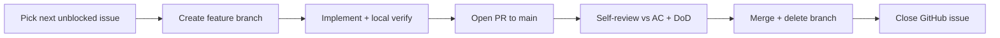

# AIMPOS-Spark Visual — Development Workflow

**Document Type:** Engineering Governance  
**Version:** 1.0  
**Status:** FROZEN — Effective June 9, 2026  
**Date:** June 9, 2026  
**Product:** AIMPOS-Spark Visual (`Idea → Story → Script → Storyboard`)  
**Authority:** Frozen planning artifacts + this document for day-to-day execution

---

## Purpose

Define the minimum workflow for moving work from the GitHub backlog to merged code on `main`. This document does not restate architecture or scope — it references them.

**Related documents:**

- [MVP Scope Freeze.md](../../MVP%20Scope%20Freeze.md) — scope contract
- [GitHub Issues - Visual MVP.md](../../GitHub%20Issues%20-%20Visual%20MVP.md) — backlog (43 issues)
- [MVP Dependency Map.md](../../MVP%20Dependency%20Map.md) — dependency order
- [Sprint 0 — Platform Skeleton.md](../../Sprint%200%20%E2%80%94%20Platform%20Skeleton.md) — Sprint 0 execution
- [Sprint Reclassification.md](../../Sprint%20Reclassification.md) — issue milestones
- [Architecture Freeze Review.md](../../Architecture%20Freeze%20Review.md) — freeze boundary
- [branching-strategy.md](./branching-strategy.md)
- [definition-of-done.md](./definition-of-done.md)
- [coding-standards.md](./coding-standards.md)

---

## Work Intake

| Rule | Detail |
|------|--------|
| **Source of work** | GitHub Issues in [GitHub Issues - Visual MVP.md](../../GitHub%20Issues%20-%20Visual%20MVP.md) only |
| **Selection order** | Follow dependency order in [MVP Dependency Map.md](../../MVP%20Dependency%20Map.md) and issue **Implementation Order** column |
| **WIP limit** | **1 issue in progress** at a time |
| **Scope check** | If an issue is not in the 43-issue Visual MVP set, stop — open a Scope Change Request per Scope Freeze §11 |
| **Task granularity** | Implement via linked tasks (e.g. `T-02-01`) where defined in [GitHub Issues - Tasks 01-25.md](../../GitHub%20Issues%20-%20Tasks%2001-25.md) |

---

## Issue → Merge Loop



### Step-by-step

1. **Pick** the next unblocked issue (all dependency issues closed).
2. **Branch** per [branching-strategy.md](./branching-strategy.md).
3. **Implement** only what the issue acceptance criteria require.
4. **Verify locally** before opening a PR (see [Verification](#verification)).
5. **Open PR** to `main` with issue reference and DoD checklist.
6. **Review** — self-review is acceptable for solo execution; check AC, DoD, and scope.
7. **Merge** to `main`; delete the feature branch.
8. **Close** the GitHub issue when DoD is satisfied.

---

## Pull Requests

| Field | Requirement |
|-------|-------------|
| **Title** | `[<issue-id>] <short description>` — e.g. `[US-02] Deploy MVP stack on Olares` |
| **Issue link** | `Closes #N` or `Refs T-02-01` in PR description |
| **DoD checklist** | Copy applicable items from [definition-of-done.md](./definition-of-done.md) |
| **Scope note** | Confirm work is within [MVP Scope Freeze.md](../../MVP%20Scope%20Freeze.md) |

### PR description template

```markdown
## Issue
Closes #N — [US-XX] Title

## Summary
One paragraph: what changed and why.

## Verification
- [ ] Commands run and results (e.g. `make up`, smoke script output)

## Definition of Done
- [ ] (copy applicable checkboxes from definition-of-done.md)
```

---

## Verification

Run verification appropriate to the issue **before** opening a PR.

| Issue area | Minimum local verify |
|------------|----------------------|
| **Infrastructure** (`deploy/`, compose) | `docker compose up` — all services healthy |
| **Database** | `alembic upgrade head` on empty DB; downgrade succeeds |
| **API** | Endpoint responds; OpenAPI includes new route |
| **Worker** | Worker registers workflow/activity; no HTTP listener |
| **GPU / AI** | Relevant smoke script passes (`scripts/smoke/`) |
| **Web** | Page renders; calls API only |

### Regression check

After merge-sensitive changes, confirm **downstream smoke** still passes:

- From Sprint 1 onward: compose stack starts cleanly
- After M1-DV (US-06): Ollama + ComfyUI smoke passes
- After US-07: pipeline start/status/approve APIs respond

---

## Hard Gates (Non-Negotiable)

These gates override normal sequencing:

| Gate | Sprint | Condition | Blocked until |
|------|--------|-----------|---------------|
| **M0 — Platform Skeleton** | Sprint 0 | Browser walkthrough passes (Login, Project, Upload, Dashboard) | Sprint 1 |
| **S1-SW — Sprint 1 software exit** | Sprint 1 | Compose/CI/scripts/runbooks/decisions verified (see `definition-of-done.md`) | — (Sprint 1 software track close) |
| **M1-DV — Deployment validation** | Sprint 1 | US-06 smoke passes on Olares; US-02 live; EPIC-01/FEAT-INFRA close (or failure protocol on US-06) | Sprint 3 (US-12+) |
| **M2 — Workflow skeleton** | Sprint 2 | Stub pipeline reaches `COMPLETED` via 4 approvals | Sprint 3 (US-12+; also requires M1-DV) |
| **Architecture freeze** | All | No new architecture docs; SCR for scope changes | N/A — permanent until US-V01 |
| **Scope freeze** | All | No video, export, Neo4j, Keycloak in Visual MVP | N/A — permanent for this increment |

---

## AI-Assisted Development

| Rule | Detail |
|------|--------|
| **Scaffolding** | LLM tools (e.g. Cursor) may generate boilerplate |
| **Review** | Founder reviews every merge — no unreviewed AI output on `main` |
| **Boundaries** | Generated code must obey [coding-standards.md](./coding-standards.md) service boundaries |
| **Secrets** | Never paste credentials, tokens, or `.env` contents into AI prompts |

---

## Documentation in Code PRs

Update docs in the **same PR** when the issue requires it:

| Trigger | Update |
|---------|--------|
| T-02-05 / US-02 | README, `docs/runbooks/olares-deployment.md` |
| T-06-03 / US-06 | `docs/runbooks/gpu-sequencing.md` |
| New env vars | `.env.example` |
| New make targets | Root `README.md` or `Makefile` help text |

Do not open separate doc-only PRs unless the issue is doc-only.

---

## When Things Go Wrong

| Situation | Action |
|-----------|--------|
| **Blocked by dependency** | Stop; pick next unblocked issue or close blocker first |
| **AC unclear** | Clarify against Scope Freeze + issue text; do not expand scope |
| **Behind schedule** | Use pre-approved cuts in Scope Freeze §11.2 only |
| **Merge breaks main** | Revert merge commit on `main`; reopen issue |
| **Scope creep temptation** | Stop; open SCR per Scope Freeze §11.1 |

---

## Cadence (Reference)

Weekly rhythm is defined in [Solo Founder Development Plan.md](../../Solo%20Founder%20Development%20Plan.md) §2.3. This workflow document does not add ceremonies — it only governs the issue → merge loop.

---

## Document Control

| Version | Date | Changes |
|---------|------|---------|
| 1.0 | 2026-06-09 | Initial development workflow for Visual MVP |
| 1.1 | 2026-06-09 | Gates aligned to Sprint 0–5; architecture freeze references |
| 1.2 | 2026-06-09 | SCR-2026-001 (D-31): S1-SW + M1-DV gate split; M1-DV blocks Sprint 3 |

*End of document*
