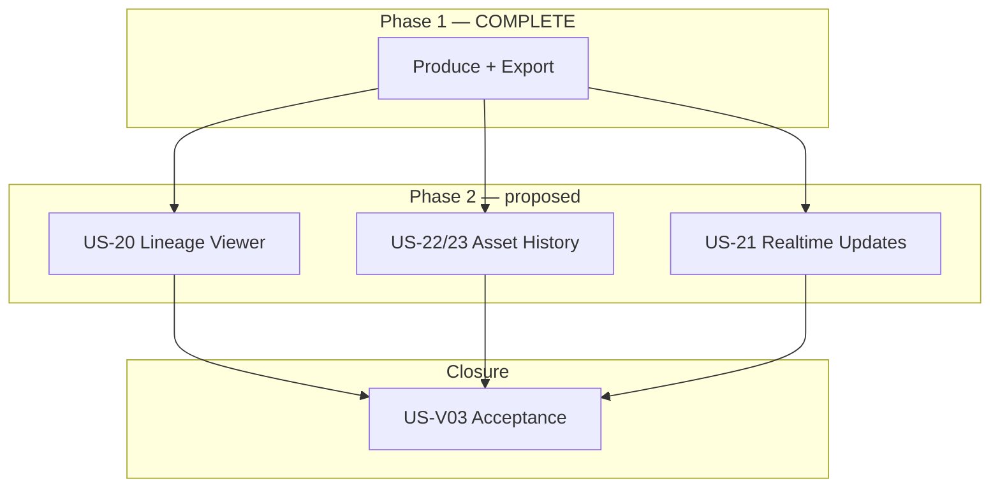

# Spark Full Phase 2 — Governance Brief

**Document type:** Program governance brief (new planning cycle)  
**Status:** **ACCEPT** — governance review 2026-06-11. Phase 2 planning cycle authorized. **Implementation not authorized** until per-story brief ACCEPT.  
**Date:** 2026-06-11  
**Codename:** `AIMPOS-Spark-Full-Phase2`  
**Theme:** Creator visibility, transparency, and observability  
**Prerequisite:** Spark Full Phase 1 **COMPLETE** — tag `v0.7.0-usv02` · M6 signed  
**Authority chain:** [spark-full-completion-summary.md](./spark-full-completion-summary.md) · [MVP Scope Freeze.md](../../MVP%20Scope%20Freeze.md) · [spark-full-governance-brief.md](./spark-full-governance-brief.md) (Phase 1 — **frozen**)

**Phase 1 closure records are frozen.** This brief opens a **new planning cycle**. It does not modify US-V02 evidence, acceptance packages, or M6 attestation.

---

## Table of contents

1. [Product vision](#1-product-vision)
2. [Business justification](#2-business-justification)
3. [Scope boundaries](#3-scope-boundaries)
4. [Success criteria](#4-success-criteria)
5. [Story sequence](#5-story-sequence)
6. [Risks](#6-risks)
7. [Acceptance strategy](#7-acceptance-strategy)
8. [Explicit exclusions](#8-explicit-exclusions)

---

## 1. Product vision

### 1.1 North star

Phase 1 proved that AIMPOS-Spark can **produce** a complete local-AI scene (idea → video → export). Phase 2 makes that production **visible and understandable** to the creator without opening SQL, kubectl, or log files.

> After Phase 2, a creator can **see how artifacts connect**, **browse every version** the pipeline produced, and **watch pipeline progress update in near real time** — while the core generation pipeline, approval gates, and export contract remain unchanged.

### 1.2 Capability map

| Dimension | Phase 1 (shipped) | Phase 2 (target) |
|---|---|---|
| Lineage | SQL / export manifest only | **Interactive chain view** idea → video |
| Asset versions | Review screens show latest only | **Full per-stage version browser** |
| Pipeline status | Dashboard DB polling (~5 s) | **WebSocket push** on state transitions |
| Audit | Append-only DB; partial API | **Creator-facing observability** via history + events |
| Pipeline behavior | D-37..D-54 frozen | **No change** unless defect hotfix |

### 1.3 User outcome

A creator finishing a run can:

1. Open **Lineage** and trace idea → story → script → frames → video with clickable metadata.
2. Open **Asset History** and inspect every version (human-edit, ai-draft, regen chains) with preview or download.
3. Watch the **Dashboard** advance through gates without manual refresh during long GPU stages.
4. Trust that Phase 1 export and approval semantics are **unchanged**.

---

## 2. Business justification

### 2.1 Problem statement

Phase 1 delivers correct artifacts and audit rows, but **creator-facing transparency is incomplete**:

| Gap | Impact today | Phase 2 response |
|---|---|---|
| Lineage exists only in PostgreSQL | Creators cannot verify provenance without engineering support | US-20 |
| Regen chains are invisible beyond “latest” | Creators cannot compare SCRIPT/STORYBOARD/VIDEO drafts | US-22, US-23 |
| Dashboard polling | Stale UI during 15–30 min ComfyUI batches; unnecessary API load | US-21 |
| Compliance narrative | “100% logged” is proven in acceptance SQL, not in product UI | US-23 + export cross-links |

### 2.2 Strategic fit

| Stakeholder need | Phase 2 contribution |
|---|---|
| **Creator trust** | Show *why* the current asset exists (parent chain + version list) |
| **Support / demo** | Reduce time to explain a run without psql |
| **Governance** | Separate observability from generation — Phase 1 pipeline stays frozen |
| **Future phases** | Lineage + history APIs become prerequisites for collaboration and publishing (out of scope here) |

### 2.3 Cost / benefit

| Factor | Estimate |
|---|---|
| Total proposed scope | ~14–17 SP (4 stories + verification gate) |
| Pipeline risk | **Low** — read-mostly APIs + web; optional WebSocket sidecar |
| GPU / inference impact | **None** — no new agents or Temporal activities |
| Olares validation | Incremental verify script (`usv03-verify`) atop US-V02 path |

**Recommendation:** Phase 2 is the lowest-risk expansion after M6 — it monetizes data already stored in Phase 1 without altering D-37..D-54 contracts.

---

## 3. Scope boundaries

### 3.1 In scope (proposed)

| ID | Story | Priority | Delivers |
|---|---|---|---|
| **US-20** | Lineage Viewer | **P1** | `GET /lineage/{pipeline_run_id}` + simple list/tree UI |
| **US-22** | Asset History API | **P1** | Version listing, metadata, content-read by version |
| **US-23** | Asset History UI | **P1** | Per-stage version browser with preview/download |
| **US-21** | Realtime Updates | **P2** | WebSocket (or SSE) pipeline status push to web |
| **US-V03** | Phase 2 acceptance | **P0** | Olares attestation; M7 sign-off gate |

### 3.2 Backlog ID reconciliation

Original Full MVP numbering diverged from Phase 1 delivery:

| Backlog ID | Original intent | Phase 1 disposition | Phase 2 intent |
|---|---|---|---|
| US-21 | Download production bundle | **Delivered as US-19** (`v0.6.0-us19`) | **Repurposed:** Realtime Updates (this brief) |
| US-22 | Browse asset versions | Deferred | **API-first** split (US-22) |
| US-23 | View audit trail | Deferred | **Repurposed:** Asset History **UI** (US-23); audit API may reuse `audit_events` read path |
| US-20 | Lineage chain | Deferred (SQL only in US-V02) | Lineage Viewer (unchanged intent, extended to **video** node) |

**Governance note:** Phase 2 brief **supersedes** backlog sequencing for US-21/US-23 labels. Export closure remains **US-19** — do not re-open export scope under US-21.

### 3.3 Frozen — do not regress

Spark Full Phase 1 behavior is **immutable** unless a blocking defect is filed against an underlying story:

- D-37..D-54 decision records
- Pipeline terminal at VIDEO approve (D-51)
- Export bundle contract D-52..D-54
- 4-frame storyboard batches, append-only regen (D-38, D-47, D-50)
- Local inference only; GPU sequencing (D-08)
- US-V02 acceptance evidence

### 3.4 Governance boundary

| Authorized after brief **ACCEPT** | **Not authorized** without new brief / SCR |
|---|---|
| Per-story governance briefs + implementation plans | Changing COMPLETED semantics or export manifest |
| `GET /lineage`, asset history read APIs | Publishing, collaboration, multi-project |
| WebSocket / SSE status channel | Neo4j or graph DB migration |
| Lineage + history web screens | Video re-encoding, new pipeline stages |
| `deploy/k8s/usv03-verify/` | Modifying US-V02 / M6 frozen records |

**This document does not authorize implementation.** Each story requires brief ACCEPT → plan ACCEPT → implementation ACCEPT (same pattern as Phase 1).

---

## 4. Success criteria

### 4.1 Primary (Phase 2)

| ID | Criterion | Target | Evidence |
|---|---|---|---|
| **SC-P2-01** | Lineage visibility | Ordered chain idea → story → script → frames → **video** | US-20 UI + API |
| **SC-P2-02** | Lineage accuracy | UI matches `lineage_edges` for run | US-V03 SQL attestation |
| **SC-P2-03** | Version transparency | All stages list versions newest-first | US-22 API |
| **SC-P2-04** | Version preview | Content-read works per version row | US-23 UI |
| **SC-P2-05** | Realtime status | Dashboard updates within **≤2 s** of gate transition | US-21 + US-V03 timing |
| **SC-P2-06** | Phase 1 regression | US-V02 normative path still PASS | US-V03 re-attest subset |
| **SC-P2-07** | No pipeline drift | D-37..D-54 unchanged | US-V03 SQL + diff audit |

### 4.2 Inherited (must not regress)

| ID | Source | Phase 2 treatment |
|---|---|---|
| SC-01, SC-02, SC-11 | Spark Full | Re-attested in US-V03 |
| SC-V04..SC-V07 | Visual MVP | Version/audit counts visible in new UI |
| SC-F01..F05 | Phase 1 | No workflow changes |

### 4.3 Milestone

| Milestone | Closure condition |
|---|---|
| **M7 — Spark Full Phase 2 signed** | US-V03 governance ACCEPT after Olares PASS |

---

## 5. Story sequence

Recommended order after governance **ACCEPT**. Dependencies reflect read-path layering: API before UI; lineage independent; realtime last (touches infra).

### 5.1 Phase 2A — Traceability (P1)

| Order | Story | SP | Depends on | Delivers |
|---|---|---|---|---|
| **2A-1** | **US-20** Lineage Viewer | 3 | US-V02 ✅ | **CLOSED** — `v0.8.0-us20` |
| **2A-2** | **US-22** Asset History API | 3 | US-05 ✅, US-V02 ✅, US-20 ✅ | **CLOSED** — `v0.9.0-us22` |

**US-20 extension vs Visual MVP backlog:** Chain **must include VIDEO node** and 4 frame nodes (D-48/D-49 lineage already stored).

### 5.2 Phase 2B — Creator console (P1)

| Order | Story | SP | Depends on | Delivers |
|---|---|---|---|---|
| **2B-1** | **US-23** Asset History UI | 3 | US-22 ✅ | `/history` browser — **brief ACCEPT C-01; plan SUBMITTED** |
| **2B-2** | **US-21** Realtime Updates | 5 | US-10 ✅, US-26 ✅ | WebSocket hub; subscribe by `project_id`; push `pipeline/status` shape |

**US-21 note:** Polling remains **fallback** if WebSocket unavailable; dashboard must not regress when socket drops.

### 5.3 Phase 2C — Acceptance (P0)

| Order | Story | SP | Depends on | Delivers |
|---|---|---|---|---|
| **2C-1** | **US-V03** Phase 2 acceptance | 2 | US-20, US-22, US-23, US-21 | Olares E2E + observability attestation; M7 closure |

### 5.4 Decision records (proposed)

Append to `DECISIONS.md` at **each story's implementation start** — not at brief ACCEPT:

| ID | Story | Topic (proposed) |
|---|---|---|
| **D-55** | US-20 | Lineage API response contract |
| **D-56** | US-20 | Lineage UI scope (list/tree; no graph DB) |
| **D-57** | US-22 | Asset history read API (pagination, stage filter) |
| **D-58** | US-23 | Asset history UI scope (read-only browser) |
| **D-59** | US-21 | Realtime channel contract (WebSocket vs SSE) |

---

## 6. Risks

| ID | Risk | Likelihood | Impact | Mitigation |
|---|---|---|---|---|
| **R-P2-01** | Lineage UI scope creep (graph layout, Neo4j) | Medium | Medium | D-56: simple ordered list/tree only; defer graph library |
| **R-P2-02** | Asset history exposes pre-approval drafts confusingly | Medium | Medium | Label ai-draft vs human-edit; default to latest; approved badge |
| **R-P2-03** | WebSocket complicates k8s ingress / Olares | Medium | High | SSE fallback; reuse API pod; document Olares port path early |
| **R-P2-04** | Realtime duplicates poll semantics | Low | Medium | Single status mapper shared by REST + WS; contract tests |
| **R-P2-05** | Phase 1 regression during UI work | Medium | **High** | US-V03 mandatory; no workflow edits in Phase 2 stories |
| **R-P2-06** | US-21/US-23 ID confusion vs backlog | Low | Low | This brief §3.2 reconciliation table; closure docs reference US-19 export |
| **R-P2-07** | Large version lists (regen chains) performance | Low | Medium | Pagination in US-22; stage-scoped queries |

---

## 7. Acceptance strategy

### 7.1 Pattern

Mirror US-V01 / US-V02 verification governance:

| Phase | Deliverable |
|---|---|
| Brief ACCEPT | This document |
| Plan ACCEPT | `docs/sprints/sprint-5-usv03-verification-plan.md` *(proposed path)* |
| Execute | `deploy/k8s/usv03-verify/` — **bash only** for gate |
| Evidence | `evidence/us-v03-verification/olares-<date>/` |
| Closure | Tag `v0.8.0-usv03` *(proposed)* · M7 complete |

### 7.2 US-V03 proposed attestation scope

**Base path:** Re-run US-V02 normative E2E on fresh project (pipeline + export unchanged).

**Additive checks:**

| Check | Story | Method |
|---|---|---|
| Lineage API matches SQL | US-20 | `GET /lineage/{run_id}` vs `lineage_edges` count |
| Lineage UI renders full chain incl. video | US-20 | Log/screenshot or headless smoke optional |
| Version API lists regen chains | US-22 | SCRIPT v≥2, STORYBOARD v≥2, VIDEO v≥2 after A-01 path |
| History UI preview HTTP 200 | US-23 | Sample content-read per stage |
| Realtime latency | US-21 | Timestamp delta gate transition → WS event ≤2 s |
| Phase 1 regression | US-V02 | Terminal COMPLETED, export 9 files, D-54 audit |

**Forbidden:** Manual SQL to fix UI/API mismatches during acceptance.

### 7.3 Local regression gate

Before Olares: existing CI thresholds (API / worker / web unit) **must pass**; Phase 2 adds web component tests as stories close.

---

## 8. Explicit exclusions

Phase 2 is **observability only**. The following remain **out of scope** even if requested during implementation:

| Exclusion | Rationale |
|---|---|
| **Publishing** to external platforms | Future program |
| **Collaboration** / multi-user / sharing | Scope Freeze 1.1 |
| **Multi-project** create/delete UI | Future |
| **Pipeline stage changes** | Phase 1 frozen (D-51) |
| **Export format changes** | US-19 / D-52..D-54 frozen |
| **New AI agents or Temporal activities** | No generation scope |
| **Neo4j / enterprise graph** | PostgreSQL `lineage_edges` sufficient |
| **Video editing / re-encoding** | Out of charter |
| **Keycloak / RBAC (US-25 full)** | Lab token sufficient |
| **Asset write paths in history UI** | Read-only browser; edits stay in Review screens |
| **Audit trail as primary US-23 backlog scope** | Repurposed to Asset History UI; dedicated audit screen deferred to Phase 3 unless split into US-23b |
| **Cloud inference / egress** | Sovereignty principle |
| **Implementation authorization** | **This brief is planning only** |

---

## 9. Project status

| Item | Status |
|---|---|
| **Spark Full Phase 1** | **COMPLETE** (`v0.7.0-usv02` · M6) |
| **Spark Full Phase 2** | **COMPLETE** (`v0.12.0-usv03` · M7) |
| **Phase 2 brief** | **ACCEPT** |
| US-20 / US-22 / US-23 / US-21 | **CLOSED** |
| US-V03 | **CLOSED** |
| **Frontier** | **Phase 3 planning** (not started) |

---

## 10. Document control

| Version | Date | Changes |
|---|---|---|
| 1.0 | 2026-06-11 | Initial submission — Phase 2 planning cycle |
