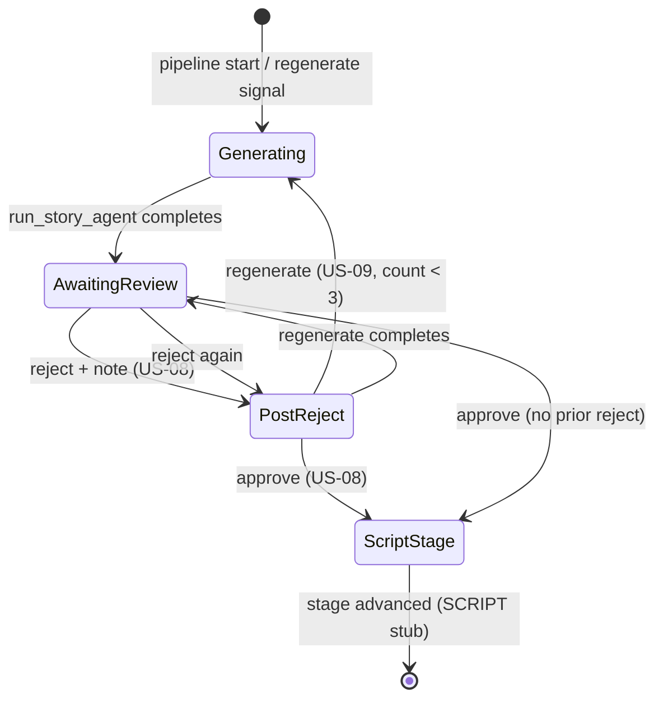

# US-09 Governance Review Package — Regenerate After Rejection

**Date:** 2026-06-10  
**Story:** US-09 · FEAT-03 · EPIC-02 · P0 · 3 SP  
**Status:** **ACCEPTED** (2026-06-10) — implementation complete; pending closure verification  
**Prerequisites:** US-07 ✅ · US-08 ✅ · US-12 ✅ · US-13 ✅ (`v0.3.1-us13`)  
**Canonical AC source:** `GitHub Issues - Visual MVP.md` Issue 15  
**Planning brief:** `docs/sprints/sprint-3d-us09-brief.md`

This package is the pre-implementation governance review. It ratifies runtime contracts, counter design, note handling, stage pins, scope boundaries, and verification evidence. **No code changes are included.**

---

## 1. Regenerate sequence diagram

### 1.1 Preconditions

| Gate | Required state |
|---|---|
| Pipeline run | `status = AWAITING_APPROVAL`, `current_stage = STORY` |
| Human action | User has **rejected** this stage with a note (US-08) |
| Regeneration budget | Fewer than **3** prior `REGENERATION_REQUESTED` audit rows for `(run_id, STORY)` |
| Stage support | `stage = STORY` (only supported execution stage in US-09) |

Initial `run_story_agent` from pipeline start **does not** count toward the regeneration limit.

### 1.2 Runtime flow (happy path)

```mermaid
sequenceDiagram
    autonumber
    actor User
    participant UI as ReviewPage (web)
    participant API as POST /pipeline/regenerate
    participant DB as Postgres (approvals, audit_events, pipeline_runs)
    participant T as Temporal (SparkPipelineWorkflow)
    participant W as Worker
    participant A as run_story_agent
    participant G as Story Architect (LangGraph)
    participant M as MinIO

    Note over User,M: Prior: user rejected STORY with note (US-08)<br/>approvals.REJECTED + workflow.last_rejection_note set

    User->>UI: Click Regenerate
    UI->>API: POST /pipeline/regenerate { project_id, stage: STORY }

    API->>DB: Load active run; verify AWAITING_APPROVAL + stage match
    API->>DB: Verify latest stage decision is REJECTED (or post-reject wait)
    API->>DB: COUNT audit_events WHERE type=REGENERATION_REQUESTED<br/>AND run_id AND stage=STORY

    alt count >= 3
        API-->>UI: 429 Too Many Requests
    else count < 3
        API->>DB: Load latest REJECTED approval.rationale (rejection note)
        API->>T: signal regenerate(STORY)
        API->>DB: INSERT audit_events REGENERATION_REQUESTED
        API->>DB: COMMIT
        API-->>UI: 200 { run_id, stage, status }

        T->>T: Exit post-reject wait; set regenerate flag
        T->>W: activity sync_pipeline_status(RUNNING, STORY)
        W->>DB: UPDATE pipeline_runs

        T->>W: activity run_story_agent(project_id, run_id, rejection_note)
        W->>DB: SELECT latest IDEA asset
        W->>G: invoke graph(idea_text, style_note, rejection_note)
        G->>G: Ollama generate (note in prompt)
        W->>M: PUT story.md bytes
        W->>DB: INSERT asset_versions (STORY, ai-draft, version+1)
        W->>DB: INSERT audit STAGE_STARTED, AGENT_TASK_COMPLETED, ASSET_STORED

        T->>W: activity sync_pipeline_status(AWAITING_APPROVAL, STORY)
        W->>DB: UPDATE pipeline_runs
        T->>T: Reset flags; enter approve|reject wait (same stage)

        UI->>API: GET /pipeline/status (poll)
        UI->>API: GET /assets + GET /assets/{id}/content
        UI-->>User: Editor shows new ai-draft treatment
    end

    Note over User,M: User may Approve (advance to SCRIPT), Reject again, or Regenerate (loop, max 3 total)
```

### 1.3 Approval state machine (STORY stage, post-US-09)



**Key invariant:** `regenerate` never advances `current_stage`. Only `approve` exits the STORY gate.

### 1.4 Workflow change (minimal, required)

Current `SparkPipelineWorkflow` post-reject path waits **only** for `approve` (lines 113–116). US-09 requires:

1. New `@workflow.signal def regenerate(self, stage: str)` — accepted only when `awaiting_approval` and `current_stage == stage` **or** in post-reject inner wait.
2. Post-reject inner loop: `wait(approve | regenerate)` instead of `wait(approve)`.
3. On `regenerate`: re-execute stage activity (`run_story_agent` for STORY), then return to `AWAITING_APPROVAL` and outer `wait(approve | reject)`.

**No new workflow type.** Same `spark-pipeline-{run_id}` id (D-32).

---

## 2. Regeneration limit design

### 2.1 Policy

| Rule | Value |
|---|---|
| Limit | **3 regenerations per `(pipeline_run_id, stage)`** |
| Scope of count | Explicit `POST /pipeline/regenerate` calls only |
| Excluded from count | Initial stage generation on pipeline start |
| Enforcement point | **API** — before Temporal signal |
| Breach response | **HTTP 429** with message e.g. `"regeneration limit reached for stage STORY (max 3)"` |
| On 429 | No Temporal signal, no worker activity, no new audit row |

### 2.2 Where the count is stored

**Governance recommendation (ratify):** append-only **`audit_events`** rows with new type **`REGENERATION_REQUESTED`**.

| Field | Content |
|---|---|
| `pipeline_run_id` | Active run |
| `event_type` | `REGENERATION_REQUESTED` |
| `payload` | `{ "stage": "STORY", "principal": "api-bearer-token", "rejection_note_id": "<approval_id>" }` |

**Count query (API pre-check):**

```sql
SELECT COUNT(*) FROM audit_events
 WHERE pipeline_run_id = :run_id
   AND event_type = 'REGENERATION_REQUESTED'
   AND payload->>'stage' = :stage;
```

### 2.3 Why audit-based counting (vs alternatives)

| Approach | Pros | Cons | Verdict |
|---|---|---|---|
| **`audit_events` count (recommended)** | Append-only audit trail; API-enforced before spend; queryable for compliance; no workflow query race; survives worker restart | Requires new `AuditEventType` enum value | **Adopt** |
| Workflow state `regeneration_count[stage]` | Single source in orchestrator | Requires Temporal query from API; count not in compliance log without extra audit anyway | Reject as primary |
| New `regeneration_counters` table | Explicit schema | Alembic migration for 3 SP story; over-engineered | Reject |
| Count `REJECTED` approvals | No new event type | Rejects ≠ regenerations; user may reject 5× but regenerate 1× | Reject |

### 2.4 Schema changes required?

| Change | Required? | Notes |
|---|---|---|
| **Alembic migration** | **No** | `audit_events.event_type` is `VARCHAR(32)` (SQLAlchemy `native_enum=False`). New values are application-level. |
| **`aimpos-core` enum** | **Yes** | Add `REGENERATION_REQUESTED` to `AuditEventType` in `packages/aimpos-core/aimpos_core/events/audit.py`. |
| **`pipeline_runs` columns** | **No** | |
| **`approvals` columns** | **No** | |
| **Temporal workflow state** | **Yes (code)** | `regenerate` signal + inner loop — not a DB schema change |

---

## 3. Rejection-note handling

### 3.1 Where the note comes from

| Source | When written | Field |
|---|---|---|
| **`approvals` table** | `POST /pipeline/approve` with `decision=REJECTED` (US-08) | `rationale` (TEXT, required on reject) |
| **Temporal workflow state** | `reject` signal handler (existing) | `_state.last_rejection_note` |
| **`APPROVAL_RECORDED` audit** | Same request as reject | `payload.note` |

**No new persistence for US-09.** The rejection note is already stored immutably by US-08.

### 3.2 How the note reaches Story Architect

**Governance path (ratify):**

```
1. API regenerate handler:
     note = latest REJECTED approval.rationale
            WHERE pipeline_run_id = run.id AND stage = STORY
            ORDER BY created_at DESC LIMIT 1

2. Temporal signal regenerate(STORY) — workflow retains last_rejection_note from reject signal

3. Workflow invokes activity:
     run_story_agent(project_id, run_id, rejection_note=note)

4. Activity passes to graph:
     run_story_architect_graph(..., rejection_note=note)

5. draft_story_node appends to prompt (T-09-02):
     revision_block = f"\nRevision notes from reviewer:\n{rejection_note}\n"
     injected into user_template / full_prompt before Ollama call
```

### 3.3 Multi-reject behavior

If the user **rejects again** with a new note before regenerating:

- US-08 writes a new `approvals` REJECTED row and updates `workflow.last_rejection_note`.
- Regenerate uses the **latest** REJECTED `rationale` (not historical notes).
- Prior notes remain in `approvals` / audit for traceability; agent receives **most recent** only (MVP scope).

### 3.4 New persistence introduced?

| Item | New? |
|---|---|
| `approvals.rationale` | **No** — US-08 |
| `workflow.last_rejection_note` | **No** — US-08 reject signal |
| Prompt config change | **No new table** — extend `configs/prompts/story_architect/v1.yaml` or inline block in `draft_story_node` |
| Storing note in `asset_versions.metadata_json` | **Out of scope** — not required for AC-4 |

---

## 4. Stage restrictions

### 4.1 Supported stages (execution)

| Stage | Agent | US-09 regenerate execution |
|---|---|---|
| **STORY** | `run_story_agent` (US-12) | **✅ In scope** |
| **SCRIPT** | `run_stub_stage` only | **❌ Not supported** |
| **STORYBOARD** | `run_stub_stage` only | **❌ Not supported** |

### 4.2 API behavior by stage

| Request `stage` | Pipeline state | HTTP response |
|---|---|---|
| `STORY` | `AWAITING_APPROVAL`, post-reject, count < 3 | **200** — signal + agent run |
| `STORY` | Regeneration limit exceeded | **429** |
| `STORY` | Not post-reject / not awaiting approval | **409** |
| `SCRIPT` | Any | **501 Not Implemented** — `"regenerate execution not available for SCRIPT until US-14"` |
| `STORYBOARD` | Any | **501 Not Implemented** — `"regenerate execution not available for STORYBOARD until US-16"` |
| `IDEA` | Any | **422** — not a pipeline review stage |

### 4.3 Enforcement layers

```
Layer 1 — API allowlist (primary pin):
  SUPPORTED_REGENERATE_STAGES = { PipelineStage.STORY }
  if stage not in allowlist → 501 before Temporal call

Layer 2 — Workflow activity dispatch:
  if stage == STORY: run_story_agent(...)
  else: not reachable for US-09 closure (API blocks first)

Layer 3 — Verification scope:
  Olares closure evidence STORY-only (match US-12/US-13 pattern)
```

**Rationale:** SCRIPT/STORYBOARD use `run_stub_stage` today. Regenerating stubs would create fake assets and imply agent behavior that does not exist — scope creep into US-14/US-16.

### 4.4 Future extension (not US-09)

When `run_script_agent` / `run_storyboard_agent` land, extend the API allowlist and workflow dispatch — **separate stories**, not US-09 closure criteria.

---

## 5. Scope-control review

### 5.1 Required functionality (must implement)

| ID | Functionality | Component |
|---|---|---|
| R-01 | `POST /pipeline/regenerate` endpoint | `api/app/routes/pipeline.py` |
| R-02 | Pre-checks: active run, `AWAITING_APPROVAL`, stage match, post-reject | API route |
| R-03 | STORY-only execution allowlist; 501 for SCRIPT/STORYBOARD | API route |
| R-04 | Max-3 enforcement via `REGENERATION_REQUESTED` audit count | API route |
| R-05 | `REGENERATION_REQUESTED` audit append on accepted request | API + `aimpos-core` enum |
| R-06 | `regenerate` Temporal signal | `TemporalService` + workflow |
| R-07 | Post-reject inner loop (approve \| regenerate) | `SparkPipelineWorkflow` |
| R-08 | Re-invoke `run_story_agent` with `rejection_note` | Worker activity |
| R-09 | Prompt injection of rejection note | Story Architect `draft_story_node` |
| R-10 | New `ai-draft` asset version (`version+1`) | Existing `store_story_markdown` |
| R-11 | Enable Review **Regenerate** button post-reject | `ReviewPage.tsx` + `api/client.ts` |
| R-12 | Reload treatment after regenerate | Existing `getAssetContent` + `selectLatestStoryAsset` |

### 5.2 Optional functionality (may implement if zero scope creep)

| ID | Functionality | Notes |
|---|---|---|
| O-01 | `REGENERATION_COMPLETED` audit after agent success | Improves traceability; not in Visual MVP AC |
| O-02 | Disable Regenerate while `RUNNING` (UI) | Polling already shows GENERATING |
| O-03 | Temporal query `get_regeneration_count` | Redundant if API uses audit count |
| O-04 | Pass `asset_version_id` of rejected draft in regenerate payload | Not required by AC; latest note suffices |

### 5.3 Out-of-scope functionality (must not implement)

| ID | Functionality | Owner / rationale |
|---|---|---|
| X-01 | `POST /pipeline/regenerate` for SCRIPT/STORYBOARD execution | US-14 / US-16 |
| X-02 | Auto-regenerate on reject | US-13 boundary — explicit user action |
| X-03 | Regenerate after approve | Not in AC |
| X-04 | Branch promotion / copy-to-main | `D-37` |
| X-05 | Delete or supersede human-edit versions on regenerate | Version chain is append-only |
| X-06 | Asset browser, history, diff UI | US-22 |
| X-07 | Regenerate via pipeline restart | US-07 start contract unchanged |
| X-08 | New Alembic migration for counter table | Audit-count design avoids this |
| X-09 | `run_stub_stage` on regenerate | Fake assets |
| X-10 | Max-3 as workflow-only check without API guard | Ollama spend risk |
| X-11 | Changes to `POST /pipeline/approve` contract | US-08 regression surface |
| X-12 | Multi-note aggregation to agent (all prior rejects) | MVP: latest note only |

### 5.4 Creep-risk summary

| Risk | Mitigation |
|---|---|
| SCRIPT regenerate with stub | API 501 allowlist |
| US-13 affordance → full regen in same story | Separate endpoint; US-13 closed |
| Unbounded Ollama calls | API 429 before signal |
| Breaking approve/reject | Additive signal only |

---

## 6. Acceptance criteria mapping

### AC-1 — `POST /pipeline/regenerate` triggers agent for current stage

| Component | Implementation target |
|---|---|
| API route | `POST /pipeline/regenerate` |
| Validation | Mirror `_require_active_run` + `AWAITING_APPROVAL` + stage match |
| Orchestration | `TemporalService.signal_regenerate` → workflow inner loop |
| Agent dispatch | `run_story_agent` (STORY only) |
| Status sync | `sync_pipeline_status`: `RUNNING` → `AWAITING_APPROVAL` |

| Verification evidence | Method |
|---|---|
| `POST /pipeline/regenerate` returns 200 | Olares curl / integration test |
| Temporal history shows `regenerate` signal + second `run_story_agent` | Worker log / Temporal UI |
| `GET /pipeline/status`: same `current_stage=STORY`, ends `AWAITING_APPROVAL` | API response |
| `STAGE_STARTED` + `AGENT_TASK_COMPLETED` audit rows | SQL query |

---

### AC-2 — New `asset_version` with incremented version

| Component | Implementation target |
|---|---|
| Storage | `store_story_markdown` — `MAX(version)+1` on `(project_id, STORY)` |
| Branch | `ai-draft`, `is_ai_generated=true` |
| Prior versions | Retained (human-edit + older ai-draft) |

| Verification evidence | Method |
|---|---|
| SQL: new row `stage=STORY`, `branch=ai-draft`, `version = N+1` | Olares psql |
| MinIO object at new `minio_key` | Object store check |
| `ASSET_STORED` audit with new `version` | SQL query |
| Human-edit rows still present after regenerate | SQL (regression) |

---

### AC-3 — Max 3 regenerations per stage → 429

| Component | Implementation target |
|---|---|
| Counter | `COUNT(*)` of `REGENERATION_REQUESTED` per `(run_id, stage)` |
| Enforcement | API returns 429 when count ≥ 3 **before** signal |
| Audit | Append `REGENERATION_REQUESTED` only on accepted (non-429) requests |

| Verification evidence | Method |
|---|---|
| Sequential regenerate × 3 → 200 each | API test script |
| 4th regenerate → 429, no new asset version | API test + SQL |
| 4th call: no new `REGENERATION_REQUESTED` row | SQL count unchanged |
| 4th call: no `run_story_agent` in Temporal history | Temporal / worker log |

---

### AC-4 — Rejection note passed to agent

| Component | Implementation target |
|---|---|
| Note source | Latest `approvals.rationale` where `decision=REJECTED` and `stage=STORY` |
| Transport | Activity arg `rejection_note` → `run_story_architect_graph` |
| Consumption | `draft_story_node` prompt augmentation (T-09-02) |

| Verification evidence | Method |
|---|---|
| Reject with distinctive note string → regenerate | Olares E2E |
| Unit test: prompt / graph input contains note substring | `worker/tests/unit/` |
| Activity log or audit references note length/hash | Worker log (optional) |
| Subjective: regenerated treatment reflects note | Olares spot-check (optional) |

---

### AC-to-task traceability

| AC | Tasks | Primary evidence owner |
|---|---|---|
| AC-1 | T-09-01, workflow signal, worker dispatch | Olares API + Temporal |
| AC-2 | T-09-04 (`store_story_markdown` reuse) | SQL + MinIO |
| AC-3 | T-09-03 (audit-count design) | API 429 sequence test |
| AC-4 | T-09-02 (activity + prompt) | Unit test + Olares E2E |

---

## 7. Governance decision points (for reviewer sign-off)

| # | Decision | Recommendation |
|---|---|---|
| G-01 | Regeneration counter storage | **`REGENERATION_REQUESTED` audit count** — no Alembic |
| G-02 | Note source for agent | **Latest `approvals.rationale`** for stage + activity arg |
| G-03 | Stage execution scope | **STORY only**; 501 for SCRIPT/STORYBOARD |
| G-04 | Workflow change scope | **Additive `regenerate` signal + inner loop** — no new workflow type |
| G-05 | Initial generation vs regenerate | **Initial run excluded** from max-3 count |
| G-06 | UI after regenerate | **Reload latest STORY by version** (existing US-13 selectors) |

---

## 8. Authorization gate

| Gate | Status |
|---|---|
| US-13 formally closed (`v0.3.1-us13`) | ✅ |
| US-09 planning brief exists | ✅ `sprint-3d-us09-brief.md` |
| This governance review package | ⏳ **Pending acceptance** |
| Implementation plan | ⏳ Blocked until G-01..G-06 accepted |
| Code implementation | **Blocked** |

---

## 9. Recommendation

Accept this governance review package to authorize an **implementation plan** for US-09. The design keeps US-09 within **3 SP** by:

- One API route and one Temporal signal
- Audit-based rate limiting (no migration)
- STORY-only execution (501 elsewhere)
- Reuse of US-08 note persistence and US-12 agent/storage paths
- Enabling the existing US-13 Regenerate affordance

**Request: governance acceptance of US-09 design (G-01 through G-06) before implementation authorization.**
