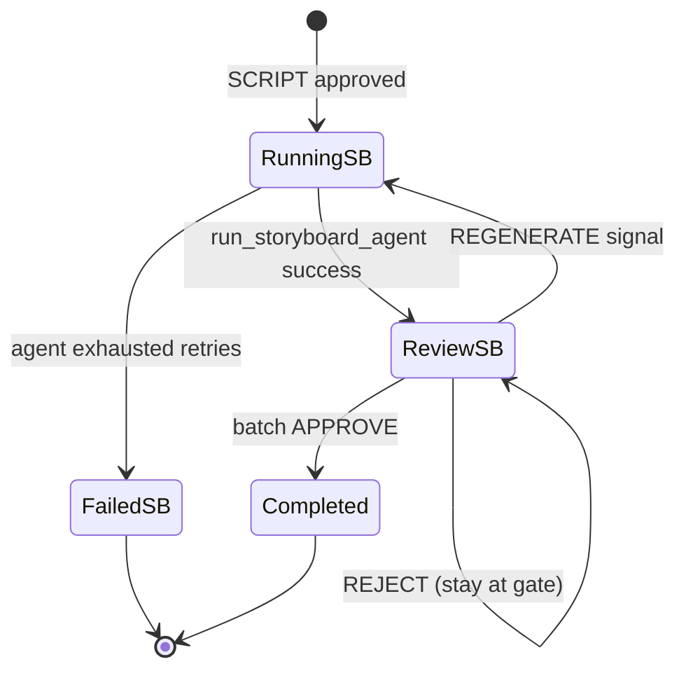

# Sprint 3H — US-17 Implementation Plan

**Status:** **CLOSED** — Olares E2E PASS; release `v0.3.6-us17`. Closure report: `docs/sprints/sprint-3h-us17-closure-report.md`.  
**Parent brief:** `docs/sprints/sprint-3h-us17-brief.md` (**ACCEPTED** 2026-06-11)  
**Story:** US-17 Review storyboard gallery · FEAT-09 · P0 · 3 SP  
**Baseline:** `v0.3.5-us16` (`4f52bb5` @ US-16 closure)  
**Decision records:** `D-46` (approved storyboard batch resolution), `D-47` (storyboard regeneration input) — append to `DECISIONS.md` at plan authorization

---

## 0. Implementation summary

US-17 completes the **terminal Visual MVP review gate**: a **2×2 storyboard gallery** with lightbox, **batch-level approve → `COMPLETED`**, and **batch-level reject/regenerate** (new batch `version+1`). Work spans **web gallery mode**, **API content-read + regenerate extensions**, and **minimal worker/workflow changes** for **`D-47`** rejection-note injection. **No schema migration. No video stage. No lineage/history UI.**

| Layer | Net-new | Reuse |
|---|---|---|
| API | Extend `GET /assets/{id}/content` (STORYBOARD PNG); extend `POST /pipeline/regenerate` (STORYBOARD) | `POST /pipeline/approve`, `GET /assets`, `GET /pipeline/status` |
| Temporal workflow | Pass `rejection_note` to `run_storyboard_agent` | Stage loop, US-09 post-reject regenerate loop (stage-agnostic); `COMPLETED` tail unchanged |
| Worker | `run_storyboard_agent(rejection_note)`, `fetch_latest_storyboard_rejection_rationale`, planner injection | `run_storyboard_agent`, `store_storyboard_batch`, ComfyUI path (US-16) |
| Web | Storyboard gallery mode, lightbox, batch selector, PNG blob URLs | `ReviewPage` approve/reject/regenerate chrome, `usePipelineStatus` |
| DB schema | — | `asset_versions`, `approvals`, `audit_events`, `lineage_edges` (migration `0003` from US-16) |

**Estimated effort:** 3 SP · ~2–3 days (API + worker → web gallery → tests → Olares verification).

---

## 1. Batch-level review semantics (mandatory)

Governance acceptance conditions — **non-negotiable** for implementation:

| Semantics | Implementation rule |
|---|---|
| Regeneration creates new batch version | `store_storyboard_batch()` assigns `COALESCE(MAX(version),0)+1` shared by all 4 frames (`D-43`) |
| Existing assets immutable | Append-only inserts; no UPDATE/DELETE of STORYBOARD rows or MinIO objects (`D-38`) |
| Approval applies to entire batch | Single **Approve** button; one `approvals` STORYBOARD/APPROVED row; **`D-46`** |
| Rejection applies to entire batch | Single reject + note; one `approvals` STORYBOARD/REJECTED row |
| Per-frame approval forbidden | No checkboxes; no partial approve API; no frame-level approval records |

---

## 2. D-46 — Approved storyboard batch resolution

**To be appended to `DECISIONS.md` at plan authorization.** Parallels **`D-37`** / **`D-41`**.

### 2.1 Authoritative batch source

| Question | Answer |
|---|---|
| What is the approved storyboard? | All `asset_versions` rows where `project_id = :project_id`, `stage = 'STORYBOARD'`, `version = MAX(version)` — the **latest batch**. |
| Frame identity | Ordered by `metadata_json.frame_index` ascending; **must be exactly 4** (`D-45`). |
| Branch | `branch=ai-draft`, `is_ai_generated=true` (US-16 output). |
| MinIO | `{project_id}/STORYBOARD/{content_hash}` per frame (`D-43`). |

### 2.2 Approval requirements

| Requirement | Detail |
|---|---|
| Immutable approval row | `approvals` insert on approve with `stage=STORYBOARD`, `decision=APPROVED`. |
| No asset write on approve | Approve **must not** create STORYBOARD rows, mutate MinIO, or promote branch. |
| Workflow | `approve` signal → STORYBOARD stage completes → **`COMPLETED`** (existing tail). |
| Regenerate before approve | Each regen appends batch `version+1` (`D-38`). Approve binds to **latest batch at signal time**. |

### 2.3 Resolution query

Document in implementation report and Olares acceptance package:

```sql
-- Gate: APPROVED approval for STORYBOARD on this run
SELECT 1 FROM approvals
WHERE pipeline_run_id = :run_id AND stage = 'STORYBOARD' AND decision = 'APPROVED';

-- Latest batch (4 rows expected)
WITH latest AS (
  SELECT COALESCE(MAX(version), 0) AS v
  FROM asset_versions
  WHERE project_id = :project_id AND stage = 'STORYBOARD'
)
SELECT av.id, av.version, av.content_hash, av.minio_key,
       av.metadata_json->>'frame_index' AS frame_index
FROM asset_versions av, latest
WHERE av.project_id = :project_id
  AND av.stage = 'STORYBOARD'
  AND av.version = latest.v
ORDER BY (av.metadata_json->>'frame_index')::int;
```

---

## 3. D-47 — Storyboard regeneration input contract

**To be appended to `DECISIONS.md` at plan authorization.** Parallels **`D-42`**.

| Input | Source |
|---|---|
| Approved script bytes | `fetch_approved_script()` per **`D-41`** |
| Rejection rationale | `fetch_latest_storyboard_rejection_rationale()` — latest `approvals.rationale` where `stage=STORYBOARD` AND `decision=REJECTED` for the run |

**Forbidden:** Reading prior STORYBOARD `asset_versions`, MinIO PNG bytes, or frame prompts from superseded batches into the Cinematography planning prompt.

**Worker helper:** `fetch_latest_storyboard_rejection_rationale(settings, pipeline_run_id)` in `worker/app/tools/assets.py` — mirror `fetch_latest_script_rejection_rationale`.

---

## 4. UI flow

### 4.1 Entry and mode detection

```
Dashboard (REVIEW badge, current_stage=STORYBOARD)
    → user navigates to /review
    → ReviewPage detects AWAITING_APPROVAL + STORYBOARD
    → storyboard gallery mode (US-17)
```

| Mode | Condition | UI |
|---|---|---|
| Storyboard gallery | `AWAITING_APPROVAL` + `STORYBOARD` | **US-17** — 2×2 grid + lightbox |
| Script | `AWAITING_APPROVAL` + `SCRIPT` | US-15 — unchanged |
| Story | `AWAITING_APPROVAL` + `STORY` | US-13 — unchanged |
| Completed | `COMPLETED` | Redirect to dashboard or completion message |

### 4.2 Gallery load sequence

```
1. listAssets(project_id)
2. selectLatestStoryboardBatch(assets)  → 4 AssetVersion rows (same version)
3. Integrity check: length === 4, frame_index 1..4 contiguous
4. For each frame: getAssetContentBlob(asset_id) → object URL for 
5. Render 2×2 grid with frame index, shot_label (metadata), AI badge
```

On load failure (count ≠ 4): error card — "Storyboard batch incomplete; contact support or regenerate."

### 4.3 Lightbox flow (T-17-02)

```
User clicks thumbnail
    → open overlay with selected frame full-size
    → optional Prev/Next within batch (frame_index ± 1)
    → Esc or Close dismisses; revoke object URL on unmount
```

**Implementation pin:** Inline lightbox in `ReviewPage` or a single `StoryboardLightbox.tsx` component — **not** a reusable gallery framework / carousel library abstraction.

### 4.4 Approve flow (batch-level, AC-3)

```
User clicks Approve (no dirty-state gate — read-only gallery)
    → POST /pipeline/approve { stage: STORYBOARD, decision: APPROVED }
    → poll pipeline status until COMPLETED
    → redirect dashboard (COMPLETED badge)
```

**Copy:** "Approve all frames to complete the pipeline" — reinforces batch semantics.

### 4.5 Reject + regenerate flow (batch-level, AC-4)

```
User enters note → Reject
    → POST /pipeline/approve { stage: STORYBOARD, decision: REJECT, note }
    → UI shows Regenerate enabled (reuse rejectedHint pattern)

User clicks Regenerate
    → POST /pipeline/regenerate { stage: STORYBOARD }
    → status RUNNING/STORYBOARD (GENERATING on dashboard)
    → poll until AWAITING_APPROVAL/STORYBOARD
    → reload latest batch (version+1); refresh grid URLs

4th Regenerate → 429; surface API error; disable button
```

### 4.6 UI layout (T-17-01 / T-17-04)

| Element | Spec |
|---|---|
| Header | `Review — Storyboard` + REVIEW badge |
| Lead | Batch review copy; approve completes Visual MVP |
| Batch metadata | Batch `version`, frame count (4), AI-generated badge |
| Grid | CSS grid 2×2; `object-fit: contain`; min height for placeholders |
| Tile | Thumbnail, `Frame {n}`, optional `shot_label`, AI badge |
| Actions | Approve · Reject · Regenerate (same footer as STORY/SCRIPT) |

### 4.7 Explicit UI non-goals

| Forbidden | Reason |
|---|---|
| Per-frame approve checkboxes | Governance condition |
| Asset history panel | US-22 |
| Lineage chain widget | US-20 |
| Generic gallery/carousel framework | Governance condition |
| Video "next step" CTA | US-18 deferred |

---

## 5. API changes

### 5.1 `GET /assets/{id}/content` — STORYBOARD PNG (B-01, B-02)

| Field | Value |
|---|---|
| Allowed stages | `STORY`, `SCRIPT`, **`STORYBOARD`** |
| STORYBOARD response | `Content-Type: image/png`; raw bytes |
| Errors | 422 for IDEA/other stages; 404 missing asset |

**File:** `api/app/routes/assets.py` — extend `_READABLE_STAGES`; branch response by stage content type.

**Tests:** `api/tests/unit/test_assets_us17.py` — PNG magic bytes returned; IDEA still 422.

### 5.2 `POST /pipeline/regenerate` — STORYBOARD (B-03)

| Field | Value |
|---|---|
| Change | Add `PipelineStage.STORYBOARD` to `_SUPPORTED_REGENERATE_STAGES` |
| Preconditions | Unchanged from US-09: latest stage approval = REJECTED; count `< 3` |
| Side effects | Temporal `regenerate` signal; `REGENERATION_REQUESTED` audit |

**Tests:** extend `test_pipeline_regenerate.py` — STORYBOARD happy path; 501 removed; 429 on 4th.

### 5.3 Unchanged API surfaces

| Endpoint | Notes |
|---|---|
| `POST /pipeline/approve` | Reuse for STORYBOARD approve/reject |
| `GET /assets` | Client-side batch grouping |
| `GET /pipeline/status` | No new status values |
| `PUT /assets/{id}` | Not used for frames |

---

## 6. Workflow transitions

### 6.1 State machine (Visual MVP terminal)



| API status | stage | Dashboard | Trigger |
|---|---|---|---|
| `RUNNING` | `STORYBOARD` | GENERATING | Initial gen or regen |
| `AWAITING_APPROVAL` | `STORYBOARD` | REVIEW | Agent completed |
| `COMPLETED` | `null` | COMPLETED | Batch approve |
| `FAILED` | `STORYBOARD` | FAILED | US-16 retry exhausted |

### 6.2 Approve transition (no workflow code change)

Existing `SparkPipelineWorkflow.run()` loop:

1. STORYBOARD wait satisfied by `approve` signal.
2. Stage appended to `completed_stages`.
3. Loop ends (STORYBOARD is last in `_STAGE_ORDER`).
4. `sync_pipeline_status(COMPLETED)` — **already implemented**.

**US-17 work:** Web + API approve wiring only; **no workflow edit for approve path**.

### 6.3 Reject transition (no workflow code change)

Existing `reject` signal → `_approval_rejected` → inner wait loop for regen or approve — **stage-agnostic**.

### 6.4 Regenerate transition (W-01 — minimal workflow edit)

**File:** `worker/app/temporal/workflows/spark_pipeline.py`

```python
# STORYBOARD branch — mirror SCRIPT:
rejection_note = self._state.last_rejection_note or ""
await workflow.execute_activity(
    run_storyboard_agent,
    args=[pipeline_input.project_id, pipeline_input.run_id, rejection_note],
    ...
)
```

**Constraint:** Do **not** modify wait-condition lambdas (US-09 lesson).

---

## 7. Regeneration path (end-to-end)

### 7.1 API layer

```
POST /pipeline/regenerate { project_id, stage: STORYBOARD }
  → validate REJECTED approval exists
  → validate regen count < 3
  → temporal.signal_regenerate(workflow_id, "STORYBOARD")
  → REGENERATION_REQUESTED audit
```

### 7.2 Workflow layer

```
regenerate signal → _regenerate_requested = True
  → sync RUNNING/STORYBOARD
  → run_storyboard_agent(project_id, run_id, rejection_note)
  → sync AWAITING_APPROVAL/STORYBOARD
  → wait for approve | reject | regenerate
```

### 7.3 Worker layer

```
run_storyboard_agent(rejection_note="")
  → fetch_approved_script()           # D-41 — unchanged
  → rationale = fetch_latest_storyboard_rejection_rationale()  # D-47 (if rejection_note empty, use DB)
  → run_cinematography_graph(script, rejection_note=rationale)
  → unload Ollama → ComfyUI × 4
  → store_storyboard_batch()          # new version = MAX+1, 4 frames atomic (D-44)
  → lineage: script → each new frame
  → audit ASSET_STORED × 4
```

### 7.4 Cinematography planner injection (A-01..A-03)

| File | Change |
|---|---|
| `cinematography/state.py` | Add `rejection_note: str \| None` |
| `cinematography/nodes.py` | Inject revision block in `plan_shots_node` when note present (mirror Screenwriter) |
| `temporal/activities/storyboard.py` | Accept `rejection_note` arg; resolve via D-47 |

**Prompt pattern (pin in plan):**

```
If rejection_note:
  "The creator rejected the previous storyboard batch with this feedback: {note}.
   Plan a revised 4-shot storyboard. Do not reference prior frame images."
```

### 7.5 Storage outcome

| Batch | version | Mutability |
|---|---|---|
| Before regen | e.g. `1` | Immutable — remains in DB + MinIO |
| After regen | e.g. `2` | New 4 rows; UI loads `MAX(version)` |
| After approve | `2` (unchanged) | `approvals` only |

---

## 8. Acceptance criteria traceability

### AC-1 — Grid of 4–6 images

| Track | IDs | Deliverable |
|---|---|---|
| Web | F-01, F-02, F-03 | `storyboardReview.ts`, 2×2 grid, blob URL loader |
| API | B-01 | PNG content-read |
| Tests | T-01, T-02 | Batch selector unit tests; grid render smoke |
| Verify | V-01 | Olares screenshot / 4-tile DOM |

### AC-2 — Lightbox preview

| Track | IDs | Deliverable |
|---|---|---|
| Web | F-04 | Lightbox overlay component |
| Tests | T-03 | Optional: open/close behavior |
| Verify | V-02 | Manual / screenshot in package |

### AC-3 — Approve-all → COMPLETED

| Track | IDs | Deliverable |
|---|---|---|
| Web | F-05 | Approve wired for STORYBOARD |
| API | — | Reuse approve |
| Workflow | — | Existing COMPLETED tail |
| Tests | T-04 | Approve advances to COMPLETED |
| Verify | V-03, V-05 | Status COMPLETED; D-46 no new assets |

### AC-4 — Reject triggers regenerate

| Track | IDs | Deliverable |
|---|---|---|
| API | B-03 | STORYBOARD regenerate |
| Workflow | W-01 | `rejection_note` arg |
| Worker | A-01..A-04 | D-47 helpers + planner injection |
| Web | F-06 | Regenerate reloads batch |
| Tests | T-05..T-08 | Regen happy path; 429; D-47 prompt test |
| Verify | V-04, V-06 | version 1→2; worker log |

### AC-5 — AI badge on frames

| Track | IDs | Deliverable |
|---|---|---|
| Web | F-07 | Badge on each tile from `is_ai_generated` |
| Tests | T-09 | Badge present when flag true |
| Verify | V-01 | Visual confirmation |

---

## 9. File-level delivery map

### 9.1 API

| File | Change |
|---|---|
| `api/app/routes/assets.py` | STORYBOARD in `_READABLE_STAGES`; PNG response |
| `api/app/routes/pipeline.py` | STORYBOARD in `_SUPPORTED_REGENERATE_STAGES` |
| `api/tests/unit/test_assets_us17.py` | **New** |
| `api/tests/unit/test_pipeline_regenerate.py` | STORYBOARD cases |

### 9.2 Worker

| File | Change |
|---|---|
| `worker/app/temporal/activities/storyboard.py` | `rejection_note` parameter |
| `worker/app/temporal/workflows/spark_pipeline.py` | Pass note to STORYBOARD activity |
| `worker/app/tools/assets.py` | `fetch_latest_storyboard_rejection_rationale` |
| `worker/app/agents/cinematography/state.py` | `rejection_note` field |
| `worker/app/agents/cinematography/nodes.py` | Prompt injection |
| `worker/tests/unit/test_storyboard_regen.py` | **New** — D-47 |
| `worker/tests/unit/test_storyboard_activity.py` | Extend for rejection_note arg |

### 9.3 Web

| File | Change |
|---|---|
| `web/src/lib/storyboardReview.ts` | **New** — `selectLatestStoryboardBatch` |
| `web/src/routes/ReviewPage.tsx` | Gallery mode branch |
| `web/src/components/StoryboardLightbox.tsx` | **New** — minimal overlay (optional inline) |
| `web/src/api/client.ts` | `getAssetContentBlob()` for PNG |
| `web/src/styles.css` | Grid + lightbox styles |
| `web/src/tests/storyboardReview.test.ts` | **New** |

### 9.4 Governance / verify

| File | Change |
|---|---|
| `DECISIONS.md` | Append **D-46**, **D-47** |
| `deploy/k8s/us17-verify/` | **New** — Olares scripts |
| `evidence/us-17-verification/` | Post-verify package |

---

## 10. Regression coverage (US-15 and US-16)

### 10.1 US-15 SCRIPT review (must remain green)

| Area | Regression check |
|---|---|
| Fountain preview | `fountainFormat.test.ts`, `scriptReview.test.ts` |
| SCRIPT content-read | `test_assets_us15.py` |
| SCRIPT regenerate | `test_pipeline_regenerate.py` SCRIPT cases |
| ReviewPage script mode | Manual / optional component test |
| Olares V-07 in US-17 verify | Fresh run through SCRIPT gate before STORYBOARD gallery |

### 10.2 US-16 storyboard generation (must remain green)

| Area | Regression check |
|---|---|
| Cinematography validate | `test_cinematography_validate.py` |
| Batch store atomicity | `test_storyboard_batch.py` |
| ComfyUI tool mocks | `test_comfyui_tool.py` |
| Activity happy path | `test_storyboard_activity.py` |
| Workflow STORYBOARD activity | No change to retry policy / timeout |
| Olares V-08 in US-17 verify | STORYBOARD generation still produces 4 frames before gallery |

### 10.3 Suite gates (pre-merge)

| Suite | Minimum |
|---|---|
| API unit | **78+** pass |
| Worker unit | **33+** pass |
| Web unit | **20+** pass (new storyboard tests add to count) |
| Web build | `npm run build` PASS |

---

## 11. Olares verification strategy

### 11.1 Prerequisites

| Item | Requirement |
|---|---|
| Worker image | `aimpos-worker:us17` (regen note + workflow arg) |
| API image | `aimpos-api:us17` (PNG content-read + STORYBOARD regen) |
| Web | Deploy or port-forward for manual gallery check (implementation choice) |
| ComfyUI | Launcher START (US-16 lesson) |
| DB | Alembic `0003` applied |
| Baseline run | Pipeline at `AWAITING_APPROVAL`/`STORYBOARD` with batch v1 |

### 11.2 Scripts (author at implementation)

| Script | Purpose |
|---|---|
| `deploy/k8s/us17-verify/verify_us17.sh` | Full E2E: gallery evidence → reject → regen → approve → COMPLETED |
| `deploy/k8s/us17-verify/run_remote.sh` | Env bootstrap + tee log |
| `deploy/k8s/us17-verify/collect_logs.sh` | Worker/API log excerpts |
| `deploy/k8s/us17-verify/regression_us15.sh` | SCRIPT content-read + regen smoke |
| `deploy/k8s/us17-verify/regression_us16.sh` | Frame count + batch version SQL |

### 11.3 Verification checks

| ID | Check | Evidence |
|---|---|---|
| V-01 | Latest batch = 4 STORYBOARD rows at `MAX(version)` | SQL + grid screenshot |
| V-02 | PNG content-read returns valid PNG for sample frame | `curl` / HTTP 200 + magic bytes |
| V-03 | Batch approve → `COMPLETED` | `GET /pipeline/status` |
| V-04 | Reject + regen → batch `version+1`; 4 new hashes | SQL before/after |
| V-05 | **`D-46`**: approve writes `approvals` only; frame row count unchanged | SQL |
| V-06 | **`D-47`**: worker log shows rejection note in planner | Pod log grep |
| V-07 | 4th regen → 429 | HTTP response |
| V-08 | US-16 regression: initial generation still 4 frames | Worker log `storyboard_agent_completed` |
| V-09 | US-15 regression: SCRIPT gate still functional | `regression_us15.sh` |

**Package:** `evidence/us-17-verification/olares-<date>/US-17-ACCEPTANCE-PACKAGE.md`

### 11.4 Operational pins

- Pin `RUN_ID` when `pipeline/start` returns 409 (US-15/US-16 lesson).
- Regen test requires ComfyUI up (~70s+ for 4 frames on Olares).
- Complete or cancel stale runs before fresh E2E.

---

## 12. Scope control

### 12.1 IN SCOPE checklist

| ID | Item |
|---|---|
| S-01 | Storyboard gallery mode on ReviewPage |
| S-02 | 2×2 grid + lightbox |
| S-03 | PNG `GET /assets/{id}/content` |
| S-04 | STORYBOARD `/pipeline/regenerate` |
| S-05 | `run_storyboard_agent(rejection_note)` + D-47 |
| S-06 | Workflow STORYBOARD rejection_note arg |
| S-07 | `D-46`, `D-47` in DECISIONS.md |
| S-08 | Unit + Olares verify + acceptance package |

### 12.2 OUT OF SCOPE (governance forbidden)

| ID | Item | Owner |
|---|---|---|
| X-01 | Asset history UI | US-22 |
| X-02 | Lineage UI / `GET /lineage` | US-20 |
| X-03 | Gallery framework abstraction (carousel lib, generic grid kit) | Forbidden |
| X-04 | Video workflow / US-18 stage | Deferred |
| X-05 | Alembic schema migration | N/A |
| X-06 | Per-frame approval | Forbidden |
| X-07 | Frame human-edit / upload | Deferred |
| X-08 | New pipeline status enum | Forbidden |
| X-09 | Branch promotion on approve | Forbidden |

---

## 13. Risk review

| ID | Risk | L | I | Mitigation |
|---|---|---|---|---|
| R1 | Partial batch shown in UI | M | H | Client integrity check; D-44 worker contract |
| R2 | Object URL memory leak | L | M | Revoke URLs on unmount / batch reload |
| R3 | Regen duration UX | M | M | GENERATING state; disable actions while RUNNING |
| R4 | Scope creep — lineage/history | M | M | §12.2 checklist; PR review |
| R5 | Breaking STORY/SCRIPT modes | L | H | Mode guards; regression suites |
| R6 | ComfyUI down on regen test | M | H | `check_comfyui.sh`; US-16 ops runbook |
| R7 | content-read binary in JSON client | M | M | Separate `getAssetContentBlob` — not string parser |

---

## 14. Implementation task checklist (execution order)

| Order | ID | Task | Track |
|---|---|---|---|
| 1 | — | Append D-46, D-47 to DECISIONS.md | Governance |
| 2 | B-01..B-03 | API content-read + regenerate | API |
| 3 | A-01..A-04 | Worker D-47 + activity arg | Worker |
| 4 | W-01 | Workflow STORYBOARD rejection_note | Temporal |
| 5 | F-01..F-07 | Web gallery + lightbox + wiring | Web |
| 6 | T-01..T-09 | Unit tests | QA |
| 7 | V-01..V-09 | Olares verify + acceptance package | Evidence |

---

## 15. Governance attestation

This plan implements **only** Visual MVP Issue 39 (US-17). It completes the **batch-level terminal review gate** for the frozen Visual MVP pipeline, consumes **`D-43`/`D-44`/`D-45`** assets from US-16, extends approve/regenerate patterns from **`D-37`–`D-42`**, and records **`D-46`/`D-47`** without schema migration, video workflow, lineage UI, asset history UI, or gallery framework abstraction.

**Request: governance authorization of this plan before implementation start.**

---

## 16. Document control

| Field | Value |
|---|---|
| Sprint | 3H |
| Baseline tag | `v0.3.5-us16` |
| Brief | ACCEPTED 2026-06-11 |
| Next artifact | Implementation (after plan AUTHORIZED) → `docs/sprints/sprint-3h-us17-implementation-report.md` |
