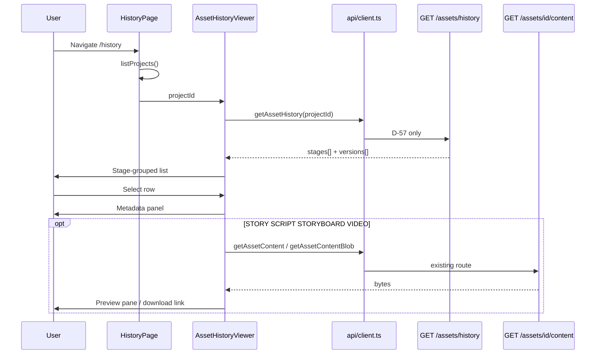

# Sprint 5C — US-23 Implementation Plan

**Status:** **ACCEPT** — implementation **COMPLETE**; Olares **PASS**; closure authorized.  
**Parent brief:** `docs/sprints/sprint-5c-us23-brief.md` (**ACCEPT WITH CONDITION**)  
**Story:** US-23 Asset History UI · FEAT-12 · EPIC-06 · P1 · 3 SP  
**Baseline:** `v0.9.0-us22` (`d04736e`)  
**Decision record:** **D-58** — append to `DECISIONS.md` at **implementation start** (after this plan ACCEPT)

---

## 0. Implementation summary

US-23 adds a **read-only web history browser** at **`/history`** that consumes the **frozen D-57 API** (`GET /assets/history`) and existing content-read (`GET /assets/{asset_id}/content`). **Web-only diff** — zero backend, API contract, schema, or workflow changes.

| Layer | Net-new | Reuse / frozen |
|---|---|---|
| **API / worker / DB** | **None** | D-57 `GET /assets/history`; content-read; all other routes unchanged |
| **Web** | History page, viewer component, client helper, types, styles, tests | `LineageViewer` / `ExportPage` patterns; `listProjects`; `getAssetContent` / `getAssetContentBlob` |
| **Verify** | `deploy/k8s/us23-verify/` | US-V02 project; API regression (history, lineage, export) |

**Estimated effort:** ≈ 3 SP · ~2 days

### Governance compliance matrix (mandatory — brief ACCEPT WITH CONDITION)

The plan **MUST** satisfy all rows below. Any implementation that violates a row is **out of scope** and requires a new governance brief.

| # | Requirement | How this plan complies |
|---|---|---|
| **1** | US-23 consumes **D-57 `GET /assets/history` only** | Single data fetch via `getAssetHistory(projectId)`; no `GET /assets` flat list for history view; no client-side SQL or alternate API |
| **2** | **No backend code changes** | §0 layer table: **zero** files under `api/`, `worker/`, `packages/aimpos-core` (except none) |
| **3** | **No API contract changes** | No edits to D-57 response shape, routes, or OpenAPI; client types mirror existing JSON only |
| **4** | **No schema changes** | No Alembic; no migrations |
| **5** | **No workflow changes** | No Temporal, worker, or pipeline route changes |
| **6** | **No restore functionality** | No restore/promote buttons, copy, or API calls |
| **7** | **No rollback functionality** | No version rollback semantics or UI |
| **8** | **No promote functionality** | No “make current” / branch promotion |
| **9** | **No asset editing functionality** | History page does **not** call `updateAssetText`, `uploadAsset`, or open review editors |
| **10** | **No version diff UI** | No side-by-side compare, diff highlighting, or dual-pane viewers |

**PR checklist (implementation):** Grep diff for `api/`, `worker/`, `alembic/`, `PUT /assets`, `restore`, `rollback`, `promote`, `diff`.

### Explicitly out of scope (US-23)

Audit trail browser · lineage editing · export contract changes · WebSocket (US-21) · HTML5 video player · graph libraries · new download routes · run-filter UI (optional defer — API supports it; v1 uses `project_id` only)

---

## 1. D-58 — Asset History UI scope

**Record in `DECISIONS.md` as D-58** at implementation start.

### 1.1 Route identity

| Field | Value |
|---|---|
| Web route | **`/history`** |
| Auth | `RequireAuth` + `AppShell` (same as Export, Lineage) |
| Data sources | **`GET /assets/history?project_id=`** (D-57); **`GET /assets/{id}/content`** (existing) |

### 1.2 D-57 consumption contract (strict)

```typescript
// web/src/api/client.ts — ONLY new client surface
getAssetHistory(projectId: string): Promise<AssetHistoryResponse>
  → GET /assets/history?project_id={uuid}
```

| Rule | Detail |
|---|---|
| History list data | **Exclusively** from `AssetHistoryResponse.stages[]` |
| Stage order | **Preserve API order** (IDEA → VIDEO per D-57) — no client re-grouping |
| Version order | **Preserve API order** within each stage (newest first per D-57) |
| Optional D-57 filters | **Not used in v1 UI** (`stage`, `pipeline_run_id`) — avoids scope creep |
| Content preview | Lazy fetch on row select via existing `getAssetContent` / `getAssetContentBlob` |

### 1.3 Metadata visibility (per row)

| Field | Source (D-57) | UI |
|---|---|---|
| `asset_id` | `versions[].asset_id` | Row key; content-read param |
| `version` | `versions[].version` | Row label |
| `content_hash` | `versions[].content_hash` | Metadata panel (full + short in row) |
| `is_ai_generated` | `versions[].is_ai_generated` | Badge Yes/No |
| `branch` | `versions[].branch` | Badge text |
| `created_at` | `versions[].created_at` | Metadata panel (formatted) |
| `pipeline_run_id` | `versions[].pipeline_run_id` | Metadata panel (nullable) |
| `metadata.frame_index` | STORYBOARD | Row label + panel |
| IDEA | listed in history | Metadata only — **no** content-read (API limitation unchanged) |

### 1.4 Read-only interaction model

| Allowed | Forbidden |
|---|---|
| Click row → metadata panel | Edit, delete, restore, promote |
| “Preview” / “Download” for readable stages | In-place text editor |
| Navigate away | Workflow actions (start, approve, regenerate) |

---

## 2. Component inventory

| Component / module | Path | Responsibility |
|---|---|---|
| **HistoryPage** | `web/src/routes/HistoryPage.tsx` | Page shell: load project, orchestrate viewer |
| **AssetHistoryViewer** | `web/src/components/AssetHistoryViewer.tsx` | Fetch D-57; stage sections; row list; metadata + preview |
| **historyDisplay** | `web/src/lib/historyDisplay.ts` | Row labels, hash shorten, stage titles (presentation only) |
| **getAssetHistory** | `web/src/api/client.ts` | Typed GET wrapper |
| **AssetHistory types** | `web/src/api/types.ts` | Mirror D-57 JSON (`AssetHistoryResponse`, etc.) |
| **Styles** | `web/src/styles.css` | `.history__*` classes (reuse `.lineage__*` patterns where sensible) |
| **App route** | `web/src/App.tsx` | `<Route path="/history" …>` |
| **AppShell nav** | `web/src/components/layout/AppShell.tsx` | `<NavLink to="/history">History</NavLink>` |

**Not created:** diff viewer, restore modal, edit forms, new API modules, worker activities.

---

## 3. Route design — `/history`

### 3.1 Routing

```tsx
// web/src/App.tsx (within RequireAuth + AppShell)
<Route path="/history" element={<HistoryPage />} />
```

### 3.2 HistoryPage structure

Mirrors `LineagePage.tsx` / `ExportPage.tsx`:

1. `listProjects()` → first project (MVP single-project pattern)
2. Render page header + `AssetHistoryViewer projectId={project.id}`
3. No pipeline COMPLETED gate — history is valid for any project with assets

### 3.3 AppShell navigation

```tsx
// web/src/components/layout/AppShell.tsx — after Assets, before Export (or after Export)
<NavLink to="/history">History</NavLink>
```

| Rule | Detail |
|---|---|
| Visibility | Always when authenticated (not gated on COMPLETED) |
| Active state | Standard `NavLink` styling |

---

## 4. Data flow



| Step | Source | Notes |
|---|---|---|
| 1 | `listProjects()` | Existing; 404/empty handled on page |
| 2 | `getAssetHistory(projectId)` | **Only** history data path |
| 3 | Render `stages[].versions[]` | No transform beyond display labels |
| 4 | Row select | Local React state only |
| 5 | Preview (optional) | Existing content-read; errors shown inline |

**No writes** at any step.

---

## 5. UI layout (stage-grouped browsing)

### 5.1 Stage sections

For each `stage` in `response.stages`:

```text
┌─ STORY (2 versions) ─────────────────────┐
│  v2 · human-edit · abc123…    [selected] │
│  v1 · ai-draft   · def456…               │
└──────────────────────────────────────────┘
┌─ STORYBOARD (8 versions) ────────────────┐
│  v2 frame 1 · ai-draft · …               │
│  …                                       │
└──────────────────────────────────────────┘
```

- Section header: stage name + version count
- Rows: `historyDisplay.historyRowLabel(version)` — includes frame index for STORYBOARD
- Badges: `branch`, optional AI indicator

### 5.2 Metadata panel

Reuse `LineageViewer` panel pattern (`dl.history__meta`):

- Stage, version, content_hash, branch, is_ai_generated, created_at, pipeline_run_id, frame_index
- Read-only copy — no action buttons except **Preview** / **Download** (content-read)

### 5.3 Preview by stage

| Stage | Action | Client helper |
|---|---|---|
| STORY, SCRIPT | Text preview (truncated in panel) | `getAssetContent` |
| STORYBOARD | `` | `getAssetContentBlob` + `URL.createObjectURL` |
| VIDEO | Download link | `getAssetContentBlob` + anchor download |
| IDEA | Message: “Metadata only” | — |

---

## 6. Error handling

| Condition | UX | Source |
|---|---|---|
| `listProjects()` fails | `page__error`: “Failed to load project.” | Same as ExportPage |
| No project | Guidance note + link to Dashboard | Same pattern |
| `getAssetHistory` 404 | “Project not found.” | `ApiError` |
| `getAssetHistory` 401 | Redirect login (client middleware) | Existing |
| Network / 5xx | “Failed to load asset history.” | `ApiError` |
| Content-read 404/502 on preview | Inline error in preview pane; metadata still visible | Per-stage catch |
| Empty `stages[]` | “No asset versions recorded for this project.” | Empty state |

**No retry storm:** single fetch on mount; user refreshes page to retry.

---

## 7. Loading state handling

| Phase | UI |
|---|---|
| Initial project load | “Loading…” in page or skeleton hint |
| History fetch | `AssetHistoryViewer`: “Loading asset history…” (`card__hint`) |
| Preview fetch | Disabled preview button or “Loading preview…” in panel |
| Concurrent | History load blocks list; preview load is row-scoped |

Pattern: identical to `LineageViewer` (`loading` boolean + `useEffect` cleanup).

---

## 8. Empty state handling

| Scenario | Message |
|---|---|
| `stages.length === 0` | “No asset versions recorded for this project.” |
| Stage section with 0 versions | **Not rendered** (D-57 omits empty stages) |
| IDEA only project | Show IDEA section only |
| Preview unavailable (IDEA) | “Content preview is not available for IDEA assets.” |

---

## 9. Local verification strategy

| Suite | New tests | Target |
|---|---|---|
| Web vitest | `historyDisplay.test.ts` | Row labels, frame index, hash shorten |
| Web vitest | `AssetHistoryViewer` smoke (optional mock fetch) | Renders stages from fixture |
| Regression | Existing 26 web + 101 API | Unchanged PASS |
| Static audit | Grep `web/` diff only | No `api/` paths |

**Baseline before implementation:** API 101 · web 26 (US-22 closure).

### 9.1 Fixture

Minimal `AssetHistoryResponse` JSON in test mirroring D-57 (2 STORY versions, 4 STORYBOARD frames).

---

## 10. Olares verification approach

**Web deploy required** (US-23 is UI-only). API image **unchanged** (`aimpos-api:us22`).

### 10.1 Scripts

```
deploy/k8s/us23-verify/
  verify_us23.sh       # S-23-01..S-23-08
  run_remote.sh
  deploy_us23.sh       # web image import only (optional)
```

### 10.2 Verify steps

| Step | Action | Pass criteria |
|---|---|---|
| S-23-01 | Web pod serves `/history` (or built bundle contains route) | HTTP 200 on static index + route exists in bundle |
| S-23-02 | **API unchanged** — `GET /assets/history?project_id=` | HTTP 200; same row count as US-22 evidence |
| S-23-03 | D-57 parity spot-check | API count = 15 (US-V02 project) |
| S-23-04 | Content-read from latest STORY `asset_id` | HTTP 200 |
| S-23-05 | Lineage regression | `GET /lineage/{RUN_ID}` HTTP 200 |
| S-23-06 | Export regression | `GET /export/{RUN_ID}` HTTP 200 |
| S-23-07 | **No API deploy diff** | Cluster still on `aimpos-api:us22` |
| S-23-08 | **asset_versions count unchanged** | SQL COUNT before/after identical |

**Reference inputs:**

- `PROJECT_ID=76aa4418-d92d-45f7-954c-a10383ea511a`
- `RUN_ID=042983f7-0f55-48c3-9d65-fce89a684625`

### 10.3 Manual UI attestation (Olares)

| Check | Method |
|---|---|
| Stage groups visible | Browser on Olares port-forward / ingress |
| Metadata panel | Click STORY v2 row |
| No edit/restore buttons | Visual audit |
| STORYBOARD frame labels | Visual audit |

Evidence: `evidence/us-23-verification/olares-<date>/US-23-ACCEPTANCE-PACKAGE.md`

---

## 11. Risk assessment

| ID | Risk | Likelihood | Impact | Mitigation |
|---|---|---|---|---|
| R-23-01 | Accidental API change bundled with web | Medium | High | PR grep: no `api/` diff; verify S-23-07 |
| R-23-02 | Client uses flat `GET /assets` for history | Low | Medium | Code review; only `getAssetHistory` in viewer |
| R-23-03 | Restore/edit button creep | Medium | High | D-58 forbid list; UI audit checklist |
| R-23-04 | Version diff scope bleed | Low | Medium | No second column / compare mode in v1 |
| R-23-05 | IDEA preview confusion | Medium | Low | Explicit empty copy; no content-read call |
| R-23-06 | Large STORYBOARD row lists | Low | Low | Scrollable section; no virtualization needed at MVP scale |
| R-23-07 | Web deploy complexity on Olares | Medium | Medium | Reuse US-19/web deploy pattern if exists; document in verify script |

---

## 12. Acceptance criteria mapping

| AC | Plan section | Verification |
|---|---|---|
| AC-1 All stages visible | §5, §10 | S-23-02 + manual |
| AC-2 Newest first | §1.2 | Fixture preserves API order |
| AC-3 Metadata panel | §5.2 | Component test |
| AC-4 STORYBOARD frame_index | §5.1 | `historyDisplay.test.ts` |
| AC-5 Preview via content-read | §5.3, §10 S-23-04 | Olares spot-check |
| AC-6 Read-only | §0 matrix, §1.4 | UI + grep audit |
| AC-7 Regression | §10 S-23-05/06 | Olares script |

---

## 13. Implementation checklist (post–plan ACCEPT)

| # | Task | Layer |
|---|---|---|
| 1 | Append **D-58** to `DECISIONS.md` | Docs |
| 2 | `AssetHistory*` types + `getAssetHistory()` | Web |
| 3 | `historyDisplay.ts` | Web |
| 4 | `AssetHistoryViewer.tsx` | Web |
| 5 | `HistoryPage.tsx` + `/history` route | Web |
| 6 | AppShell nav link | Web |
| 7 | Vitest | Web |
| 8 | `deploy/k8s/us23-verify/` | Ops |
| 9 | Olares web deploy + evidence | Ops |
| 10 | Implementation report | Docs |

**Explicitly excluded from checklist:** any `api/`, `worker/`, `alembic/` task.

---

## 14. Authorization boundary

| Stage | Status |
|---|---|
| Brief | **ACCEPT WITH CONDITION** (this plan demonstrates conditions) |
| Implementation plan | **SUBMITTED** — awaiting ACCEPT |
| **Code / deploy** | **Not authorized** until plan ACCEPT |

Upon plan ACCEPT: web-only implementation may begin. Olares evidence required before story closure.

---

## 15. Document control

| Version | Date | Changes |
|---|---|---|
| 1.0 | 2026-06-11 | Initial plan — D-58, governance matrix, web-only scope |
