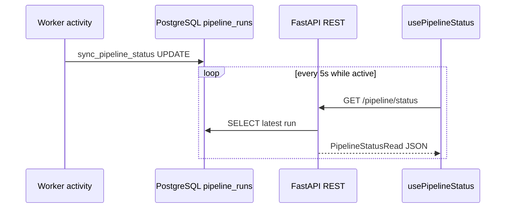
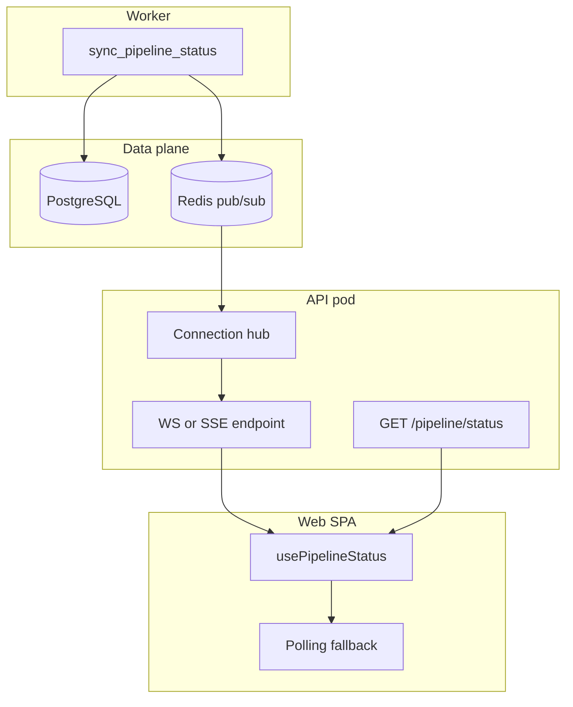
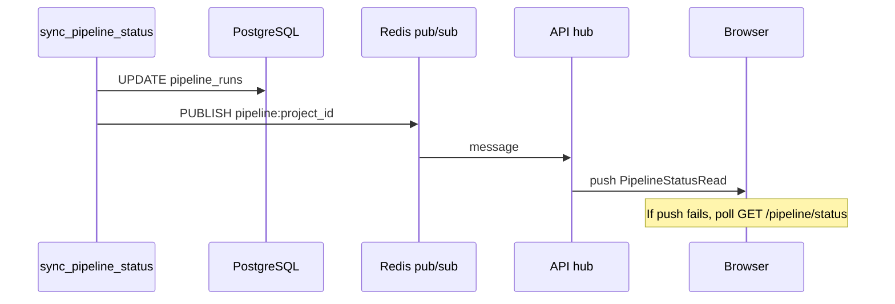

# Sprint 5D — US-21 Realtime Updates (governance brief)

**Status:** **CLOSED** — `v0.11.0-us21` · governance ACCEPT 2026-06-10.  
**Implementation plan:** `docs/sprints/sprint-5d-us21-implementation-plan.md` (**SUBMITTED**)  
**Parent program:** Spark Full Phase 2 ([spark-full-phase2-governance-brief.md](./spark-full-phase2-governance-brief.md) **ACCEPT**)  
**Story:** US-21 Realtime pipeline status updates · extends **FEAT-16** (Dashboard) · **EPIC-02** · **P2** · **5 SP**  
**Backlog note:** Original Visual MVP US-21 (“download production bundle”) was **delivered as US-19** (`v0.6.0-us19`). Phase 2 **repurposes US-21** for realtime status (Phase 2 brief §3.2).  
**Prerequisites (closed):** US-10 ✅ · US-26 ✅ · US-V02 ✅ · US-20 ✅ · US-22 ✅ · US-23 ✅  
**Baseline:** `v0.10.0-us23`  
**Proposed decision record:** **D-59** — Realtime channel contract (append at implementation start after plan ACCEPT)

---

## 0. Story classification — push layer only

US-21 adds a **server-initiated status push channel** so the dashboard (and other consumers of `usePipelineStatus`) reflect pipeline transitions without relying solely on client polling. It is **not** a workflow change, generation feature, or broad event bus.

| Authorized in US-21 | Forbidden in US-21 |
|---|---|
| Push **`PipelineStatusRead`-shaped** events on `project_id` subscription | Temporal workflow / activity logic changes (beyond optional publish hook) |
| Web client integration in **`usePipelineStatus`** (+ connection indicator optional) | Asset history, lineage, or audit **event streams** |
| **Polling fallback** when push unavailable (D-34 preserved) | Multi-project / multi-run fan-out UI |
| Redis pub/sub or equivalent **notify path** at status sync | Schema migrations |
| Olares verify + latency attestation (SC-P2-05) | Query-parameter Bearer token on stream URL (D-09) |
| Decision record **D-59** (transport + auth + payload) | Export progress streaming, GPU percent, agent logs |
| Bearer auth on stream (same token model as REST) | Replacing or removing `GET /pipeline/status` |

**Frozen baseline:** D-32 (DB is status source of truth), D-34 (poll intervals and presentation mapping), D-37..D-54 pipeline semantics.

---

## 1. Business objective

Phase 1 and US-10 proved correct pipeline orchestration, but status visibility is **poll-bound**:

| Problem today | Business impact |
|---|---|
| Dashboard polls `GET /pipeline/status` every **5 s** while active (D-34) | During 15–30 min ComfyUI batches, UI can lag up to 5 s on gate transitions |
| Every connected tab polls independently | Unnecessary API load during long runs |
| Review/Export/Lineage pages reuse the same hook | Stale badges until next poll cycle |
| SC-P2-05 requires **≤ 2 s** transition visibility | Not met by polling alone |

**US-21 objective:** Deliver **near-real-time pipeline status** to the creator console when `pipeline_runs` changes, meeting Phase 2 success criterion **SC-P2-05**, while **preserving** REST polling as a degraded-mode fallback.

| Dimension | Target |
|---|---|
| **User value** | Watch the stepper advance and REVIEW badge appear without manual refresh during long GPU stages |
| **System value** | Reduce redundant status reads; establish push infrastructure for US-V03 timing attestation |
| **Phase 2 boundary** | **Observability transport only** — no change to what “COMPLETED” or approval means |

---

## 2. User-visible behavior

### 2.1 Primary experience (Dashboard)

When a creator has an active or recently completed run:

1. Dashboard **connects** to the realtime channel for the current `project_id` (MVP: first project from `listProjects()` — same as US-10).
2. On **`sync_pipeline_status`** writes (worker), the UI receives a push within **≤ 2 s** (SC-P2-05).
3. **Stepper**, status **badge**, and **CTAs** (`Start Pipeline`, `Go to Review`) update immediately using existing `toDisplayStatus()` mapping (D-34 unchanged).
4. A subtle **connection indicator** (e.g. “Live” / “Polling”) informs the user which mode is active — optional but recommended for support.

### 2.2 Secondary consumers

Any screen using **`usePipelineStatus`** benefits without duplicate subscription logic:

| Page | Behavior |
|---|---|
| **Dashboard** (`/`) | Primary beneficiary — stepper + start/review CTAs |
| **Review** (`/review`) | Badge/step context stays aligned during approve/regenerate flows |
| **Export** (`/export`) | COMPLETED detection for download + lineage sections |
| **Lineage** (`/lineage`) | COMPLETED gate for lineage viewer |

**Not in v1 scope:** History page (`/history`) — no pipeline status dependency today.

### 2.3 Interaction with mutations

| User action | Expected UX |
|---|---|
| **Start pipeline** | Optimistic refresh + push confirms `PENDING`/`RUNNING` |
| **Approve / reject / regenerate** | Existing `refresh()` call remains; push confirms post-worker sync |
| **Logout / 401** | Stream closes; redirect to `/login` (same as REST client) |
| **Tab backgrounded** | Connection may suspend; reconnect + snapshot on focus |

### 2.4 Degraded mode (mandatory)

If the push channel fails (network, proxy, Redis outage, server restart):

- UI **automatically falls back** to D-34 polling (`5 s` active / `15 s` idle).
- **No functional regression** vs pre-US-21 behavior.
- User sees “Polling” (or equivalent) — not a blocking error.

---

## 3. Proposed architecture

US-21 introduces a **thin push layer** on top of the existing DB-authoritative status model (D-32). The worker already writes truth via `sync_pipeline_status`; US-21 **notifies** subscribers after that write.

### 3.1 Current state (baseline)



| Component | Role today |
|---|---|
| **`sync_pipeline_status`** | Sole writer of `pipeline_runs.status` / `current_stage` (T-07-04) |
| **`GET /pipeline/status`** | Read-only; returns `PipelineStatusRead` |
| **`usePipelineStatus`** | Client poll loop via `pipelinePollIntervalMs()` |
| **Redis** | Health probe only; **not** used for events today |
| **Temporal** | Never queried by frontend (D-32) |

### 3.2 Target state (proposed)





### 3.3 Component responsibilities

| Layer | New / changed | Responsibility |
|---|---|---|
| **Worker** | **Extend** `sync_pipeline_status` | After successful DB commit, publish `{project_id, run_id, status, current_stage, updated_at}` to Redis channel `aimpos:pipeline:{project_id}` |
| **API — hub** | **New** in-process module | Subscribe to Redis pattern; maintain `project_id → set[connections]` registry; fan-out to local clients |
| **API — stream route** | **New** | Authenticated long-lived connection; subscribe to one `project_id`; push JSON events |
| **API — REST** | **Unchanged** | `GET /pipeline/status` remains canonical read + fallback |
| **Web — client** | **Extend** `api/client.ts` | Stream connector (WebSocket or SSE helper) |
| **Web — hook** | **Extend** `usePipelineStatus` | Prefer push; merge with poll fallback; `refresh()` triggers immediate REST read |

### 3.4 Transport choice (governance decision — D-59)

| Option | Pros | Cons | Olares fit |
|---|---|---|---|
| **A — WebSocket** (`/ws/pipeline`) | Bidirectional; first-message auth avoids query token; standard in browsers | Ingress upgrade quirks; need heartbeat | Works with port-forward; document ingress timeout |
| **B — SSE** (`GET /pipeline/status/stream`) | Simple one-way; HTTP-friendly | **Cannot set `Authorization` header** on native `EventSource` | Requires **stream ticket** REST preflight |
| **C — Long-poll** | Minimal infra | Still request-per-wait; poor latency vs true push | Avoid as primary |

**Recommendation for governance review:** **Option A — WebSocket** as primary transport, with **D-59** documenting:

1. **Auth:** Client opens WS, sends `{ "type": "auth", "token": "<bearer>" }` then `{ "type": "subscribe", "project_id": "<uuid>" }` before any events. Server closes with **4401** on auth failure.
2. **Events:** Server sends `{ "type": "pipeline.status", "payload": <PipelineStatusRead> }`.
3. **Heartbeat:** Server ping every **30 s**; client reconnect if silent **> 60 s**.
4. **SSE fallback (optional v1.1):** Only if Olares ingress blocks WS — implement ticket-based SSE per §3.5.

**Rationale:** Preserves D-09 (no Bearer in query string); single API pod already serves REST; WebSocket auth via first frame is a well-understood MVP pattern.

### 3.5 Stream ticket pattern (SSE fallback only)

If governance selects SSE for Olares ingress compatibility:

| Step | Detail |
|---|---|
| 1 | Client `POST /pipeline/stream-ticket` with Bearer + `{ project_id }` |
| 2 | API returns `{ ticket, expires_at }` — random UUID, **TTL 60 s**, stored in Redis |
| 3 | Client `EventSource(/pipeline/status/stream?project_id=&ticket=)` |
| 4 | API validates ticket, upgrades to SSE, deletes ticket (one-time use) |

Tickets are **not** API tokens; they are short-lived stream leases.

### 3.6 Payload contract (must mirror REST)

Push payload **MUST** serialize the same fields as `PipelineStatusRead`:

```json
{
  "type": "pipeline.status",
  "payload": {
    "project_id": "uuid",
    "run_id": "uuid | null",
    "status": "IDLE | PENDING | RUNNING | AWAITING_APPROVAL | COMPLETED | FAILED | CANCELLED",
    "current_stage": "IDEA | STORY | SCRIPT | STORYBOARD | VIDEO | null",
    "stages": ["IDEA", "STORY", "SCRIPT", "STORYBOARD", "VIDEO"],
    "updated_at": "ISO-8601 | null"
  }
}
```

| Rule | Detail |
|---|---|
| **Single mapper** | API builds payload from shared function used by REST + push (mitigates R-P2-04) |
| **Presentation** | Web continues `toDisplayStatus()` — push does not send GENERATING/REVIEW labels |
| **IDLE** | Push when latest run deleted or project has no run — same semantics as REST idle sentinel |

### 3.7 What US-21 does not change

| Layer | Impact |
|---|---|
| **Temporal workflows** | **None** — no new signals/queries for UI |
| **`pipeline_runs` schema** | **None** |
| **Approval / start / regenerate routes** | **None** |
| **Worker AI activities** | **None** |
| **Export, lineage, history APIs** | **None** |

---

## 4. Event/update mechanism

### 4.1 Trigger point (source of truth)

Events **MUST** fire **after** `sync_pipeline_status` successfully updates PostgreSQL — not before, not from workflow code directly.

| Trigger | When |
|---|---|
| **Primary** | `worker/app/temporal/activities/pipeline_status.py` — post-commit publish |
| **Secondary (API-only paths)** | If any future API route writes `pipeline_runs` directly, it **MUST** use the same publish helper (none today) |

**Forbidden triggers:** Temporal workflow timers polling UI; client-side inference; MinIO/audit events.

### 4.2 Redis pub/sub channel design

| Field | Value |
|---|---|
| **Channel** | `aimpos:pipeline:{project_id}` |
| **Message body** | JSON `{ run_id, status, current_stage, updated_at }` — API enriches to full `PipelineStatusRead` on fan-out |
| **Publisher** | Worker activity (sync path) |
| **Subscriber** | Each API process — pattern subscribe `aimpos:pipeline:*` or per-connection subscribe |

**Why Redis:** Already deployed (`aimpos-redis-master` on Olares, `redis` in compose). Avoids PostgreSQL `LISTEN/NOTIFY` connection lifecycle on the API async pool. Pub/sub is fire-and-forget — missed messages handled by reconnect snapshot (§9).

### 4.3 Delivery semantics

| Property | Value |
|---|---|
| **Ordering** | Per `project_id`, messages ordered by publish sequence (single worker writer per run) |
| **Durability** | **At-most-once** push — acceptable because REST snapshot on connect/reconnect is source of repair |
| **Fan-out** | All authenticated tabs subscribed to same `project_id` receive the event |
| **Filtering** | Server drops events for connections subscribed to a different `project_id` |

### 4.4 Client merge strategy

`usePipelineStatus` proposed logic:

1. On mount: **REST snapshot** (`GET /pipeline/status`) — immediate paint.
2. Open push connection for `project_id`.
3. On push event: replace local state if `payload.updated_at` ≥ current (monotonic guard).
4. On push error / close: enable poll loop (existing D-34 intervals).
5. On `refresh()`: REST snapshot immediately (unchanged API for post-mutation).

---

## 5. Olares deployment impact

### 5.1 Current Olares topology (M1-DV)

| Service | US-21 impact |
|---|---|
| **`aimpos-api`** | **Primary** — hosts WebSocket/SSE + Redis subscriber |
| **`aimpos-worker`** | **Minor** — Redis publish in `sync_pipeline_status` |
| **`aimpos-redis-master`** | **Used** — pub/sub channels (no config change expected) |
| **`aimpos-postgres`** | Unchanged |
| **Web SPA** | Not deployed on Olares k8s today — verify via **API stream smoke + local web** (same pattern as US-23 S-23-01) |

### 5.2 Deployment changes (proposed)

| Change | Required? |
|---|---|
| New container / sidecar | **No** — extend API + worker images |
| API env: `REDIS_URL` | Already present for health |
| Worker env: `REDIS_URL` | **Add** if worker lacks Redis settings today |
| Ingress / proxy WebSocket upgrade | **Verify** — document port-forward path for verify scripts |
| `readinessProbe` | Unchanged — `/health` only |
| Resource limits | Modest increase for open connections (512Mi likely sufficient for MVP single user) |

### 5.3 Verification on Olares

| Step | Method |
|---|---|
| Deploy API + worker images with US-21 | `deploy/k8s/us21-verify/` (proposed) |
| Start pipeline on US-V02 project | Existing normative path |
| Measure gate transition → push latency | Script captures `updated_at` vs event timestamp **≤ 2 s** |
| Redis outage simulation | Disable publish → confirm REST poll fallback still PASS |
| Phase 1 regression | Export, lineage, history unchanged |

**No Olares web pod required** for gate closure — API-level stream attestation + local web vitest suffice (consistent with US-23).

---

## 6. API impact

### 6.1 New surfaces (proposed — finalized in D-59)

| Surface | Method | Auth | Purpose |
|---|---|---|---|
| **`/ws/pipeline`** (or `/v1/ws/pipeline`) | WebSocket upgrade | First-frame Bearer | Subscribe + receive pushes |
| **`POST /pipeline/stream-ticket`** | POST | Bearer | **Optional** — SSE fallback only |
| **`GET /pipeline/status/stream`** | GET (SSE) | Ticket query param | **Optional** — SSE fallback only |

### 6.2 Unchanged surfaces

| Surface | Note |
|---|---|
| **`GET /pipeline/status`** | **Frozen** — polling fallback + snapshot on connect |
| **`POST /pipeline/start`** | Unchanged |
| **`POST /pipeline/approve`** | Unchanged |
| **`POST /pipeline/regenerate`** | Unchanged |
| **`GET /health`** | Unchanged — no WebSocket on health |

### 6.3 Middleware / CORS

| Concern | Handling |
|---|---|
| **AuthMiddleware** | WebSocket upgrade **must** be exempt from body parsing; auth via WS subprotocol or first message (D-59) |
| **CORSMiddleware** | Already outermost (D-28) — allow WS from configured `cors_origins` |
| **OpenAPI** | Document stream endpoint; may be separate from OpenAPI schema |

### 6.4 Testing expectations

| Suite | Target |
|---|---|
| API unit | Hub fan-out, auth failure, payload parity with REST |
| Web vitest | Hook merges push + fallback; mock WebSocket |
| Contract | Shared builder: REST response ≡ push payload for same DB row |

---

## 7. Database impact

| Area | Impact |
|---|---|
| **Schema migrations** | **None** |
| **New tables** | **None** |
| **`pipeline_runs`** | Read/write paths unchanged — same columns |
| **Audit events** | **None** — no `PIPELINE_STATUS_PUSHED` required for v1 |
| **Redis keys** | Ephemeral pub/sub only; optional `stream_ticket:{uuid}` with TTL if SSE fallback |

**Governance rule:** If implementation proposes any Alembic revision, **stop** and escalate — out of scope for US-21.

---

## 8. Scaling considerations

### 8.1 MVP / Olares (single creator)

| Assumption | Handling |
|---|---|
| **1 API replica** | In-memory connection hub sufficient |
| **1–3 browser tabs** | Negligible connection count |
| **1 active project** | Single subscription per tab |

### 8.2 Multi-replica API (future)

| Concern | Mitigation |
|---|---|
| Connections on different pods | Each pod subscribes to Redis; local fan-out only |
| Sticky sessions | **Not required** if Redis pub/sub fans to all pods |
| Connection storm on deploy | Clients reconnect with backoff; REST snapshot |

### 8.3 Limits (document in D-59)

| Limit | Proposed v1 |
|---|---|
| Subscriptions per connection | **1** `project_id` |
| Max connections per token | **10** (soft cap — log + reject) |
| Message rate | Bounded by pipeline (~tens per run, not high frequency) |
| Long-run connection duration | Up to **60 min** (full pipeline) — heartbeat required |

**Non-goal:** Horizontal scale testing beyond M1-DV single-replica assumptions.

---

## 9. Failure handling

| Failure mode | System behavior | User-visible behavior |
|---|---|---|
| **WebSocket disconnect** | Hook starts D-34 polling; exponential backoff reconnect (1s → 2s → 4s → max 30s) | Brief “Polling” indicator; dashboard still updates within 5s |
| **Reconnect after disconnect** | Immediate `GET /pipeline/status` snapshot, then resume push | Possible single duplicate render — acceptable |
| **Auth failure (4401)** | Close WS; clear token; redirect `/login` | Same as REST 401 |
| **Redis unavailable** | Worker publish fails **non-fatally** (log warning); API hub idle | Polling-only mode — **no user blocking error** |
| **Missed pub/sub message** | At-most-once gap | Next poll or reconnect snapshot heals state |
| **Stale event** | Drop if `updated_at` < local state | No stepper regression |
| **API pod restart** | All WS close | Auto-reconnect + snapshot |
| **Invalid project_id** | Close with **4404** | Error toast; fall back to poll if REST 404 |

**Principle:** Push is an **optimization**; REST polling path **must always work** (Phase 2 brief §5.2 US-21 note).

---

## 10. Explicit non-goals

| Exclusion | Rationale |
|---|---|
| **Asset history / lineage / audit push** | Separate stories; read-only browsers do not need live streams |
| **Multi-project subscription UI** | MVP single-project pattern (US-10) |
| **Temporal queries from browser** | Forbidden by D-32 |
| **Workflow or approval semantic changes** | Phase 1 frozen |
| **Export download progress streaming** | Export is synchronous ZIP HTTP |
| **GPU percent / ComfyUI queue depth** | Operational telemetry — out of creator MVP |
| **Agent log tail / structured trace UI** | Phase 3+ observability |
| **Collaboration / presence (“user X is viewing”)** | Scope Freeze |
| **Mobile push notifications** | Out of charter |
| **Removing REST `GET /pipeline/status`** | Polling fallback mandatory |
| **Keycloak / per-user stream ACLs** | Lab Bearer token sufficient (D-09) |
| **Cloud relay / egress** | Local-first sovereignty |
| **Implementation authorization** | **This brief is planning only** |

---

## 11. Acceptance criteria (proposed)

| ID | Criterion | Verification |
|---|---|---|
| AC-1 | Push delivers `PipelineStatusRead`-equivalent payload | API contract test |
| AC-2 | Gate transition visible within **≤ 2 s** (SC-P2-05) | Olares timing script |
| AC-3 | Dashboard stepper/badge updates without manual refresh | Manual / vitest |
| AC-4 | **Polling fallback** works when WS disabled | Verify script + vitest |
| AC-5 | `GET /pipeline/status` unchanged | Regression tests |
| AC-6 | No workflow/schema changes | Diff audit |
| AC-7 | Lineage + export + history regression | US-21 verify script |
| AC-8 | Bearer auth enforced on stream | Negative test (no token → close) |

---

## 12. Dependencies

| Dependency | Status |
|---|---|
| US-10 Dashboard + `usePipelineStatus` | **CLOSED** |
| US-26 Web shell + `api/client.ts` | **CLOSED** |
| D-32 `sync_pipeline_status` write path | **CLOSED** |
| Redis in compose + Olares | **CLOSED** |
| US-20 / US-22 / US-23 | **CLOSED** — regression only |
| **US-V03** Phase 2 acceptance | **Blocked** on US-21 + governance closure |

---

## 13. Verification strategy (preview)

| Step | Action | Pass |
|---|---|---|
| S-21-01 | WebSocket auth + subscribe smoke | PASS |
| S-21-02 | Payload parity REST vs push | PASS |
| S-21-03 | Transition latency ≤ 2 s (Olares) | PASS |
| S-21-04 | Redis publish failure → poll fallback | PASS |
| S-21-05 | Lineage + export + history regression | PASS |
| S-21-06 | No schema migration files | PASS |
| S-21-07 | Worker + API images deploy on Olares | PASS |

Scripts: `deploy/k8s/us21-verify/` (to be authored at implementation).

---

## 14. Risk summary

| ID | Risk | Mitigation |
|---|---|---|
| R-21-01 | WS blocked by ingress | Port-forward verify; SSE ticket fallback in D-59 |
| R-21-02 | REST vs push payload drift | Shared mapper + contract tests (R-P2-04) |
| R-21-03 | Redis publish fails silently | Log + metric; poll fallback |
| R-21-04 | Scope creep to full event bus | §10 non-goals; D-59 pipeline-only |
| R-21-05 | Auth pattern violates D-09 | First-message WS auth; no query Bearer |

---

## 15. Authorization boundary

| Stage | Status |
|---|---|
| Phase 2 program brief | **ACCEPT** |
| US-20 / US-22 / US-23 | **CLOSED** |
| **US-21 brief** | **ACCEPT WITH CONDITION** |
| Implementation plan | **SUBMITTED** — awaiting ACCEPT |
| Code / deploy | **Not authorized** |

**Upon brief ACCEPT:** Author `docs/sprints/sprint-5d-us21-implementation-plan.md` → governance review → **D-59** → implementation ACCEPT.

**Governance emphasis:** Because realtime updates touch worker, API, Redis, and long-lived connections, **plan ACCEPT is mandatory** before any code. Escalate if implementation requires schema changes, Temporal workflow edits beyond a publish hook, or removal of REST polling.

---

## 16. Document control

| Version | Date | Changes |
|---|---|---|
| 1.1 | 2026-06-10 | ACCEPT WITH CONDITION; implementation plan SUBMITTED |
