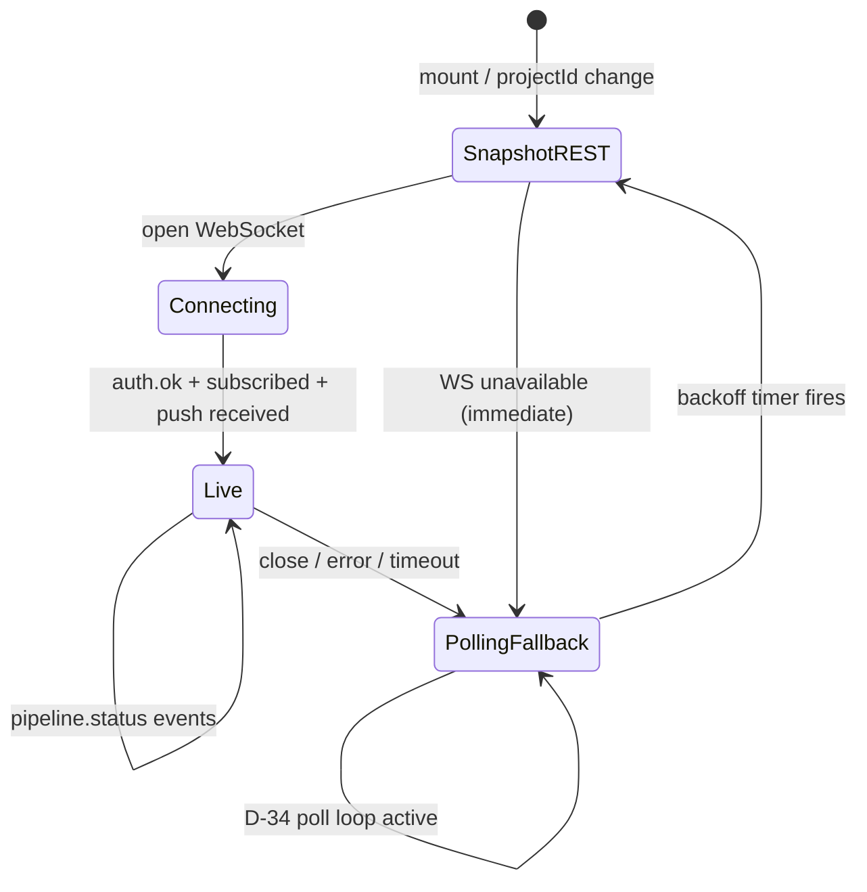
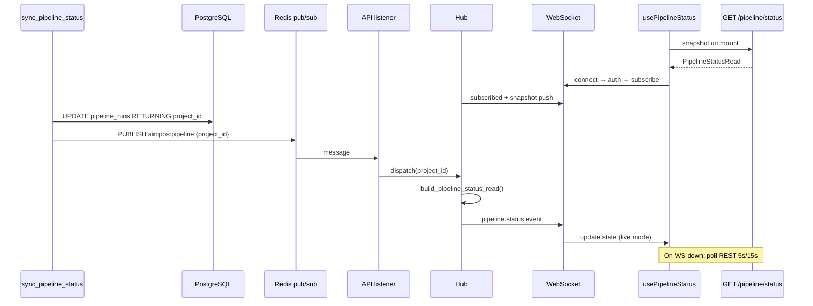

# Sprint 5D — US-21 Implementation Plan

**Status:** **ACCEPT** — implementation **COMPLETE**; Olares **PASS**; closure authorized.  
**Parent brief:** `docs/sprints/sprint-5d-us21-governance-brief.md` (**ACCEPT WITH CONDITION**)  
**Story:** US-21 Realtime pipeline status updates · FEAT-16 · EPIC-02 · **P2** · **5 SP**  
**Baseline:** `v0.10.0-us23` (`e01c6ab`)  
**Decision record:** **D-59** — append to `DECISIONS.md` at **implementation start** (after this plan ACCEPT)

---

## 0. Implementation summary

US-21 adds a **WebSocket push channel** for **`PipelineStatusRead`** events, triggered by **`sync_pipeline_status`** via **existing Redis pub/sub** (no new broker). The web hook **`usePipelineStatus`** prefers push but **always** retains D-34 REST polling as authoritative fallback.

| Layer | Net-new | Reuse / frozen |
|---|---|---|
| **Worker** | Redis publish after DB sync in `sync_pipeline_status` | Same activity signature; no workflow edits |
| **API** | WS route `/ws/pipeline`, in-process hub, Redis listener, shared status mapper | `GET /pipeline/status` unchanged; existing `app.state.redis` |
| **Web** | WS client module, hook merge logic, Live/Polling indicator | `PipelineStatus` type; `pipelinePollIntervalMs()`; `toDisplayStatus()` |
| **Verify** | `deploy/k8s/us21-verify/` | US-V02 project; latency + fallback + regression |

**Estimated effort:** ≈ 5 SP · ~3–4 days

### Deployment impact attestation (§7 summary)

| Assertion | Plan compliance |
|---|---|
| No new infrastructure **classes** | **Yes** — extend `aimpos-api` + `aimpos-worker` images only |
| No sidecars | **Yes** — WS + hub run in API container |
| No new databases | **Yes** — PostgreSQL schema unchanged |
| No new message brokers | **Yes** — Redis pub/sub on **existing** `aimpos-redis-master` / compose `redis` service |

---

## 1. Connection lifecycle

WebSocket transport per governance brief §3.4 (**Option A**). Auth uses **first-frame Bearer** (preserves D-09 — no query-token).

### 1.1 Connect

| Step | Actor | Action |
|---|---|---|
| C-1 | Web | Derive WS URL from `VITE_API_URL`: `http`→`ws`, `https`→`wss`, append `/ws/pipeline` |
| C-2 | Web | `new WebSocket(url)` on `usePipelineStatus` mount when `projectId !== null` |
| C-3 | API | Accept upgrade on `/ws/pipeline`; **do not** require HTTP Bearer on upgrade (AuthMiddleware passes `scope["type"]=="websocket"` through) |
| C-4 | API | Register connection in hub as **unauthenticated** pending first message; start **10 s auth timeout** |

**Pre-connect snapshot:** Before WS open completes, hook performs **`GET /pipeline/status`** (existing REST) so UI paints immediately (D-34 baseline preserved).

### 1.2 Authenticate

| Step | Client → server | Server behavior |
|---|---|---|
| A-1 | `{ "type": "auth", "token": "<AIMPOS_API_TOKEN>" }` | `secrets.compare_digest` vs `Settings.api_token` (same as D-09) |
| A-2 | — | **Success:** mark connection authenticated; reply `{ "type": "auth.ok" }` |
| A-3 | — | **Failure:** close with code **4401** + reason `Unauthorized`; web clears token → `/login` |

| Rule | Detail |
|---|---|
| Ordering | **Auth MUST precede subscribe** — server ignores subscribe on unauthenticated connections |
| Timeout | No auth within **10 s** → close **4401** |
| Token source | Same `localStorage` key as REST (`aimpos.token`) |

### 1.3 Subscribe

| Step | Client → server | Server behavior |
|---|---|---|
| S-1 | `{ "type": "subscribe", "project_id": "<uuid>" }` | Validate UUID; verify project exists (404 → close **4404**) |
| S-2 | — | Register connection in hub map: `project_id → Set[WebSocket]` |
| S-3 | — | Reply `{ "type": "subscribed", "project_id": "<uuid>" }` |
| S-4 | — | **Immediately push snapshot:** `{ "type": "pipeline.status", "payload": <PipelineStatusRead> }` built via **shared mapper** (§4) |

| Rule | Detail |
|---|---|
| Subscriptions per connection | **1** `project_id` (v1); re-subscribe replaces prior |
| Max connections per token | **10** soft cap — **4408** + log if exceeded |
| Hub registry | In-process `dict[UUID, set[ConnectionState]]` on API pod |

### 1.4 Disconnect

| Trigger | Client | Server |
|---|---|---|
| User logout | `WebSocket.close(1000)` in logout handler | Remove from hub sets |
| Navigate away / unmount | Hook cleanup closes WS | Remove from hub |
| Server heartbeat timeout | Client detects silence **> 60 s** → close | Stop fan-out to dead socket |
| Auth/subscribe failure | Close on 4401/4404 | Remove from hub |
| API shutdown | — | Lifespan `finally`: close all WS gracefully |

### 1.5 Reconnect



| Phase | Behavior |
|---|---|
| **R-1 Immediate** | On close/error: set mode **`polling`**; D-34 interval loop **already running** (see §3) |
| **R-2 Snapshot** | Before each reconnect attempt: **`GET /pipeline/status`** (repair missed at-most-once events) |
| **R-3 Backoff** | Reconnect delays: **1 s → 2 s → 4 s → 8 s → 16 s → 30 s max**; reset to 1 s on `subscribed` |
| **R-4 Resume Live** | On `subscribed` + first push: set mode **`live`**; reduce poll frequency (§3.2) |
| **R-5 Tab focus** | Optional `visibilitychange`: if hidden **> 30 s**, snapshot REST on visible |

**No reconnect storm:** single WS per hook instance; backoff capped at 30 s.

---

## 2. Failure handling

### 2.1 Redis unavailable

| Layer | Detection | Response |
|---|---|---|
| **Worker** | `PUBLISH` raises / connection error | **Log warning** (`pipeline_status.publish_failed`); **do not fail activity** — DB sync already committed |
| **API hub** | Redis listener disconnect / subscribe error | Log error; retry listener with **5 s backoff**; WS clients remain on **polling fallback** |
| **API startup** | Redis unreachable at lifespan | Log warning; start API **without** listener; REST + WS auth/subscribe work; pushes absent until Redis returns |
| **Web** | N/A (transparent) | Stays in **Polling** mode; no blocking error surface |

**Acceptance:** Worker activity success unchanged when Redis down; dashboard still updates via poll within D-34 intervals.

### 2.2 WebSocket unavailable

| Scenario | System | User |
|---|---|---|
| Browser blocks WS | Hook catches constructor error | **Polling** immediately; indicator shows "Polling" |
| Upgrade rejected (502/404) | `onerror` / abnormal close | Backoff reconnect; poll active |
| Proxy strips upgrade (Olares ingress) | Verify script documents port-forward path | Same fallback; escalate SSE ticket only if verify FAIL (out of v1 unless D-59 amended) |
| Invalid message JSON | Server close **4400** | Reconnect + poll |

### 2.3 API restart

| Event | Behavior |
|---|---|
| Pod rolling restart | All WS connections drop |
| Client | Detect close → **Polling** + backoff reconnect |
| On new pod ready | Reconnect → auth → subscribe → REST-equivalent snapshot push |
| Redis listener | Restarts in API lifespan; re-subscribes `aimpos:pipeline:*` pattern |

**Acceptance (Olares S-21-04):** Kill API pod during idle WS → client reconnects within **≤ 60 s**; status matches REST snapshot.

### 2.4 Worker publish failure

| Case | Behavior |
|---|---|
| Redis up, publish fails | Logged; activity **still succeeds** (DB is truth) |
| Partial JSON | API listener ignores malformed messages (log debug) |
| Missing `project_id` in message | API drops message (log warning) |

Worker publish payload (minimal — API enriches to full read model):

```json
{
  "project_id": "uuid",
  "run_id": "uuid",
  "status": "RUNNING",
  "current_stage": "STORY",
  "updated_at": "ISO-8601"
}
```

Implementation: extend SQL to `UPDATE … RETURNING project_id, updated_at` — **no workflow signature change**.

### 2.5 Client disconnect

| Case | Server | Other clients |
|---|---|---|
| Normal tab close | Remove socket from hub set | Unaffected |
| Network drop | Detect on next send failure / ping timeout | Unaffected |
| Idle run complete | Client may stay connected in **Live** with heartbeats | — |

**Stale event guard (client):** Apply push only if `payload.updated_at >= local.updated_at` (ISO compare); ignore regressions.

---

## 3. Fallback behavior

### 3.1 Polling remains authoritative fallback

| Principle | Implementation |
|---|---|
| **REST is source of truth** | Every reconnect and `refresh()` calls `GET /pipeline/status` |
| **Push is optimization** | Missed WS events healed by next poll or snapshot |
| **Poll never removed** | `usePipelineStatus` **always** schedules D-34 timer when `projectId` set |
| **Mutation paths unchanged** | `startPipeline` / `approvePipeline` / `regeneratePipeline` still call `refresh()` → REST |

### 3.2 Dual-mode poll scheduling

| Mode | Poll interval | When |
|---|---|---|
| **`live`** | **30 s** (slow sanity check) | WS connected + subscribed |
| **`polling`** | D-34: **5 s** active / **15 s** idle | WS disconnected or never connected |

Rationale: Live mode reduces REST load while retaining healing if push silently fails.

### 3.3 Live / Polling indicator

| Component | Path | Behavior |
|---|---|---|
| **`PipelineConnectionIndicator`** | `web/src/components/PipelineConnectionIndicator.tsx` | Renders badge in Dashboard header (and optionally Export/Review) |
| **`live`** | Green/muted badge **"Live"** | WS authenticated + subscribed |
| **`polling`** | Neutral badge **"Polling"** | Fallback active |
| **`connecting`** | Hint text **"Connecting…"** | WS opening; REST snapshot may already show |
| **Errors** | No red alert for WS alone | `statusError` from REST still uses `page__error` |

Indicator is **informational only** — never blocks pipeline actions.

---

## 4. Contract governance

### 4.1 Identical `PipelineStatusRead` payload

Push event shape:

```json
{
  "type": "pipeline.status",
  "payload": {
    "project_id": "uuid",
    "run_id": "uuid | null",
    "status": "IDLE | PENDING | RUNNING | AWAITING_APPROVAL | COMPLETED | FAILED | CANCELLED",
    "current_stage": "IDEA | STORY | SCRIPT | STORYBOARD | VIDEO | null",
    "stages": ["IDEA", "STORY", "SCRIPT", "STORYBOARD", "VIDEO"],
    "updated_at": "ISO-8601 | null"
  }
}
```

**Rule:** `payload` JSON **MUST** byte-match the REST serializer output for the same DB row (modulo key ordering — compare parsed objects in tests).

### 4.2 Shared mapper (no duplicate DTO definitions)

| Module | Responsibility |
|---|---|
| **`api/app/domain/pipeline/status_read.py`** | `build_pipeline_status_read(project_id, run \| None) -> PipelineStatusRead` |
| **`api/app/routes/pipeline.py`** | `GET /pipeline/status` calls mapper only |
| **`api/app/infrastructure/realtime/hub.py`** | Fan-out calls same mapper after Redis hint + optional DB re-read |
| **Web `PipelineStatus`** | **Single** interface in `web/src/api/types.ts` — used by REST and WS |

**Forbidden:**

- Separate `PipelineStatusPush` Pydantic model with duplicated fields
- Client-side reconstruction of status from partial Redis fields without full payload from server
- Presentation labels (`GENERATING`, `REVIEW`) on wire — web `toDisplayStatus()` only

### 4.3 Mapper contract tests

| Test | Assertion |
|---|---|
| `test_pipeline_status_mapper_idle` | No run → IDLE sentinel matches current route |
| `test_pipeline_status_mapper_active` | Run row → all fields populated |
| `test_ws_payload_matches_rest` | Same DB fixture: REST JSON == WS `payload` |
| `test_ws_auth_required` | No auth frame → 4401 |

### 4.4 Heartbeat messages

Server → client (every **30 s**):

```json
{ "type": "ping", "ts": "ISO-8601" }
```

Client → server (optional):

```json
{ "type": "pong" }
```

Heartbeats **do not** carry status — they keep connections alive through proxies.

---

## 5. D-59 scope boundaries

**Record in `DECISIONS.md` as D-59** at implementation start.

### 5.1 IN SCOPE

- **Pipeline status realtime updates** — WebSocket `/ws/pipeline` with first-frame Bearer auth
- **Subscribe by `project_id`** — one subscription per connection (MVP)
- **Push `PipelineStatusRead`** — identical to `GET /pipeline/status`
- **Redis pub/sub trigger** — channel `aimpos:pipeline:{project_id}` after `sync_pipeline_status`
- **In-process connection hub** on API pod
- **Web `usePipelineStatus` integration** — Live/Polling dual mode + indicator
- **Polling fallback** — D-34 preserved; REST authoritative
- **Olares verify** — latency, reconnect, fallback, regression

### 5.2 OUT OF SCOPE

| Exclusion | Notes |
|---|---|
| **Asset streams** | No version/content push |
| **Lineage streams** | No `GET /lineage` push |
| **Audit streams** | No `audit_events` fan-out |
| **Event replay** | No backlog / catch-up buffer |
| **Event persistence** | No Redis streams, no DB event table |
| **Notifications** | No email/push/mobile alerts |
| **Workflow mutation** | No Temporal signal/query/UI changes; publish hook only in existing activity |
| **Schema changes** | No Alembic revisions |
| **SSE / stream tickets** | Deferred unless Olares verify blocks WS (governance escalation) |
| **Multi-project subscribe UI** | Single project (US-10 pattern) |
| **Removing `GET /pipeline/status`** | Frozen |

---

## 6. Component inventory

| Module | Path | Responsibility |
|---|---|---|
| **Status mapper** | `api/app/domain/pipeline/status_read.py` | Single `PipelineStatusRead` builder |
| **Pipeline WS route** | `api/app/routes/pipeline_ws.py` | Upgrade, auth/subscribe protocol |
| **Connection hub** | `api/app/infrastructure/realtime/hub.py` | Registry + fan-out |
| **Redis listener** | `api/app/infrastructure/realtime/listener.py` | `PSUBSCRIBE aimpos:pipeline:*` |
| **Worker publisher** | `worker/app/infrastructure/pipeline_publish.py` | Redis PUBLISH helper |
| **Activity extend** | `worker/app/temporal/activities/pipeline_status.py` | Post-commit publish |
| **WS client** | `web/src/api/pipelineSocket.ts` | Connect/auth/subscribe/reconnect |
| **Hook extend** | `web/src/hooks/usePipelineStatus.ts` | Live + polling merge |
| **Indicator** | `web/src/components/PipelineConnectionIndicator.tsx` | Live/Polling badge |
| **Auth middleware** | `api/app/middleware/auth.py` | Pass-through `websocket` scope |
| **Main lifespan** | `api/app/main.py` | Start/stop listener + hub |

**Refactor (no behavior change):** `api/app/routes/pipeline.py` → delegate to shared mapper.

---

## 7. Data flow



---

## 8. Olares verification strategy

Scripts: `deploy/k8s/us21-verify/` (`verify_us21.sh`, `deploy_us21.sh`, `run_remote.sh`).

**Reference inputs:** `PROJECT_ID=76aa4418-d92d-45f7-954c-a10383ea511a` · deploy `aimpos-api:us21` + `aimpos-worker:us21`.

### 8.1 Measurable acceptance criteria

| ID | Criterion | Method | Pass threshold |
|---|---|---|---|
| **S-21-01** | WS auth + subscribe smoke | `websockets` Python client or `wscat` in verify script | `auth.ok` + `subscribed` + one `pipeline.status` |
| **S-21-02** | Payload parity REST vs push | Same moment: REST GET vs WS `payload` field compare | Deep equality on parsed JSON |
| **S-21-03** | **Latency target** (SC-P2-05) | Trigger approve or wait for stage transition; compare `pipeline_runs.updated_at` (SQL) vs WS receive timestamp | **≤ 2000 ms** |
| **S-21-04** | **Reconnect validation** | Restart API deployment during open WS; client script reconnects | Re-`subscribed` within **≤ 60 s**; status matches REST |
| **S-21-05** | **Polling fallback validation** | Block WS port or run with `AIMPOS_DISABLE_WS=1` test flag; poll REST only | Status updates within **≤ 5000 ms** on transition |
| **S-21-06** | **Redis failure validation** | Scale Redis to 0 or iptables block publish port; run pipeline transition | Worker activity **SUCCESS**; REST poll shows new status within 5 s |
| **S-21-07** | **Regression validation** | `GET /assets/history`, `/lineage/{RUN_ID}`, `/export/{RUN_ID}` | HTTP 200; counts unchanged |
| **S-21-08** | No schema migrations | Grep / diff | Zero Alembic files |
| **S-21-09** | No new infra classes | `kubectl get deploy,sts,svc` | No new Deployments beyond image tag bump |

### 8.2 Local verification (pre-Olares)

| Suite | New tests | Target |
|---|---|---|
| API unit | `test_pipeline_status_mapper.py`, `test_pipeline_ws.py` | Mapper parity + WS protocol |
| Worker unit | `test_pipeline_publish.py` | Publish called; failure non-fatal |
| Web vitest | `pipelineSocket.test.ts`, `usePipelineStatus.test.ts` | Fallback + monotonic merge |
| Regression | API **101+** · web **32+** | All PASS |

Evidence: `evidence/us-21-verification/local-<date>/`

### 8.3 Olares evidence package

`evidence/us-21-verification/olares-<date>/US-21-ACCEPTANCE-PACKAGE.md` with latency histogram, reconnect log, Redis-down attestation, regression table.

---

## 9. Deployment impact

### 9.1 Infrastructure delta

| Resource | Change |
|---|---|
| **aimpos-api Deployment** | New image tag `aimpos-api:us21`; same manifest |
| **aimpos-worker Deployment** | New image tag `aimpos-worker:us21`; add `REDIS_URL` env from existing secret/config if missing |
| **aimpos-redis-master** | **No manifest change** — pub/sub only |
| **aimpos-postgres** | Unchanged |
| **aimpos-web** | Not on Olares k8s — local vitest + build for web diff |
| **Ingress / Service** | ClusterIP :8000 unchanged; verify uses port-forward or in-cluster curl |

### 9.2 Explicit non-additions

| Not added | Confirmed |
|---|---|
| Sidecar containers | ✓ |
| Kafka / NATS / RabbitMQ | ✓ |
| New PostgreSQL databases or tables | ✓ |
| Dedicated WS gateway pod | ✓ |
| Redis Streams / consumer groups | ✓ |

### 9.3 Compose (local dev)

| Service | Change |
|---|---|
| `api` | WS on same port 8000 |
| `worker` | `REDIS_URL=redis://redis:6379/0` in environment |
| `web` | `VITE_API_URL` unchanged |

---

## 10. D-59 decision record (preview)

Append to `DECISIONS.md` at implementation start:

| Field | Value |
|---|---|
| **Transport** | WebSocket `GET /ws/pipeline` (upgrade) |
| **Auth** | First frame `{type:auth, token}` — no query Bearer |
| **Subscribe** | `{type:subscribe, project_id}` — one per connection |
| **Event** | `{type:pipeline.status, payload: PipelineStatusRead}` |
| **Trigger** | Worker Redis PUBLISH after `sync_pipeline_status` commit |
| **Channel** | `aimpos:pipeline:{project_id}` |
| **Fallback** | D-34 REST polling mandatory; 5s/15s in polling mode |
| **Out of scope** | §5.2 list |

---

## 11. Risk assessment

| ID | Risk | Mitigation |
|---|---|---|
| R-21-01 | WS blocked on ingress | Port-forward verify; S-21-05 polling proves fallback |
| R-21-02 | REST/push drift | Shared mapper + S-21-02 |
| R-21-03 | Listener memory leak | Hub prune on disconnect; lifespan cleanup |
| R-21-04 | Worker Redis dependency | Non-fatal publish; S-21-06 |
| R-21-05 | Dual poll + push race | Monotonic `updated_at` guard |

---

## 12. Implementation sequence

| Step | Deliverable |
|---|---|
| 1 | Append **D-59**; extract shared mapper; refactor REST route |
| 2 | Worker publish + unit tests |
| 3 | API listener + hub + WS route + unit tests |
| 4 | Web socket client + hook + indicator + vitest |
| 5 | Local verification (all suites) |
| 6 | `deploy/k8s/us21-verify/` + Olares deploy |
| 7 | Implementation report → Olares PASS → governance closure |

**PR checklist:** Grep diff for `alembic/`, `asset` stream routes, `audit` stream, workflow graph changes beyond publish hook, removal of `GET /pipeline/status`.

---

## 13. Authorization boundary

| Stage | Status |
|---|---|
| Phase 2 program brief | **ACCEPT** |
| US-21 brief | **ACCEPT WITH CONDITION** |
| **US-21 implementation plan** | **SUBMITTED** |
| D-59 | Pending plan ACCEPT |
| Code / deploy | **Not authorized** |

**Upon plan ACCEPT:** Append D-59 → implementation ACCEPT → execute §12.

**Escalation triggers:** Olares S-21-01 FAIL on WS upgrade → governance review for SSE ticket path. Any schema or workflow semantic change → stop.

---

## 14. Document control

| Version | Date | Changes |
|---|---|---|
| 1.0 | 2026-06-10 | Initial submission — addresses governance conditions C-01 (lifecycle, failure, fallback, contract, D-59 bounds, Olares, deployment) |
