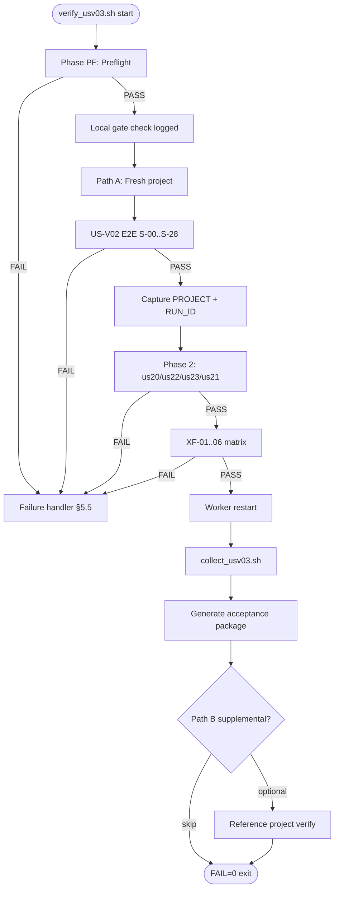

# Sprint 5E — US-V03 Verification Plan

**Status:** **CLOSED — Olares PASS** · governance closure ACCEPT 2026-06-15 · tag `v0.12.0-usv03` · **M7 complete**.  
**Parent brief:** `docs/sprints/sprint-5e-usv03-governance-brief.md` (**ACCEPT WITH CONDITION**)  
**Story:** US-V03 Phase 2 integrated acceptance · EPIC-06 · **P0** · **2 SP**  
**Baseline:** `v0.11.0-us21` (`59506aa`)  
**Goal:** Authoritative Olares integrated acceptance package and **M7 sign-off evidence**

**Authorization boundary (current):** Verification plan authoring only. **No verify script execution. No Olares runs. No product code. No API, schema, workflow, or architecture changes.**

---

## 0. Plan summary

| Phase | Deliverable |
|---|---|
| Local gate | API ≥ 106 · web ≥ 36 · worker publish tests · web build PASS |
| Preflight | Cluster health, image tags `us21`, secrets, ComfyUI, ffmpeg |
| **Path A (authoritative)** | Fresh-project US-V02 E2E → Phase 2 attestation on same `PROJECT`/`RUN_ID` |
| **Path B (supplemental)** | Reference-project read-only regression on US-V02 attestation run |
| Cross-feature | XF-01..06 matrix on authoritative run |
| Collect | SQL attestation + per-story verify logs + metrics |
| Package | `evidence/us-v03-verification/olares-<date>/US-V03-ACCEPTANCE-PACKAGE.md` |
| Close | Verification report + governance closure + tag `v0.12.0-usv03` (proposed) |

**Estimated wall-clock (Path A):** 60–90+ min (inherits US-V02 GPU path + Phase 2 read suite + WS latency sampling).

**Reference project (Path B only):** `76aa4418-d92d-45f7-954c-a10383ea511a` · run `042983f7-0f55-48c3-9d65-fce89a684625`.

---

## 1. Acceptance exit criteria

Exit criteria define **mandatory PASS conditions** per story, cross-feature check, and overall Phase 2 acceptance. Any **FAIL** on a mandatory criterion blocks closure until resolved per §3 (defect classification) and §6 (retry policy).

### 1.1 US-20 — Lineage Viewer (D-55, D-56)

**Decision records:** D-55 (API contract), D-56 (UI scope — read-only, list/tree, synthetic IDEA).

| ID | Check | Method | Pass criteria | Pass token |
|---|---|---|---|---|
| EC-20-01 | Lineage API reachable | `GET /lineage/{run_id}` | HTTP **200** on COMPLETED run | `LINEAGE http=200` |
| EC-20-02 | Display chain complete | Parse `nodes[]` stages | `IDEA` first (synthetic); `STORY`, `SCRIPT`, `STORYBOARD` (≥4), `VIDEO` present | `DISPLAY_CHAIN=PASS` |
| EC-20-03 | API/SQL edge parity | Compare edge count | API `len(edges)` = SQL run-scoped edge count | `SQL_EDGE_COUNT` = `API_EDGE_COUNT` |
| EC-20-04 | Synthetic IDEA | Node + edge inspection | `synthetic=true`; IDEA not in any edge endpoint | `SYNTHETIC_IDEA=PASS` |
| EC-20-05 | STORYBOARD→VIDEO lineage | SQL on VIDEO asset | Exactly **4** edges from STORYBOARD parent to VIDEO child | `STORYBOARD_TO_VIDEO=4` |
| EC-20-06 | Unknown run | `GET /lineage/{missing_uuid}` | HTTP **404** | `UNKNOWN http=404` |
| EC-20-07 | No lineage writes | `lineage_edges` COUNT before/after | Unchanged | `LINEAGE_EDGES_BEFORE` = `AFTER` |
| EC-20-08 | Export regression | `GET /export/{run_id}` | HTTP **200** | `EXPORT http=200` |

**Story exit:** All EC-20-01..08 **PASS** · `verify_us20.sh` exits `FAIL=0` · SC-P2-01 and SC-P2-02 satisfied.

**Reference script:** `deploy/k8s/us20-verify/verify_us20.sh`

---

### 1.2 US-22 — Asset History API (D-57)

**Decision record:** D-57 (stage-grouped history, newest-first, read-only).

| ID | Check | Method | Pass criteria | Pass token |
|---|---|---|---|---|
| EC-22-01 | History API reachable | `GET /assets/history?project_id=` | HTTP **200** | `HISTORY http=200` |
| EC-22-02 | Stage groups | Parse `stages[]` | Contains `IDEA`, `STORY`, `SCRIPT`, `STORYBOARD`, `VIDEO` | `STAGES=PASS` |
| EC-22-03 | API/SQL row parity | Compare version counts | `sum(len(versions))` = SQL `asset_versions` COUNT for project | `SQL_ROW_COUNT` = `API_ROW_COUNT` |
| EC-22-04 | STORY regen history | STORY stage versions | ≥ 2 versions; `version` descending (newest-first) | `STORY_REGEN=PASS` |
| EC-22-05 | STORYBOARD metadata | STORYBOARD versions | Each version has `metadata.frame_index` | `STORYBOARD_FRAMES=PASS` |
| EC-22-06 | Content-read spot check | `GET /assets/{story_asset_id}/content` | HTTP **200** | `CONTENT_READ http=200` |
| EC-22-07 | Lineage regression | `GET /lineage/{run_id}` | HTTP **200** | `LINEAGE http=200` |
| EC-22-08 | Export regression | `GET /export/{run_id}` | HTTP **200** | `EXPORT http=200` |
| EC-22-09 | No asset writes | Global `asset_versions` COUNT before/after | Unchanged | `ASSET_VERSIONS_BEFORE` = `AFTER` |

**Story exit:** All EC-22-01..09 **PASS** · `verify_us22.sh` exits `FAIL=0` · SC-P2-03 satisfied.

**Forbidden:** Using `GET /assets` flat list as history verification path.

**Reference script:** `deploy/k8s/us22-verify/verify_us22.sh`

---

### 1.3 US-23 — Asset History UI (D-58)

**Decision record:** D-58 (web-only history browser; API frozen at D-57).

| ID | Check | Method | Pass criteria | Pass token |
|---|---|---|---|---|
| EC-23-01 | Web bundle route | Local `web` build grep | `/history` route present in bundle | `HISTORY_ROUTE=PASS` |
| EC-23-02 | History API (UI data path) | `GET /assets/history?project_id=` | HTTP **200**; D-57 parity | `HISTORY http=200` |
| EC-23-03 | API/SQL parity | Row count compare | SQL = API total versions | counts match |
| EC-23-04 | Content-read (UI preview path) | Latest STORY `asset_id` content | HTTP **200** | `CONTENT_READ http=200` |
| EC-23-05 | STORYBOARD content-read | Latest STORYBOARD frame content | HTTP **200** (SC-P2-04) | `SB_CONTENT_READ http=200` |
| EC-23-06 | Lineage regression | `GET /lineage/{run_id}` | HTTP **200** | `LINEAGE http=200` |
| EC-23-07 | Export regression | `GET /export/{run_id}` | HTTP **200** | `EXPORT http=200` |
| EC-23-08 | No asset writes | Global `asset_versions` COUNT | Unchanged | before = after |
| EC-23-09 | API image baseline | Deploy image tag | `aimpos-api:us21` (or ≥ us21) at verify time | image check PASS |

**Story exit:** All EC-23-01..09 **PASS** · `verify_us23.sh` exits `FAIL=0` (EC-23-01 local only) · SC-P2-04 satisfied.

**Note:** Olares has no web pod; EC-23-01 is attested from **local build evidence** logged in acceptance package preconditions.

**Reference script:** `deploy/k8s/us23-verify/verify_us23.sh`

---

### 1.4 US-21 — Realtime Updates (D-59)

**Decision record:** D-59 (WebSocket transport, Redis pub/sub, shared `PipelineStatusRead`, polling fallback, non-authoritative delivery).

| ID | Check | Method | Pass criteria | Pass token |
|---|---|---|---|---|
| EC-21-01 | Image tags | Deploy inspection | `aimpos-api:us21` · `aimpos-worker:us21` | image check PASS |
| EC-21-02 | WebSocket smoke | In-pod `ws_smoke.py` | Auth + subscribe + message received | `WS_SMOKE=PASS` |
| EC-21-03 | REST/WS payload parity | Compare subscribe snapshot | WS `pipeline.status` deep-equals REST `GET /pipeline/status` | `REST_WS_PARITY=PASS` |
| EC-21-04 | Gate transition latency | Measure during live gate (Path A) | Median gate → WS event **≤ 2000 ms** over ≥ 3 samples | `WS_LATENCY_MS` ≤ 2000 |
| EC-21-05 | Poll fallback | `GET /pipeline/status?project_id=` | HTTP **200**; valid status JSON | `POLL http=200` |
| EC-21-06 | Redis health | `GET /health` dependencies | `redis.status = ok` | `REDIS_HEALTH=PASS` |
| EC-21-07 | Phase 2 regression reads | history + lineage + export | All HTTP **200** | `HISTORY/LINEAGE/EXPORT=200` |
| EC-21-08 | No asset writes | Global `asset_versions` COUNT | Unchanged | before = after |
| EC-21-09 | Publish non-fatal | Worker log / Redis spot-check | Status sync succeeds even if publish fails (documented spot-check or unit reference) | documented PASS |

**Story exit:** All EC-21-01..09 **PASS** · `verify_us21.sh` exits `FAIL=0` · SC-P2-05 satisfied on Path A.

**Reference script:** `deploy/k8s/us21-verify/verify_us21.sh` · `deploy/k8s/us21-verify/ws_smoke.py`

---

### 1.5 Cross-feature matrix (XF-01..06)

Executed on **authoritative** `PROJECT` / `RUN_ID` after COMPLETED.

| ID | Cross-check | Method | Pass criteria | Pass token |
|---|---|---|---|---|
| **XF-01** | Lineage ⊆ History | For each `nodes[].asset_id` in lineage, find in history `versions[]` | 100% lineage assets present in history | `XF-01=PASS` |
| **XF-02** | History ≥ Lineage count | Compare total history versions vs lineage node count | `history_total ≥ lineage_nodes` | `XF-02=PASS` |
| **XF-03** | Export manifest ⊆ History | SHA-256 of 8 export files vs history `content_hash` for approved versions | All 8 hashes match | `XF-03=PASS` |
| **XF-04** | Realtime ≡ REST | Deep compare at subscribe + post-gate | Payload fields equal (shared mapper) | `XF-04=PASS` |
| **XF-05** | COMPLETED surfaces readable | lineage + history + export HTTP codes | All **200** on COMPLETED run | `XF-05=PASS` |
| **XF-06** | Observability read-only | `asset_versions` COUNT before/after full Phase 2 suite | Unchanged | `XF-06=PASS` |

**Matrix exit:** All XF-01..06 **PASS** · logged in `phase2-cross.log`.

---

### 1.6 Overall Phase 2 acceptance exit

| ID | Criterion | Pass criteria |
|---|---|---|
| **EC-P2-01** | Path A fresh E2E | US-V02 normative run reaches `COMPLETED` at VIDEO approve (D-51) |
| **EC-P2-02** | Export integrity | 9 ZIP entries; manifest hash verify; `BUNDLE_EXPORTED` audit (D-52..D-54) |
| **EC-P2-03** | Phase 1 regression | D-37..D-54 subset PASS on authoritative run |
| **EC-P2-04** | All story exits | US-20, US-22, US-23, US-21 exit criteria §1.1–1.4 |
| **EC-P2-05** | Cross-feature matrix | XF-01..06 all PASS |
| **EC-P2-06** | Worker durability | SC-F05: COMPLETED stable after worker restart |
| **EC-P2-07** | Local regression gate | API ≥ 106 · web ≥ 36 · worker PASS · web build PASS |
| **EC-P2-08** | No pipeline drift | Zero Alembic migrations in verify window; no manual SQL repairs |
| **EC-P2-09** | Olares orchestrator | `verify_usv03.sh` exits `FAIL=0` |
| **EC-P2-10** | Evidence complete | Acceptance package generated per §5 |
| **EC-P2-11** | Defect clearance | Zero unresolved Severity-1 or Severity-2 defects (§3) |

**Overall exit verdict:**

| Verdict | Condition |
|---|---|
| **PASS / ACCEPT** | EC-P2-01..11 all satisfied |
| **FAIL / REJECT** | Any mandatory criterion fails → defect protocol §3; full or partial re-run per §6 |

**SC-P2 mapping:**

| SC-P2 | Exit criteria source |
|---|---|
| SC-P2-01 | EC-20-02 |
| SC-P2-02 | EC-20-03 |
| SC-P2-03 | EC-22-03 |
| SC-P2-04 | EC-23-04, EC-23-05 |
| SC-P2-05 | EC-21-04 |
| SC-P2-06 | EC-P2-01, EC-P2-02 |
| SC-P2-07 | EC-P2-03, EC-P2-08 |

---

## 2. Defect classification

All defects discovered during US-V03 **MUST** be classified before closure. US-V03 does not own product fixes — defects route to the **underlying closed story** (US-09..US-21) via hotfix protocol.

### 2.1 Severity definitions

| Severity | Label | Definition | Closure impact |
|---|---|---|---|
| **Severity-1** | **Blocker** | Data corruption; pipeline stuck; wrong terminal state; export integrity failure; cross-feature inconsistency indicating broken contract; security/auth bypass | **Blocks M7 closure** until resolved + full Path A re-run |
| **Severity-2** | **Major** | Acceptance criterion fails on correct environment; API returns wrong shape/count; WS never delivers; history/lineage mismatch; regression of D-51 or export gates | **Blocks M7 closure** until resolved + affected phase re-run |
| **Severity-3** | **Minor** | Flaky timing within retry budget; documentation gap; verify script bug with no product impact; transient infra blip resolved on retry | Does **not** block closure if resolved or waived with evidence |
| **Severity-4** | **Cosmetic** | Log formatting; non-blocking warnings; evidence naming | Informational only |

### 2.2 Defect class — Product

| Attribute | Rule |
|---|---|
| **Definition** | Incorrect behavior in API, worker, web, or workflow violating D-37..D-59 or SC-P2 |
| **Examples** | Lineage edge count mismatch; history not newest-first; WS payload ≠ REST; COMPLETED at wrong gate |
| **Owner** | Underlying feature story (US-20, US-22, US-23, US-21, or US-09..US-19 for regression) |
| **US-V03 action** | **STOP** acceptance run · capture logs/SQL · file defect · **no US-V03 product patches** |
| **Resolution** | Hotfix on authorized story branch · redeploy images · **re-run** from affected phase (§6) |
| **Typical severity** | S1 or S2 |

### 2.3 Defect class — Environment

| Attribute | Rule |
|---|---|
| **Definition** | Olares infrastructure failure not caused by product code: SSH, k3s, GPU, ComfyUI launcher, disk, network, secrets |
| **Examples** | ComfyUI queue unreachable; SSH hang; postgres pod not ready; missing `TOKEN`/`PGPW` |
| **Owner** | Platform / ops |
| **US-V03 action** | Retry per §6.2 · document in acceptance package preconditions |
| **Resolution** | Restore environment · retry same phase · **do not** patch product to compensate |
| **Typical severity** | S3 if transient; S2 if persistent blocking run |
| **Invalidates attestation if** | Manual SQL or data repair applied to unblock |

### 2.4 Defect class — Verification

| Attribute | Rule |
|---|---|
| **Definition** | Bug in verify script, wrong UUID, incorrect assertion, missing poll loop, flaky WS smoke setup |
| **Examples** | Single poll before async COMPLETED; wrong expected row count for fresh project; missing `websocket-client` in pod |
| **Owner** | US-V03 verify scripts (`deploy/k8s/usv03-verify/`) |
| **US-V03 action** | Fix script only · **no product code** · re-run failed phase |
| **Resolution** | Commit verify fix · re-execute from last good checkpoint |
| **Typical severity** | S3 unless it masked a real product failure (then reclassify after investigation) |

### 2.5 Defect handling workflow

```
FAIL detected
    ├── Classify: Product | Environment | Verification
    ├── Assign Severity: S1 | S2 | S3 | S4
    ├── S1/S2 Product → hotfix underlying story → redeploy → re-run (§6)
    ├── S1/S2 Environment → restore infra → retry (§6.2)
    ├── S3 Verification → fix script → re-run phase
    └── Log in acceptance package § Defect register
```

**Manual SQL to unblock progression:** Always classifies as **invalidating attestation** — requires fresh Path A project.

---

## 3. Closure conditions

US-V03 **MAY NOT** close and M7 **MAY NOT** sign unless **all** conditions below are satisfied.

| # | Condition | Evidence |
|---|---|---|
| **CL-01** | Olares verification passes | `verify_usv03.sh` → `FAIL=0`; `VERIFY_RC=0` |
| **CL-02** | Acceptance package generated | `evidence/us-v03-verification/olares-<date>/US-V03-ACCEPTANCE-PACKAGE.md` |
| **CL-03** | Cross-feature matrix passes | XF-01..06 all `PASS` in package § Cross-feature validation |
| **CL-04** | No unresolved **Severity-1** defects | Defect register empty of open S1 |
| **CL-05** | No unresolved **Severity-2** defects | Defect register empty of open S2 |
| **CL-06** | Path A authoritative run complete | Fresh `PROJECT` + `RUN_ID` in package metadata |
| **CL-07** | Phase 1 regression attested | D-37..D-54 subset PASS on authoritative run |
| **CL-08** | Local regression gate logged | Pre-Olares pytest/vitest/build counts in evidence |
| **CL-09** | Verification report written | `docs/sprints/sprint-5e-usv03-verification-report.md` |
| **CL-10** | Governance closure ACCEPT | PO sign-off |
| **CL-11** | Repository closure | Commit · tag `v0.12.0-usv03` · push · closure report |

**Hard gate:** CL-01, CL-02, CL-03, CL-04, CL-05 are **mandatory**. No governance ACCEPT without them.

**Forbidden before closure:** Tagging, README M7 complete, or story CLOSED status without Olares PASS evidence.

---

## 4. Evidence structure

### 4.1 Directory layout

```
evidence/us-v03-verification/
  local-<date>/
    logs/
      pytest-api.txt
      pytest-worker.txt
      vitest-web.txt
      web-build.txt
      history-route-grep.txt          # EC-23-01
  olares-<date>/
    US-V03-ACCEPTANCE-PACKAGE.md    # Master document (§4.2)
    metadata.json
    logs/
      usv03-verify.log              # Master orchestrator
      usv02-e2e.log                 # Path A Phase B
      phase2-cross.log              # XF-01..06
      us20-verify.log
      us22-verify.log
      us23-verify.log
      us21-verify.log
      worker-restart.log
      export-verify.log
      ws-latency.log                # EC-21-04 samples
    sql/
      v03-terminal.txt
      v03-approvals.txt
      v03-lineage-edges.txt
      v03-history-rows.txt
      v03-cross-feature.txt
      v03-no-writes.txt
      ... (D-37..D-54 subset)
    export/
      usv03-export.zip              # optional archive
      manifest.json
```

### 4.2 US-V03-ACCEPTANCE-PACKAGE.md — required sections

| § | Section | Required content |
|---|---|---|
| **1** | **Executive summary** | Overall **PASS/FAIL** · date · baseline tag · closure recommendation |
| **2** | **Preconditions** | Olares host/namespace · image tags · secrets sourced · ComfyUI/ffmpeg · local regression counts · Path A vs Path B designation |
| **3** | **Test execution summary** | Phases executed (A/B/C/D) · wall-clock · operator · script versions |
| **4** | **Metrics** | WS latency samples (median/p95) · E2E duration · export size · row/edge counts · unit test baselines |
| **5** | **PASS/FAIL results** | Tables for EC-20, EC-22, EC-23, EC-21, EC-P2-01..11 with evidence links |
| **6** | **Cross-feature validation results** | XF-01..06 per-check PASS/FAIL + method notes |
| **7** | **Regression results** | D-37..D-54 subset · US-V02 export · worker restart · per-story verify FAIL=0 |
| **8** | **Decision record attestation** | D-55..D-59 matrix |
| **9** | **Defect register** | ID · severity · class · status · resolution |
| **10** | **Final acceptance recommendation** | **READY** or **NOT READY** for M7 |

### 4.3 metadata.json template

```json
{
  "story": "US-V03",
  "date": "2026-06-10",
  "baseline_tag": "v0.11.0-us21",
  "path_authoritative": "A",
  "project_id": "<fresh-uuid>",
  "run_id": "<fresh-run-uuid>",
  "reference_project_id": "76aa4418-d92d-45f7-954c-a10383ea511a",
  "reference_run_id": "042983f7-0f55-48c3-9d65-fce89a684625",
  "api_image": "aimpos-api:us21",
  "worker_image": "aimpos-worker:us21",
  "verify_fail_count": 0,
  "xf_matrix": "PASS",
  "ws_latency_median_ms": 0,
  "export_file_count": 9,
  "manifest_hash_verify": "PASS",
  "final_status": "COMPLETED",
  "unresolved_s1": 0,
  "unresolved_s2": 0
}
```

---

## 5. Verification orchestration

### 5.1 Script layout (proposed — bash only)

```
deploy/k8s/usv03-verify/
  verify_usv03.sh       # Master orchestrator — Path A + cross-feature + story delegation
  run_remote.sh         # Secrets, logging, exit RC
  collect_usv03.sh    # SQL attestation + evidence harvest
  deploy_usv03.sh     # Pin aimpos-api:us21 + aimpos-worker:us21
  cross_feature.py      # XF-01..06 assertions (read-only)
  ws_latency.py         # EC-21-04 sampling during live gate (optional helper)
```

**Composition:** `verify_usv03.sh` orchestrates US-V02 E2E (reuse `usv02-verify` patterns), then invokes `us20`/`us22`/`us23`/`us21` verify scripts with captured `PROJECT`/`RUN_ID`. Sub-scripts **must not** modify product code.

### 5.2 Path A — Fresh-project authoritative path (mandatory)

**Purpose:** Single source of truth for M7 attestation. Ties Phase 2 observability to a **new** COMPLETED run.

| Phase | Steps | Source |
|---|---|---|
| **PF** | PF-01..PF-07 preflight | US-V02 plan §1.2 |
| **B** | S-00..S-28 US-V02 normative E2E | `usv02-verify/verify_usv02.sh` patterns |
| **C** | EC-20, EC-22, EC-23, EC-21 on same `PROJECT`/`RUN_ID` | Per-story verify scripts |
| **XF** | XF-01..06 cross-feature matrix | `cross_feature.py` |
| **DR** | Worker restart SC-F05 | US-V02 plan §6 |
| **COL** | SQL + logs → evidence | `collect_usv03.sh` |

**Capture once, reuse everywhere:**

```bash
export PROJECT="<fresh-project-uuid>"
export RUN_ID="<fresh-run-uuid>"
export PROJECT_ID="$PROJECT"
```

All Phase C, XF, and per-story scripts **MUST** use these values — no drift (R-V03-02 mitigation).

**EC-21-04 (WS latency):** Sample during Phase B gate polls (STORY, SCRIPT, STORYBOARD, VIDEO). Record ≥ 3 gate transitions with `(t_ws - t_gate) ≤ 2000 ms` median.

### 5.3 Path B — Reference-project supplemental path (optional)

**Purpose:** Fast read-only regression when Path A wall-clock exceeds session budget, or to double-check Phase 2 surfaces on known-good US-V02 data.

| Step | Action | Pass criteria |
|---|---|---|
| B-01 | Set `PROJECT_ID=76aa4418-...` · `RUN_ID=042983f7-...` | COMPLETED confirmed |
| B-02 | Run `verify_us20.sh` | `FAIL=0` |
| B-03 | Run `verify_us22.sh` | `FAIL=0` |
| B-04 | Run `verify_us23.sh` | `FAIL=0` |
| B-05 | Run `verify_us21.sh` | `FAIL=0` |
| B-06 | Run XF-01..06 (read-only) | All PASS |

**Limitations:**

- Path B **alone does NOT satisfy** EC-P2-01 (fresh E2E) or EC-P2-06 worker restart on fresh run.
- Path B **may supplement** evidence but **cannot replace** Path A for M7 closure.
- EC-21-04 latency on reference COMPLETED run: **not applicable** — must come from Path A live gates.

### 5.4 Orchestration flow



### 5.5 Failure handling

| Failure point | Immediate action | Classification hint |
|---|---|---|
| PF health/images | Stop · fix environment · retry PF | Environment |
| E2E gate timeout | Capture worker/API logs · classify | Product (S1/S2) or Environment |
| E2E wrong terminal state | Stop · SQL attestation · no manual fix | Product S1 |
| Lineage/history mismatch | Stop · capture API JSON + SQL | Product S2 |
| WS smoke fail | Check redis, api pod, ws_smoke deps | Environment or Product |
| XF-03 hash mismatch | Stop · export + history dump | Product S1 |
| Verify script exit 1 | Review log · fix script if assertion bug | Verification |
| Worker restart drift | Stop · durability defect | Product S2 |

**Fail-closed rule:** On ambiguous failure, **do not** proceed to closure documentation. Capture full artifact set and classify per §2.

**Forbidden during failure recovery:**

- Manual SQL to advance pipeline state
- Patching product mid-run without defect protocol
- Marking PASS with Path B only when Path A incomplete

### 5.6 Retry policy

| Class | Max retries | Backoff | Re-run scope |
|---|---|---|---|
| **Environment** transient (SSH, pod restart) | 3 | 5 min | Same phase from last checkpoint |
| **Environment** persistent | 0 auto | — | Ops fix required before new attempt |
| **Verification** script bug | 1 after fix | — | Failed phase only |
| **Product** S1/S2 | 0 until hotfix | — | Full Path A from PF (fresh project) after hotfix deploy |
| **WS latency flake** (EC-21-04) | 2 extra samples | — | Re-sample during next live gate; median must pass |
| **ComfyUI launcher** (PF-03) | 1 | 2 min | Continue if batches still generate (US-V02 precedent) |

**Full re-run required when:**

- Any S1 product defect fixed
- D-51 terminal regression detected
- Export hash mismatch (XF-03 fail)
- Manual SQL was applied (attestation invalidated)
- Fresh project reused from prior acceptance run as authoritative

**Partial re-run permitted when:**

- Verification script fix only → from failed phase
- Path B supplemental added after Path A PASS → B-phase only

---

## 6. Olares execution procedure

### 6.1 Environment

| Field | Value |
|---|---|
| Host | `olares@10.0.0.34` |
| Namespace | `aimpos-mwayolares` |
| API access | ClusterIP `aimpos-api:8000` via curl from Olares host |
| Auth | `Authorization: Bearer $TOKEN` |
| Postgres | `aimpos-postgres-0`; `psql -U aimpos -d aimpos_spark` |
| Secrets | `$TOKEN`, `$PGPW` sourced on Olares |

### 6.2 Pre-flight (PF-01..PF-07)

| ID | Action | Pass criteria |
|---|---|---|
| PF-01 | Deploy images ≥ baseline | `aimpos-api:us21`, `aimpos-worker:us21` |
| PF-02 | Alembic 0003 present | STORYBOARD indexes (no new migrations) |
| PF-03 | ComfyUI launcher | Queue reachable or documented WARN |
| PF-04 | API `GET /health` | postgres, redis, minio ok |
| PF-05 | Fresh project slot ready | No pre-set `PROJECT` from prior US-V03 attempt |
| PF-06 | ffmpeg in worker pod | `ffmpeg -version` exits 0 |
| PF-07 | WS smoke deps | `ws_smoke.py` present; websocket-client install path verified |

### 6.3 Operator sequence (after plan ACCEPT + script implementation)

```bash
# Local gate (pre-Olares)
cd api && pytest -q
cd web && npm test && npm run build
cd worker && pytest -q

# Deploy scripts to Olares (execution authorized only after plan ACCEPT)
scp deploy/k8s/usv03-verify/*.sh deploy/k8s/us21-verify/ws_smoke.py olares@10.0.0.34:/tmp/

# On Olares — after plan ACCEPT:
bash /tmp/run_remote.sh
# → tees usv03-verify-<timestamp>.log
# → invokes verify_usv03.sh
# → exit code = FAIL count
```

### 6.4 Forbidden during execution

- Manual SQL to unblock pipeline progression
- Reusing US-V01/US-V02/US-V03 primary attestation project UUID as Path A fresh project
- Product code changes without defect protocol
- Skipping Path A fresh E2E for M7 closure
- Using `GET /assets` flat list for history verification

---

## 7. Local verification gate (pre-Olares)

| Suite | Threshold | Evidence file |
|---|---|---|
| API unit | ≥ **106** passed | `pytest-api.txt` |
| Web unit | ≥ **36** passed | `vitest-web.txt` |
| Web build | PASS | `web-build.txt` |
| History route grep | `/history` in bundle | `history-route-grep.txt` |
| Worker unit | PASS (publish non-fatal) | `pytest-worker.txt` |

Local gate **need not block** Olares if logged as baseline reference, but FAIL **should** be resolved before execution unless waived by governance.

---

## 8. Implementation constraints (restated)

US-V03 remains **verification-only**. This plan authorizes **verify script authoring** upon plan ACCEPT — not product work.

| Constraint | Enforcement |
|---|---|
| No feature work | Zero new routes, UI screens, or capabilities |
| No API changes | Response shapes frozen at D-55..D-59 |
| No schema changes | Zero Alembic revisions |
| No workflow changes | D-37..D-54 frozen |
| No architecture changes | No new infrastructure classes |
| Defect hotfix only | Patch underlying closed story; re-run acceptance |

---

## 9. Execution checklist

| # | Task | Owner | Authorized | Done |
|---|---|---|---|---|
| 1 | Governance brief ACCEPT WITH CONDITION | PO | ✅ | ✅ |
| 2 | Verification plan governance ACCEPT | PO | ☐ | ☐ |
| 3 | Author `deploy/k8s/usv03-verify/` scripts | Dev | After plan ACCEPT | ☐ |
| 4 | Local regression gate | Dev | After plan ACCEPT | ☐ |
| 5 | PF-01..PF-07 on Olares | Ops | After plan ACCEPT | ☐ |
| 6 | Path A fresh E2E + Phase 2 + XF | Ops | After plan ACCEPT | ☐ |
| 7 | Path B supplemental (optional) | Ops | After plan ACCEPT | ☐ |
| 8 | Write US-V03-ACCEPTANCE-PACKAGE.md | Dev | After Olares PASS | ☐ |
| 9 | Verification report | Dev | After Olares PASS | ☐ |
| 10 | Governance closure ACCEPT | PO | After evidence | ☐ |

---

## 10. Document control

| Version | Date | Changes |
|---|---|---|
| 1.0 | 2026-06-10 | Initial plan — brief ACCEPT WITH CONDITION; execution NOT authorized |
| 1.1 | 2026-06-15 | Plan ACCEPT; Olares Path A+B executed PASS (`FAIL=0`) |

**Next step:** Governance ACCEPT of this plan → implement `deploy/k8s/usv03-verify/` (bash only) → local gate → Olares Path A run → acceptance package → M7 closure.
