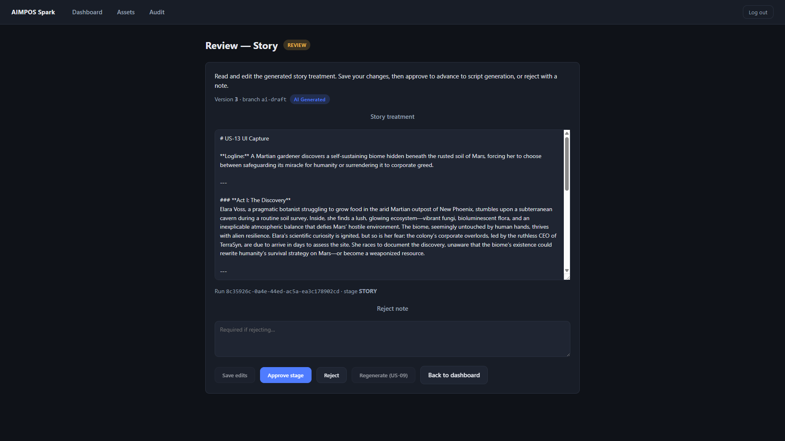
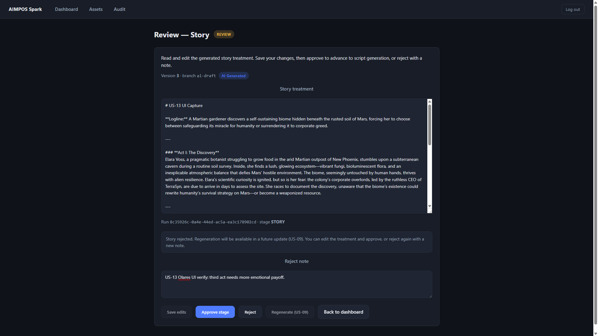

# US-13 Acceptance Package — Olares Verification

**Environment:** Olares (`olares@10.0.0.34`, namespace `aimpos-mwayolares`)  
**Date:** 2026-06-10  
**API image:** `docker.io/library/aimpos-api:us13`  
**Project:** `ba0c4636-817c-423b-9771-20100e080b76`  
**Recommendation:** **ACCEPT**

---

## Verification summary

| Check | Result |
|---|---|
| V1 — Load STORY into editor | **PASS** (API + UI) |
| V2 — Save human-edit version | **PASS** (API) |
| V3 — Approve story → SCRIPT | **PASS** (API) |
| V4 — Reject story, STORY active, regenerate affordance | **PASS** (API + UI) |

**Primary API run:** `7e8699d1-35c6-4135-9a2b-404a737ad622` (`verify_us13.sh`)  
**UI capture run:** `8c35926c-0a4e-44ed-ac5a-ea3c178902cd` (fresh STORY gate for screenshots)

Log: `logs/us13-verify.log`

---

## V1 — Load STORY asset into editor

### API response

**Asset identifier (verify run):** `b87c4c5b-1f66-4699-b07c-f6c43d408723`

```
GET /assets/b87c4c5b-1f66-4699-b07c-f6c43d408723/content
HTTP 200
Content-Type: text/markdown; charset=utf-8
```

Body preview (truncated):

```markdown
# Mars Garden US-12  

**Logline:** A lone astronaut discovers a hidden garden on Mars and must decide whether to share its miraculous secrets with Earth before the colony council arrives to claim the discovery.  

---

### **Act I: The Discovery**  
Commander Elara Voss, a seasoned but disillusioned astronaut, is tasked with a solo survey mission near the Valles Marineris...
```

**UI capture asset (editor load):** `c6a43261-ca37-413a-8fc0-2ec20448b460` (version 3, `branch=ai-draft`)

### UI screenshot



Evidence: editable treatment textarea populated; run `8c35926c-0a4e-44ed-ac5a-ea3c178902cd` · stage **STORY**; version **3** · branch `ai-draft`.

---

## V2 — Save edited story

### `asset_versions` rows — before

| id | version | branch | is_ai_generated | content_hash (prefix) |
|---|---|---|---|---|
| `b87c4c5b-1f66-4699-b07c-f6c43d408723` | 1 | `ai-draft` | true | `52f69b19da0449b4` |

### PUT response

```
PUT /assets/b87c4c5b-1f66-4699-b07c-f6c43d408723
```

```json
{
  "id": "d02b1e64-4d71-44dd-b0a1-8fddd078310a",
  "stage": "STORY",
  "version": 2,
  "branch": "human-edit",
  "is_ai_generated": false
}
```

### `asset_versions` rows — after

| id | version | branch | is_ai_generated | content_hash (prefix) |
|---|---|---|---|---|
| `b87c4c5b-1f66-4699-b07c-f6c43d408723` | 1 | `ai-draft` | true | `52f69b19da0449b4` |
| `d02b1e64-4d71-44dd-b0a1-8fddd078310a` | 2 | `human-edit` | false | `a469cbdb2b9b3190` |

| Assertion | Expected | Observed |
|---|---|---|
| Version increment | 1 → 2 | **PASS** |
| `branch` | `human-edit` | **PASS** |
| `is_ai_generated` | `false` | **PASS** |

### Pipeline unchanged after save

| Field | Before | After |
|---|---|---|
| `pipeline_runs.status` | `AWAITING_APPROVAL` | `AWAITING_APPROVAL` |
| `pipeline_runs.current_stage` | `STORY` | `STORY` |

---

## V3 — Approve story

### Approval record

```
POST /pipeline/approve
{"project_id":"...","stage":"STORY","decision":"GRANT"}
```

```json
{
  "run_id": "7e8699d1-35c6-4135-9a2b-404a737ad622",
  "approval_id": "2a6dcf29-94f9-424d-98e2-b6ea9b2e79e3",
  "decision": "APPROVED",
  "stage": "STORY"
}
```

**DB row:** `STORY|APPROVED`

### Audit evidence

```
APPROVAL_RECORDED|{"note": null, "stage": "STORY", "decision": "APPROVED", "principal": "api-bearer-token", "approval_id": "2a6dcf29-94f9-..."}
```

### Status transition → SCRIPT stage

| Field | Before approve | After approve |
|---|---|---|
| `status` | `AWAITING_APPROVAL` | `AWAITING_APPROVAL` |
| `current_stage` | `STORY` | **`SCRIPT`** |

```
GET /pipeline/status → current_stage: "SCRIPT"
```

No branch promotion on approve (`D-37`).

---

## V4 — Reject story

### API rejection (verify run)

```
POST /pipeline/approve
{"stage":"STORY","decision":"REJECT","note":"US-13 Olares verify: treatment needs stronger third act."}
```

```json
{
  "approval_id": "62e1bc50-9120-4f7f-b716-cef32144767e",
  "decision": "REJECTED",
  "stage": "STORY",
  "status": "AWAITING_APPROVAL",
  "current_stage": "STORY"
}
```

**DB row:** `STORY|REJECTED|US-13 Olares verify: treatment needs stronger third act.`

### Audit evidence

```
APPROVAL_RECORDED|{"note": "US-13 Olares verify: treatment needs stronger third act.", "stage": "STORY", "decision": "REJECTED", ...}
```

### STORY remains active

| Field | After reject |
|---|---|
| `status` | `AWAITING_APPROVAL` |
| `current_stage` | `STORY` |

### UI rejection + regenerate affordance (UI capture run)

**Run:** `8c35926c-0a4e-44ed-ac5a-ea3c178902cd`

After reject with note `US-13 Olares UI verify: third act needs more emotional payoff.`:

- Status message: *"Story rejected. Regeneration will be available in a future update (US-09)…"*
- **Regenerate (US-09)** button visible (disabled — affordance only, no `POST /pipeline/regenerate`)
- Pipeline status remains `AWAITING_APPROVAL` / `STORY`



---

## Constraint verification

| Check | Result |
|---|---|
| No `POST /pipeline/regenerate` | **PASS** |
| No worker / Temporal / schema changes | **PASS** |
| No branch promotion on approve (`D-37`) | **PASS** |
| `GET /assets/{id}/content` — STORY bytes only | **PASS** |
| `PUT /assets/{id}` — `human-edit`, `is_ai_generated=false` | **PASS** |

---

## Verification notes

1. **API verification** executed on Olares via `deploy/k8s/us13-verify/verify_us13.sh` (ClusterIP `10.233.21.231:8000`).
2. **UI verification** used local web preview (`localhost:5173`) against Olares API via SSH port-forward (`localhost:18000`). CORS origin `http://localhost:5173` satisfied.
3. **ReviewPage navigation fix** applied during verification: wait for first pipeline status fetch before redirecting away from `/review` (prevents race on direct navigation).

---

## Final closure request

All required V1–V4 evidence is captured. **US-13 is recommended for formal ACCEPT.**

**Requesting final US-13 closure review.**

**US-09 remains blocked** until US-13 is formally closed.
